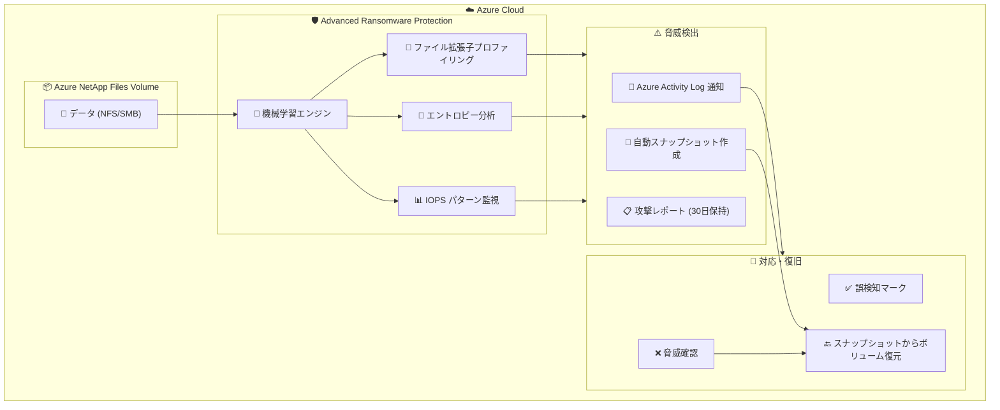

# Azure NetApp Files: Advanced Ransomware Protection (ANF ARP) が GA

**リリース日**: 2026-04-21

**サービス**: Azure NetApp Files

**機能**: Advanced Ransomware Protection (ANF ARP)

**ステータス**: In preview (RSS カテゴリによる分類。タイトルでは GA と記載されているが、RSS フィードのステータスは In preview)

[このアップデートのインフォグラフィックを見る](https://takech9203.github.io/azure-news-summary/20260421-netapp-files-ransomware-protection.html)

## 概要

Azure NetApp Files の Advanced Ransomware Protection (ANF ARP) が一般提供 (GA) となった。この機能は 2025 年 12 月にプレビューとして提供開始され、約 4 か月のプレビュー期間を経て GA に昇格した。

ANF ARP は、機械学習を活用してボリュームのワークロードプロファイルを構築し、ランサムウェア攻撃に類似するパターンの逸脱を検出するストレージレベルのセキュリティ機能である。脅威が検出されると、自動的にポイントインタイムスナップショットを作成し、迅速な評価とリカバリを可能にする。追加コストなしで利用できる点が大きな特徴である。

**アップデート前の課題**

- クラウドボリュームに対するランサムウェア攻撃の検出には、サードパーティツールの導入が必要だった
- ストレージレベルでのリアルタイム異常検知が提供されていなかった
- ランサムウェア検出時のスナップショット取得が手動対応だった
- ファイルの暗号化パターンやアクセス異常を自動的に分析する仕組みがなかった

**アップデート後の改善**

- Azure NetApp Files ネイティブのランサムウェア検出機能が追加コストなしで利用可能
- 機械学習ベースのプロファイリングにより、ボリューム固有のワークロードパターンを学習して異常を検出
- 脅威検出時に自動的にポイントインタイムスナップショットを作成し、迅速なリカバリが可能
- Azure Activity Log を通じた通知と、30 日間の攻撃レポート保持

## アーキテクチャ図

ANF ARP は機械学習エンジンがボリュームのファイル拡張子、データエントロピー、IOPS パターンを継続的に監視し、ランサムウェアに類似する異常を検出すると自動スナップショット作成と通知を行う。管理者は脅威を確認後、スナップショットからボリュームを復元できる。

## サービスアップデートの詳細

### 主要機能

1. **機械学習ベースの検出**
   - ボリュームのワークロードパターンを学習してプロファイルを構築
   - ファイル拡張子の種類、データエントロピーパターン、IOPS パターンを監視
   - 通常のパターンから逸脱する活動をランサムウェア脅威としてマーク
   - ユーザーの脅威応答 (誤検知/脅威確認) に基づいてプロファイルを継続的に改善

2. **自動スナップショット作成**
   - 脅威検出時にポイントインタイムスナップショットを自動作成
   - スナップショットを使用して迅速にボリュームを評価・復元可能
   - ボリューム全体の復元 (Revert) に対応

3. **アラートとレポーティング**
   - Azure Activity Log を通じてランサムウェア脅威の通知を送信
   - 攻撃レポートを 30 日間保持
   - アクティブな脅威と疑わしいファイルの一覧表示

4. **脅威対応ワークフロー**
   - 検出された脅威を「誤検知」または「脅威」としてマーク可能
   - 脅威確認後、最後のスナップショットからボリュームを復元
   - 解決済みの脅威はアーカイブレポートとして閲覧可能

## 技術仕様

| 項目 | 詳細 |
|------|------|
| 機能名 | Advanced Ransomware Protection (ANF ARP) |
| 対応プロトコル | NFS、SMB、デュアルプロトコル |
| 検出方式 | 機械学習 (ファイル拡張子、エントロピー、IOPS) |
| 攻撃レポート保持期間 | 30 日間 |
| 推奨ボリューム数上限 | サブスクリプションあたり 10 ボリューム (超過時はサポートリクエストが必要) |
| 推奨 QoS 容量増加 | 5 ~ 10% の追加容量 (パフォーマンス影響の緩和) |
| 追加コスト | なし |
| プレビュー開始 | 2025 年 12 月 |
| GA | 2026 年 4 月 |

## 設定方法

### 前提条件

1. Azure NetApp Files アカウントとキャパシティプールが構成済みであること
2. NFS、SMB、またはデュアルプロトコルのボリュームが作成済みであること
3. パフォーマンス影響を考慮し、QoS 容量を 5 ~ 10% 増加させることが推奨される

### Azure Portal (新規ボリューム作成時)

1. 通常のワークフローで NFS/SMB/デュアルプロトコルボリュームを作成する
2. **Basics** タブの **Advanced Ransomware Protection** フィールドで **Enabled** を選択する
3. ボリューム作成後、概要ページで Advanced Ransomware Protection が「Enabled」と表示されていることを確認する

### Azure Portal (既存ボリュームへの有効化)

1. 対象ボリュームに移動する
2. サイドバーの **Storage services** メニューから **Advanced Ransomware Protection** を選択する
3. **Enable Protection** を選択する
4. 確認ダイアログで **Yes** を選択する
5. 保護状態が **Enabled** になっていることを確認する

### 脅威への対応手順

1. サイドバーの **Storage services** > **Advanced Ransomware Protection** を選択する
2. **Active threats** に表示される疑わしい攻撃を展開し、疑わしいファイルを確認する
3. 脅威でない場合は **False positive** としてマークする
4. 脅威と判断した場合は **Threat** を選択し、最後のスナップショットからボリュームを復元する
5. 解決済みの脅威はアーカイブレポートとして同ページで確認可能 (30 日間保持)

## メリット

### ビジネス面

- ランサムウェア攻撃からの事業継続性の向上
- サードパーティのセキュリティツールへの追加投資が不要 (追加コストなし)
- 攻撃レポートの 30 日間保持によるインシデント対応の記録管理
- データの安全性向上による規制コンプライアンスの強化

### 技術面

- ストレージレベルでのネイティブなランサムウェア検出により、エージェント不要
- 機械学習ベースのプロファイリングでワークロードごとにカスタマイズされた検出精度
- 自動スナップショットによる迅速な復旧 (RPO の最小化)
- 誤検知フィードバックによるプロファイルの継続的な改善

## デメリット・制約事項

- サブスクリプションあたり推奨 10 ボリュームまで (超過時はサポートリクエストが必要)
- QoS 容量を 5 ~ 10% 追加で確保する必要がある (パフォーマンス影響の緩和のため)
- テスト/開発ワークロードには不向き (大量のファイル作成/削除が誤検知の原因となる)
- アプリケーション側でデータを暗号化しているワークロードでは検出精度が低下する
- 学習期間中に検出されなかったファイル拡張子が後から使用されると、誤検知が増える可能性がある (ヘルスケアレコードや EDA データなど)
- 正当なアプリケーションによる大量のファイル作成・リネーム・削除がランサムウェア活動として検出される可能性がある

## ユースケース

### ユースケース 1: 企業ファイルサーバーの保護

**シナリオ**: 企業の Windows/Linux ホームディレクトリを Azure NetApp Files で運用しており、ユーザーの PC がランサムウェアに感染した場合にネットワーク共有上のファイルが暗号化されるリスクがある。

**効果**: ANF ARP が異常なファイル暗号化パターン (エントロピーの急激な変化) や大量のファイル拡張子変更を検出し、自動的にスナップショットを作成。被害が拡大する前にボリュームを復元できる。

### ユースケース 2: 画像・動画アーカイブの保護

**シナリオ**: メディア企業が大量の画像・動画ファイルを Azure NetApp Files に保存しており、ランサムウェアによるデータ破壊から保護したい。

**効果**: 画像・動画ワークロードは ANF ARP に適したワークロードとして公式にサポートされており、ファイル拡張子の異常な変更や IOPS パターンの逸脱を検出して自動的に保護スナップショットを作成する。

## 料金

Azure NetApp Files の Advanced Ransomware Protection は**追加コストなし**で利用可能。ただし、パフォーマンス影響の緩和のために QoS 容量を 5 ~ 10% 追加で確保することが推奨されており、その分のキャパシティプール料金は発生する。

Azure NetApp Files 自体の料金体系は以下のサービスレベルで構成される:

| サービスレベル | 説明 |
|---------------|------|
| Standard | 基本的なパフォーマンス |
| Premium | 高パフォーマンス |
| Ultra | 最高パフォーマンス |
| Flexible | 柔軟なパフォーマンス設定 |
| Elastic zone-redundant | ゾーン冗長対応 |

詳細な料金については公式料金ページを参照: [Azure NetApp Files の料金](https://azure.microsoft.com/pricing/details/netapp/)

## 利用可能リージョン

Azure NetApp Files が利用可能なすべてのリージョンで ANF ARP が利用可能かどうかは、公式ドキュメントを参照のこと。

- [リージョン別の利用可能性](https://azure.microsoft.com/explore/global-infrastructure/products-by-region/?products=netapp)
- [機能別の利用可能性マップ](https://azure.github.io/azure-netapp-files/map/)

## 関連サービス・機能

- **Azure NetApp Files スナップショット**: ANF ARP が脅威検出時に自動作成するスナップショットの基盤技術。ボリュームの復元やクローンに使用される
- **Azure NetApp Files バックアップ**: 長期保持のためのバックアップソリューション。ANF ARP と組み合わせることで、スナップショットによる短期復旧とバックアップによる長期復旧の両方をカバーできる
- **Azure NetApp Files クロスリージョンレプリケーション**: リージョン間でのデータ複製。ランサムウェア対策とディザスタリカバリを組み合わせた包括的なデータ保護が可能
- **Azure Activity Log**: ANF ARP の脅威通知の送信先。Azure Monitor と統合してアラートルールやアクションの設定が可能

## 参考リンク

- [インフォグラフィック](https://takech9203.github.io/azure-news-summary/20260421-netapp-files-ransomware-protection.html)
- [公式アップデート情報](https://azure.microsoft.com/updates?id=560188)
- [Advanced Ransomware Protection の構成 - Microsoft Learn](https://learn.microsoft.com/azure/azure-netapp-files/ransomware-configure)
- [Azure NetApp Files のデータ保護オプション - Microsoft Learn](https://learn.microsoft.com/azure/azure-netapp-files/data-protection-disaster-recovery-options)
- [Azure NetApp Files とは - Microsoft Learn](https://learn.microsoft.com/azure/azure-netapp-files/azure-netapp-files-introduction)
- [料金ページ](https://azure.microsoft.com/pricing/details/netapp/)

## まとめ

Azure NetApp Files の Advanced Ransomware Protection (ANF ARP) が GA となり、ストレージレベルでのネイティブなランサムウェア検出・対応・復旧機能が追加コストなしで利用可能になった。機械学習ベースの検出エンジンがファイル拡張子、エントロピー、IOPS パターンを監視し、脅威検出時には自動スナップショットを作成して迅速な復旧を可能にする。

Solutions Architect としての推奨アクションは以下の通り:

1. **即座に検討**: Azure NetApp Files を使用している環境で ANF ARP の有効化を検討する (追加コスト不要)
2. **キャパシティ計画**: QoS 容量の 5 ~ 10% の追加確保を計画に含める
3. **ワークロード適合性の確認**: テスト/開発環境や、アプリケーション側で暗号化を行うワークロードでは効果が限定的であることに留意する
4. **サブスクリプションあたり 10 ボリューム上限**: 大規模環境では事前にサポートリクエストで上限引き上げを依頼する
5. **監視統合**: Azure Activity Log との連携によるアラート設定を構成する

---

**タグ**: #AzureNetAppFiles #Ransomware #Security #Storage #GA #DataProtection #MachineLearning
