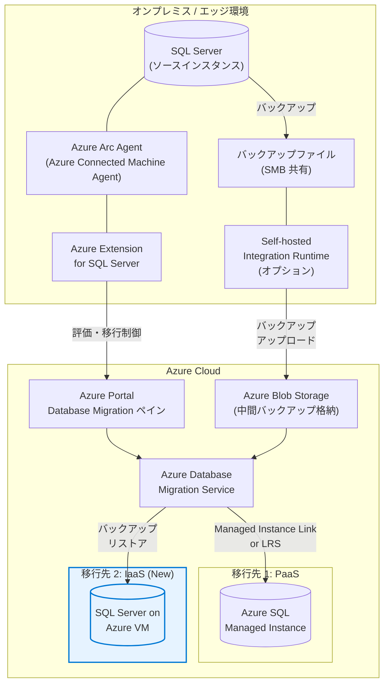

# Azure Arc: SQL Server on Azure Virtual Machines を移行ターゲットとして追加

**リリース日**: 2026-04-22

**サービス**: Azure Arc

**機能**: SQL Server on Azure Virtual Machines を移行ターゲットとして追加

**ステータス**: In preview

[このアップデートのインフォグラフィックを見る](https://takech9203.github.io/azure-news-summary/20260422-arc-sql-server-vm-migration.html)

## 概要

Azure Arc のマイグレーション機能に、SQL Server on Azure Virtual Machines が新たな移行ターゲットとして追加されたことがパブリックプレビューとして発表された。これにより、Azure Arc 対応の SQL Server インスタンスから、Azure SQL Managed Instance だけでなく、Azure インフラストラクチャ上で動作する SQL Server (Azure VM) への移行も、同一の統合されたマイグレーションエクスペリエンスを通じて実行可能となった。

従来、Azure Arc を通じた SQL Server の移行は Azure SQL Managed Instance のみをターゲットとしていた。PaaS 型の Managed Instance への移行は多くのシナリオに適合するが、アプリケーションの互換性要件やカスタム構成の必要性から、IaaS 型の SQL Server on Azure VM を選択したいケースも多く存在していた。今回のアップデートにより、Azure Arc の「Database Migration」ペインから、移行先として Azure SQL Managed Instance と SQL Server on Azure VM の両方を選択できるようになり、ユーザーのワークロード要件に最適なターゲットを柔軟に選択できるようになった。

Azure Database Migration Service (DMS) との統合により、オンライン移行 (最小ダウンタイム) およびオフライン移行の両方がサポートされ、Azure Portal から一貫したウィザード形式で移行プロセス全体を管理できる。

**アップデート前の課題**

- Azure Arc を通じた SQL Server の移行ターゲットは Azure SQL Managed Instance のみに限定されていた
- SQL Server on Azure VM への移行を行う場合は、Azure Arc の統合マイグレーションエクスペリエンスとは別に Azure Database Migration Service を個別に構成・実行する必要があった
- IaaS 型のターゲットを必要とするワークロードでは、移行ツールが分散し、管理が複雑化していた

**アップデート後の改善**

- Azure Arc の「Database Migration」ペインから SQL Server on Azure VM を移行ターゲットとして直接選択可能になった
- Azure SQL Managed Instance と SQL Server on Azure VM の両方に対応した統一的なマイグレーション体験を提供
- 移行先の評価・選択・実行・監視・カットオーバーを単一のインターフェースで完結できるようになった
- ワークロードの互換性要件に応じて最適な移行先を柔軟に選択可能

## アーキテクチャ図

Azure Arc 対応の SQL Server インスタンスから、Azure Portal の統一されたマイグレーションエクスペリエンスを通じて、Azure SQL Managed Instance (PaaS) と SQL Server on Azure VM (IaaS) の両方に移行可能となった。バックアップファイルは Azure Blob Storage を経由し、Azure Database Migration Service が移行プロセス全体を管理する。

## サービスアップデートの詳細

### 主要機能

1. **SQL Server on Azure VM への統合マイグレーション**
   - Azure Arc の「Database Migration」ペインから、SQL Server on Azure VM を移行ターゲットとして直接選択可能
   - 既存の Azure SQL Managed Instance への移行と同じ UI/ワークフローで操作可能

2. **移行先の評価と推奨**
   - Azure Arc がソース SQL Server インスタンスの構成やワークロード特性を自動評価
   - Azure SQL Managed Instance と SQL Server on Azure VM のどちらが最適かの推奨を提供
   - 互換性の問題や移行リスクの事前検出

3. **オンライン移行とオフライン移行のサポート**
   - オンライン移行: バックアップの継続的なリストアにより最小ダウンタイムで移行
   - オフライン移行: バックアップ/リストア方式で完全な移行を実行
   - Self-hosted Integration Runtime を介した SMB 共有からのバックアップアップロード、または Azure Blob Storage からの直接リストアに対応

4. **Azure Portal からのエンドツーエンドの移行管理**
   - 評価 (Assessment) から移行実行、監視、カットオーバーまでを一元管理
   - 移行の進捗状況をリアルタイムで監視可能
   - 移行ステータス (Arrived, Uploading, Uploaded, Restoring, Restored) の追跡

## 技術仕様

| 項目 | 詳細 |
|------|------|
| 対象サービス | Azure Arc (SQL Server migration) |
| ステータス | パブリックプレビュー |
| 移行元 | Azure Arc 対応 SQL Server インスタンス (SQL Server 2012 以降) |
| 移行先 (既存) | Azure SQL Managed Instance |
| 移行先 (新規) | SQL Server on Azure Virtual Machines |
| 移行モード | オンライン (最小ダウンタイム)、オフライン |
| バックアップ格納先 | Azure Blob Storage / SMB ネットワーク共有 |
| 必須コンポーネント | Azure Extension for SQL Server (最新バージョン) |
| Self-hosted Integration Runtime | SMB 共有からのバックアップ転送時に必要 |

## 設定方法

### 前提条件

1. ソース SQL Server インスタンスが Azure Arc に登録済みであること
2. Azure Extension for SQL Server が最新バージョンにアップグレードされていること
3. アクティブな Azure サブスクリプション
4. ターゲットとなる SQL Server on Azure VM が作成済みであること (または移行時に新規作成)
5. SQL Server on Azure VM が SQL IaaS Agent Extension に Full 管理モードで登録されていること
6. ソース SQL Server へのログインが sysadmin ロールまたは CONTROL SERVER 権限を持つこと
7. バックアップファイルの格納先 (SMB 共有または Azure Blob Storage) が準備されていること

### Azure Portal

1. Azure Portal で [SQL Server instance](https://portal.azure.com/#servicemenu/SqlAzureExtension/AzureSqlHub/SqlServerInstance) に移動する
2. **Migration** セクションの **Database migration** を選択
3. **Assess source instance** で移行の準備状況を評価する
4. **Select target** でターゲットとして「SQL Server on Azure VM」を選択する
5. 既存の Azure VM を選択するか、新規作成を選択する
6. **Migrate data** でバックアップファイルの場所と移行モード (オンライン/オフライン) を設定する
7. **Start data migration** で移行を開始する
8. **Monitor and cutover** で進捗を監視し、準備ができたらカットオーバーを実行する

## メリット

### ビジネス面

- **移行先の柔軟な選択**: ワークロード特性やコスト要件に応じて PaaS (Managed Instance) と IaaS (Azure VM) を選択可能
- **統一された移行体験**: 複数のツールを使い分ける必要がなくなり、運用チームの学習コストと管理負荷を削減
- **段階的なクラウド移行**: まず Azure VM にリフト&シフトし、将来的に PaaS への移行を検討するという段階的アプローチが容易に
- **最小ダウンタイム**: オンライン移行モードにより、ビジネスへの影響を最小化

### 技術面

- **完全な SQL Server 互換性**: Azure VM 上の SQL Server は完全な SQL Server エンジンであるため、オンプレミスとの互換性が最も高い
- **OS レベルのカスタマイズ**: IaaS モデルにより、OS 設定やサードパーティツールのインストールが可能
- **既存ライセンスの活用**: Azure Hybrid Benefit により既存の SQL Server ライセンスを Azure VM に適用可能
- **エンドツーエンドの自動化**: Assessment からカットオーバーまでの全プロセスを Azure Portal で管理

## デメリット・制約事項

- パブリックプレビュー段階のため、SLA の対象外であり、本番ワークロードでの利用は慎重に検討する必要がある
- SQL Server on Azure VM は IaaS モデルのため、OS パッチ適用やバックアップ管理などの運用責任がユーザーに発生する
- Self-hosted Integration Runtime の構成が必要な場合、追加のネットワーク要件 (ポート 443 のアウトバウンド接続など) がある
- 移行中のバックアップファイルのアップロードに Azure Blob Storage の利用が必要な場合、一時的なストレージコストが発生する
- TDE (Transparent Data Encryption) で保護されたデータベースの移行には、事前に証明書の移行が必要
- Managed Instance Link (リアルタイムレプリケーション) 方式は SQL Server on Azure VM への移行では利用できない可能性がある (バックアップ/リストア方式が主な移行手法)

## ユースケース

### ユースケース 1: 高い互換性要件を持つレガシーアプリケーションの移行

**シナリオ**: オンプレミスで稼働する SQL Server 2016 ベースの基幹業務アプリケーションが、SQL Agent ジョブ、リンクサーバー、CLR アセンブリなど、Managed Instance では一部制限のある機能に依存している場合。

**効果**: SQL Server on Azure VM をターゲットに選択することで、オンプレミスと完全に同等の SQL Server 環境を Azure 上に構築し、アプリケーション変更なしで移行を完了できる。Azure Arc の統合エクスペリエンスにより、移行の評価からカットオーバーまでを一元管理可能。

### ユースケース 2: 段階的なクラウドモダナイゼーション

**シナリオ**: 大規模な SQL Server 環境をクラウドに移行する際、まずリフト&シフトで Azure VM に移行し、その後段階的に Azure SQL Managed Instance や Azure SQL Database への PaaS 化を検討したい場合。

**効果**: 第一段階として Azure Arc の統合マイグレーションエクスペリエンスで SQL Server on Azure VM に移行し、アプリケーションの動作を確認した上で、将来的に PaaS ターゲットへの再移行を計画できる。

### ユースケース 3: マルチクラウド / エッジ環境からの集約

**シナリオ**: Azure Arc で管理されている複数のオンプレミス拠点やエッジ環境の SQL Server インスタンスを、Azure 上の SQL Server VM に集約・統合したい場合。

**効果**: Azure Arc の統一的な管理画面から、分散した SQL Server インスタンスの移行準備状況を一括評価し、Azure VM への計画的な集約を実行できる。

## 料金

Azure Arc の SQL Server 移行機能自体の追加料金は、Azure Arc のライセンス範囲内で提供される。移行先の SQL Server on Azure VM の料金は以下の要素で構成される。

| 項目 | 説明 |
|------|------|
| Azure VM のコンピューティング料金 | VM サイズに応じた時間単位の料金 |
| SQL Server ライセンス料金 | 従量課金制 (pay-as-you-go) または Azure Hybrid Benefit (既存ライセンス持ち込み) |
| ストレージ料金 | マネージドディスクの種類とサイズに応じた料金 |
| 移行時の一時コスト | Azure Blob Storage (バックアップ格納用)、Self-hosted Integration Runtime (該当する場合) |

- Azure Hybrid Benefit を利用することで、既存の Software Assurance 付き SQL Server ライセンスを Azure VM に適用し、ライセンスコストを大幅に削減可能
- 詳細は [SQL Server on Azure VM の料金ページ](https://azure.microsoft.com/pricing/details/azure-sql/sql-server-virtual-machines/) を参照

## 関連サービス・機能

- **Azure Arc 対応 SQL Server**: オンプレミスおよびマルチクラウド環境の SQL Server インスタンスを Azure Arc に登録し、統合管理する基盤機能
- **Azure Database Migration Service (DMS)**: SQL Server 移行のバックエンドエンジンとして、バックアップのアップロード・リストア・監視を担当
- **Azure SQL Managed Instance**: PaaS 型の移行ターゲット。Managed Instance Link や Log Replay Service (LRS) による移行をサポート
- **SQL Server on Azure Virtual Machines**: IaaS 型の移行ターゲット。完全な SQL Server 互換性を提供
- **Azure Blob Storage**: 移行時のバックアップファイルの中間格納先
- **SQL IaaS Agent Extension**: Azure VM 上の SQL Server の管理・監視を強化する拡張機能

## 参考リンク

- [インフォグラフィック](https://takech9203.github.io/azure-news-summary/20260422-arc-sql-server-vm-migration.html)
- [公式アップデート情報](https://azure.microsoft.com/updates?id=560805)
- [Microsoft Learn - SQL Server migration in Azure Arc to Azure SQL Managed Instance](https://learn.microsoft.com/sql/sql-server/azure-arc/migrate-to-azure-sql-managed-instance)
- [Microsoft Learn - Azure Database Migration Service](https://learn.microsoft.com/azure/dms/)
- [Microsoft Learn - Migrate SQL Server to SQL Server on Azure VM (Online)](https://learn.microsoft.com/data-migration/sql-server/virtual-machines/database-migration-service-online)
- [Microsoft Learn - Migrate SQL Server to SQL Server on Azure VM (Offline)](https://learn.microsoft.com/data-migration/sql-server/virtual-machines/database-migration-service-offline)
- [Microsoft Learn - Azure Arc-enabled data services overview](https://learn.microsoft.com/azure/azure-arc/data/overview)

## まとめ

Azure Arc のマイグレーション機能に SQL Server on Azure Virtual Machines が移行ターゲットとして追加されたことで、Azure Arc 対応の SQL Server インスタンスから PaaS (Azure SQL Managed Instance) と IaaS (SQL Server on Azure VM) の両方への移行が、統一されたエクスペリエンスで実行可能となった。

Solutions Architect にとって、このアップデートは特に以下の点で重要である。

- **互換性要件の高いワークロード**: Managed Instance の制限に該当する機能に依存するアプリケーションでも、Azure VM ターゲットを選択することで移行が可能になった
- **段階的なモダナイゼーション戦略**: まず IaaS にリフト&シフトし、その後 PaaS への移行を計画するアプローチが、単一のツールで管理可能になった
- **統一された運用体験**: 移行先が異なっても同じ Azure Portal のワークフローで評価・移行・監視・カットオーバーを実行できる

パブリックプレビュー段階であるため、本番環境への適用は検証環境での十分なテストを経てから検討することを推奨する。

---

**タグ**: #Azure #AzureArc #SQLServer #Migration #AzureVM #IaaS #DatabaseMigration #HybridCloud #マルチクラウド #パブリックプレビュー #DMS
