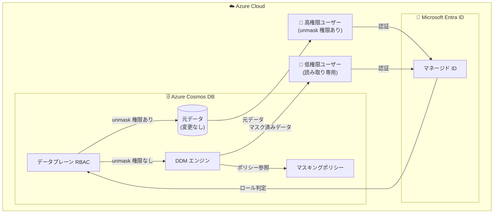

# Azure Cosmos DB: Dynamic Data Masking (DDM) の一般提供開始

**リリース日**: 2026-04-22

**サービス**: Azure Cosmos DB

**機能**: Dynamic Data Masking (DDM)

**ステータス**: Launched (GA)

[このアップデートのインフォグラフィックを見る](https://takech9203.github.io/azure-news-summary/20260422-cosmosdb-dynamic-data-masking.html)

## 概要

Azure Cosmos DB の Dynamic Data Masking (DDM) が一般提供 (GA) となった。DDM は、サーバーサイドで動作するポリシーベースのセキュリティ機能であり、権限のないユーザーに対して機密データへのアクセスを制限する。データベースに格納されている元のデータは変更されず、クエリ実行時にリアルタイムでデータがマスクされて返される仕組みとなっている。

この機能により、個人情報 (PII) や保護対象医療情報 (PHI) などの機密データの露出を最小限に抑えることができる。セキュリティ、コンプライアンス、規制要件への対応を支援し、アプリケーション側のコード変更なしにデータ保護を実現できる。

DDM は Microsoft Entra ID のマネージド ID を使用した認証と、Azure Cosmos DB データプレーンのロールベースアクセス制御 (RBAC) を活用して、ユーザーの権限レベルに応じたデータマスキングを適用する。高権限ユーザーには元データが表示され、低権限ユーザーにはマスクされたデータが返される。

**アップデート前の課題**

- Cosmos DB で機密データを保護するには、アプリケーション側でマスキングロジックを実装する必要があった
- ユーザーの権限レベルに応じたデータ表示の制御がサーバーサイドで行えなかった
- コンプライアンス要件を満たすために、データアクセス層に追加の開発工数が必要だった

**アップデート後の改善**

- サーバーサイドのポリシー設定のみで、アプリケーションコードを変更せずにデータマスキングを実現
- RBAC と連携し、ユーザーの権限レベルに応じて自動的にマスキングが適用される
- 複数のマスキング戦略 (Default、Custom String、Email) を柔軟に組み合わせてポリシーを定義可能

## アーキテクチャ図



高権限ユーザー (unmask 権限を持つロール) はデータをそのまま参照でき、低権限ユーザーのクエリ結果は DDM エンジンがマスキングポリシーに基づいてリアルタイムでマスクして返す。

## サービスアップデートの詳細

### 主要機能

1. **サーバーサイドのリアルタイムマスキング**
   - クエリ実行時にデータをマスクし、元のデータは変更しない
   - アプリケーション側のコード変更は不要

2. **3 種類のマスキング戦略**
   - **Default**: 文字列は `XXXX`、数値は `0`、Boolean は `false` に置換
   - **Custom String (MaskSubstring)**: 開始位置と長さを指定して部分的にマスク (例: `WasXXXXXon`)
   - **Email**: ユーザー名の先頭文字とドメイン末尾のみ表示 (例: `aXXXX@XXXXXXX.com`)

3. **ポリシーベースの柔軟な設定**
   - パス単位でマスキング戦略を定義可能
   - includedPaths / excludedPaths による細かい制御
   - ネストされたフィールドや配列内のフィールドにも対応

4. **RBAC 連携による権限管理**
   - Microsoft Entra ID マネージド ID と連携
   - 組み込みの Data Contributor ロールには unmask 権限が含まれる
   - カスタムロール定義で unmask 権限の付与が可能

## 技術仕様

| 項目 | 詳細 |
|------|------|
| 対応 API | NoSQL API のみ |
| 認証方式 | Microsoft Entra ID マネージド ID (アカウントキーは非対応) |
| マスキング戦略 | Default / Custom String (MaskSubstring) / Email |
| ポリシー適用単位 | コンテナーレベル |
| 有効化後の無効化 | 不可 (ポリシーからパスを削除することでマスキング停止は可能) |
| 有効化所要時間 | 最大 15 分 |
| RU への影響 | マスキング適用クエリは若干の RU 増加あり |

## 設定方法

### 前提条件

1. Azure Cosmos DB アカウント (NoSQL API)
2. Microsoft Entra ID マネージド ID の設定
3. データプレーン RBAC の有効化

### Azure CLI

```bash
# 1. DDM 機能の有効化 (Azure Portal の Features タブから実施)

# 2. unmask 権限を含むカスタムロール定義の作成
az cosmosdb sql role definition create \
  --account-name "<CosmosDB-account-name>" \
  --resource-group "<resource-group-name>" \
  --body "@unmasked_role_definition.json"

# 3. 高権限ユーザーへのロール割り当て
az cosmosdb sql role assignment create \
  --account-name "<CosmosDB-account-name>" \
  --resource-group "<resource-group-name>" \
  --scope "/" \
  --principal-id "<principal-id>" \
  --role-definition-id "<unmask-role-definition-id>"

# 4. 低権限ユーザーへのロール割り当て (組み込み Data Reader ロール)
az cosmosdb sql role assignment create \
  --account-name "<CosmosDB-account-name>" \
  --resource-group "<resource-group-name>" \
  --scope "/" \
  --principal-id "<principal-id>" \
  --role-definition-id "<data-reader-role-definition-id>"
```

### Azure Portal

1. Azure Cosmos DB アカウントの **Settings** > **Features** タブから **Dynamic Data Masking** を有効化する
2. 有効化後、コンテナーの **Settings** > **Masking Policy** からマスキングポリシーを設定する
3. includedPaths でマスク対象パスを指定し、必要に応じて excludedPaths で除外パスを設定する
4. 各パスに対してマスキング戦略 (Default / MaskSubstring / Email) を割り当てる

### マスキングポリシーの設定例

```json
{
  "dataMaskingPolicy": {
    "includedPaths": [
      { "path": "/" },
      { "path": "/profile/contact/email", "strategy": "Email" },
      {
        "path": "/employment/history/[]/company",
        "strategy": "MaskSubstring",
        "startPosition": 2,
        "length": 4
      }
    ],
    "excludedPaths": [
      { "path": "/id" },
      { "path": "/department" },
      { "path": "/projects/[]/projectId" }
    ]
  }
}
```

## メリット

### ビジネス面

- コンプライアンス対応 (GDPR、HIPAA 等) をサーバーサイドの設定のみで実現し、開発コストを削減
- 機密データへのアクセスをポリシーベースで一元管理でき、ガバナンスを強化
- アプリケーション層でのマスキング実装が不要となり、開発サイクルを短縮

### 技術面

- サーバーサイド処理のため、クライアントやミドルウェアでのマスキングロジックが不要
- 元データを変更しないため、高権限ユーザーのワークフローに影響しない
- RBAC と統合されており、既存の認証・認可基盤をそのまま活用可能

## デメリット・制約事項

- NoSQL API のみ対応であり、他の API (Cassandra、MongoDB、Gremlin、Table) では利用不可
- 一度有効化すると無効化できない (ポリシーからパスを削除することでマスキングの停止は可能)
- アカウントキー認証は非対応であり、Microsoft Entra ID マネージド ID が必須
- 配列の特定インデックスへのマスキングは非対応 (例: `/projects/[1]/name` は不可)
- MaskSubstring 戦略では正のインデックスのみ対応 (逆インデックスは非対応)
- ID またはパーティションキーをマスクすると、Azure Portal の Data Explorer でのドキュメント表示が不可になる
- Change Feed (Latest / AllVersionsAndDeletes) は unmask 権限のないユーザーには利用不可
- Fabric ミラーリングおよび Analytical Store は DDM 有効アカウントではデフォルトで非対応 (Microsoft サポートへの連絡が必要)
- 複雑なクエリにより、マスクされていないデータの推論が可能になる場合がある (DDM は直接的なデータベースアクセス制限の代替ではない)
- マスキングルールの適用によりクエリの RU 消費量が若干増加する

## ユースケース

### ユースケース 1: 医療データの保護

**シナリオ**: 医療アプリケーションで患者の個人情報 (氏名、連絡先、保険番号) を Cosmos DB に保存している。医療スタッフには全データを表示し、分析チームには匿名化されたデータのみを提供したい。

**効果**: DDM のポリシー設定により、分析チームのクエリ結果は自動的にマスクされ、HIPAA コンプライアンスを維持しながらデータ活用が可能になる。

### ユースケース 2: IoT デバイスデータの機密保護

**シナリオ**: IoT デバイスから収集したデータに、デバイス所有者の個人情報やロケーション情報が含まれている。運用チームはデバイスの稼働状況を監視する必要があるが、個人情報へのアクセスは不要である。

**効果**: マスキングポリシーでデバイスメトリクスを excludedPaths に設定し、個人情報フィールドをマスクすることで、運用チームはデバイス監視に必要なデータのみにアクセスできる。

### ユースケース 3: マルチテナント SaaS アプリケーション

**シナリオ**: SaaS アプリケーションで各テナントの顧客データを Cosmos DB に格納しており、サポートチームが問い合わせ対応時にデータを参照する。クレジットカード番号やメールアドレスなどの機密フィールドは部分的にのみ表示したい。

**効果**: Email 戦略と MaskSubstring 戦略を組み合わせることで、サポートチームには本人確認に必要な最小限の情報のみが表示される。

## 料金

Microsoft Learn のドキュメントによると、DDM の有効化自体には追加費用は発生しない。ただし、マスキングポリシーをコンテナーに適用した場合、マスキング処理によるクエリ実行時の RU 消費量が若干増加する。詳細な料金への影響は、マスキング対象のフィールド数やクエリパターンに依存する。

詳細は [Azure Cosmos DB の料金ページ](https://azure.microsoft.com/pricing/details/cosmos-db/) を参照。

## 利用可能リージョン

公式アップデートではリージョン制限に関する記載は確認できなかった。Azure Cosmos DB が利用可能なリージョンで DDM も利用可能と考えられる。最新のリージョン対応状況は [Azure Cosmos DB のドキュメント](https://learn.microsoft.com/azure/cosmos-db/) を参照。

## 関連サービス・機能

- **Microsoft Entra ID**: DDM の認証基盤として必須。マネージド ID を使用したデータプレーン RBAC と連携してマスキングの適用を制御する
- **Azure Cosmos DB データプレーン RBAC**: ロール定義とロール割り当てにより、unmask 権限の付与を管理する
- **Azure Cosmos DB Change Feed**: DDM 有効時、unmask 権限のないユーザーは Change Feed を利用できないため、イベント駆動アーキテクチャへの影響を考慮する必要がある
- **Azure Cosmos DB Materialized Views / バックアップ**: マスクされていない元データで動作するため、バックアップデータの保護は別途検討が必要

## 参考リンク

- [インフォグラフィック](https://takech9203.github.io/azure-news-summary/20260422-cosmosdb-dynamic-data-masking.html)
- [公式アップデート情報](https://azure.microsoft.com/updates?id=559633)
- [Microsoft Learn ドキュメント - Dynamic Data Masking](https://learn.microsoft.com/azure/cosmos-db/dynamic-data-masking)
- [料金ページ](https://azure.microsoft.com/pricing/details/cosmos-db/)

## まとめ

Azure Cosmos DB の Dynamic Data Masking (DDM) が一般提供となり、サーバーサイドのポリシー設定のみで機密データの保護が可能になった。NoSQL API で利用可能で、Default / Custom String / Email の 3 種類のマスキング戦略をパス単位で柔軟に適用できる。Microsoft Entra ID とデータプレーン RBAC を活用し、ユーザーの権限レベルに応じた自動的なデータマスキングを実現する。コンプライアンス対応やデータガバナンス強化に有効であり、機密データを Cosmos DB で扱う Solutions Architect は、DDM の導入を検討すべきである。なお、NoSQL API 限定であること、有効化後の無効化不可、アカウントキー認証非対応などの制約事項には注意が必要である。

---

**タグ**: #Azure #CosmosDB #DynamicDataMasking #セキュリティ #コンプライアンス #データベース #GA #NoSQL #RBAC #IoT
