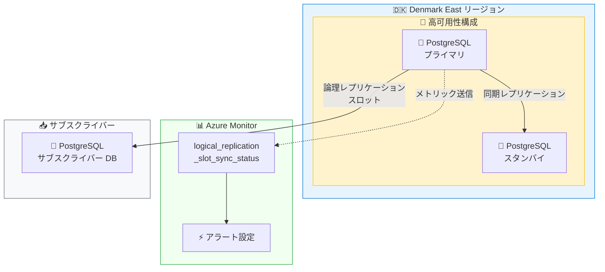

# Azure Database for PostgreSQL: Denmark East リージョン対応 & レプリケーションスロット同期メトリック

**リリース日**: 2026-04-22

**サービス**: Azure Database for PostgreSQL

**機能**: Denmark East リージョン対応 (GA) / 論理レプリケーションスロット同期ステータスメトリック (Public Preview)

**ステータス**: Launched (GA) / In preview

[このアップデートのインフォグラフィックを見る](https://takech9203.github.io/azure-news-summary/20260422-postgresql-denmark-east-replication-metric.html)

## 概要

Azure Database for PostgreSQL Flexible Server に関する 2 つのアップデートが発表された。1 つ目は Denmark East リージョンでの Flexible Server の一般提供 (GA) 開始であり、デンマーク国内で PostgreSQL データベースをデプロイできるようになった。2 つ目は論理レプリケーションスロット同期ステータスメトリック (`logical_replication_slot_sync_status`) のパブリックプレビュー開始であり、高可用性 (HA) 構成におけるプライマリとスタンバイ間の論理レプリケーションスロットの同期状態を Azure Monitor で監視できるようになった。

**アップデート前の課題**

- デンマーク国内でデータレジデンシー要件を満たしつつ PostgreSQL Flexible Server を利用するには、近隣リージョン (North Europe、West Europe、Sweden Central、Norway East など) にデプロイする必要があった
- HA 構成で論理レプリケーションスロットがプライマリとスタンバイ間で同期されているかを確認する標準的な Azure Monitor メトリックが存在せず、フェイルオーバーの安全性を事前に判断することが困難であった
- 論理レプリケーションを使用している環境でフェイルオーバーが発生した際に、レプリケーションスロットが同期されていないと、データの一貫性に影響が出るリスクがあった

**アップデート後の改善**

- Denmark East リージョンで PostgreSQL Flexible Server を直接デプロイ可能となり、デンマーク国内のデータレジデンシー要件に対応
- `logical_replication_slot_sync_status` メトリックにより、各論理レプリケーションスロットの同期状態を Azure Monitor で可視化可能に
- メトリック値が 1 (同期済み) か 0 (未同期) かを確認することで、フェイルオーバーの安全性を事前に評価可能に

## アーキテクチャ図



この図は、Denmark East リージョンにデプロイされた PostgreSQL Flexible Server の HA 構成と、論理レプリケーションスロット同期ステータスメトリックの関係を示している。プライマリサーバーからサブスクライバーへの論理レプリケーションの同期状態が Azure Monitor メトリックとして送信され、アラートによる監視が可能となっている。

## サービスアップデートの詳細

### 1. Denmark East リージョン対応 (GA)

Azure Database for PostgreSQL Flexible Server が Denmark East リージョンで一般提供 (GA) を開始した。2026 年 3 月 31 日に Denmark East リージョン自体が GA となったことを受け、PostgreSQL Flexible Server もこのリージョンで利用可能になった。

Denmark East リージョンはコペンハーゲンに設置されており、デンマーク国内の顧客に対して低レイテンシのデータベースアクセスを提供する。これにより、デンマークの規制要件に準拠したデータ保存が可能となり、EU 圏内のデータガバナンス要件にも対応できる。

### 2. 論理レプリケーションスロット同期ステータスメトリック (Public Preview)

Azure Database for PostgreSQL Flexible Server に新しい Azure Monitor メトリック `logical_replication_slot_sync_status` がパブリックプレビューとして追加された。このメトリックは、HA 構成におけるプライマリとスタンバイ間で論理レプリケーションスロットが同期されているかを示す。

**メトリックの動作:**

- **値 1**: 論理レプリケーションスロットがプライマリとスタンバイ間で同期されている
- **値 0**: 論理レプリケーションスロットがスタンバイ上で同期されていない。この状態ではフェイルオーバーが安全でない可能性がある

このメトリックは PostgreSQL 17 以上でネイティブにサポートされるスロット同期 (`sync_replication_slots`) の状態を監視するために特に有用である。PostgreSQL 16 以前では、フェイルオーバー時にスロットが保持されないため、PG Failover Slots 拡張機能と `hot_standby_feedback = on` の設定が推奨されている。

## 技術仕様

| 項目 | 詳細 |
|------|------|
| メトリック ID | `logical_replication_slot_sync_status` |
| メトリック単位 | Count (1 = 同期済み、0 = 未同期) |
| ディメンション | Logical Replication Slot (スロット名) |
| メトリック発行間隔 | 1 分 |
| メトリック保持期間 | 93 日 |
| デフォルト有効 | No (手動で有効化が必要) |
| 前提条件 | サーバーパラメータ `metrics.collector_database_activity` を `on` に設定 |
| 対象 PostgreSQL バージョン | 論理レプリケーション対応バージョン (ネイティブスロット同期は PostgreSQL 17 以上) |
| Denmark East 対応機能 | Intel Compute でのデプロイに対応 |

## 設定方法

### 論理レプリケーションスロット同期メトリックの有効化

1. Azure Portal で対象の PostgreSQL Flexible Server のサーバーパラメータページを開く
2. サーバーパラメータ `metrics.collector_database_activity` を `on` に設定する
3. 変更を保存する (動的パラメータのためサーバー再起動は不要)

### 論理レプリケーションの前提条件

1. サーバーパラメータ `wal_level` を `logical` に設定する
2. `max_worker_processes` を 16 以上に設定する
3. 変更を保存しサーバーを再起動する
4. 管理ユーザーにレプリケーション権限を付与する:

```sql
ALTER ROLE <adminname> WITH REPLICATION;
```

### PostgreSQL 17 以上でのスロット同期設定

PostgreSQL 17 以上では、ネイティブのスロット同期がサポートされている。以下のパラメータを設定する:

- `sync_replication_slots`: 有効化
- `hot_standby_feedback`: `on`

これにより、HA フェイルオーバー後も論理レプリケーションスロットが自動的に保持される。

## メリット

### ビジネス面

- デンマーク国内のデータレジデンシー要件・コンプライアンス要件に対応した PostgreSQL データベースの運用が可能に
- HA 構成のフェイルオーバー準備状態を可視化することで、計画外停止時のダウンタイムリスクを低減
- デンマーク国内のエンドユーザーに対して低レイテンシのデータベースアクセスを提供可能

### 技術面

- 論理レプリケーションスロットの同期状態を Azure Monitor でリアルタイムに監視可能
- メトリックに基づくアラート設定により、同期が途切れた際の即時通知が可能
- スロット名をディメンションとして使用できるため、個別のスロット単位での監視が可能
- 既存の Azure Monitor ワークフロー (Grafana ダッシュボード、Log Analytics) との統合が可能

## デメリット・制約事項

- `logical_replication_slot_sync_status` メトリックはデフォルトで無効であり、サーバーパラメータ `metrics.collector_database_activity` を `on` にする必要がある
- ネイティブのスロット同期は PostgreSQL 17 以上でのみサポート。PostgreSQL 16 以前では PG Failover Slots 拡張機能が必要
- 論理レプリケーション自体の制限事項 (DDL の自動レプリケーション非対応など) は引き続き存在する
- Denmark East リージョンの具体的な対応コンピュートファミリーや HA 対応状況の詳細は、公式ドキュメントで確認が必要
- 論理レプリケーションスロットが未使用のまま放置されると WAL ログが蓄積され、ストレージ使用量が 95% に達するとサーバーが読み取り専用モードに切り替わる

## ユースケース

### ユースケース 1: デンマーク国内のデータレジデンシー対応

**シナリオ**: デンマークの規制に準拠してデータを国内に保持する必要がある企業が、PostgreSQL データベースを Denmark East リージョンにデプロイし、データレジデンシー要件を満たす。

**効果**: EU のデータ保護規制に加え、デンマーク固有のコンプライアンス要件にも対応でき、監査対応が容易になる。

### ユースケース 2: HA 構成でのフェイルオーバー安全性監視

**シナリオ**: 論理レプリケーションを使用して外部システムへのデータ連携を行っている PostgreSQL Flexible Server の HA 環境で、`logical_replication_slot_sync_status` メトリックにアラートを設定し、値が 0 (未同期) になった際に通知を受け取る。

**効果**: フェイルオーバー前にレプリケーションスロットの同期状態を確認でき、フェイルオーバー後のデータ不整合リスクを事前に把握・対処できる。

### ユースケース 3: 論理レプリケーションの運用監視

**シナリオ**: 複数の論理レプリケーションスロットを使用している環境で、各スロットの同期状態をディメンション別に監視し、Azure Managed Grafana ダッシュボードで可視化する。

**効果**: スロットごとの同期状態を一元的に把握でき、問題のあるスロットを迅速に特定できる。

## 関連サービス・機能

- **Azure Monitor**: `logical_replication_slot_sync_status` メトリックの収集・可視化・アラート基盤
- **Azure Database for PostgreSQL - 高可用性**: ゾーン冗長 HA 構成におけるプライマリ/スタンバイ間のスロット同期が本メトリックの主な監視対象
- **PG Failover Slots 拡張機能**: PostgreSQL 16 以前で HA フェイルオーバー時のスロット保持を実現する拡張機能
- **Azure Managed Grafana**: メトリックの高度な可視化とダッシュボード作成に利用可能
- **Denmark East リージョン**: 2026 年 3 月 31 日に GA となったデンマーク初の Azure リージョン

## 参考リンク

- [インフォグラフィック](https://takech9203.github.io/azure-news-summary/20260422-postgresql-denmark-east-replication-metric.html)
- [公式アップデート情報 - Denmark East](https://azure.microsoft.com/updates?id=560288)
- [公式アップデート情報 - レプリケーションメトリック](https://azure.microsoft.com/updates?id=513249)
- [Azure Database for PostgreSQL Flexible Server 概要 - Microsoft Learn](https://learn.microsoft.com/azure/postgresql/flexible-server/overview)
- [論理レプリケーションと論理デコーディング - Microsoft Learn](https://learn.microsoft.com/azure/postgresql/flexible-server/concepts-logical)
- [監視とメトリック - Microsoft Learn](https://learn.microsoft.com/azure/postgresql/flexible-server/concepts-monitoring)

## まとめ

Azure Database for PostgreSQL Flexible Server に 2 つのアップデートが加わった。Denmark East リージョンでの GA により、デンマーク国内でのデータレジデンシー対応が可能になり、北欧地域での PostgreSQL ワークロードの展開選択肢が拡がった。また、`logical_replication_slot_sync_status` メトリックのパブリックプレビューにより、HA 構成における論理レプリケーションスロットの同期状態を Azure Monitor で監視できるようになった。特に PostgreSQL 17 以上のネイティブスロット同期と組み合わせることで、フェイルオーバーの安全性を事前に確認し、データ整合性のリスクを低減できる。HA 環境で論理レプリケーションを使用している場合は、`metrics.collector_database_activity` パラメータを有効化してこの新メトリックの活用を推奨する。

---

**タグ**: #Azure #PostgreSQL #DenmarkEast #LogicalReplication #Monitoring
