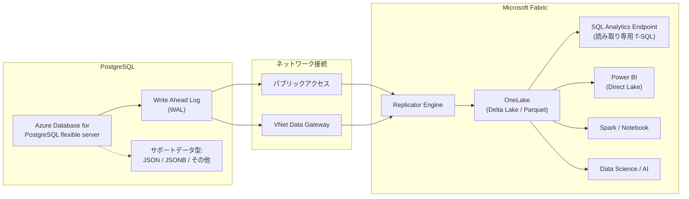

# Azure Database for PostgreSQL: Fabric Mirroring の機能強化が一般提供開始

**リリース日**: 2026-04-22

**サービス**: Azure Database for PostgreSQL / Microsoft Fabric

**機能**: Enhanced Mirroring Azure Database for PostgreSQL in Microsoft Fabric

**ステータス**: Launched (GA)

[このアップデートのインフォグラフィックを見る](https://takech9203.github.io/azure-news-summary/20260422-postgresql-fabric-mirroring-enhanced.html)

## 概要

Azure Database for PostgreSQL flexible server 向けの Microsoft Fabric Mirroring に、新たな機能強化が一般提供 (GA) として追加された。今回のアップデートでは、JSON、JSONB をはじめとするネイティブ PostgreSQL データ型のミラーリングサポートが追加され、実運用ワークロードを大規模に Fabric へミラーリングすることが容易になった。

従来の Fabric Mirroring for PostgreSQL では、JSON や JSONB などの一般的に使用されるデータ型がサポート対象外であり、これらの型を含むテーブルのカラムはミラーリングできなかった。今回の機能強化により、リッチな構造化データが変換なしで直接 OneLake に流れ込むようになり、ETL パイプラインの構築なしにニアリアルタイムで PostgreSQL のデータを Fabric の分析ワークロードに活用できるようになった。

**アップデート前の課題**

- JSON、JSONB などの一般的な PostgreSQL データ型がミラーリング非対応であり、これらの型を含むカラムは OneLake にレプリケーションできなかった
- 構造化された JSON データを分析基盤で利用するには、事前にデータ変換パイプラインの構築が必要だった
- 大規模な実運用ワークロードのミラーリングにおいて、データ型の制約が本番採用の障壁となっていた

**アップデート後の改善**

- JSON、JSONB およびその他の一般的に使用される PostgreSQL ネイティブデータ型がミラーリングに対応
- リッチな構造化データが変換なしで直接 OneLake に流れ込み、即座に分析可能
- 実運用ワークロードを大規模かつ信頼性を持って Fabric にミラーリングすることが可能に

## アーキテクチャ図



Azure Database for PostgreSQL の WAL (Write Ahead Log) から変更データを検出し、Fabric の Replicator Engine が OneLake に Delta Lake テーブル形式でニアリアルタイムにレプリケーションを行う。今回の機能強化により、JSON/JSONB などのネイティブデータ型がそのまま OneLake に流れ込むようになった。

## サービスアップデートの詳細

### 主要機能

1. **ネイティブ PostgreSQL データ型のサポート拡大**
   - JSON、JSONB などの一般的に使用されるデータ型がミラーリングに対応
   - リッチな構造化データが変換なしで直接 OneLake にレプリケーションされる
   - データ変換パイプラインの構築が不要となり、ゼロ ETL アーキテクチャが実現

2. **大規模ワークロードへの対応強化**
   - 実運用環境のワークロードを大規模にミラーリングすることが可能に
   - 信頼性の向上により、本番環境での運用に耐えうるレベルの機能を提供

3. **ゼロ ETL のデータレプリケーション**
   - WAL ベースの変更データキャプチャにより、INSERT / UPDATE / DELETE を継続的に検出
   - 変更データは Delta Lake テーブルに自動マージされ、OneLake 上で即座にクエリ可能
   - ETL パイプラインの設計・構築・保守が不要

4. **SQL Analytics Endpoint の自動生成**
   - ミラーリング作成時に SQL Analytics Endpoint が自動生成される
   - T-SQL によるクエリ、ビュー、TVF、ストアドプロシージャの作成が可能 (読み取り専用)
   - SSMS、VS Code (mssql 拡張機能)、GitHub Copilot 等のツールからもアクセス可能

5. **柔軟なネットワーク構成**
   - パブリックアクセス、仮想ネットワーク、プライベートエンドポイント構成に対応
   - VNet Data Gateway によるプライベート接続をサポート
   - 高可用性構成のサーバーからのミラーリングにも対応

## 技術仕様

| 項目 | 詳細 |
|------|------|
| ステータス | 一般提供 (GA) |
| 対応ソース | Azure Database for PostgreSQL flexible server |
| 対応 PostgreSQL バージョン | 14、15、16、17 |
| 対応コンピュートティア | General Purpose、Memory Optimized (Burstable は非対応) |
| レプリケーション方式 | WAL (Write Ahead Log) ベースの論理レプリケーション |
| ターゲットフォーマット | Delta Lake テーブル (Parquet) |
| テーブル上限 | 最大 1,000 テーブル |
| 認証方式 | Basic (PostgreSQL 認証)、Entra ID 認証 |
| ネットワーク | パブリックアクセス、VNet Data Gateway |
| 高可用性フェイルオーバー | バージョン 17 以上で透過的フェイルオーバーをサポート |

## 設定方法

### 前提条件

1. Azure Database for PostgreSQL flexible server が作成済みであること (General Purpose または Memory Optimized ティア)
2. Fabric キャパシティが有効かつ稼働中であること
3. Fabric テナント設定で「Service principals can use Fabric APIs」が有効化されていること
4. Fabric テナント設定で「Users can access data stored in OneLake with apps external to Fabric」が有効化されていること
5. Fabric ワークスペースで Member または Admin ロールを持っていること
6. PostgreSQL サーバーの System Assigned Managed Identity (SAMI) が有効であること
7. `wal_level` サーバーパラメータが `logical` に設定されていること
8. `azure_cdc` 拡張機能が許可リストに追加され、プリロードされていること (再起動が必要)

### Azure Portal

1. Fabric ポータル (https://fabric.microsoft.com) を開き、ワークスペースを選択
2. **New item** から **Mirrored Azure Database for PostgreSQL** を選択
3. 接続情報を入力:
   - **Server**: `<server-name>.postgres.database.azure.com`
   - **Database**: レプリケーション対象のデータベース名
   - **Authentication kind**: Basic (PostgreSQL Authentication) または Organizational account (Entra Authentication)
   - **Data Gateway**: 必要に応じて VNet Data Gateway を選択
4. **Connect** を選択して接続を検証
5. テーブル一覧からミラーリング対象のテーブルを選択 (最大 1,000 テーブル)、または **Mirror all data** を選択
6. **Mirror database** を選択してミラーリングを開始

### データベースロールの設定

```sql
-- Fabric 接続用のロールを作成
CREATE ROLE fabric_user CREATEDB CREATEROLE LOGIN REPLICATION PASSWORD '<strong_password>';

-- CDC 管理権限を付与
GRANT azure_cdc_admin TO fabric_user;

-- ミラーリング対象データベースの CREATE 権限を付与
GRANT CREATE ON DATABASE <database_name> TO fabric_user;

-- テーブルの所有権を変更 (必要に応じて)
ALTER TABLE <table_name> OWNER TO fabric_user;
```

## メリット

### ビジネス面

- JSON/JSONB データ型のサポートにより、アプリケーションのデータモデルを変更することなく分析基盤への統合が可能
- ETL パイプラインの開発・運用コストを大幅に削減し、分析基盤の構築期間を短縮
- ニアリアルタイムのデータ可用性により、意思決定のスピードが向上
- GA リリースにより SLA が提供され、本番環境での採用が可能

### 技術面

- JSON/JSONB データが変換なしで OneLake に流れ込むため、データ整合性を維持しつつ分析に活用可能
- フルマネージドのレプリケーションにより、パイプラインの障害対応やスケーリングの運用負荷を排除
- Delta Lake フォーマットによるオープンなデータ形式で、Fabric 内の全サービスとシームレスに連携
- Entra ID 認証に対応し、セキュリティ要件の高い環境でも導入可能

## デメリット・制約事項

- Burstable コンピュートティアのサーバーはソースとして非対応
- Read Replica、または Read Replica が存在する Primary サーバーからのミラーリングは非対応
- テーブル数の上限が 1,000 テーブルまで
- DDL 操作 (カラムの追加・削除・型変更) がミラーリング中のテーブルで非対応。変更にはレプリケーションの停止・再開が必要
- `TRUNCATE TABLE` コマンドがミラーリング対象テーブルでは非対応
- ビュー、マテリアライズドビュー、外部テーブル、TOAST テーブル、パーティションテーブルはミラーリング非対応
- TimescaleDB ハイパーテーブルは非対応
- Numeric/Decimal 型で精度 38 を超えるデータは `NULL` としてレプリケーションされる
- 高可用性構成における透過的フェイルオーバーはバージョン 17 以上のみ対応。それ以前のバージョンではフェイルオーバー後に手動でミラーリングの再設定が必要
- 一部のデータ型 (bit、inet、interval、macaddr、xml 等) は引き続き非対応

## ユースケース

### ユースケース 1: JSONB データを活用したリアルタイム分析

**シナリオ**: Web アプリケーションがユーザーイベントやセッションデータを JSONB 型で PostgreSQL に格納しており、マーケティングチームがリアルタイムに近い行動分析ダッシュボードを必要としている。

**効果**: JSONB データが変換なしで OneLake にミラーリングされるため、ETL パイプラインの構築なしに Power BI でリアルタイムダッシュボードを構築可能。データの鮮度が向上し、マーケティング施策の迅速な効果測定が実現する。

### ユースケース 2: IoT データの大規模分析基盤

**シナリオ**: IoT デバイスから収集したセンサーデータが JSON 型で PostgreSQL に蓄積されており、Fabric のデータサイエンス機能で予測保全モデルを構築したい。

**効果**: JSON 型のセンサーデータが OneLake に直接レプリケーションされ、Spark Notebook から即座に利用可能。大量の構造化された IoT データを変換なしで機械学習パイプラインに投入でき、モデルの学習サイクルを短縮できる。

## 料金

Fabric Mirroring のレプリケーションにかかるコンピュートおよびストレージには、キャパシティベースの無料枠が適用される。

| 項目 | 料金 |
|------|------|
| レプリケーションコンピュート | 無料 (Fabric キャパシティに含まれる) |
| OneLake ストレージ (ミラーリング用) | 1 CU あたり 1 TB まで無料 (例: F64 で 64 TB) |
| 超過ストレージ / キャパシティ一時停止時 | OneLake ストレージの通常料金が適用 |
| クエリコンピュート (SQL / Power BI / Spark) | 通常のキャパシティ消費として課金 |

## 利用可能リージョン

データベースミラーリングは、すべての Microsoft Fabric リージョンで利用可能。詳細は [Fabric region availability](https://learn.microsoft.com/en-us/fabric/admin/region-availability) を参照。

## 関連サービス・機能

- **Microsoft Fabric Mirroring**: Azure の各種データベースを OneLake にニアリアルタイムでレプリケーションする統合機能。Azure SQL Database、MySQL、Cosmos DB 等にも対応
- **Azure Database for PostgreSQL flexible server**: PostgreSQL 互換のフルマネージドデータベースサービス。General Purpose および Memory Optimized ティアでミラーリングをサポート
- **Microsoft Fabric OneLake**: Fabric のユニファイドデータレイク。Delta Lake フォーマットでデータを格納し、Fabric 内の全サービスからアクセス可能
- **Power BI Direct Lake**: OneLake 上の Delta テーブルに直接アクセスする Power BI のクエリモード。データ移動なしで高速なレポーティングを実現

## 参考リンク

- [インフォグラフィック](https://takech9203.github.io/azure-news-summary/20260422-postgresql-fabric-mirroring-enhanced.html)
- [公式アップデート情報](https://azure.microsoft.com/updates?id=560293)
- [Microsoft Learn ドキュメント - Fabric Mirroring for Azure Database for PostgreSQL](https://learn.microsoft.com/en-us/fabric/database/mirrored-database/azure-database-postgresql)
- [Microsoft Learn チュートリアル - ミラーリングの設定手順](https://learn.microsoft.com/en-us/fabric/database/mirrored-database/azure-database-postgresql-tutorial)
- [Microsoft Learn ドキュメント - 制限事項](https://learn.microsoft.com/en-us/fabric/database/mirrored-database/azure-database-postgresql-limitations)
- [Microsoft Learn ドキュメント - Fabric Mirroring 概要](https://learn.microsoft.com/en-us/fabric/database/mirrored-database/overview)

## まとめ

Azure Database for PostgreSQL flexible server 向けの Fabric Mirroring に、JSON/JSONB をはじめとするネイティブ PostgreSQL データ型のサポートが追加され、一般提供 (GA) として機能強化が発表された。これにより、構造化された JSON データを変換なしで OneLake にレプリケーションできるようになり、実運用ワークロードの大規模なミラーリングがより実用的になった。

Solutions Architect としては、PostgreSQL で JSONB 型を活用したアプリケーションを運用しており、Fabric での分析基盤を構築しているケースにおいて、本アップデートにより ETL パイプラインなしでのデータ統合が現実的な選択肢となった。Burstable ティア非対応や一部データ型の制約に留意しつつ、まずは開発環境でミラーリングの設定と JSON/JSONB データのレプリケーション検証を行い、ソースサーバーへのパフォーマンス影響を確認することを推奨する。

---

**タグ**: #AzureDatabaseForPostgreSQL #MicrosoftFabric #Mirroring #OneLake #DeltaLake #ZeroETL #GA #JSON #JSONB #Analytics #PowerBI #DataEngineering
