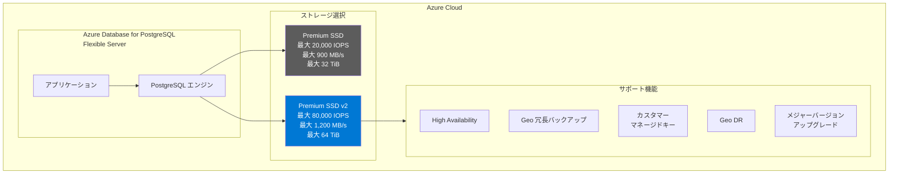

# Azure Database for PostgreSQL: Premium SSD v2 ストレージの一般提供開始 (GA)

**リリース日**: 2026-04-22

**サービス**: Azure Database for PostgreSQL

**機能**: Premium SSD v2 ストレージオプション

**ステータス**: Launched (GA)

[このアップデートのインフォグラフィックを見る](https://takech9203.github.io/azure-news-summary/20260422-postgresql-premium-ssd-v2.html)

## 概要

Azure Database for PostgreSQL Flexible Server において、Premium SSD v2 ストレージオプションが一般提供 (GA) となった。Premium SSD v2 は、従来の Premium SSD と比較して最大 4 倍の IOPS、大幅に低いレイテンシ、および I/O 集約型ワークロードに対する優れたコストパフォーマンスを提供する。

Premium SSD v2 では、容量・IOPS・スループットをそれぞれ個別に調整可能であり、ワークロードの特性に応じたきめ細かなパフォーマンスチューニングが実現する。従来の Premium SSD が固定サイズのディスク SKU に基づいて性能が決まるモデルだったのに対し、Premium SSD v2 は 1 GiB 単位でストレージサイズを設定でき、IOPS やスループットもワークロードの需要に合わせて動的に変更できる。

GA に伴い、High Availability、Geo 冗長バックアップ、Geo レプリカ、メジャーバージョンアップグレード、カスタマーマネージドキー (CMK)、Geo DR (ディザスタリカバリ) といったエンタープライズ機能もサポートされている。

**アップデート前の課題**

- Premium SSD では最大 IOPS が 20,000、最大スループットが 900 MB/s に制限されており、I/O 集約型ワークロードでボトルネックになるケースがあった
- ディスクサイズが固定の SKU (P1, P2, ... P80) に紐づいており、必要以上のストレージを確保しないと高い IOPS を得られなかった
- IOPS やスループットを個別に調整できず、ワークロードの変動に柔軟に対応することが困難だった
- 最大ディスクサイズが 32 TiB に制限されていた

**アップデート後の改善**

- 最大 80,000 IOPS (Premium SSD の 4 倍) を実現でき、トランザクション集約型ワークロードの性能が大幅に向上
- 容量・IOPS・スループットを個別に調整可能になり、コスト効率の高い構成が可能に
- 最大ディスクサイズが 64 TiB に拡大
- 1 GiB 単位でストレージサイズを設定でき、無駄のないリソースプロビジョニングが可能に
- HA、Geo 冗長バックアップ、CMK など主要なエンタープライズ機能をサポート

## アーキテクチャ図



Premium SSD v2 は従来の Premium SSD と比較して IOPS が 4 倍、スループットが約 1.3 倍、最大容量が 2 倍に向上しており、GA によりエンタープライズ向け機能も完全にサポートされている。

## サービスアップデートの詳細

### 主要機能

1. **柔軟なパフォーマンス調整**
   - 容量、IOPS、スループットをそれぞれ独立して設定可能
   - 24 時間以内に最大 4 回のパフォーマンス変更が可能 (新規作成ディスクは最初の 24 時間で最大 3 回)
   - ワークロードの変動に応じてリアルタイムにパフォーマンスを最適化

2. **無料ベースライン IOPS/スループット**
   - 399 GiB 以下のディスク: 3,000 IOPS / 125 MB/s が無料で提供
   - 400 GiB 以上のディスク: 12,000 IOPS / 500 MB/s が無料で提供
   - ベースラインを超えた分のみ追加課金

3. **きめ細かなストレージサイズ**
   - 1 GiB 単位でストレージサイズを設定可能 (1 GiB - 64 TiB)
   - 従来の Premium SSD のような固定 SKU サイズの制約なし

4. **エンタープライズ機能のフルサポート (GA)**
   - High Availability (HA)
   - Geo 冗長バックアップ
   - Geo レプリカ
   - メジャーバージョンアップグレード
   - カスタマーマネージドキー (CMK)
   - Geo DR (ディザスタリカバリ)

## 技術仕様

| 項目 | Premium SSD v2 | Premium SSD |
|------|---------------|-------------|
| ディスクタイプ | SSD | SSD |
| 最大ディスクサイズ | 65,536 GiB (64 TiB) | 32,767 GiB (32 TiB) |
| 最大 IOPS | 80,000 | 20,000 |
| 最大スループット | 1,200 MB/s | 900 MB/s |
| サイズ増分 | 1 GiB 単位 | 固定 SKU (P1-P80) |
| 無料 IOPS (399 GiB 以下) | 3,000 | ディスクサイズに依存 (120-2,300) |
| 無料 IOPS (400 GiB 以上) | 12,000 | ディスクサイズに依存 (5,000-20,000) |
| 無料スループット (399 GiB 以下) | 125 MB/s | ディスクサイズに依存 |
| 無料スループット (400 GiB 以上) | 500 MB/s | ディスクサイズに依存 |
| IOPS スケーリング | 500 IOPS/GiB | 固定 |
| ホストキャッシング | 非対応 | 対応 |
| サポートコンピューティングティア | General Purpose / Memory Optimized | 全ティア |

### ディスクサイズ別 IOPS 比較

| ディスクサイズ | Premium SSD IOPS | Premium SSD v2 IOPS |
|---------------|-----------------|---------------------|
| 32 GiB | 120 (バースト最大 3,500) | 3,000 (無料)、最大 17,179 |
| 64 GiB | 240 (バースト最大 3,500) | 3,000 (無料)、最大 34,359 |
| 128 GiB | 500 (バースト最大 3,500) | 3,000 (無料)、最大 68,719 |
| 256 GiB | 1,100 (バースト最大 3,500) | 3,000 (無料)、最大 80,000 |
| 512 GiB | 2,300 (バースト最大 3,500) | 12,000 (無料)、最大 80,000 |
| 1 TiB | 5,000 | 12,000 (無料)、最大 80,000 |
| 2 TiB | 7,500 | 12,000 (無料)、最大 80,000 |
| 4 TiB | 7,500 | 12,000 (無料)、最大 80,000 |
| 8 TiB | 16,000 | 12,000 (無料)、最大 80,000 |
| 16 TiB | 18,000 | 12,000 (無料)、最大 80,000 |
| 32 TiB | 20,000 | 12,000 (無料)、最大 80,000 |
| 64 TiB | N/A | 12,000 (無料)、最大 80,000 |

## 設定方法

### 前提条件

1. Azure サブスクリプション
2. General Purpose または Memory Optimized コンピューティングティアを使用すること (Burstable ティアは非対応)
3. PostgreSQL バージョン 14 以降 (バージョン 13 は非対応)

### Azure CLI

```bash
# Premium SSD v2 を使用して PostgreSQL Flexible Server を作成
az postgres flexible-server create \
  --name <server-name> \
  --resource-group <resource-group> \
  --location <location> \
  --storage-type PremiumV2_LRS \
  --storage-size 256 \
  --tier GeneralPurpose \
  --sku-name Standard_D4ds_v5
```

### Azure Portal

1. Azure Portal で **Azure Database for PostgreSQL Flexible Server** の作成画面を開く
2. **Compute + storage** セクションで **Configure server** をクリック
3. ストレージタイプとして **Premium SSD v2** を選択
4. ストレージサイズ、IOPS、スループットをそれぞれ設定
5. 設定を確認し、サーバーを作成

### 既存サーバーからの移行

Premium SSD から Premium SSD v2 へのオンライン移行はサポートされていない。以下の方法で移行可能。

1. **ポイントインタイムリストア (PITR)**: Premium SSD サーバーから Premium SSD v2 の新しいサーバーに復元
2. **読み取りレプリカ**: Premium SSD サーバーから Premium SSD v2 のレプリカを作成し、レプリケーション完了後にプロモート

**注意**: 移行前にソースの Premium SSD サーバーでストレージ自動拡張を無効にする必要がある。

## メリット

### ビジネス面

- IOPS やスループットをワークロードに合わせて個別に調整できるため、過剰なプロビジョニングを避けてコストを最適化できる
- GA ステータスにより SLA の対象となり、本番ワークロードへの適用が可能
- 無料のベースライン IOPS/スループットにより、中小規模のワークロードでは追加ストレージコストなしで高性能を実現

### 技術面

- 最大 80,000 IOPS により、大規模トランザクション処理やリアルタイム分析のパフォーマンスが大幅に向上
- ホストキャッシングを使用しないにもかかわらず、Premium SSD より低いレイテンシを実現
- 64 TiB までの大容量ディスクに対応し、大規模データベースの要件を満たせる
- パフォーマンスパラメータの動的変更により、ピーク時間帯だけ IOPS を増やすような運用が可能

## デメリット・制約事項

- **ストレージ自動拡張が非対応**: Premium SSD v2 ではストレージ自動拡張 (autogrow) がサポートされていないため、手動でのディスク容量管理が必要
- **Burstable ティアでは使用不可**: General Purpose と Memory Optimized コンピューティングティアのみ対応
- **PostgreSQL バージョン 13 は非対応**: バージョン 14 以降が必要
- **長期保存バックアップ非対応**: 長期保存バックアップ (Long-term backup) は現時点でサポートされていない
- **オンライン移行不可**: Premium SSD から Premium SSD v2 への直接的なオンライン移行はサポートされておらず、PITR またはレプリカを使用する必要がある
- **ストレージのスケールダウン不可**: ストレージは増やすことはできるが、減らすことはできない
- **ディスクハイドレーション中の制約**: ディスクハイドレーション中にコンピュートスケーリング、ストレージスケーリング、HA 有効化などの操作を行うとエラーが発生する可能性がある
- **パフォーマンス変更回数の制限**: 24 時間以内に最大 4 回まで (新規作成ディスクは最初の 24 時間で 3 回まで)
- **Geo 冗長バックアップと CMK の同時使用は非対応**: それぞれ個別には対応しているが、両方を同時に有効にすることはサポートされていない
- **ホストキャッシング非対応**: Premium SSD v2 はホストキャッシングをサポートしていない (ただしレイテンシは Premium SSD より低い)

## ユースケース

### ユースケース 1: 高頻度トランザクション処理データベース

**シナリオ**: EC サイトやフィンテックアプリケーションなど、大量のトランザクションを処理するデータベースで、高い IOPS と低レイテンシが求められるケース。

**効果**: Premium SSD v2 の最大 80,000 IOPS とサブミリ秒レイテンシにより、従来の Premium SSD (最大 20,000 IOPS) では対応が困難だった高負荷トランザクション処理を実現できる。

### ユースケース 2: ピーク負荷が変動するゲームアプリケーション

**シナリオ**: ゲームバックエンドのデータベースで、イベント時やピーク時間帯にのみ高い IOPS が必要になるケース。

**効果**: Premium SSD v2 の動的パフォーマンス調整により、ピーク時に IOPS を引き上げ、オフピーク時に下げることでコストを最適化できる。24 時間以内に最大 4 回の調整が可能。

### ユースケース 3: 大規模データウェアハウス

**シナリオ**: 数十 TiB のデータを保持する分析用データベースで、大容量ストレージと高スループットが求められるケース。

**効果**: 最大 64 TiB のディスク容量と最大 1,200 MB/s のスループットにより、大規模データセットの読み書きを効率的に処理できる。Premium SSD の 32 TiB 制限を超える容量が必要な場合にも対応可能。

## 料金

Premium SSD v2 の料金は、ストレージ容量、プロビジョニングされた IOPS、およびプロビジョニングされたスループットの 3 つの要素で構成される。

| 項目 | 課金モデル |
|------|-----------|
| ストレージ容量 | GiB 単位で課金 |
| IOPS | 無料ベースラインを超えた分に対して課金 |
| スループット | 無料ベースラインを超えた分に対して課金 |

**無料ベースライン:**
- 399 GiB 以下のディスク: 3,000 IOPS / 125 MB/s
- 400 GiB 以上のディスク: 12,000 IOPS / 500 MB/s

詳細な料金は [Azure Database for PostgreSQL Flexible Server 料金ページ](https://azure.microsoft.com/pricing/details/postgresql/flexible-server/) を参照。

## 利用可能リージョン

Premium SSD v2 は以下のリージョンで利用可能。

**アメリカ**: Brazil South, Brazil Southeast, Canada Central, Canada East, Central US, East US, East US 2, North Central US, South Central US, West Central US, West US, West US 2, West US 3

**ヨーロッパ**: Austria East, France Central, Germany West Central, Germany North, Italy North, North Europe, Norway East, Norway West, Poland Central, Spain Central, Sweden Central, Switzerland North, Switzerland West, UK South, UK West, West Europe

**アジア太平洋 / 中東**: Australia Central 2, Australia East, Australia Southeast, Central India, East Asia, Indonesia Central, Israel Central, Japan East, Japan West, Jio India Central, Jio India West, Korea Central, Malaysia West, New Zealand North, South India, Southeast Asia, UAE North

**アフリカ**: South Africa North, South Africa West

**注意**: Geo 冗長バックアップは一部のリージョン (アスタリスク付きのリージョン) では利用できない。ソブリンリージョン (China North 3、US Gov Virginia) ではスタンドアロン SSD v2 のみサポート。

## 関連サービス・機能

- **Premium SSD**: 従来のストレージオプション。固定 SKU ベースで最大 20,000 IOPS をサポート。Premium SSD v2 への移行が推奨されるワークロードもある
- **Azure Key Vault**: CMK を使用した暗号化を構成する場合に、暗号化キーの格納先として使用
- **Azure Monitor**: ストレージ使用率、IOPS 消費率、スループットなどのメトリクスの監視とアラート設定に使用
- **High Availability**: Premium SSD v2 でゾーン冗長 HA がサポートされており、ビジネスクリティカルなワークロードに対応
- **Geo 冗長バックアップ**: Premium SSD v2 で Geo 冗長バックアップがサポートされ、リージョン障害時のデータ保護を実現

## 参考リンク

- [インフォグラフィック](https://takech9203.github.io/azure-news-summary/20260422-postgresql-premium-ssd-v2.html)
- [公式アップデート情報](https://azure.microsoft.com/updates?id=560336)
- [Microsoft Learn - Storage options](https://learn.microsoft.com/en-us/azure/postgresql/flexible-server/concepts-storage)
- [Microsoft Learn - Premium SSD v2](https://learn.microsoft.com/en-us/azure/postgresql/flexible-server/concepts-storage-premium-ssd-v2)
- [料金ページ](https://azure.microsoft.com/pricing/details/postgresql/flexible-server/)

## まとめ

Azure Database for PostgreSQL Flexible Server で Premium SSD v2 ストレージが GA となり、I/O 集約型ワークロード向けの大幅なパフォーマンス向上が本番環境で利用可能になった。従来の Premium SSD と比較して最大 4 倍の IOPS (80,000)、約 1.3 倍のスループット (1,200 MB/s)、2 倍のディスク容量 (64 TiB) を提供し、容量・IOPS・スループットを個別に調整できる柔軟性がコスト最適化に寄与する。HA、Geo 冗長バックアップ、CMK などのエンタープライズ機能もサポートされている。一方で、ストレージ自動拡張の非対応、Burstable ティアの非対応、オンライン移行の非対応などの制約があるため、導入前にワークロード要件との適合性を確認することを推奨する。高い IOPS やスループットが求められるトランザクション処理、ピーク負荷が変動するアプリケーション、大規模データベースを運用している場合は、Premium SSD v2 への移行を検討すべきである。

---

**タグ**: #Azure #PostgreSQL #PremiumSSDv2 #Storage #GA #Database #Performance #FlexibleServer
