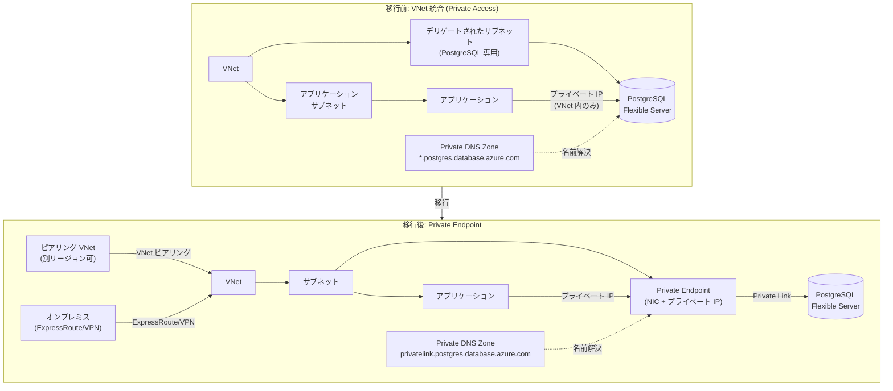

# Azure Database for PostgreSQL: VNet 統合から Private Endpoint 対応ネットワーク構成への移行

**リリース日**: 2026-04-22

**サービス**: Azure Database for PostgreSQL Flexible Server

**機能**: VNet 統合デプロイメントから Private Endpoint 対応ネットワーク構成への移行

**ステータス**: In preview

[このアップデートのインフォグラフィックを見る](https://takech9203.github.io/azure-news-summary/20260422-postgresql-vnet-to-private-endpoint.html)

## 概要

Azure Database for PostgreSQL Flexible Server において、仮想ネットワーク (VNet) 統合でデプロイされたサーバーを、Private Endpoint 接続をサポートするネットワーク構成に移行できる機能がパブリックプレビューとして提供開始された。

これまで、VNet 統合 (Private Access) モードでデプロイされたサーバーは、デプロイ後にネットワーキングモードを変更することができなかった。Private Endpoint を使用したい場合は、Public Access モードで新しくサーバーを作成し、データを移行する必要があった。今回のアップデートにより、既存の VNet 統合サーバーを Private Endpoint 対応構成に直接移行できるようになり、サーバーの再作成やデータ移行の手間が不要となった。

**アップデート前の課題**

- VNet 統合でデプロイしたサーバーは、Private Endpoint を構成できなかった
- ネットワーキングモードの変更にはサーバーの再作成とデータ移行が必要だった
- VNet 統合はデリゲートされたサブネットを専有するため、サブネットリソースの柔軟性が制限されていた
- VNet 統合サーバーは別の VNet やサブネットへの移動が不可能だった

**アップデート後の改善**

- 既存の VNet 統合サーバーを Private Endpoint 対応構成に直接移行可能になった
- サーバーの再作成やデータ移行が不要になった
- Private Endpoint による、より柔軟なネットワーク接続 (同一 VNet、ピアリング VNet、オンプレミスなど) が利用可能になった
- Private Link によるグローバルリーチ (異なるリージョンからのプライベート接続) が可能になった

## アーキテクチャ図

移行前の VNet 統合構成では、PostgreSQL サーバーがデリゲートされたサブネットに直接インジェクションされ、同一 VNet 内からのアクセスに限定されていた。移行後の Private Endpoint 構成では、Private Link を介した接続により、ピアリング VNet やオンプレミスからのアクセスなど、より柔軟なネットワーク接続が可能になる。

## サービスアップデートの詳細

### 主要機能

1. **VNet 統合から Private Endpoint 対応構成へのインプレース移行**
   - 既存のサーバーを再作成することなく、ネットワーキングモードを変更可能
   - データの移行やダウンタイムを最小限に抑えた移行パスを提供

2. **Private Endpoint による柔軟な接続性**
   - 同一 VNet、ピアリング VNet、VNet 間接続 (VPN Gateway)、オンプレミス (ExpressRoute/VPN) からの接続に対応
   - 異なるリージョンからのプライベート接続 (グローバルリーチ) をサポート

3. **データ漏洩防止**
   - Private Endpoint はサービス全体ではなく特定のリソースインスタンスにマッピングされるため、他のリソースへのアクセスがブロックされる

## 技術仕様

| 項目 | 詳細 |
|------|------|
| 対象サービス | Azure Database for PostgreSQL Flexible Server |
| ステータス | パブリックプレビュー |
| 移行元 | Private Access (VNet 統合) |
| 移行先 | Public Access + Private Endpoint |
| Private Endpoint DNS ゾーン | `privatelink.postgres.database.azure.com` |
| 対応する機能 (Private Endpoint) | 高可用性、読み取りレプリカ、仮想エンドポイント付き読み取りレプリカ、ポイントインタイムリストア、メジャーバージョンアップグレード、Microsoft Entra 認証、PgBouncer 接続プーリング、カスタマーマネージドキー暗号化 |
| NSG/UDR サポート | Private Endpoint ではネットワークポリシー (NSG、UDR、ASG) をサポート |
| ファイアウォールルールとの併用 | Private Endpoint とパブリックアクセス/ファイアウォールルールの同時利用が可能 |

## メリット

### ビジネス面

- **移行コストの削減**: サーバーの再作成やデータ移行が不要になり、運用工数とリスクを削減
- **ダウンタイムの最小化**: インプレース移行により、サービス停止時間を最小限に抑制
- **コンプライアンス対応の強化**: Private Link によるデータ漏洩防止機能で、セキュリティ要件への対応が容易に

### 技術面

- **柔軟なネットワーク接続**: 同一 VNet だけでなく、ピアリング VNet やオンプレミスからの接続が可能
- **グローバルリーチ**: 異なるリージョンからも Private Link 経由でプライベート接続が可能
- **ネットワークポリシーの適用**: NSG、UDR、ASG による細かなトラフィック制御が可能
- **Hub-and-Spoke アーキテクチャとの親和性**: 中央集約型のネットワーク設計で Private DNS ゾーンを一元管理可能
- **サブネットの制約解消**: VNet 統合ではデリゲートされたサブネットが PostgreSQL 専用となるが、Private Endpoint ではその制約がなくなる

## デメリット・制約事項

- パブリックプレビュー段階のため、本番ワークロードでの利用は慎重に検討する必要がある
- 移行後は VNet 統合構成には戻せない可能性がある (公式ドキュメントで確認が必要)
- Private Endpoint の数はデータベースサービス自体ではなく、Azure ネットワーキングの制約 (VNet 内のサブネットにインジェクション可能な Private Endpoint 数) に依存する
- DNS 構成の変更が必要 (VNet 統合時の DNS ゾーンから `privatelink.postgres.database.azure.com` への移行)
- Private Endpoint 利用時は Private DNS ゾーンの適切な構成とリンクが必要
- 既存のアプリケーションの接続文字列やネットワーク構成の更新が必要になる場合がある

## ユースケース

### ユースケース 1: ハブアンドスポーク ネットワーク構成への統合

**シナリオ**: 企業がハブアンドスポーク型のネットワークアーキテクチャを採用しており、VNet 統合でデプロイ済みの PostgreSQL サーバーを中央集約型のネットワーク管理に統合したい場合。

**効果**: Private Endpoint に移行することで、ハブ VNet に Private DNS ゾーンを集中配置し、複数のスポーク VNet やオンプレミスから一元的にアクセス管理が可能になる。

### ユースケース 2: マルチリージョン接続の実現

**シナリオ**: 異なるリージョンに展開されたアプリケーションから、単一の PostgreSQL サーバーにプライベート接続したい場合。VNet 統合では同一 VNet 内からのアクセスに限定されていた。

**効果**: Private Endpoint のグローバルリーチ機能により、異なるリージョンの VNet からも Private Link 経由でセキュアに接続できるようになる。

### ユースケース 3: オンプレミスからのハイブリッド接続

**シナリオ**: オンプレミスのアプリケーションから ExpressRoute または VPN 経由で PostgreSQL サーバーにプライベート接続したい場合。

**効果**: Private Endpoint を経由することで、オンプレミスから Azure バックボーンネットワークを通じたセキュアな接続が実現される。

## 料金

Private Endpoint の料金は Azure Private Link の料金体系に基づく。詳細は以下の料金ページを参照。

- [Azure Private Link の料金](https://azure.microsoft.com/pricing/details/private-link/)
- [Azure Database for PostgreSQL の料金](https://azure.microsoft.com/pricing/details/postgresql/flexible-server/)

## 関連サービス・機能

- **Azure Private Link**: Private Endpoint の基盤となるサービス。Azure PaaS サービスへのプライベート接続を提供
- **Azure Private DNS**: Private Endpoint の名前解決に必要な DNS ゾーン管理サービス
- **Azure Virtual Network**: VNet 統合および Private Endpoint の両方で使用されるネットワーク基盤
- **Azure ExpressRoute / VPN Gateway**: オンプレミスからの Private Endpoint 経由接続に使用
- **Azure DNS Private Resolver**: ハイブリッド DNS 環境でのクロスプレミス名前解決に使用

## 参考リンク

- [インフォグラフィック](https://takech9203.github.io/azure-news-summary/20260422-postgresql-vnet-to-private-endpoint.html)
- [公式アップデート情報](https://azure.microsoft.com/updates?id=560298)
- [Microsoft Learn - Private Link を使用したネットワーク概要](https://learn.microsoft.com/azure/postgresql/flexible-server/concepts-networking-private-link)
- [Microsoft Learn - VNet 統合 (Private Access) を使用したネットワーク概要](https://learn.microsoft.com/azure/postgresql/flexible-server/concepts-networking-private)
- [Microsoft Learn - ネットワーク設定の構成](https://learn.microsoft.com/azure/postgresql/flexible-server/how-to-networking)

## まとめ

Azure Database for PostgreSQL Flexible Server において、VNet 統合デプロイメントから Private Endpoint 対応構成へのインプレース移行がパブリックプレビューとして利用可能になった。これにより、VNet 統合でデプロイ済みのサーバーを再作成することなく、Private Endpoint による柔軟なネットワーク接続に移行できる。

Solutions Architect にとって、このアップデートは特にハブアンドスポーク型ネットワークアーキテクチャの採用、マルチリージョン接続、オンプレミスからのハイブリッド接続といったシナリオで重要な意味を持つ。パブリックプレビュー段階であるため、本番環境への適用は検証環境での十分なテストを経てから検討することを推奨する。

---

**タグ**: #Azure #PostgreSQL #FlexibleServer #PrivateEndpoint #PrivateLink #VNet #ネットワーキング #移行 #パブリックプレビュー #データベース #ハイブリッドクラウド
