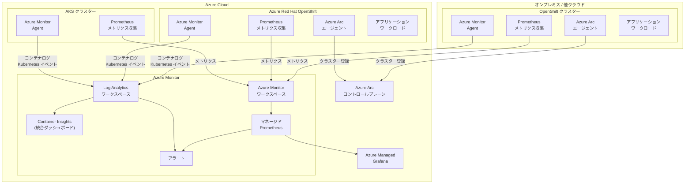

# Azure Monitor: Azure Arc 対応 Kubernetes での OpenShift および Azure Red Hat OpenShift サポートが一般提供開始

**リリース日**: 2026-04-23

**サービス**: Azure Monitor

**機能**: Azure Arc 対応 Kubernetes クラスター上の OpenShift および Azure Red Hat OpenShift (ARO) に対する Azure Monitor の完全な監視サポート

**ステータス**: Launched (GA)

[このアップデートのインフォグラフィックを見る](https://takech9203.github.io/azure-news-summary/20260423-azure-monitor-arc-openshift.html)

## 概要

Azure Monitor が Azure Arc 対応 Kubernetes クラスター上で動作する OpenShift および Azure Red Hat OpenShift (ARO) に対する監視サポートを一般提供 (GA) として開始した。これにより、Kubernetes インフラストラクチャおよびその上で動作するアプリケーションの正常性とパフォーマンスを監視するための完全なサービスセットが、OpenShift 環境でも利用可能になる。

Azure Monitor は、Azure Kubernetes Service (AKS) だけでなく、AWS や GCP などの他のクラウドで稼働するクラスターも含めた包括的な Kubernetes 監視機能を提供してきた。今回の GA により、オンプレミスや他クラウドで稼働する OpenShift クラスターを Azure Arc を介して接続し、Azure Monitor の Container Insights、マネージド Prometheus、Log Analytics などの機能を統合的に利用できるようになった。Azure Red Hat OpenShift (ARO) は Microsoft と Red Hat が共同で設計・運用・サポートする完全マネージドの OpenShift サービスであり、このアップデートにより ARO クラスターも同一の監視基盤で管理できるようになる。

これまで OpenShift 環境では独自のモニタリングスタック (Prometheus + Grafana) を個別に運用する必要があったが、Azure Monitor への統合により、AKS クラスターと同じダッシュボード、アラート、分析ツールで一元管理することが可能になる。ハイブリッド・マルチクラウド環境において統一された可観測性を実現する重要なアップデートである。

**アップデート前の課題**

- OpenShift クラスターの監視には独自の Prometheus + Grafana スタックを個別に構築・運用する必要があり、AKS クラスターとは別の監視基盤を管理する運用負荷が発生していた
- オンプレミスや他クラウドの OpenShift クラスターのメトリクスやログを Azure の監視基盤に集約する統一的な手段が限定的であった
- AKS クラスターと OpenShift クラスターで異なる監視ツールを使用するため、ハイブリッド環境全体の正常性を一元的に把握することが困難であった
- ARO クラスターに対する Azure Monitor の統合監視が完全にはサポートされていなかった

**アップデート後の改善**

- Azure Arc を介して接続した OpenShift クラスターに対して、Container Insights、マネージド Prometheus、Log Analytics の全機能が GA として利用可能になった
- ARO クラスターと AKS クラスターを同一の Azure Monitor ダッシュボードで一元管理できるようになった
- 統合監視ダッシュボードにより、ハイブリッド・マルチクラウド環境全体の Kubernetes クラスターの正常性を単一画面で確認できるようになった
- SLA に裏付けられた本番ワークロード向けの監視機能が OpenShift 環境でも利用可能になった

## アーキテクチャ図



オンプレミスや他クラウドの OpenShift クラスターは Azure Arc エージェントを通じて Azure に接続される。Azure Monitor Agent がコンテナログと Kubernetes イベントを Log Analytics ワークスペースに送信し、Prometheus メトリクスは Azure Monitor ワークスペースに収集される。AKS、ARO、Arc 対応 OpenShift のすべてのクラスターが同一の Container Insights ダッシュボードとマネージド Grafana で統合的に監視される。

## サービスアップデートの詳細

### 主要機能

1. **Container Insights による統合監視**
   - Azure Arc 対応 OpenShift クラスターに対して、コンテナログ (stdout/stderr)、Kubernetes イベント、Pod インベントリなどの情報を収集し、Log Analytics ワークスペースに格納する。Azure Portal の統合監視ダッシュボードで、すべてのクラスターの状態を一元的に確認できる。

2. **マネージド Prometheus メトリクス収集**
   - Azure Monitor マネージドサービス for Prometheus を使用して、OpenShift クラスターからメトリクスを収集する。PromQL 互換のクエリ言語と Prometheus アラートをサポートし、自前の Prometheus 環境を管理する複雑さなく、クラウドネイティブなメトリクス分析が可能。

3. **Azure Managed Grafana との統合**
   - 収集した Prometheus メトリクスを Azure Managed Grafana で可視化する。Kubernetes 監視用の事前定義されたダッシュボードが複数提供されており、フルスタックのトラブルシューティングが可能。

4. **コントロールプレーンログの収集**
   - OpenShift クラスターのコントロールプレーンログを Azure Monitor のリソースログとして収集する。診断設定を作成してコンテナログと同じ Log Analytics ワークスペースに格納することで、クラスター全体の問題分析に活用できる。

5. **マルチクラスター統合ビュー**
   - Azure Portal の統合監視ダッシュボードで、AKS、ARO、Arc 対応 OpenShift クラスターを含むすべての Kubernetes 環境を一覧表示し、個別のクラスターにドリルダウンして詳細を確認できる。

## 技術仕様

| 項目 | 詳細 |
|------|------|
| ステータス | 一般提供 (GA) |
| 対象プラットフォーム | OpenShift (Azure Arc 対応)、Azure Red Hat OpenShift (ARO) |
| 必要なエージェント | Azure Arc エージェント、Azure Monitor Agent (コンテナ化版) |
| メトリクス収集 | Azure Monitor マネージドサービス for Prometheus |
| ログ収集先 | Log Analytics ワークスペース (ContainerLogV2 スキーマ対応) |
| メトリクス収集先 | Azure Monitor ワークスペース |
| クエリ言語 | PromQL (メトリクス)、KQL (ログ) |
| 可視化 | Azure Portal 統合ダッシュボード、Azure Managed Grafana |
| 認証方式 | マネージド ID 認証 |

## 設定方法

### 前提条件

1. OpenShift クラスターが Azure Arc に接続されていること (Azure Arc エージェントがデプロイ済み)
2. Azure サブスクリプションに以下のリソースプロバイダーが登録されていること:
   - Microsoft.ContainerService
   - Microsoft.Insights
   - Microsoft.AlertsManagement
   - Microsoft.Monitor
3. クラスターへのオンボーディングに Contributor 以上のアクセス権が必要
4. Grafana ワークスペースとの連携を行う場合は Owner または Contributor + User Access Administrator ロールが必要
5. マネージド ID 認証が有効であること

### Azure CLI

```bash
# Azure Arc に OpenShift クラスターを接続
az connectedk8s connect --name <cluster-name> --resource-group <resource-group>

# Azure Monitor 拡張機能のインストール (Container Insights + Prometheus)
az k8s-extension create \
  --name azuremonitor-containers \
  --cluster-name <cluster-name> \
  --resource-group <resource-group> \
  --cluster-type connectedClusters \
  --extension-type Microsoft.AzureMonitor.Containers \
  --configuration-settings \
    logAnalyticsWorkspaceResourceID=<workspace-resource-id> \
    amalogs.useAADAuth=true
```

### Azure Portal

1. Azure Portal で対象の Arc 対応 Kubernetes リソースに移動する
2. サービスメニューから「Monitor」>「Monitor Settings」を選択する
3. Prometheus メトリクス、Grafana、コンテナログの収集を有効化する
4. Azure Monitor ワークスペース、Log Analytics ワークスペース、Managed Grafana ワークスペースを指定する (既存のワークスペースを選択するか、新規作成する)
5. ログ収集プロファイルを選択する (Default / Syslog / Standard / Cost-optimized)
6. 「Review + enable」を選択して設定を適用する

## メリット

### ビジネス面

- ハイブリッド・マルチクラウド環境全体の Kubernetes クラスターを単一の監視基盤で管理でき、運用コストとツール管理の複雑さを削減できる
- OpenShift 環境を Azure の運用管理エコシステムに統合することで、既存の Azure スキルセットとプロセスを活用できる
- GA リリースにより SLA が適用され、本番ワークロードの監視基盤として信頼性が保証される

### 技術面

- AKS、ARO、オンプレミス OpenShift を同一の Container Insights ダッシュボードで統合的に監視でき、環境横断的なトラブルシューティングが可能になる
- マネージド Prometheus によりメトリクス収集基盤の運用負荷が不要になり、PromQL によるクエリと Prometheus アラートルールをそのまま活用できる
- Azure Monitor Agent のコンテナ化版が各ノードにデプロイされ、stdout/stderr ログ、Kubernetes イベント、Pod インベントリを自動収集する
- Azure Managed Grafana の事前定義ダッシュボードにより、即座に可視化環境を構築できる

## デメリット・制約事項

- Azure Arc エージェントのデプロイと維持が必要であり、ネットワーク要件 (Azure への安全なアウトバウンド接続) を満たす必要がある
- OpenShift 固有のモニタリング機能 (OpenShift Console の組み込みモニタリング等) との二重管理になる可能性がある
- Azure Monitor へのデータ転送には従量課金が発生するため、大規模クラスターではログ収集プロファイルやサンプリングの適切な設定が重要
- オンプレミス環境からの Azure へのネットワーク接続が必要であり、セキュリティポリシーとの整合性を確認する必要がある

## ユースケース

### ユースケース 1: ハイブリッドクラウド Kubernetes 統合監視

**シナリオ**: オンプレミスの OpenShift クラスターと Azure 上の AKS クラスターおよび ARO クラスターを運用する企業が、すべてのクラスターの監視を Azure Monitor に統合する。

**効果**: 異なる環境で稼働する Kubernetes クラスターの正常性、パフォーマンス、リソース使用率を単一のダッシュボードで把握でき、クラスター間の比較分析やアラートの一元管理が実現する。監視ツールのサイロ化を解消し、インシデント対応の迅速化に寄与する。

### ユースケース 2: OpenShift から ARO へのマイグレーション監視

**シナリオ**: オンプレミスの OpenShift クラスターを Azure Red Hat OpenShift (ARO) にマイグレーションするプロジェクトにおいて、移行前後の両環境を同一の Azure Monitor で監視する。

**効果**: マイグレーション期間中も両環境のメトリクスとログを統合的に分析でき、パフォーマンスの劣化や設定の不整合を早期に検出できる。移行完了後はシームレスに ARO の監視に移行できる。

### ユースケース 3: マルチクラウド OpenShift の統合運用

**シナリオ**: AWS や GCP 上でも OpenShift クラスターを運用しており、Azure Arc を介してすべてのクラスターを Azure に接続し、Azure Monitor で統合監視を実施する。

**効果**: クラウドプロバイダーに依存しない統一的な監視体験を実現し、マルチクラウド環境全体の可観測性を確保できる。PromQL ベースのアラートルールを全クラスターに適用し、一貫した運用ポリシーを維持できる。

## 料金

Azure Monitor の Kubernetes 監視に関連する主要なコスト要因は以下のとおり。

| 項目 | 概要 |
|------|------|
| ログデータインジェスト (Log Analytics) | Log Analytics ワークスペースへのデータ取り込み量に応じた従量課金 |
| メトリクスインジェスト (マネージド Prometheus) | Azure Monitor ワークスペースへの Prometheus メトリクス取り込み量に応じて課金 |
| データ保持 | Log Analytics のデフォルト保持期間 (31 日間) は無料。それ以降は保持期間に応じて課金 |
| Azure Managed Grafana | Grafana インスタンスの SKU に応じた課金 |
| 無料枠 | Log Analytics は毎月 5 GB のデータインジェストが無料 |

ログ収集プロファイル (Cost-optimized 等) を適切に設定することで、収集するデータ量を制御しコストを最適化できる。詳細な料金情報は [Azure Monitor の料金ページ](https://azure.microsoft.com/pricing/details/monitor/) を参照のこと。

## 関連サービス・機能

- **Azure Arc 対応 Kubernetes**: オンプレミスや他クラウドの Kubernetes クラスターを Azure のコントロールプレーンに接続するサービス。CNCF 認定の Kubernetes ディストリビューションに対応し、OpenShift もサポートされている
- **Azure Red Hat OpenShift (ARO)**: Microsoft と Red Hat が共同で運用するフルマネージド OpenShift サービス。99.95% の SLA が提供される
- **Container Insights**: Kubernetes クラスターのコンテナログ、Kubernetes イベント、Pod インベントリを収集・分析する Azure Monitor の機能
- **Azure Monitor マネージドサービス for Prometheus**: Prometheus 互換のフルマネージドメトリクス収集・分析サービス。PromQL とアラートをサポート
- **Azure Managed Grafana**: Prometheus メトリクスの可視化に使用する Grafana のフルマネージドサービス
- **Microsoft Defender for Containers**: Arc 対応 Kubernetes クラスターに対する脅威保護を提供するセキュリティサービス
- **Azure Policy for Kubernetes**: クラスター全体にポリシーを適用し、コンプライアンスの管理とレポートを行う機能

## 参考リンク

- [インフォグラフィック](https://takech9203.github.io/azure-news-summary/20260423-azure-monitor-arc-openshift.html)
- [公式アップデート情報](https://azure.microsoft.com/updates?id=560358)
- [Kubernetes monitoring in Azure Monitor - Microsoft Learn](https://learn.microsoft.com/azure/azure-monitor/containers/kubernetes-monitoring-overview)
- [Enable monitoring for AKS and Arc-enabled clusters - Microsoft Learn](https://learn.microsoft.com/azure/azure-monitor/containers/kubernetes-monitoring-enable)
- [Azure Arc-enabled Kubernetes overview - Microsoft Learn](https://learn.microsoft.com/azure/azure-arc/kubernetes/overview)
- [Introduction to Azure Red Hat OpenShift - Microsoft Learn](https://learn.microsoft.com/azure/openshift/intro-openshift)
- [Container Insights for Arc-enabled clusters - Microsoft Learn](https://learn.microsoft.com/azure/azure-monitor/containers/container-insights-enable-arc-enabled-clusters)
- [料金ページ](https://azure.microsoft.com/pricing/details/monitor/)

## まとめ

Azure Monitor が Azure Arc 対応 Kubernetes 上の OpenShift および Azure Red Hat OpenShift (ARO) に対する完全な監視サポートを GA として提供開始した。Container Insights によるログ収集、マネージド Prometheus によるメトリクス収集、Azure Managed Grafana による可視化、統合ダッシュボードによるマルチクラスター監視が OpenShift 環境でも利用可能になる。

ハイブリッド・マルチクラウド環境で OpenShift を運用する組織にとって、このアップデートは Azure Monitor を統一的な Kubernetes 監視基盤として採用するための重要なマイルストーンとなる。既に AKS を Azure Monitor で監視している環境では、OpenShift クラスターを Azure Arc で接続し同一のダッシュボードに統合することで、環境全体の可観測性を大幅に向上させることができる。GA リリースにより SLA が適用されるため、本番ワークロードの監視基盤としての採用を検討することを推奨する。

---

**タグ**: #Azure #AzureMonitor #AzureArc #OpenShift #AzureRedHatOpenShift #ARO #ContainerInsights #Prometheus #Kubernetes #ハイブリッドクラウド #マルチクラウド #GA #監視
