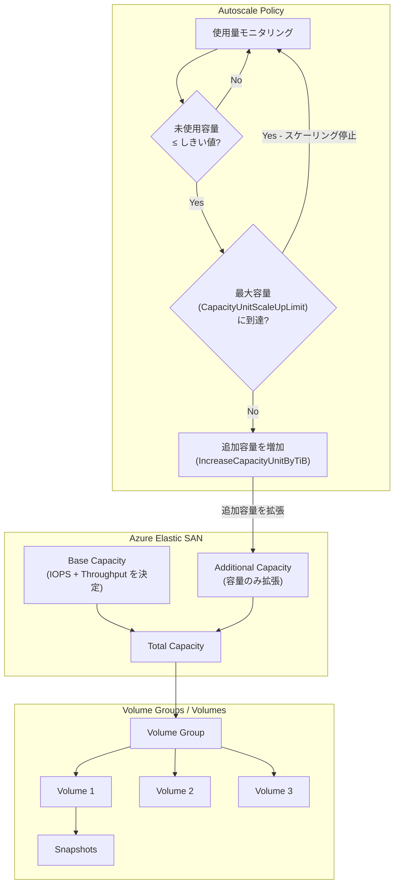

# Azure Elastic SAN: Capacity Autoscaling が一般提供開始

**リリース日**: 2026-04-23

**サービス**: Azure Elastic SAN

**機能**: Capacity Autoscaling (容量自動スケーリング)

**ステータス**: Launched (GA)

[このアップデートのインフォグラフィックを見る](https://takech9203.github.io/azure-news-summary/20260423-elastic-san-capacity-autoscaling.html)

## 概要

Azure Elastic SAN の Capacity Autoscaling 機能が一般提供 (GA) として正式リリースされた。この機能により、Elastic SAN の容量を使用量に基づいて自動的に拡張するポリシーを設定できるようになり、過剰プロビジョニングや手動での容量管理の制約から解放される。

Capacity Autoscaling は、ストレージ消費が継続的に増加する環境 (ボリュームスナップショットを使用する環境など) において特に有用である。ボリュームスナップショットは Elastic SAN の総容量の一部を消費するため、オートスケールポリシーを設定することで SAN のスナップショット保存領域が不足するリスクを防止できる。

オートスケールポリシーでは、未使用容量のしきい値、スケールアップ時の増加量、最大容量の上限という 3 つのパラメータを設定する。未使用容量がしきい値以下になると自動的に追加容量 (additional capacity) が増加し、指定した最大容量に達するまでスケールアップが行われる。なお、オートスケーリングで増加するのは追加容量のみであり、ベース容量 (IOPS とスループットに影響) は自動的にはスケールアップされない。

**アップデート前の課題**

- ストレージ容量の管理が手動であり、使用量の監視と手動での容量追加が必要であった
- 容量不足を避けるために過剰プロビジョニングが発生しやすく、コスト効率が低下していた
- ボリュームスナップショットの蓄積により予期せず容量が不足し、運用に影響が出るリスクがあった
- ストレージ容量の拡張タイミングを見極めるための監視・アラート設定が運用負荷となっていた

**アップデート後の改善**

- オートスケールポリシーにより、使用量に応じた容量の自動拡張が可能に
- 過剰プロビジョニングを回避し、実際の使用量に近い容量で運用することでコストを最適化
- スナップショット蓄積による容量不足を自動的に防止し、運用リスクを低減
- 最大容量の上限を設定できるため、予期しないコスト増加を防止

## アーキテクチャ図



Elastic SAN のオートスケールポリシーのフローを示している。使用量がモニタリングされ、未使用容量がしきい値以下になると追加容量 (Additional Capacity) が自動的に増加する。最大容量の上限に達するとスケーリングは停止する。ベース容量 (IOPS・スループットを決定) は自動スケーリングの対象外である。

## サービスアップデートの詳細

### 主要機能

1. **使用量ベースの自動容量拡張**
   - 未使用容量が設定したしきい値 (UnusedSizeTiB) 以下になると、自動的にスケールアップ操作がトリガーされる
   - 追加容量を指定した増分 (IncreaseCapacityUnitByTiB) で拡張し、最小増分は 1 TiB
   - 最大容量の上限 (CapacityUnitScaleUpLimit) を超えた自動スケーリングは行われない

2. **追加容量 (Additional Capacity) のみの自動拡張**
   - オートスケーリングで増加するのは追加容量のみで、ベース容量は変更されない
   - ベース容量に紐づく IOPS やスループットは自動的にはスケールアップしないため、パフォーマンス増強が必要な場合は手動でベース容量を調整する必要がある

3. **SAN 作成時または既存 SAN への後からの有効化**
   - Elastic SAN の新規作成時にオートスケールポリシーを有効化可能
   - 既存の Elastic SAN に対しても後からポリシーを設定可能

## 技術仕様

| 項目 | 詳細 |
|------|------|
| 機能名 | Capacity Autoscaling |
| ステータス | 一般提供 (GA) |
| 対象リソース | Azure Elastic SAN (SAN レベル) |
| スケーリング対象 | 追加容量 (Additional Capacity) のみ |
| 最小増分 | 1 TiB |
| パラメータ: UnusedSizeTiB | スケールアップをトリガーする未使用容量のしきい値 (TiB) |
| パラメータ: IncreaseCapacityUnitByTiB | スケールアップ時の追加容量の増分 (TiB) |
| パラメータ: CapacityUnitScaleUpLimit | 自動スケーリングの最大容量上限 (TiB) |
| パラメータ: AutoScalePolicyEnforcement | Enabled または Disabled |
| SKU | Premium_LRS, Premium_ZRS |

## 設定方法

### 前提条件

1. Azure CLI がインストールされていること (最新版推奨)
2. Azure CLI の elastic-san 拡張機能がインストールされていること (`az extension add -n elastic-san`)
3. Azure PowerShell を使用する場合は Az.ElasticSan モジュール v1.5.0 以降が必要

### Azure CLI

```bash
# 新規 Elastic SAN をオートスケール有効で作成 (LRS)
az elastic-san create \
  -n myElasticSan \
  -g myResourceGroup \
  -l eastus \
  --base-size-tib 100 \
  --extended-capacity-size-tib 20 \
  --sku "{name:Premium_LRS,tier:Premium}" \
  --availability-zones 1 \
  --auto-scale-policy-enforcement Enabled \
  --unused-size-tib 20 \
  --increase-capacity-unit-by-tib 5 \
  --capacity-unit-scale-up-limit 150
```

### Azure PowerShell

```powershell
# 新規 Elastic SAN をオートスケール有効で作成 (LRS)
New-AzElasticSAN `
  -ResourceGroupName "myResourceGroup" `
  -Name "myElasticSan" `
  -AvailabilityZone 1 `
  -Location "eastus" `
  -BaseSizeTib 100 `
  -ExtendedCapacitySizeTiB 20 `
  -SkuName Premium_LRS `
  -AutoScalePolicyEnforcement "Enabled" `
  -UnusedSizeTiB 20 `
  -IncreaseCapacityUnitByTiB 5 `
  -CapacityUnitScaleUpLimit 150 `
  -PublicNetworkAccess Disabled
```

### Azure Portal

Azure Portal で Elastic SAN を作成する際に、基本設定ページでベース容量と追加容量を指定した後、オートスケールポリシーの設定を行うことができる。

## メリット

### ビジネス面

- 過剰プロビジョニングの回避により、ストレージコストを最適化できる
- 手動での容量管理が不要となり、運用コストと人的ミスのリスクを削減
- 最大容量の上限設定により、予算管理と予期しないコスト増加の防止が可能

### 技術面

- ボリュームスナップショットの蓄積による容量不足を自動的に回避し、データ保護の信頼性を向上
- 使用量増加に対する自動対応により、サービスの可用性を向上
- 1 TiB 単位の細かい増分でスケーリングでき、必要最小限の容量追加が可能

## デメリット・制約事項

- オートスケーリングで増加するのは追加容量のみであり、ベース容量 (IOPS・スループット) は自動拡張されない。パフォーマンスの増強が必要な場合は手動でベース容量を調整する必要がある
- スケールダウン (容量の自動縮小) はサポートされていない。使用量が減少した場合、手動で容量を調整する必要がある
- 最大容量の上限はリージョンと冗長性タイプによるスケールターゲットに制限される (例: LRS の高容量リージョンでは追加容量最大 600 TiB、低容量リージョンでは最大 100 TiB)

## ユースケース

### ユースケース 1: ボリュームスナップショット管理の自動化

**シナリオ**: Elastic SAN 上で複数のボリュームスナップショットを定期的に取得しており、スナップショットの蓄積により容量が徐々に消費されていく環境。

**実装例**:

```bash
# 未使用容量が 20 TiB 以下になったら 5 TiB ずつ、最大 200 TiB まで自動拡張
az elastic-san create \
  -n snapshotSan \
  -g myResourceGroup \
  -l westeurope \
  --base-size-tib 50 \
  --extended-capacity-size-tib 50 \
  --sku "{name:Premium_ZRS,tier:Premium}" \
  --auto-scale-policy-enforcement Enabled \
  --unused-size-tib 20 \
  --increase-capacity-unit-by-tib 5 \
  --capacity-unit-scale-up-limit 200
```

**効果**: スナップショットの蓄積による予期せぬ容量不足を防止し、データ保護ポリシーを中断なく維持できる。

### ユースケース 2: 成長するデータベースワークロード

**シナリオ**: AKS 上のデータベースワークロードのデータ量が継続的に増加しており、定期的な手動容量拡張が運用負荷となっている場合。

**実装例**:

```bash
# 未使用容量が 10 TiB 以下になったら 10 TiB ずつ、最大 500 TiB まで自動拡張
az elastic-san create \
  -n dbSan \
  -g myResourceGroup \
  -l eastus2 \
  --base-size-tib 100 \
  --extended-capacity-size-tib 100 \
  --sku "{name:Premium_LRS,tier:Premium}" \
  --availability-zones 1 \
  --auto-scale-policy-enforcement Enabled \
  --unused-size-tib 10 \
  --increase-capacity-unit-by-tib 10 \
  --capacity-unit-scale-up-limit 500
```

**効果**: ストレージ容量管理の自動化により運用負荷を軽減し、データベースの成長に追従した容量拡張を実現。

## 料金

Elastic SAN の料金はベース容量と追加容量で異なり、ベース容量は IOPS・スループットを含むため単価が高く、追加容量はストレージ容量のみのため低コストとなる。オートスケーリングでは追加容量のみが拡張されるため、パフォーマンスの変更なしに容量を効率的に増加できる。

詳細な料金については以下のリンクを参照のこと:

- [Azure Elastic SAN 料金ページ](https://azure.microsoft.com/pricing/details/elastic-san/)

## 利用可能リージョン

Elastic SAN は以下のリージョンで利用可能。Capacity Autoscaling は Elastic SAN が利用可能なすべてのリージョンで使用できる。

**LRS および ZRS 対応リージョン**:

Australia East, Brazil South, Canada Central, Central US, East Asia, East US, East US 2, France Central, Germany West Central, India Central, Japan East, Korea Central, North Europe, Norway East, South Africa North, South Central US, Southeast Asia, Sweden Central, Switzerland North, UAE North, UK South, West Europe, West US 2, West US 3

**LRS のみ対応リージョン**:

Australia Central, Australia Central 2, Australia Southeast, Brazil Southeast, Canada East, France South, Germany North, India South, Japan West, Korea South, Malaysia South, North Central US, Norway West, South Africa West, Sweden South, Switzerland West, Taiwan North, UAE Central, UK West, West Central US, West US

## 関連サービス・機能

- **Azure Container Storage**: Elastic SAN をバッキングストレージとして使用する AKS 向けストレージオーケストレーションサービス。オートスケーリングにより、コンテナワークロードの成長に対応した容量管理が自動化される
- **Azure Kubernetes Service (AKS)**: Elastic SAN のボリュームを iSCSI プロトコル経由でマウントし、コンテナワークロードのストレージとして利用可能
- **Azure Virtual Machines**: Elastic SAN のボリュームを Windows / Linux VM にアタッチして使用可能
- **Azure VMware Solution**: Elastic SAN と連携してストレージを提供可能
- **Elastic SAN Snapshots**: ボリュームスナップショットは SAN の総容量を消費するため、オートスケーリングとの併用が推奨される

## 参考リンク

- [インフォグラフィック](https://takech9203.github.io/azure-news-summary/20260423-elastic-san-capacity-autoscaling.html)
- [公式アップデート情報](https://azure.microsoft.com/updates?id=560919)
- [Azure Elastic SAN 概要](https://learn.microsoft.com/azure/storage/elastic-san/elastic-san-introduction)
- [Azure Elastic SAN 計画ガイド (Autoscaling セクション)](https://learn.microsoft.com/azure/storage/elastic-san/elastic-san-planning#autoscaling)
- [Azure Elastic SAN のデプロイ方法](https://learn.microsoft.com/azure/storage/elastic-san/elastic-san-create)
- [Azure Elastic SAN スケールターゲット](https://learn.microsoft.com/azure/storage/elastic-san/elastic-san-scale-targets)
- [Azure Elastic SAN 料金](https://azure.microsoft.com/pricing/details/elastic-san/)

## まとめ

Azure Elastic SAN の Capacity Autoscaling が GA となり、使用量に基づいた容量の自動拡張が正式に利用可能になった。特にボリュームスナップショットを活用する環境や、データ量が継続的に増加するワークロードにおいて、手動での容量管理の負荷を大幅に軽減できる。

Solutions Architect への推奨アクション:
- 既存の Elastic SAN で手動容量管理を行っている場合、オートスケールポリシーの有効化を検討する
- ボリュームスナップショットを使用している環境では、スナップショット蓄積による容量不足防止のためにオートスケーリングを設定する
- オートスケーリングは追加容量のみが対象であることに留意し、パフォーマンス要件 (IOPS・スループット) が増加する場合はベース容量の手動調整を別途計画する
- CapacityUnitScaleUpLimit を適切に設定し、予期しないコスト増加を防止する

---

**タグ**: #AzureElasticSAN #Storage #Autoscaling #CapacityManagement #GA #CostOptimization
