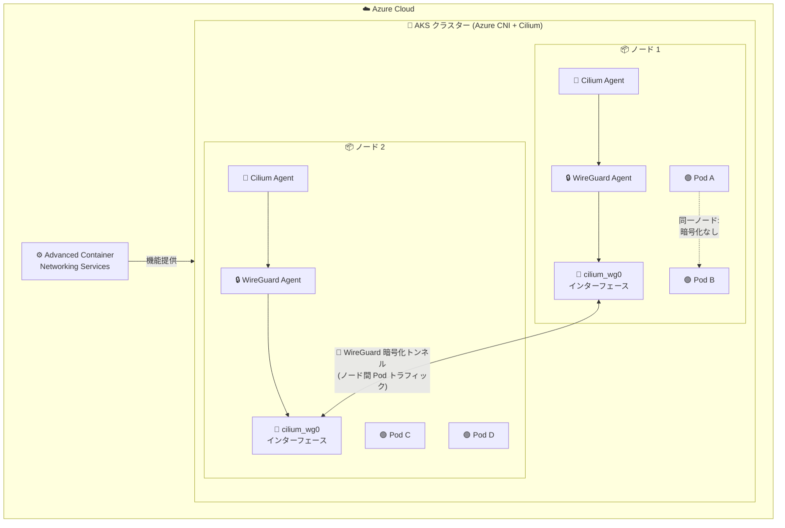

# Azure Kubernetes Service (AKS): WireGuard によるインターポッド転送中暗号化の一般提供開始

**リリース日**: 2026-04-24

**サービス**: Azure Kubernetes Service (AKS)

**機能**: WireGuard In-Transit Encryption (転送中暗号化)

**ステータス**: Launched (GA)

[このアップデートのインフォグラフィックを見る](https://takech9203.github.io/azure-news-summary/20260424-aks-wireguard-encryption.html)

## 概要

Azure Kubernetes Service (AKS) において、WireGuard プロトコルを利用したインターポッド転送中暗号化 (In-Transit Encryption) が一般提供 (GA) となった。本機能は Azure CNI powered by Cilium と Advanced Container Networking Services (ACNS) を使用する AKS クラスターで利用可能であり、ノード間を移動するポッド間トラフィックを透過的に暗号化する。

WireGuard はそのシンプルさと堅牢な暗号化で知られるプロトコルであり、AKS クラスター内の Cilium マネージドエンドポイント間の通信を保護する。これにより、規制要件が厳しい環境やセキュリティに敏感なワークロードにおいて、盗聴やデータ改ざんのリスクを軽減できる。

本機能は ACNS の Container Network Security 機能セットの一部として提供され、アプリケーションコードの変更を必要とせず、ノードレベルで自動的に暗号化を適用する。これまでプレビューとして提供されていた本機能が GA となったことで、本番環境での利用が正式にサポートされるようになった。

**アップデート前の課題**

- AKS クラスター内のノード間ポッドトラフィックはデフォルトで暗号化されておらず、クラスター内部のネットワーク傍受リスクが存在していた
- 仮想ネットワーク暗号化は同一物理ホスト上のノード間トラフィックを暗号化できないという制約があった
- WireGuard 暗号化はプレビュー段階であり、本番環境での正式サポートが提供されていなかった
- マルチクラウドやハイブリッド環境で一貫した暗号化方式を適用することが困難だった

**アップデート後の改善**

- WireGuard 暗号化が GA となり、本番ワークロードでの利用が正式にサポートされるようになった
- ノード間のポッドトラフィックが透過的に暗号化され、アプリケーション変更なしでセキュリティが向上した
- 同一物理ホスト上のノード間トラフィックも含め、異なるノード上のポッド間通信が保護されるようになった
- VM SKU に依存しないソフトウェアレベルの暗号化により、異種環境でも一貫した暗号化が可能になった

## アーキテクチャ図



各ノードの Cilium Agent が WireGuard サブシステムを初期化し、専用の `cilium_wg0` インターフェースを作成する。ノード間のポッドトラフィックはこのインターフェースを経由して自動的に暗号化される。同一ノード内のポッド間通信は暗号化の対象外となる。

## サービスアップデートの詳細

### 主要機能

1. **透過的なノード間ポッドトラフィック暗号化**
   - アプリケーションコードの変更なしで、異なるノード上のポッド間通信を自動的に暗号化
   - Cilium の eBPF データプレーンと統合し、カーネルレベルで効率的に暗号化処理を実行

2. **自動鍵管理**
   - 各ノードで WireGuard 鍵ペア (公開鍵・秘密鍵) が自動生成される
   - 鍵はメモリ内に保持され、120 秒ごとに自動ローテーションされる
   - 公開鍵は Kubernetes の CiliumNode カスタムリソースの `network.cilium.io/wg-pub-key` アノテーションを通じてクラスター内に配布される
   - 鍵管理は完全に Azure によって管理され、手動操作は不要

3. **専用ネットワークインターフェース (`cilium_wg0`)**
   - WireGuard Agent が各ノードに専用のネットワークインターフェースを作成
   - 生成された秘密鍵でインターフェースを構成し、暗号化トンネルを確立

4. **クラウド非依存の暗号化ソリューション**
   - ソフトウェアベースの暗号化により VM SKU のハードウェアサポートに依存しない
   - マルチクラウドやハイブリッド環境でも一貫した暗号化方式を適用可能

## 技術仕様

| 項目 | 詳細 |
|------|------|
| プロトコル | WireGuard |
| 暗号化対象 | ノード間のポッドトラフィック (Inter-node pod traffic) |
| 暗号化非対象 | 同一ノード内のポッド間トラフィック、ノード自体が生成するノード間トラフィック |
| 必須ネットワークプラグイン | Azure CNI powered by Cilium |
| 必須アドオン | Advanced Container Networking Services (ACNS) |
| 鍵ローテーション間隔 | 120 秒 |
| 鍵ペア保存場所 | メモリ内 |
| 作成されるインターフェース | `cilium_wg0` |
| スループット上限 (MTU 1500) | 約 1.5 Gbps |
| スループット上限 (MTU 3900 対応 SKU) | 約 2.5 倍向上 (約 3.75 Gbps) |
| FIPS 準拠 | 非対応 |

## 設定方法

### 前提条件

1. Azure CNI powered by Cilium が有効化された AKS クラスター
2. Advanced Container Networking Services (ACNS) が有効化されていること
3. Azure CLI がインストールされていること

### Azure CLI

```bash
# ACNS を有効にして新規 AKS クラスターを作成 (Azure CNI + Cilium)
az aks create \
  --resource-group <リソースグループ名> \
  --name <クラスター名> \
  --network-plugin azure \
  --network-plugin-mode overlay \
  --network-dataplane cilium \
  --advanced-networking-observability-enabled \
  --location <リージョン>
```

```bash
# 既存クラスターで ACNS を有効化
az aks update \
  --resource-group <リソースグループ名> \
  --name <クラスター名> \
  --advanced-networking-observability-enabled
```

**注意**: WireGuard 暗号化の具体的な有効化コマンドについては、最新の Microsoft Learn ドキュメントを参照してください。ACNS の有効化後、WireGuard 暗号化の設定が可能になります。

## メリット

### ビジネス面

- 規制要件 (PCI DSS、HIPAA など) におけるデータ転送中暗号化の要件を満たすことが可能
- アプリケーション変更不要のため、既存ワークロードのセキュリティ強化コストが低い
- GA となったことで本番環境での利用に対する SLA が適用され、エンタープライズでの採用が促進される

### 技術面

- 自動鍵管理・ローテーションにより運用負荷が最小限
- eBPF ベースの Cilium データプレーンとの統合により、カーネルレベルで効率的に動作
- VM SKU に依存しないソフトウェア実装のため、異種環境でも一貫して適用可能
- ネットワークポリシーとの併用が可能 (ただしパフォーマンスへの影響に注意)

## デメリット・制約事項

- **FIPS 非準拠**: WireGuard は FIPS 140-2 に準拠していないため、FIPS 準拠が必須の環境では使用できない
- **同一ノード内トラフィックは暗号化されない**: 同じノード上のポッド間通信は暗号化の対象外
- **ホストネットワーキング使用時は非対応**: `spec.hostNetwork: true` を設定したポッドは個別のアイデンティティではなくホストアイデンティティを使用するため、WireGuard 暗号化が適用されない
- **パフォーマンスへの影響**: ソフトウェアレベルの暗号化のため、レイテンシの増加とスループットの低下が発生する。MTU 1500 時のスループット上限は約 1.5 Gbps
- **ネットワークポリシー併用時のさらなる性能低下**: WireGuard 暗号化とネットワークポリシーを同時に使用すると、スループットの低下とレイテンシの増加がさらに顕著になる可能性がある
- **ノード生成トラフィックは対象外**: ノード自体が生成し、他のノードに向かうトラフィックは暗号化されない
- **Azure CNI + Cilium 必須**: Azure CNI powered by Cilium を使用するクラスターでのみ利用可能

## ユースケース

### ユースケース 1: 金融サービスにおけるコンプライアンス対応

**シナリオ**: 金融機関が AKS 上でトランザクション処理マイクロサービスを運用しており、PCI DSS に準拠するためにクラスター内のすべてのデータ転送を暗号化する必要がある。

**効果**: WireGuard 暗号化を有効化することで、アプリケーションコードを変更せずにノード間ポッドトラフィックが自動的に暗号化され、コンプライアンス要件を満たすことができる。

### ユースケース 2: ヘルスケア業界における患者データの保護

**シナリオ**: ヘルスケアプロバイダーが AKS 上で患者データを処理するアプリケーションを運用しており、HIPAA に準拠するためにネットワーク内のデータを保護する必要がある。

**効果**: 透過的な暗号化により、マイクロサービス間で送受信される患者データが盗聴や改ざんから保護され、HIPAA のセキュリティ要件への適合を支援する。

### ユースケース 3: マルチクラウド環境での統一暗号化

**シナリオ**: 企業がマルチクラウド戦略を採用しており、Azure、オンプレミス、他のクラウドプロバイダーにまたがる Kubernetes クラスターで一貫した暗号化方式を適用したい。

**効果**: WireGuard はクラウド非依存のプロトコルであるため、異なる環境間で統一された暗号化アプローチを実現でき、ハードウェアアクセラレーションに依存しないソフトウェアベースの実装により、VM SKU の違いを気にせず展開可能。

## 料金

WireGuard 暗号化は Advanced Container Networking Services (ACNS) の一部として提供される有料機能です。詳細な料金については以下の公式料金ページを参照してください。

- [Advanced Container Networking Services 料金ページ](https://azure.microsoft.com/pricing/details/azure-container-networking-services/)

## 利用可能リージョン

Azure CNI powered by Cilium および ACNS が利用可能なリージョンで使用可能です。詳細は公式ドキュメントを参照してください。

## 関連サービス・機能

- **Azure CNI powered by Cilium**: WireGuard 暗号化の前提条件となるネットワークプラグイン。eBPF ベースのデータプレーンを提供する
- **Advanced Container Networking Services (ACNS)**: WireGuard 暗号化を含む Container Network Security、Container Network Observability、Container Network Performance の機能スイート
- **仮想ネットワーク暗号化**: Azure Virtual Network レベルでのハードウェアアクセラレーションによる暗号化。WireGuard とは異なるアプローチで、全トラフィックを暗号化するが、対応する VM SKU が必要
- **Cilium mTLS 暗号化**: ACNS が提供するもう一つの暗号化オプション。相互 TLS による Pod 間トラフィックの暗号化と認証を提供
- **Container Network Observability**: ACNS の機能の一つで、ネットワークトラフィックの可視性を提供。WireGuard 暗号化と組み合わせてセキュリティ監視を強化可能
- **FQDN ベースフィルタリング**: ACNS の Container Network Security 機能で、FQDN ベースのネットワークポリシーを提供。WireGuard と組み合わせてゼロトラストネットワーキングを実現

## 参考リンク

- [インフォグラフィック](https://takech9203.github.io/azure-news-summary/20260424-aks-wireguard-encryption.html)
- [公式アップデート情報](https://azure.microsoft.com/updates?id=560015)
- [Microsoft Learn - WireGuard Encryption with Advanced Container Networking Services](https://learn.microsoft.com/azure/aks/container-network-security-wireguard-encryption-concepts)
- [Microsoft Learn - Advanced Container Networking Services 概要](https://learn.microsoft.com/azure/aks/advanced-container-networking-services-overview)
- [料金ページ - Advanced Container Networking Services](https://azure.microsoft.com/pricing/details/azure-container-networking-services/)

## まとめ

Azure Kubernetes Service (AKS) の WireGuard インターポッド転送中暗号化が一般提供 (GA) となり、Azure CNI powered by Cilium と ACNS を使用するクラスターにおいて、ノード間のポッドトラフィックを透過的に暗号化できるようになった。自動鍵管理 (120 秒ごとのローテーション)、アプリケーション変更不要の透過的暗号化、VM SKU 非依存のソフトウェア実装が主な特徴である。FIPS 非準拠やスループット上限 (MTU 1500 で約 1.5 Gbps) などの制約があるものの、規制要件を持つ金融・ヘルスケア業界やマルチクラウド環境でのセキュリティ強化に有効である。本番環境への導入前にパフォーマンスへの影響を非本番環境で評価することが推奨される。

---

**タグ**: #Azure #AKS #Kubernetes #WireGuard #暗号化 #セキュリティ #Cilium #ACNS #ネットワーク #GA
