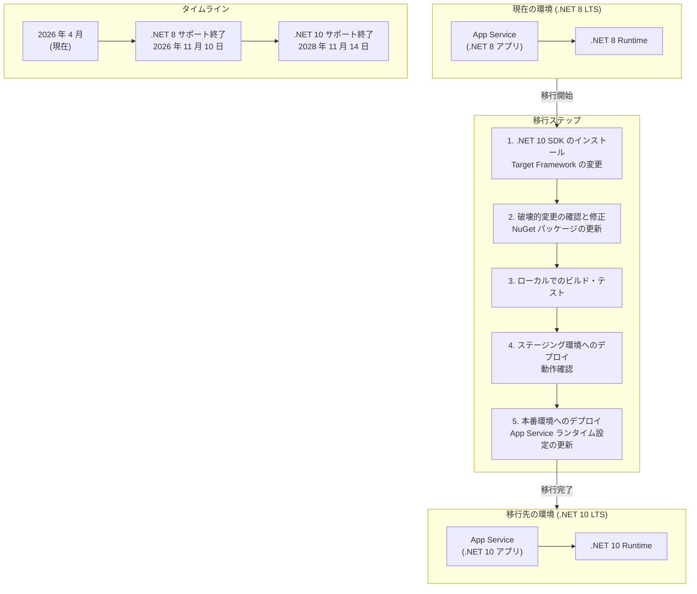

# Azure App Service: .NET 8 (LTS) サポート終了 -- .NET 10 (LTS) へのアップグレードが必要

**リリース日**: 2026-04-24

**サービス**: Azure App Service

**機能**: .NET 8 (LTS) サポート終了通知

**ステータス**: Retirement

[このアップデートのインフォグラフィックを見る](https://takech9203.github.io/azure-news-summary/20260424-app-service-dotnet-8-retirement.html)

## 概要

2026 年 11 月 10 日をもって、.NET 8 (LTS) のサポートが終了する。App Service でホストされているアプリケーションはサポート終了後も引き続き動作するが、.NET 8 に対するセキュリティ更新プログラムの提供は停止され、Microsoft によるカスタマーサービスも提供されなくなる。

.NET 8 は 2023 年 11 月 14 日にリリースされた Long-Term Support (LTS) バージョンであり、3 年間のサポート期間が設定されている。後継の LTS バージョンである .NET 10 は 2025 年 11 月 11 日に既にリリースされており、2028 年 11 月 14 日までサポートされる。影響を受けるアプリケーションの所有者は、サポート終了前に .NET 10 (LTS) へのアップグレードを完了することが推奨される。

この通知は App Service (Web Apps) に加えて、.NET 8 を使用するすべての Azure サービス (Azure Functions、Azure Static Web Apps など) に影響する可能性がある。セキュリティパッチが提供されなくなることで、脆弱性が発見された場合にもパッチが適用されず、アプリケーションがセキュリティリスクにさらされることになる。

**アップデート前の課題**

- .NET 8 (LTS) のサポート期間が 2026 年 11 月 10 日に終了を迎える
- サポート終了後はセキュリティ更新プログラムが提供されず、既知・未知の脆弱性に対するリスクが増大する
- カスタマーサポートが受けられなくなり、問題発生時の解決が困難になる

**アップデート後の改善**

- .NET 10 (LTS) へ移行することで、2028 年 11 月 14 日までの長期サポートを確保できる
- 最新のセキュリティパッチが継続的に提供される環境を維持できる
- .NET 10 のパフォーマンス改善、新しい言語機能、API の恩恵を受けることができる

## アーキテクチャ図



.NET 8 から .NET 10 への移行パスを示している。移行は Target Framework の変更に始まり、破壊的変更への対応、テスト、段階的デプロイを経て完了する。2026 年 11 月 10 日のサポート終了までに移行を完了することが推奨される。

## サービスアップデートの詳細

### 主要ポイント

1. **サポート終了日: 2026 年 11 月 10 日**
   - .NET 8 (LTS) のすべてのサポートが終了する
   - セキュリティ更新プログラムの提供が停止される
   - Microsoft によるカスタマーサービスが提供されなくなる

2. **アプリケーションの動作継続**
   - サポート終了後も App Service 上の .NET 8 アプリは引き続き動作する
   - ただし、セキュリティパッチが適用されないため、脆弱性リスクが増大する
   - Azure Portal 上でのランタイム選択肢から .NET 8 が非表示になる可能性がある

3. **推奨される移行先: .NET 10 (LTS)**
   - .NET 10 は 2025 年 11 月 11 日にリリース済み
   - LTS として 2028 年 11 月 14 日までサポートされる
   - 最新パッチは 10.0.7 (2026 年 4 月 21 日リリース)

## 技術仕様

| 項目 | 詳細 |
|------|------|
| 対象ランタイム | .NET 8 (LTS) |
| サポート終了日 | 2026 年 11 月 10 日 |
| .NET 8 リリース日 | 2023 年 11 月 14 日 |
| .NET 8 最新パッチ | 8.0.26 (2026 年 4 月 14 日) |
| 推奨移行先 | .NET 10 (LTS) |
| .NET 10 リリース日 | 2025 年 11 月 11 日 |
| .NET 10 サポート終了日 | 2028 年 11 月 14 日 |
| .NET 10 最新パッチ | 10.0.7 (2026 年 4 月 21 日) |
| 影響を受けるサービス | App Service, Azure Functions, その他 .NET 8 を使用するサービス |

## 設定方法

### .NET 10 への移行手順

#### 1. プロジェクトファイルの更新

```xml
<!-- 変更前 -->
<TargetFramework>net8.0</TargetFramework>

<!-- 変更後 -->
<TargetFramework>net10.0</TargetFramework>
```

#### 2. NuGet パッケージの更新

```bash
# .NET 10 SDK のインストール確認
dotnet --version

# NuGet パッケージの更新
dotnet restore
```

#### 3. App Service のランタイム設定変更 (Linux)

```bash
# 現在のランタイムバージョンを確認
az webapp config show \
  --resource-group <resource-group-name> \
  --name <app-name> \
  --query linuxFxVersion

# .NET 10 に変更
az webapp config set \
  --name <app-name> \
  --resource-group <resource-group-name> \
  --linux-fx-version "DOTNETCORE|10.0"
```

#### 4. App Service のランタイム設定変更 (Windows)

Windows の場合は、プロジェクトファイルの Target Framework を `net10.0` に設定してデプロイすることで、App Service が自動的に適切なランタイムを使用する。

#### 5. デプロイスロットを活用した段階的移行

```bash
# ステージングスロットを作成
az webapp deployment slot create \
  --name <app-name> \
  --resource-group <resource-group-name> \
  --slot staging

# ステージングスロットに .NET 10 アプリをデプロイし動作確認後にスワップ
az webapp deployment slot swap \
  --name <app-name> \
  --resource-group <resource-group-name> \
  --slot staging \
  --target-slot production
```

## メリット

### ビジネス面

- .NET 10 (LTS) への移行により、2028 年 11 月まで約 2 年間の追加サポート期間を確保できる
- セキュリティ更新プログラムの継続的な提供により、コンプライアンス要件を維持できる
- カスタマーサポートの利用が可能な状態を維持し、障害発生時の対応力を確保

### 技術面

- .NET 10 のパフォーマンス改善によるアプリケーションの高速化が期待できる
- 新しい C# 言語機能や API の利用が可能になる
- 最新のセキュリティパッチ適用により、脆弱性リスクを最小化できる

## デメリット・制約事項

- .NET 8 から .NET 10 への移行には、破壊的変更 (breaking changes) への対応が必要になる場合がある
- サードパーティ製の NuGet パッケージが .NET 10 に対応していない場合、代替手段の調査や対応が必要
- 移行に伴うテスト工数の確保が必要であり、特に大規模アプリケーションでは十分な検証期間を見込む必要がある
- .NET 9 (STS) は .NET 8 と同じ 2026 年 11 月 10 日にサポートが終了するため、.NET 9 への移行はスキップし .NET 10 に直接移行することが推奨される

## ユースケース

### ユースケース 1: Web アプリケーションの .NET 10 移行

**シナリオ**: App Service 上で .NET 8 を使用した ASP.NET Core Web アプリケーションを運用している場合。

**対応手順**:
1. プロジェクトの TargetFramework を `net10.0` に変更
2. 依存パッケージを .NET 10 対応バージョンに更新
3. 破壊的変更の影響を確認し、コードを修正
4. ステージングスロットでテスト後、本番環境にスワップ

### ユースケース 2: Azure Functions の .NET 10 移行

**シナリオ**: .NET 8 の In-Process または Isolated Worker モデルで Azure Functions を運用している場合。

**対応手順**:
1. Azure Functions のホストバージョンと .NET 10 の互換性を確認
2. TargetFramework を更新し、Azure Functions SDK パッケージを対応バージョンに更新
3. ローカル環境でテストを実施後、ステージング環境にデプロイして検証

### ユースケース 3: 移行が間に合わない場合

**シナリオ**: サポート終了日までに .NET 10 への移行が完了できない場合。

**対応方針**:
- アプリケーションは引き続き動作するが、セキュリティリスクが増大することを認識する
- WAF (Web Application Firewall) や Azure Front Door などの追加的なセキュリティレイヤーで暫定的にリスクを緩和する
- 移行計画を早急に策定し、可能な限り速やかに .NET 10 へのアップグレードを完了する

## 料金

.NET 8 から .NET 10 へのランタイム変更に伴う追加料金は発生しない。App Service の料金プランは引き続き同じ体系で適用される。ただし、移行作業に伴う開発・テスト工数は別途見込む必要がある。

## 利用可能リージョン

.NET 10 ランタイムは App Service が利用可能なすべてのリージョンで使用可能である。

## 関連サービス・機能

- **Azure Functions**: .NET 8 を使用している Azure Functions も同様にサポート終了の影響を受ける
- **Azure Static Web Apps**: .NET 8 ベースの API バックエンドを使用している場合に影響を受ける
- **Azure Container Apps**: .NET 8 ベースのコンテナイメージを使用している場合、コンテナイメージの再ビルドが必要
- **Azure Kubernetes Service (AKS)**: .NET 8 アプリをコンテナとして運用している場合、コンテナイメージの更新が必要
- **Visual Studio / Visual Studio Code**: .NET 10 SDK のインストールと開発環境の更新が必要

## 参考リンク

- [インフォグラフィック](https://takech9203.github.io/azure-news-summary/20260424-app-service-dotnet-8-retirement.html)
- [公式アップデート情報](https://azure.microsoft.com/updates?id=558033)
- [.NET サポートポリシー](https://dotnet.microsoft.com/en-us/platform/support/policy)
- [ASP.NET Core アプリの構成 - Azure App Service](https://learn.microsoft.com/en-us/azure/app-service/configure-language-dotnetcore)
- [App Service での .NET ランタイムのサポートについて](https://learn.microsoft.com/en-us/azure/app-service/configure-language-dotnet-framework)

## まとめ

.NET 8 (LTS) のサポートは 2026 年 11 月 10 日に終了する。App Service をはじめとする Azure サービス上で .NET 8 を使用しているアプリケーションは、サポート終了後も動作は継続するが、セキュリティ更新プログラムとカスタマーサービスは提供されなくなる。推奨される移行先は .NET 10 (LTS) であり、2028 年 11 月 14 日までのサポートが保証される。

Solutions Architect への推奨アクション:
- 自組織内で .NET 8 を使用している App Service アプリケーションの棚卸しを早急に実施する
- .NET 10 (LTS) への移行計画を策定し、サポート終了日 (2026 年 11 月 10 日) までに移行を完了するスケジュールを確保する
- .NET 9 (STS) も同日にサポートが終了するため、.NET 9 を経由せず .NET 10 に直接移行することを推奨する
- 移行に際してはデプロイスロットを活用した段階的な移行を行い、本番環境への影響を最小化する
- サポート終了までに移行が完了できないアプリケーションについては、WAF など追加のセキュリティ対策を暫定的に適用する

---

**タグ**: #AzureAppService #DotNet8 #DotNet10 #Retirement #Migration #LTS #Security
