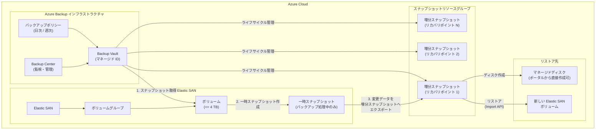

# Azure Backup: Elastic SAN バックアップ (パブリックプレビュー)

**リリース日**: 2026-04-24

**サービス**: Azure Backup / Azure Elastic SAN

**機能**: Azure Backup for Elastic SAN

**ステータス**: In preview

[このアップデートのインフォグラフィックを見る](https://takech9203.github.io/azure-news-summary/20260424-elastic-san-backup.html)

## 概要

Azure Backup が Azure Elastic SAN のバックアップをサポートするパブリックプレビューが発表された。これにより、Elastic SAN ボリュームのバックアップとリストアをフルマネージドで実行できるようになる。Backup vault を通じてバックアップを管理し、Elastic SAN ボリュームのスナップショットをマネージドディスクの増分スナップショット (オペレーショナルティア) としてエクスポートする仕組みで動作する。

この統合により、偶発的な削除、ランサムウェア攻撃、アプリケーション更新時のデータ損失からの保護が可能となる。バックアップスケジュールの設定、リカバリポイントの有効期限管理、新しいボリュームへのデータリカバリといった機能が提供される。

Elastic SAN は iSCSI プロトコルを介して Azure Virtual Machines、Azure VMware Solution、Azure Kubernetes Service など多様なコンピュートリソースと連携するクラウドネイティブな SAN ソリューションであり、ミッションクリティカルなワークロードを支えるストレージ基盤として利用されている。今回のバックアップ機能により、このストレージ基盤のデータ保護が Azure Backup のエコシステムに統合された。

**アップデート前の課題**

- Elastic SAN ボリュームには Azure Backup による統合的なバックアップソリューションが存在せず、データ保護のために独自の仕組みを構築する必要があった
- ボリュームスナップショットの管理 (スケジュール、保持期間、ライフサイクル) を手動で行う必要があった
- 偶発的な削除やランサムウェア攻撃に対するポイントインタイムリカバリが困難であった
- バックアップの監視やコンプライアンスレポートが Elastic SAN に対して一元化されていなかった

**アップデート後の改善**

- Azure Backup の Backup vault を通じて、Elastic SAN ボリュームのフルマネージドなバックアップ・リストアが可能に
- 日次・週次のスケジュールバックアップとオンデマンドバックアップの両方をサポート
- 最大 450 のリカバリポイントを保持でき、柔軟な保持ポリシーの構成が可能
- マネージドディスクの増分スナップショットとして保存されるため、ZRS または LRS の冗長性を選択可能
- Backup Center からの一元的な監視・管理に対応

## アーキテクチャ図

Azure Backup は Elastic SAN ボリュームの一時スナップショットを取得し、変更データをマネージドディスクの増分スナップショットとしてエクスポートする。リストア時は増分スナップショットから Elastic SAN の Import API を使用して新しいボリュームにデータを復元する。

## サービスアップデートの詳細

### 主要機能

1. **スナップショットエクスポートによるバックアップ**
   - Elastic SAN ボリュームの一時スナップショットを取得し、変更データをマネージドディスクの増分スナップショット (オペレーショナルティア) にエクスポートする
   - 一時スナップショットはバックアップ処理中のみ存在し、リカバリポイントとしては増分スナップショットが保持される
   - Azure Backup がスナップショットのライフサイクルをバックアップポリシーに従って自動管理する

2. **柔軟なバックアップスケジュールとリテンション**
   - 日次 (Daily) および週次 (Weekly) のバックアップ頻度をサポート
   - 最大 450 のリカバリポイントを保持可能
   - デフォルトの保持期間は 7 日間
   - オンデマンドバックアップにも対応 (1 バックアップインスタンスあたり 1 日最大 10 回)

3. **ストレージ冗長性の選択**
   - ZRS (ゾーン冗長ストレージ) および LRS (ローカル冗長ストレージ) に対応
   - ZRS は対応リージョンで新規バックアップインスタンスにデフォルト適用される
   - 増分スナップショットは Elastic SAN のライフサイクルから独立して保存される

4. **代替場所へのリストア (ALR)**
   - リストア時は既存の Elastic SAN インスタンス内の新しいボリュームにデータを復元
   - 同一サブスクリプションまたは異なるサブスクリプションへのリストアをサポート
   - マネージドディスクの増分スナップショットから Azure Portal 上で直接マネージドディスクを作成することも可能

## 技術仕様

| 項目 | 詳細 |
|------|------|
| サポートされるボリュームサイズ | 4 TB 以下 |
| バックアップ頻度 | 日次、週次 (時間単位は非対応) |
| 最大リカバリポイント数 | 450 |
| デフォルト保持期間 | 7 日間 |
| バックアップティア | オペレーショナルティア (Vault ティアは非対応) |
| ストレージ冗長性 | ZRS (対応リージョン) / LRS |
| オンデマンドバックアップ上限 | 1 バックアップインスタンスあたり 1 日 10 回 |
| リストア上限 | 1 バックアップインスタンスあたり 1 日 10 回 |
| リカバリ方式 | ALR (代替場所リカバリ) のみ。OLR (元の場所へのリカバリ) は非対応 |
| Vault タイプ | Backup vault |
| マネージド ID | システム割り当てマネージド ID |

## 設定方法

### 前提条件

1. Elastic SAN ボリュームが対応リージョンにデプロイ済みであること
2. Elastic SAN ボリュームと同じサブスクリプション・リージョンに Backup vault が存在すること
3. Backup vault のマネージド ID に以下のロールが割り当てられていること:

| 操作 | 必要なロール |
|------|-------------|
| バックアップ | Elastic SAN Snapshot Exporter, Disk Snapshot Contributor (スナップショットリソースグループ) |
| リストア | Reader (スナップショットリソースグループ), Elastic SAN Volume Importer |

4. スナップショットリソースグループで Delete Lock が無効であること (有効な場合、スナップショットの削除が不可)
5. Elastic SAN ボリュームとスナップショットリソースグループが同一サブスクリプション内にあること

### Azure Portal

1. **Backup vault の作成**: Azure Portal で Backup vault を作成する (Elastic SAN と同一サブスクリプション・リージョン)
2. **バックアップポリシーの作成**:
   - Azure Portal で「Resiliency」>「Protection policies」>「+ Create Policy」>「Create Backup Policy」に移動
   - ポリシー名を入力し、データソースタイプとして「Elastic SAN (Preview)」を選択
   - スケジュール (日次 / 週次) と保持ルールを設定
3. **バックアップの構成**:
   - 「Resiliency」>「+ Configure protection」を選択
   - Resource managed by: Azure、Datasource type: Elastic SAN volumes (Preview)、Solution: Azure Backup を選択
   - Backup vault とバックアップポリシーを選択
   - バックアップ対象の Elastic SAN インスタンスとボリュームを選択
   - ロール割り当ての検証で不足がある場合は「Assign missing roles」で自動付与
   - 構成を確認し「Configure Backup」を選択

## メリット

### ビジネス面

- ランサムウェア攻撃や偶発的な削除からのデータ保護により、事業継続性が向上
- バックアップポリシーによるリカバリポイントの自動管理で、コンプライアンス要件への対応が容易に
- Azure Backup のエコシステムに統合されることで、既存の Backup Center からの一元的な監視・管理が可能
- プレビュー期間中は Azure Backup の保護インスタンス料金が無料であり、低コストで評価が可能

### 技術面

- Elastic SAN ボリュームのバックアップとリストアが Azure Backup の Backup vault を通じてフルマネージドで実行される
- マネージドディスクの増分スナップショットとして保存されるため、Elastic SAN のライフサイクルから独立した耐久性を確保
- ZRS 対応リージョンではゾーン冗長性がデフォルトで適用され、ゾーン障害に対する保護が実現
- 最大 450 のリカバリポイントにより、長期間にわたるポイントインタイムリカバリが可能

## デメリット・制約事項

- 4 TB 以下のボリュームのみサポートされており、大容量ボリュームのバックアップには対応していない
- Vault ティアのバックアップ (長期保管) は現時点で非対応であり、オペレーショナルティアのみサポート
- 元の場所へのリストア (OLR) は非対応であり、リストアは常に新しいボリュームに対して行われる (ALR のみ)
- 時間単位のバックアップは非対応であり、最短でも日次のバックアップ頻度となる
- 同一ボリュームを複数のバックアップインスタンスで保護することはできない
- Vault ティア非対応のため、イミュータビリティ、論理削除、マルチユーザー認証、カスタマーマネージドキーなどのセキュリティ機能は利用不可
- プレビュー段階であり、テスト目的での使用が推奨されている (本番環境での使用は非推奨)
- スナップショットリソースグループに Delete Lock が設定されている場合、スナップショットの削除ができない

## ユースケース

### ユースケース 1: ミッションクリティカルなデータベースワークロードのデータ保護

**シナリオ**: Elastic SAN 上で大規模なデータベース (SQL Server、Oracle など) を運用しており、偶発的な削除やランサムウェア攻撃からデータを保護する必要がある。

**効果**: 日次バックアップスケジュールにより、最大 450 のリカバリポイントを保持し、任意の時点へのデータ復元が可能になる。ランサムウェア攻撃を受けた場合でも、攻撃前のリカバリポイントから新しいボリュームにデータを復元し、業務を迅速に再開できる。

### ユースケース 2: AKS ワークロードの永続ボリュームバックアップ

**シナリオ**: Azure Kubernetes Service (AKS) で Elastic SAN ボリュームを永続ストレージとして使用しており、アプリケーション更新やクラスタメンテナンス時のデータロスを防ぎたい。

**効果**: アプリケーション更新前にオンデマンドバックアップを実行し、問題発生時にリカバリポイントから別のボリュームにリストアすることで、安全なロールバックが可能になる。

### ユースケース 3: コンプライアンス要件への対応

**シナリオ**: 金融機関や医療機関など、規制上の要件によりストレージデータの定期的なバックアップと一定期間の保持が求められている。

**効果**: バックアップポリシーにより、日次・週次の自動バックアップスケジュールと保持ルールを設定し、コンプライアンス要件に準拠したデータ保護を自動化できる。Backup Center からのレポート機能により、監査証跡の提供も容易になる。

## 料金

プレビュー期間中の料金構成は以下の通り:

- **Azure Backup 保護インスタンス料金**: プレビュー期間中は無料
- **マネージドディスク増分スナップショット料金**: 既存の Azure マネージドディスクの料金体系に基づく ([マネージドディスク料金ページ](https://azure.microsoft.com/pricing/details/managed-disks/) を参照)

増分スナップショットは変更データのみを保存するため、フルスナップショットと比較してストレージコストが最適化される。

## 利用可能リージョン

Elastic SAN がサポートされているすべての Azure パブリックリージョンでバックアップが利用可能。ただし、ZRS スナップショットストレージは ZRS に対応したリージョンのみで利用可能であり、非対応リージョンでは LRS でスナップショットが保存される。

## 関連サービス・機能

- **[Azure Elastic SAN](https://learn.microsoft.com/azure/storage/elastic-san/elastic-san-introduction)**: クラウドネイティブの SAN ソリューション。iSCSI プロトコルで VM、AKS、Azure VMware Solution と接続可能
- **[Azure Backup vault](https://learn.microsoft.com/azure/backup/backup-vault-overview)**: Elastic SAN バックアップの管理に使用される Vault タイプ
- **[Azure マネージドディスク増分スナップショット](https://learn.microsoft.com/azure/virtual-machines/disks-incremental-snapshots)**: バックアップのリカバリポイントとして使用されるスナップショット形式
- **[Backup Center](https://learn.microsoft.com/azure/backup/backup-center-overview)**: Azure Backup ワークロードの一元的な監視・管理ダッシュボード
- **[Azure Elastic SAN の容量自動スケーリング](https://takech9203.github.io/azure-news-summary/20260423-elastic-san-capacity-autoscaling.html)**: 2026-04-23 に発表された Elastic SAN の関連アップデート
- **[Azure Elastic SAN の CRC Protection](https://takech9203.github.io/azure-news-summary/20260424-elastic-san-crc-protection.html)**: 2026-04-24 に発表された Elastic SAN のデータ整合性保護機能

## 参考リンク

- [インフォグラフィック](https://takech9203.github.io/azure-news-summary/20260424-elastic-san-backup.html)
- [公式アップデート情報](https://azure.microsoft.com/updates?id=560904)
- [Microsoft Learn: Azure Elastic SAN バックアップの概要](https://learn.microsoft.com/azure/backup/azure-elastic-san-backup-overview)
- [Microsoft Learn: サポートマトリックス](https://learn.microsoft.com/azure/backup/azure-elastic-san-backup-support-matrix)
- [Microsoft Learn: バックアップの構成](https://learn.microsoft.com/azure/backup/azure-elastic-san-backup-configure)
- [Microsoft Learn: Azure Elastic SAN の概要](https://learn.microsoft.com/azure/storage/elastic-san/elastic-san-introduction)
- [マネージドディスク料金ページ](https://azure.microsoft.com/pricing/details/managed-disks/)

## まとめ

Azure Backup for Elastic SAN のパブリックプレビューにより、Elastic SAN ボリュームのデータ保護が Azure Backup のフルマネージドソリューションとして統合された。Backup vault を通じたスケジュールバックアップ、最大 450 のリカバリポイント保持、ZRS/LRS の冗長性選択、代替場所へのリストアなどの機能により、偶発的な削除やランサムウェア攻撃からの保護が実現される。現時点では 4 TB 以下のボリュームのみサポート、オペレーショナルティアのみ対応、OLR 非対応といった制約があるが、Elastic SAN を利用するミッションクリティカルなワークロードにとって重要なデータ保護の選択肢となる。プレビュー期間中は保護インスタンス料金が無料であるため、検証環境での評価が推奨される。問い合わせ先は AzureEsanBackup@microsoft.com。

---

**タグ**: #Azure #AzureBackup #ElasticSAN #Storage #DataProtection #BackupVault #Preview #SAN #iSCSI #DisasterRecovery
