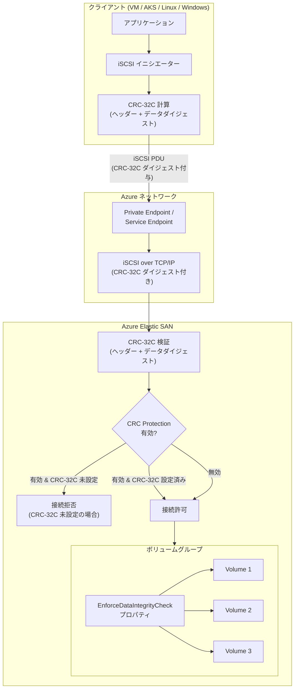

# Azure Elastic SAN: CRC Protection (CRC-32C チェックサム検証) が一般提供開始

**リリース日**: 2026-04-24

**サービス**: Azure Elastic SAN

**機能**: CRC Protection (CRC-32C Checksum Verification)

**ステータス**: Launched (GA)

[このアップデートのインフォグラフィックを見る](https://takech9203.github.io/azure-news-summary/20260424-elastic-san-crc-protection.html)

## 概要

Azure Elastic SAN において、CRC-32C チェックサム検証による CRC Protection 機能が一般提供 (GA) として正式にリリースされた。この機能により、クライアントと Elastic SAN ボリューム間の iSCSI 接続において、より強固なデータ整合性保護が実現される。TCP の標準的なチェックサム機構に加え、CRC-32C による巡回冗長検査 (Cyclic Redundancy Check) を iSCSI ヘッダーおよびデータペイロードに適用することで、サイレントデータ破損のリスクを大幅に低減する。

CRC Protection はボリュームグループレベルのプロパティとして設定される。ボリュームグループで CRC Protection を有効にすると、そのボリュームグループ内のすべてのボリュームがこのプロパティを継承する。有効化された状態では、CRC-32C がヘッダーダイジェストまたはデータダイジェストに設定されていないクライアント接続は拒否される。これにより、ボリュームグループに接続するすべてのクライアントがデータ整合性チェックを確実に実施することを強制できる。

CRC Protection は新規の Elastic SAN 作成時に有効化できるほか、既存の Elastic SAN に対しても後から有効化が可能である。Azure Portal、Azure PowerShell、Azure CLI のいずれからも設定でき、柔軟な導入が可能となっている。

**アップデート前の課題**

- iSCSI 接続におけるデータ整合性は TCP チェックサムのみに依存しており、サイレントデータ破損を検出する能力が限定的であった
- クライアント側で CRC-32C を設定していない場合でも接続が許可されるため、データ整合性チェックの適用が一貫しなかった
- ストレージとクライアント間のデータパスにおいて、ネットワーク機器やメモリ上でのビット反転など、TCP チェックサムでは検出困難なエラーに対する保護が不十分であった

**アップデート後の改善**

- CRC-32C チェックサム検証により、iSCSI ヘッダーとデータペイロードの両方に対する強固な誤り検出が可能に
- ボリュームグループレベルでの強制設定により、すべてのクライアント接続でデータ整合性チェックを確実に適用
- 新規・既存の Elastic SAN の両方で CRC Protection を有効化でき、段階的な導入が可能
- サイレントデータ破損のリスクを低減し、ミッションクリティカルなワークロードの信頼性を向上

## アーキテクチャ図



クライアント側で iSCSI イニシエーターが CRC-32C チェックサムをヘッダーとデータペイロードに付与し、Elastic SAN 側で検証する。ボリュームグループの CRC Protection プロパティが有効の場合、CRC-32C が設定されていない接続は拒否される。

## サービスアップデートの詳細

### 主要機能

1. **CRC-32C チェックサム検証**: iSCSI ヘッダーダイジェストおよびデータダイジェストに CRC-32C を適用し、転送中のデータ破損を検出
2. **ボリュームグループレベルでの強制**: ボリュームグループのプロパティとして設定され、グループ内の全ボリュームに自動的に適用
3. **接続制御**: CRC Protection を有効化すると、CRC-32C 未設定のクライアント接続を自動的に拒否
4. **既存環境への対応**: 新規作成時だけでなく、既存の Elastic SAN に対しても CRC Protection を有効化可能
5. **柔軟な無効化**: CRC Protection を無効にした場合、クライアント側の CRC-32C 設定に依存するが、接続自体は拒否されない

## 技術仕様

| 項目 | 詳細 |
|------|------|
| チェックサムアルゴリズム | CRC-32C (Castagnoli) |
| 検証対象 | iSCSI ヘッダーダイジェスト、データダイジェスト |
| 設定レベル | ボリュームグループ単位 |
| 継承 | ボリュームグループ内の全ボリュームに自動適用 |
| プロトコル | iSCSI (internet Small Computer Systems Interface) |
| PowerShell パラメータ | `-EnforceDataIntegrityCheckForIscsi` |
| Azure CLI パラメータ | `--data-integrity-check` |
| 保存時暗号化 | AES-256 (常時有効) |
| 冗長性オプション | LRS / ZRS |

## 設定方法

### Azure Portal での設定

1. Azure Portal にサインインし、**Elastic SAN** を検索
2. 対象の Elastic SAN を選択し、ボリュームグループの作成または編集画面を開く
3. **CRC Protection** を有効化するチェックボックスをオンにする
4. 設定を保存

### Azure PowerShell での設定

```powershell
# 新規ボリュームグループ作成時に CRC Protection を有効化
New-AzElasticSanVolumeGroup -ResourceGroupName $RgName -ElasticSANName $EsanName -Name $EsanVgName -EnforceDataIntegrityCheckForIscsi $true
```

### Azure CLI での設定

```bash
# 新規ボリュームグループ作成時に CRC Protection を有効化
az elastic-san volume-group create --elastic-san-name $EsanName -g $RgName -n $EsanVgName --data-integrity-check true
```

### クライアント側の設定

クライアント側の iSCSI イニシエーターで CRC-32C ヘッダーダイジェストおよびデータダイジェストを有効にする必要がある。設定方法はオペレーティングシステムにより異なるため、各 OS の iSCSI イニシエーター設定ドキュメントを参照のこと。

## メリット

### ビジネス面

- **データ信頼性の向上**: ミッションクリティカルなワークロードにおいて、サイレントデータ破損のリスクを低減し、データの信頼性を向上
- **コンプライアンス対応**: データ整合性要件が厳格な業界 (金融、医療、製造など) におけるコンプライアンス要件への対応が容易に
- **運用コストの削減**: データ破損に起因するインシデント対応やデータ復旧のコストを削減
- **段階的導入が可能**: 既存環境に影響を与えずにボリュームグループ単位で段階的に導入可能

### 技術面

- **エンドツーエンドの整合性保護**: TCP チェックサムに加え、CRC-32C によるアプリケーション層レベルの整合性検証を実現
- **ゼロトラストアプローチ**: ボリュームグループレベルでの強制により、CRC-32C 未設定のクライアントからのアクセスを確実に防止
- **追加コストなし**: CRC Protection は Elastic SAN の標準機能として提供され、追加課金は不要
- **パフォーマンスへの影響が最小限**: CRC-32C は高効率なチェックサムアルゴリズムであり、CPU オーバーヘッドが低い

## デメリット・制約事項

- **リージョン制限**: CRC Protection は現時点で **North Europe** および **South Central US** では利用不可
- **OS 互換性の制限**: Fedora およびその下流 Linux ディストリビューション (Red Hat Enterprise Linux、CentOS、Rocky Linux など) は iSCSI データダイジェストをサポートしていないため、CRC Protection を有効にするとこれらの OS からの接続が失敗する
- **Azure VMware Solution との非互換**: Azure VMware Solution に接続するボリュームグループでは CRC Protection を有効にすべきでない
- **クライアント側の設定が必要**: CRC Protection の恩恵を受けるには、クライアント側の iSCSI イニシエーターで CRC-32C を有効にする設定が別途必要
- **既存接続への影響**: 既存のボリュームグループで CRC Protection を有効化すると、CRC-32C 未設定のクライアント接続が拒否されるため、事前のクライアント側設定変更が必要

## ユースケース

1. **ミッションクリティカルなデータベース**: 大規模なトランザクションデータベース (SQL Server、Oracle など) のバックエンドストレージとして Elastic SAN を使用する場合、CRC Protection によりデータ書き込みと読み取りの整合性を保証
2. **金融・医療業界のワークロード**: データの正確性が法規制で求められる環境において、エンドツーエンドのデータ整合性検証を実現
3. **大規模 AKS クラスタのストレージ**: Kubernetes クラスタのパーシステントボリュームとして Elastic SAN を使用する場合、コンテナワークロード間のデータ整合性を確保
4. **ディザスタリカバリ環境**: データのレプリケーションやバックアップにおいて、転送中のデータ破損を防止し、リカバリ時のデータ信頼性を向上

## 料金

CRC Protection 自体に追加料金は発生しない。Elastic SAN の標準機能として提供される。Elastic SAN の料金体系はベース容量と追加容量の組み合わせに基づき、選択した冗長性オプション (LRS / ZRS) およびリージョンにより異なる。詳細な料金情報については [Azure Elastic SAN の価格ページ](https://azure.microsoft.com/pricing/details/elastic-san/) を参照のこと。

## 利用可能リージョン

CRC Protection は Elastic SAN が提供されているほとんどのリージョンで利用可能であるが、以下のリージョンでは現時点で利用不可である。

**CRC Protection が利用不可のリージョン**:
- North Europe
- South Central US

**Elastic SAN (LRS & ZRS) が利用可能なリージョン**:
Australia East、Brazil South、Canada Central、Central US、East Asia、East US、East US 2、France Central、Germany West Central、India Central、Japan East、Korea Central、North Europe、Norway East、South Africa North、South Central US、Southeast Asia、Sweden Central、Switzerland North、UAE North、UK South、West Europe、West US 2、West US 3

**Elastic SAN (LRS のみ) が利用可能なリージョン**:
Australia Central、Australia Central 2、Australia Southeast、Brazil Southeast、Canada East、France South、Germany North、India South、Japan West、Korea South、Malaysia South、North Central US、Norway West、South Africa West、Sweden South、Switzerland West、Taiwan North、UAE Central、UK West、West Central US、West US

## 関連サービス・機能

- **Azure Elastic SAN Capacity Autoscaling**: 容量の自動スケーリング機能 (GA)
- **Azure Elastic SAN Snapshots**: ボリュームスナップショット機能
- **Azure Private Link**: Elastic SAN ボリュームグループへのプライベート接続
- **Azure Virtual Network Service Endpoints**: ストレージサービスエンドポイント経由のアクセス制御
- **Azure Kubernetes Service (AKS)**: Elastic SAN ボリュームのコンテナストレージとしての利用
- **Azure VMware Solution**: Elastic SAN との統合 (ただし CRC Protection は非対応)

## 参考リンク

- [インフォグラフィック](https://takech9203.github.io/azure-news-summary/20260424-elastic-san-crc-protection.html)
- [公式アップデート情報](https://azure.microsoft.com/updates?id=560889)
- [Azure Elastic SAN の概要 - Microsoft Learn](https://learn.microsoft.com/azure/storage/elastic-san/elastic-san-introduction)
- [Azure Elastic SAN の作成とデプロイ - Microsoft Learn](https://learn.microsoft.com/azure/storage/elastic-san/elastic-san-create)
- [Azure Elastic SAN ネットワークの概念 - Microsoft Learn](https://learn.microsoft.com/azure/storage/elastic-san/elastic-san-networking)
- [Azure Elastic SAN のデプロイ計画 - Microsoft Learn](https://learn.microsoft.com/azure/storage/elastic-san/elastic-san-planning)
- [Azure Elastic SAN の価格](https://azure.microsoft.com/pricing/details/elastic-san/)

## まとめ

Azure Elastic SAN の CRC Protection (CRC-32C チェックサム検証) が一般提供開始となった。この機能は、iSCSI 接続におけるヘッダーおよびデータペイロードに CRC-32C チェックサムを適用し、TCP チェックサムだけでは検出困難なサイレントデータ破損を検出する。ボリュームグループレベルのプロパティとして設定でき、有効化すると CRC-32C 未設定のクライアント接続を自動的に拒否することで、データ整合性チェックを強制的に適用する。新規作成時だけでなく既存の Elastic SAN に対しても有効化でき、追加料金は不要である。ただし、Fedora 系 Linux ディストリビューションや Azure VMware Solution との互換性に制限があるほか、North Europe および South Central US では現時点で利用不可である点に留意が必要である。ミッションクリティカルなワークロードを運用する Solutions Architect にとって、ストレージのデータ整合性を強化する重要な機能である。

---

**タグ**: #Azure #ElasticSAN #CRC #データ整合性 #iSCSI #Storage #GA #セキュリティ #チェックサム
