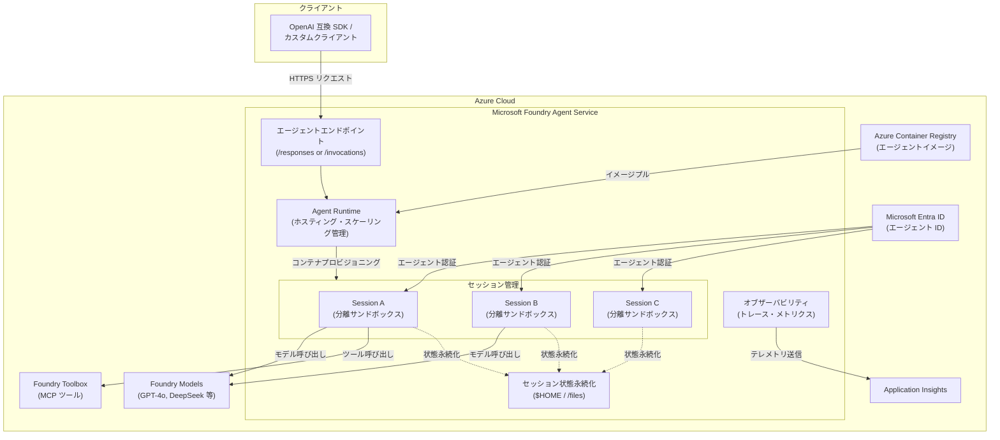

# Foundry Agent Service: Hosted Agents がパブリックプレビューとして提供開始

**リリース日**: 2026-04-24

**サービス**: Microsoft Foundry Agent Service

**機能**: Hosted Agents (ホステッドエージェント)

**ステータス**: In preview

[このアップデートのインフォグラフィックを見る](https://takech9203.github.io/azure-news-summary/20260424-foundry-hosted-agents.html)

## 概要

Microsoft Foundry Agent Service において、Hosted Agents (ホステッドエージェント) がパブリックプレビューとして提供開始された。Hosted Agents は、開発者が独自のコードをコンテナイメージとしてパッケージ化し、Foundry Agent Service のマネージドインフラストラクチャ上にデプロイして実行できる機能である。Agent Framework、LangGraph、Semantic Kernel など任意のフレームワークを使用でき、ツール呼び出し、マルチステップ推論、エージェント間連携などのオーケストレーションロジックを完全に制御できる。

Hosted Agents の最大の特徴は、分離された実行サンドボックス (isolated execution sandbox) でエージェントが実行される点である。各エージェントセッションには専用のセキュアなランタイムが提供され、セッションは常にクリーンな環境で開始される。セッション間で共有される状態は存在せず、クロスセッションのデータ漏洩がなく、セッション間に強力なコンピュートバウンダリが確保される。これにより、エンタープライズワークロードに求められるセキュリティとデータ分離が実現される。

従来、オープンソースフレームワークでエージェントアプリケーションを構築する場合、コンテナ化、Web サーバー構成、セキュリティ、メモリ永続化、スケーリング、インストルメンテーション、バージョンロールバックなど多数の横断的関心事を開発者自身が管理する必要があった。Hosted Agents はこれらの課題を Foundry Agent Service のマネージドプラットフォームとして解決し、開発者がエージェントロジックに集中できる環境を提供する。

**アップデート前の課題**

- オープンソースフレームワークでエージェントを構築する場合、コンテナ化・スケーリング・セキュリティなどのインフラ管理を開発者自身が行う必要があった
- エージェントセッション間のデータ分離やセキュリティ境界の実装が複雑で、エンタープライズ要件を満たすことが困難であった
- プロンプトベースの Prompt Agent ではカスタムオーケストレーションロジックや独自フレームワークの使用ができなかった
- エージェントのバージョン管理、ロールバック、トラフィック分割などの運用管理を個別に実装する必要があった

**アップデート後の改善**

- 任意のフレームワーク (Agent Framework、LangGraph、Semantic Kernel など) で構築したエージェントをコンテナとしてデプロイ可能に
- セッションごとに分離されたサンドボックス環境が自動提供され、クロスセッションのデータ漏洩を防止
- ホスティング、スケーリング、ID 管理、オブザーバビリティ、エンタープライズセキュリティをプラットフォームが自動管理
- イミュータブルなバージョン管理とカナリア/ブルーグリーンデプロイメントのためのトラフィック分割が利用可能に

## アーキテクチャ図



Hosted Agents はコンテナイメージとして Azure Container Registry に格納され、Foundry Agent Service の Runtime が各セッションに対して分離されたサンドボックスを自動プロビジョニングする。各セッションは Microsoft Entra ID による専用エージェント ID で認証され、Foundry Models やToolbox ツールにセキュアにアクセスする。

## サービスアップデートの詳細

### 主要機能

1. **分離された実行サンドボックス**
   - 各エージェントセッションに専用のセキュアランタイムを提供
   - セッションはクリーンな環境で開始され、セッション間で共有状態が存在しない
   - クロスセッションのデータ漏洩を防止する強力なコンピュートバウンダリを実装

2. **コンテナベースのデプロイメント**
   - エージェントコードをコンテナイメージとしてパッケージ化し、Azure Container Registry にプッシュ
   - Agent Framework、LangGraph、Semantic Kernel、またはカスタムコードなど任意のフレームワークに対応
   - Python および C# をサポート

3. **プロトコルサポート (Responses / Invocations)**
   - Responses プロトコル: OpenAI 互換の会話型エージェント向け。プラットフォームが会話履歴、ストリーミング、セッションライフサイクルを管理
   - Invocations プロトコル: Webhook 受信、非会話型処理、カスタムストリーミングなど任意の JSON ペイロードに対応
   - Activity プロトコル (Teams/M365 連携) および A2A プロトコル (エージェント間委任) も利用可能
   - 1 つのエージェントで複数プロトコルを同時にサポート可能

4. **専用エージェント ID とエンドポイント**
   - デプロイ時に Microsoft Entra によるエージェント専用 ID が自動作成
   - 専用エンドポイントがデプロイ直後に利用可能 (公開手順不要)
   - マネージド ID によりモデル、ツール、下流の Azure サービスへセキュアにアクセス

5. **セッション状態の永続化**
   - $HOME ディレクトリおよび /files エンドポイント経由のファイルがターン間・アイドル期間を越えて永続化
   - アイドルタイムアウト (15 分) 後にコンピュートが解放されても、状態は保持され再開時に自動復元
   - セッション有効期間は最大 30 日間

6. **イミュータブルバージョニング**
   - バージョン作成のたびにコンテナイメージ、リソース割り当て、環境変数、プロトコル構成のスナップショットが不変として保存
   - バージョン間のトラフィック分割によりカナリアデプロイやブルーグリーンデプロイが可能

7. **Foundry Toolbox 統合**
   - Code Interpreter、Web Search、Azure AI Search、OpenAPI、カスタム MCP 接続、A2A ツールに MCP エンドポイント経由でアクセス
   - 標準的な MCP クライアントライブラリで接続可能

## 技術仕様

| 項目 | 詳細 |
|------|------|
| サンドボックスサイズ | 0.25 vCPU / 0.5 GiB ~ 2 vCPU / 4 GiB |
| サポート言語 | Python、C# |
| 対応フレームワーク | Agent Framework、LangGraph、Semantic Kernel、カスタムコード |
| プロトコル | Responses、Invocations、Activity、A2A |
| セッションアイドルタイムアウト | 15 分 |
| セッション最大有効期間 | 30 日 |
| 最大同時アクティブセッション数 | サブスクリプション/リージョンあたり 50 (引き上げ可能) |
| 認証 | Microsoft Entra ID (エージェント専用 ID) |
| オブザーバビリティ | OpenTelemetry、Application Insights 統合 |
| コンテナレジストリ | Azure Container Registry |

## 設定方法

### 前提条件

1. Azure サブスクリプション
2. Python 3.10 以降
3. Azure Developer CLI (azd) バージョン 1.24.0 以降
4. Azure AI Project Manager ロール (プロジェクトスコープ)

### Azure Developer CLI (azd)

```bash
# azd ai agent 拡張機能のインストール
azd ext install azure.ai.agents

# 新しい Hosted Agent プロジェクトの初期化
azd ai agent init

# Azure リソースのプロビジョニング
azd provision

# ローカルでのテスト実行
azd ai agent run

# ローカルエージェントへのテストメッセージ送信
azd ai agent invoke --local "What is Microsoft Foundry?"

# Azure へのデプロイ
azd deploy

# デプロイ済みエージェントの状態確認
azd ai agent show --output table

# ログの確認
azd ai agent monitor --follow
```

### Azure Portal / Foundry Portal

1. [Foundry ポータル](https://ai.azure.com) にサインイン
2. プロジェクトを選択し、左ナビゲーションの「Build」から「Agents」を選択
3. デプロイされたエージェントを選択し、「Open in playground」でテスト
4. Foundry Toolkit for VS Code 拡張機能からもデプロイおよびテストが可能

### VS Code (Microsoft Foundry Toolkit 拡張機能)

1. コマンドパレットで「Microsoft Foundry: Create new Hosted Agent」を選択
2. フレームワーク、言語、プロトコルを選択
3. ローカルテスト後、「Microsoft Foundry: Deploy Hosted Agent」でデプロイ

## メリット

### ビジネス面

- エージェントのインフラ管理からの解放により、ビジネスロジック開発への集中が可能
- エンタープライズグレードのセキュリティ (Entra ID、RBAC、コンテンツフィルター) が標準搭載
- Teams や Microsoft 365 Copilot への発行により、既存のコラボレーションプラットフォームでエージェントを展開可能
- バージョン管理とトラフィック分割により、安全な段階的リリースが実現

### 技術面

- 任意のフレームワークとカスタムオーケストレーションロジックの使用が可能
- セッション分離によるセキュアなマルチテナント実行環境
- OpenTelemetry と Application Insights によるエンドツーエンドのオブザーバビリティ
- Responses / Invocations / Activity / A2A の 4 つのプロトコルを柔軟に組み合わせ可能
- Docker Desktop 不要でリモートビルド・デプロイが可能

## デメリット・制約事項

- プレビュー段階のため、プロダクション環境での利用には SLA の確認が必要
- 最大同時アクティブセッション数がサブスクリプション/リージョンあたり 50 に制限 (引き上げは Microsoft サポートへの要求が必要)
- サンドボックスサイズの上限が 2 vCPU / 4 GiB であり、大規模な計算処理には制約がある
- サポート言語は Python と C# に限定 (他言語は未対応)
- 利用可能リージョンが 4 リージョンに限定 (プレビュー期間中)
- Azure Container Registry はパブリックエンドポイント経由でアクセス可能である必要があり、プライベートネットワーク保護された ACR は未対応
- サードパーティのモデル・サーバー・エージェントとの統合はユーザーの自己責任となり、データの流出リスクを個別に評価する必要がある

## ユースケース

### ユースケース 1: カスタムオーケストレーションによる社内業務自動化エージェント

**シナリオ**: 企業が独自のビジネスロジックを組み込んだ AI エージェントを構築し、社内の承認ワークフロー、データ分析、レポート生成を自動化する。LangGraph や Agent Framework で複雑なマルチステップ推論を実装し、Foundry Toolbox 経由で社内 API やデータベースに接続する。

**効果**: 分離されたサンドボックスにより、異なるユーザーセッション間でのデータ漏洩を防止しながら、スケーラブルなエージェント実行環境を実現。インフラ管理の負担を排除し、開発チームがビジネスロジックに集中できる。

### ユースケース 2: Webhook 受信による外部サービス連携エージェント

**シナリオ**: GitHub、Stripe、Jira などの外部サービスから Webhook を受信し、Invocations プロトコルでカスタムペイロードを処理する AI エージェントを構築する。例えば、GitHub の Issue 作成イベントをトリガーに、自動でコード分析・修正提案を行うエージェントなど。

**効果**: 任意の JSON ペイロードを処理できる Invocations プロトコルにより、既存の外部サービスとの柔軟な統合が可能。エージェント専用の Entra ID により、セキュアなサービス間認証が実現される。

### ユースケース 3: Teams 統合による全社向け AI アシスタント

**シナリオ**: Responses プロトコルと Activity プロトコルを組み合わせ、Microsoft Teams 上で動作する AI アシスタントを構築する。社内ナレッジベースの検索、ドキュメント要約、タスク管理などを Teams チャットから直接実行できるようにする。

**効果**: Microsoft 365 Copilot や Teams への発行機能により、従業員が日常的に使用するプラットフォーム上でエージェントを利用可能に。セッション状態の永続化により、マルチターンの複雑な会話もシームレスに対応できる。

## 料金

プレビュー期間中の料金は、アクティブセッション中の CPU およびメモリリソースの消費量に基づく従量課金制である。具体的な料金レートについては [Foundry Agent Service 料金ページ](https://azure.microsoft.com/pricing/details/foundry-agent-service/) を参照のこと。

なお、Hosted Agents の利用に関連して以下のリソースにも個別に課金が発生する:

| リソース | 課金体系 |
|---------|---------|
| モデルデプロイメント | [Foundry 料金](https://azure.microsoft.com/pricing/details/microsoft-foundry/) に準拠 |
| Azure Container Registry | Basic ティア ([ACR 料金](https://azure.microsoft.com/pricing/details/container-registry/)) |
| Application Insights | 従量課金 ([Azure Monitor 料金](https://azure.microsoft.com/pricing/details/monitor/)) |

## 利用可能リージョン

プレビュー期間中、Hosted Agents は以下の 4 リージョンで利用可能:

- Australia East
- Canada Central
- North Central US
- Sweden Central

追加リージョンは今後の拡張が予定されている。

## 関連サービス・機能

- **Foundry Agent Service (Prompt Agents)**: コード不要でプロンプトとツール設定のみでエージェントを構築できるタイプ。Hosted Agents はコードベースのカスタムエージェント向け
- **Foundry Agent Service (Workflow Agents)**: 宣言的な定義で複数エージェントのオーケストレーションやビジネスロジックのワークフローを構築するタイプ (プレビュー)
- **Foundry Toolbox**: Code Interpreter、Web Search、Azure AI Search、MCP サーバーなどのツールを一元管理し、MCP 互換エンドポイント経由で提供
- **Foundry IQ**: エージェントに接続するナレッジベース機能
- **Microsoft Entra ID**: エージェント専用 ID の管理とアクセス制御
- **Azure Container Registry**: エージェントコンテナイメージの格納
- **Application Insights**: エージェントのパフォーマンス監視とログ管理

## 参考リンク

- [インフォグラフィック](https://takech9203.github.io/azure-news-summary/20260424-foundry-hosted-agents.html)
- [公式アップデート情報](https://azure.microsoft.com/updates?id=560997)
- [Microsoft Learn - Hosted Agents コンセプト](https://learn.microsoft.com/azure/foundry/agents/concepts/hosted-agents)
- [Microsoft Learn - Hosted Agents クイックスタート](https://learn.microsoft.com/azure/foundry/agents/quickstarts/quickstart-hosted-agent)
- [Microsoft Learn - Foundry Agent Service 概要](https://learn.microsoft.com/azure/foundry/agents/overview)
- [料金ページ](https://azure.microsoft.com/pricing/details/foundry-agent-service/)
- [Foundry Samples (GitHub)](https://github.com/microsoft-foundry/foundry-samples/tree/main/samples/python/hosted-agents)

## まとめ

Foundry Agent Service の Hosted Agents パブリックプレビューは、AI エージェント開発における重要なマイルストーンである。開発者は Agent Framework、LangGraph、Semantic Kernel など任意のフレームワークで構築したエージェントをコンテナとしてデプロイし、分離されたサンドボックス環境で安全に実行できる。セッション間のデータ分離、Microsoft Entra による専用エージェント ID、エンドツーエンドのオブザーバビリティなど、エンタープライズグレードのセキュリティと運用管理がプラットフォームレベルで提供される。プレビュー段階ではあるが、カスタムオーケストレーションが必要な複雑なエージェントワークロードに対して、インフラ管理の負担を大幅に軽減する選択肢となる。

---

**タグ**: #AI #MachineLearning #MicrosoftFoundry #AgentService #HostedAgents #Preview #コンテナ #サンドボックス #エージェント #セキュリティ
