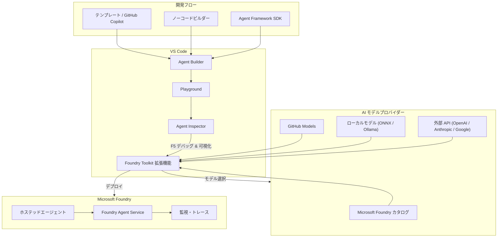

# Microsoft Foundry: Foundry Toolkit for Visual Studio Code が一般提供開始 (旧 AI Toolkit for VS Code)

**リリース日**: 2026-04-24

**サービス**: Microsoft Foundry

**機能**: Foundry Toolkit for Visual Studio Code (旧 AI Toolkit for VS Code)

**ステータス**: Launched (GA)

[このアップデートのインフォグラフィックを見る](https://takech9203.github.io/azure-news-summary/20260424-foundry-toolkit-vscode.html)

## 概要

Microsoft は Foundry Toolkit for Visual Studio Code (旧 AI Toolkit for VS Code) の一般提供 (GA) を発表した。この VS Code 拡張機能は、Microsoft Agent Framework を活用した AI エージェント開発のための統合ツールセットを提供し、テンプレートや GitHub Copilot を使用したエージェント作成、ローカルでのテスト・デバッグ (可視化・トレース付き)、Microsoft Foundry への直接デプロイをサポートする。

Foundry Toolkit は、AI Toolkit for VS Code から名称変更され、Microsoft Foundry との完全な統合を反映した製品となった。既存の機能はすべて引き継がれており、さらに Foundry プラットフォームとの連携が強化されている。開発者は VS Code を離れることなく、モデルの探索からエージェントの構築、テスト、デプロイまでの一連のワークフローを完結できる。

この拡張機能は、OpenAI、Anthropic、Google、GitHub、ONNX、Ollama など複数の AI モデルプロバイダーをサポートしており、100 万件を超えるインストール数を記録している。ノーコードのビジュアルビルダーからコードベースの SDK 開発まで、幅広い開発者のニーズに対応している。

**アップデート前の課題**

- AI エージェント開発において、モデル選択・コード記述・テスト・デプロイが別々のツールやプラットフォームにまたがっており、開発ワークフローが断片化していた
- エージェントのデバッグ時にマルチエージェントワークフローの実行状況を可視化する手段が限られており、問題の特定に時間がかかっていた
- ローカル開発からクラウドデプロイまでの一貫したパイプラインがなく、手動での設定・構成が必要だった
- AI Toolkit for VS Code はプレビュー段階であり、本番環境での利用に対する信頼性・サポートの保証が不十分だった

**アップデート後の改善**

- VS Code 内でモデル探索・エージェント作成・テスト・デプロイまでの開発ライフサイクル全体を統合的に管理可能
- Agent Inspector により F5 キーでデバッガーを起動し、リアルタイムストリーミングレスポンスの表示やマルチエージェントワークフローの実行を可視化
- Microsoft Foundry への直接デプロイにより、ローカル開発からクラウド展開までシームレスに移行
- GA となったことで本番環境での利用に対するサポートと安定性が保証される

## アーキテクチャ図

Foundry Toolkit は VS Code 内での開発ワークフロー全体を統合し、複数の AI モデルプロバイダーからのモデル選択、Agent Builder でのエージェント構築、Agent Inspector でのデバッグ・可視化、そして Microsoft Foundry へのデプロイまでを一貫して行う構成となっている。

## サービスアップデートの詳細

### 主要機能

1. **モデルカタログとモデル探索**
   - Microsoft Foundry、GitHub Models、ONNX、Ollama、OpenAI、Anthropic、Google など複数のソースから AI モデルを探索・アクセス可能
   - モデルの並列比較機能により、用途に最適なモデルを選定できる

2. **エージェント開発 (2 つのアプローチ)**
   - **ノーコードビルダー**: 自然言語によるプロンプト生成と組み込み評価メトリクスを備えたビジュアルインターフェースでプロンプトエージェントを作成
   - **コードベース SDK**: Microsoft Agent Framework SDK を使用したシングル・マルチエージェントワークフローの構築。フルデバッグサポート付き

3. **Agent Inspector (デバッグ・可視化)**
   - F5 キーでフルデバッガーサポート付きの起動が可能
   - リアルタイムストリーミングレスポンスの表示
   - マルチエージェントワークフローの実行可視化
   - トレース機能による AI アプリケーションのパフォーマンス分析

4. **インタラクティブ Playground**
   - リアルタイムのモデルテスト環境
   - 画像・添付ファイルを含むマルチモーダル入力をサポート

5. **モデル評価**
   - データセットと標準メトリクス (F1 スコア、関連性、類似性、一貫性) を使用した包括的なモデル評価
   - エージェントの品質を定量的に測定可能

6. **ファインチューニング**
   - ローカル GPU によるファインチューニング
   - Azure Container Apps を活用したクラウドベースの GPU ファインチューニング

7. **モデル最適化とデプロイ**
   - モデル変換ツールによるモデルの変換・量子化・最適化
   - Windows ML プロファイリング (CPU / GPU / NPU)
   - Microsoft Foundry へのクラウドデプロイ

8. **MCP ツール統合**
   - MCP (Model Context Protocol) ツールとの統合により、洗練されたプロンプトエンジニアリングが可能

## 技術仕様

| 項目 | 詳細 |
|------|------|
| 拡張機能名 | Foundry Toolkit (旧 AI Toolkit for VS Code) |
| 現在のバージョン | 1.1.2026042206 |
| インストール数 | 1,053,677 以上 |
| 対応プラットフォーム | VS Code (クロスプラットフォーム) |
| 対応モデルソース | Microsoft Foundry, GitHub Models, ONNX, Ollama, OpenAI, Anthropic, Google, Hugging Face |
| エージェント開発方式 | ノーコードビルダー / Agent Framework SDK (Python, C#) |
| デプロイ先 | Microsoft Foundry (ホステッドエージェント) |
| ローカルアクセラレーション | CPU, GPU, NPU |
| 評価メトリクス | F1 スコア、関連性、類似性、一貫性 |
| 費用 | 拡張機能自体は無料 |

## 設定方法

### 前提条件

1. Visual Studio Code がインストールされていること
2. Azure サブスクリプション (Foundry リソースへのアクセスに必要)
3. Azure 認証の設定 (Foundry リソースの利用時)
4. ローカルモデルを使用する場合は ONNX ランタイムまたは Ollama の環境構築

### VS Code からのインストール

1. VS Code を起動する
2. 拡張機能マーケットプレイスで「Foundry Toolkit」を検索する
3. 拡張機能をインストールする (Microsoft Foundry 拡張機能が自動的に組み込まれる)
4. VS Code の左サイドバーに Foundry Toolkit のアイコンが表示される

### エージェント作成と実行

1. Foundry Toolkit パネルから「Agent Builder」を開く
2. テンプレートまたは GitHub Copilot を使用してエージェントを作成する
3. Playground でエージェントの動作を対話的にテストする
4. F5 キーで Agent Inspector を起動し、デバッグ・可視化を行う
5. 問題がなければ Microsoft Foundry へデプロイする

## メリット

### ビジネス面

- エージェント開発の開発サイクルを短縮し、プロトタイプから本番デプロイまでの時間を大幅に削減
- ノーコードビルダーにより、開発者以外のチームメンバーもプロンプトエージェントの作成に参加可能
- 複数の AI モデルプロバイダーをサポートしており、ベンダーロックインを回避しつつ最適なモデルを選択できる

### 技術面

- VS Code 内での統合開発体験により、コンテキストスイッチングを最小化
- Agent Inspector によるリアルタイムのデバッグ・可視化で、マルチエージェントワークフローの問題を迅速に特定
- Microsoft Agent Framework SDK との深い統合により、シングルエージェントからマルチエージェントまでの複雑なワークフローを構築可能
- トレース機能による本番環境でのパフォーマンス監視

## デメリット・制約事項

- Foundry リソースへのアクセスには Azure サブスクリプションと認証設定が必要 (ローカルモデルのみの利用は認証不要)
- Windows ML プロファイリングや NPU 最適化は Windows 環境に限定される
- 拡張機能自体は無料だが、クラウドモデルの利用や Foundry へのデプロイには各サービスの料金が発生する
- AI Toolkit からの名称変更に伴い、既存のドキュメントやチュートリアルの一部が更新途中の可能性がある

## ユースケース

### ユースケース 1: カスタマーサポートエージェントの迅速な開発

**シナリオ**: 企業のカスタマーサポートチームが、FAQ 対応を自動化する AI エージェントを構築する。ノーコードビルダーで初期プロンプトを設計し、Playground で対話テストを実施。Agent Inspector でレスポンスの品質を確認した上で、Microsoft Foundry にデプロイする。

**効果**: プロトタイプから本番デプロイまでの時間を大幅に短縮。ローカルテストで品質を確保してからクラウドに展開するため、リスクを低減できる。

### ユースケース 2: マルチエージェントワークフローの開発・デバッグ

**シナリオ**: 開発チームが、データ収集・分析・レポート生成を担う複数の AI エージェントが協調して動作するワークフローを構築する。Agent Framework SDK でコードベースのエージェントを作成し、Agent Inspector でマルチエージェント間のやり取りを可視化しながらデバッグする。

**効果**: マルチエージェントワークフローの実行をリアルタイムで可視化できるため、エージェント間の連携問題を迅速に発見・修正できる。

### ユースケース 3: ローカル環境でのモデル評価と最適化

**シナリオ**: AI エンジニアが、複数のモデル候補を並列比較し、精度・コスト・レイテンシの観点から最適なモデルを選定する。選定後、モデル変換ツールで量子化・最適化を行い、エッジデバイスや NPU 対応デバイスへのローカルデプロイを行う。

**効果**: 1 つのツール内でモデルの評価・比較・最適化・デプロイまでを完結でき、モデル選定の意思決定を加速できる。

## 料金

Foundry Toolkit 拡張機能自体は無料で利用可能。ただし、以下のサービスについては別途料金が発生する。

- **クラウド AI モデルの利用**: 各モデルプロバイダーの従量課金 (Microsoft Foundry Models、OpenAI、Anthropic、Google など)
- **Microsoft Foundry へのデプロイ**: Azure AI Foundry の料金体系に準拠
- **Azure Container Apps によるファインチューニング**: GPU インスタンスの利用料金

詳細は [Microsoft Foundry の料金ページ](https://azure.microsoft.com/pricing/details/ai-foundry/) を参照。

## 利用可能リージョン

Foundry Toolkit は VS Code 拡張機能としてグローバルに利用可能。ローカルモデル (ONNX / Ollama) の利用はリージョンに依存しない。Microsoft Foundry へのデプロイ先リージョンについては、[Microsoft Foundry のドキュメント](https://learn.microsoft.com/azure/ai-foundry/) を参照。

## 関連サービス・機能

- **Microsoft Foundry**: AI アプリ・エージェントの構築・最適化・ガバナンスを行うプラットフォーム。Foundry Toolkit のデプロイ先として機能する
- **Microsoft Agent Framework**: エージェントの構築・オーケストレーションを行うフレームワーク。Python および C# のサンプルが提供されており、Foundry Toolkit はこのフレームワークの VS Code 統合を担う
- **Foundry Agent Service**: AI エージェントのオーケストレーションとホスティングを行うサービス。Foundry Toolkit からデプロイされたエージェントの実行基盤
- **Foundry Models**: Azure 経由で提供される AI モデルカタログ。Foundry Toolkit のモデルカタログ機能と連携
- **Foundry Local**: デバイス上で LLM を無料で実行するためのツール。Foundry Toolkit と組み合わせたローカル開発に活用
- **GitHub Copilot**: Foundry Toolkit 内でのエージェント作成支援に活用可能

## 参考リンク

- [インフォグラフィック](https://takech9203.github.io/azure-news-summary/20260424-foundry-toolkit-vscode.html)
- [公式アップデート情報](https://azure.microsoft.com/updates?id=560987)
- [Azure Blog - OpenAI's GPT-5.5 in Microsoft Foundry](https://azure.microsoft.com/en-us/blog/openais-gpt-5-5-in-microsoft-foundry-frontier-intelligence-on-an-enterprise-ready-platform/)
- [Microsoft Learn - Foundry Toolkit 概要](https://learn.microsoft.com/windows/ai/toolkit/)
- [VS Code ドキュメント - Foundry Toolkit](https://code.visualstudio.com/docs/intelligentapps/overview)
- [VS Code Marketplace - Foundry Toolkit](https://marketplace.visualstudio.com/items?itemName=ms-windows-ai-studio.windows-ai-studio)
- [Microsoft Foundry ドキュメント](https://learn.microsoft.com/azure/ai-foundry/)
- [Microsoft Agent Framework ドキュメント](https://learn.microsoft.com/agent-framework/)
- [料金ページ](https://azure.microsoft.com/pricing/details/ai-foundry/)

## まとめ

Foundry Toolkit for Visual Studio Code の GA は、AI エージェント開発のワークフローを VS Code 内で統合的に完結させる重要なマイルストーンである。テンプレートや GitHub Copilot によるエージェント作成、Agent Inspector によるリアルタイムデバッグ・可視化、Microsoft Foundry への直接デプロイという一連の開発ライフサイクルを 1 つの拡張機能でカバーしている点が大きな特徴である。

Solutions Architect にとっては、ノーコードビルダーとコードベース SDK の 2 つのアプローチが提供されている点に注目すべきである。これにより、PoC フェーズではノーコードで迅速にプロトタイプを作成し、本番開発ではAgent Framework SDK を使用した本格的な実装に移行するという段階的なアプローチが可能となる。拡張機能自体は無料であるため、まずはインストールして Playground でモデルの比較やエージェントのテストを行うことを推奨する。

---

**タグ**: #Microsoft-Foundry #AI #VS-Code #Agent-Framework #エージェント開発 #GA #開発ツール #機械学習
