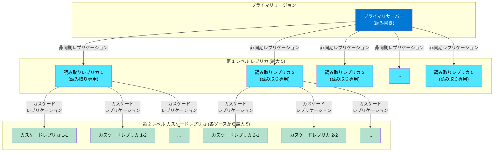

# Azure Database for PostgreSQL: カスケード読み取りレプリカの一般提供開始 (GA)

**リリース日**: 2026-04-24

**サービス**: Azure Database for PostgreSQL

**機能**: カスケード読み取りレプリカ (Cascading Read Replicas)

**ステータス**: Launched (GA)

[このアップデートのインフォグラフィックを見る](https://takech9203.github.io/azure-news-summary/20260424-postgresql-cascading-read-replicas.html)

## 概要

Azure Database for PostgreSQL Flexible Server において、カスケード読み取りレプリカ (Cascading Read Replicas) が一般提供 (GA) となった。この機能により、既存の読み取りレプリカからさらに新しい読み取りレプリカを作成する 2 階層のレプリケーション構成が可能になり、読み取り集約型ワークロードのスケーラビリティが大幅に向上する。

従来の読み取りレプリカ機能では、プライマリサーバーから直接最大 5 つの読み取りレプリカを作成できたが、カスケードレプリカにより、第 1 レベルの各レプリカからさらに最大 5 つの第 2 レベルレプリカを作成できるようになった。これにより、1 つのプライマリサーバーあたり最大 30 の読み取りレプリカ (第 1 レベル 5 + 第 2 レベル 25) をデプロイでき、読み取りトラフィックの分散と地理的に分散したユーザーへの低レイテンシアクセスを実現できる。

レプリケーションは PostgreSQL エンジンのネイティブな物理レプリケーション技術を使用し、非同期方式で行われる。レプリケーションスロットを使用したストリーミングレプリケーションがデフォルトの動作モードであり、必要に応じてファイルベースのログシッピングが使用される。

**アップデート前の課題**

- プライマリサーバーから直接作成できる読み取りレプリカは最大 5 つに制限されており、大規模な読み取りワークロードの分散に限界があった
- 多数の読み取りレプリカが必要な場合、すべてのレプリカがプライマリサーバーに直接接続するため、プライマリサーバーのレプリケーション負荷が増大していた
- 地理的に分散した読み取りワークロードに対して、レプリカの配置に柔軟性が不足していた

**アップデート後の改善**

- 2 階層のカスケード構成により、最大 30 の読み取りレプリカをデプロイ可能に
- 第 1 レベルのレプリカがソースとなることで、プライマリサーバーのレプリケーション負荷を軽減
- クロスリージョンレプリカとの組み合わせにより、地理的に分散した読み取りトラフィックをユーザーに近いリージョンで処理可能に
- 中間レプリカ (ソース) とカスケードレプリカ間のスイッチオーバー操作をサポート

## アーキテクチャ図

プライマリサーバーから第 1 レベルの読み取りレプリカ (最大 5) に非同期レプリケーションが行われ、さらに各第 1 レベルレプリカから第 2 レベルのカスケードレプリカ (各最大 5) にデータが伝播する。この 2 階層構成により、合計最大 30 の読み取りレプリカを構成できる。

## サービスアップデートの詳細

### 主要機能

1. **2 階層カスケードレプリケーション**
   - 既存の読み取りレプリカ (第 1 レベル) をソースとして、新たなカスケード読み取りレプリカ (第 2 レベル) を作成可能
   - 第 1 レベルのレプリカがプライマリサーバーから非同期でデータを受信し、第 2 レベルのレプリカがそのデータをさらに受信する

2. **大規模スケーラビリティ**
   - プライマリサーバーあたり最大 5 つの第 1 レベルレプリカ
   - 各第 1 レベルレプリカあたり最大 5 つの第 2 レベルカスケードレプリカ
   - 合計で最大 30 の読み取りレプリカサーバーをデプロイ可能

3. **スイッチオーバーのサポート**
   - 中間レプリカ (ソース) とカスケードレプリカ間でスイッチオーバー操作が可能

4. **クロスリージョン対応**
   - カスケードレプリカは異なるリージョンに配置でき、グローバルに分散した読み取りトラフィックの最適化が可能

## 技術仕様

| 項目 | 詳細 |
|------|------|
| 最大レプリケーション階層数 | 2 レベル |
| プライマリあたりの第 1 レベルレプリカ数 | 最大 5 |
| 第 1 レベルレプリカあたりの第 2 レベルレプリカ数 | 最大 5 |
| 合計最大読み取りレプリカ数 | 最大 30 |
| レプリケーション方式 | 非同期物理レプリケーション (ストリーミング + ログシッピング) |
| 対応 PostgreSQL バージョン | 14 以降 |
| 対応コンピューティングティア | General Purpose / Memory Optimized |
| クロスリージョンレプリカ | サポート |
| スイッチオーバー (中間レプリカ - カスケードレプリカ間) | サポート |
| カスケードレプリカのプライマリ昇格 | 独立サーバーとしての昇格のみ (中間レプリカからのプライマリ昇格は非サポート) |
| バーチャルエンドポイント | カスケードレプリカでは非サポート |
| Burstable ティア | 非サポート |

## 設定方法

### 前提条件

1. Azure サブスクリプション
2. Azure Database for PostgreSQL Flexible Server (プライマリサーバー) が作成済みであること
3. General Purpose または Memory Optimized コンピューティングティアを使用していること
4. PostgreSQL バージョン 14 以降であること
5. 第 1 レベルの読み取りレプリカが既に存在していること (カスケードレプリカの作成時)

### Azure Portal での設定手順

1. Azure Portal で第 1 レベルの読み取りレプリカ (プライマリサーバーから作成済み) を選択
2. **レプリケーション** タブに移動
3. **レプリカの作成** をクリック
4. カスケードレプリカの設定 (名前、リージョン、コンピューティングティア、ストレージサイズなど) を構成
5. 設定を確認し、カスケードレプリカを作成

### 構成管理のポイント

- カスケードレプリカのコンピューティングティアとストレージサイズは、ソースとなるレプリカと同等以上に設定することを推奨
- ファイアウォールルールはレプリカ作成時に継承されるが、作成後に個別に変更可能
- サーバーパラメータはソースから継承されるが、`max_connections`、`max_prepared_transactions`、`max_locks_per_transaction`、`max_wal_senders`、`max_worker_processes` はソースと同等以上の値を維持する必要がある

## メリット

### ビジネス面

- 読み取りワークロードをより多くのレプリカに分散でき、アプリケーションの応答性と可用性が向上
- 地理的に分散したユーザーに対して低レイテンシの読み取りアクセスを提供でき、グローバルサービスの品質が向上
- プライマリサーバーの負荷を軽減することで、書き込みパフォーマンスの安定性を確保

### 技術面

- 2 階層構成によりプライマリサーバーのレプリケーションスロット数を 5 に抑えつつ、最大 30 のレプリカにデータを配信可能
- 中間レプリカがレプリケーションのハブとして機能するため、プライマリサーバーの WAL (Write-Ahead Log) 送信負荷が分散される
- PostgreSQL ネイティブの物理レプリケーション技術を使用しているため、追加のレプリケーションツールが不要
- スイッチオーバー操作により、レプリカのトポロジを柔軟に変更可能

## デメリット・制約事項

- **レプリケーション遅延の増大**: カスケード構成では第 2 レベルのレプリカはプライマリから 2 ホップ分の遅延が発生するため、第 1 レベルのレプリカよりもレプリケーションラグが大きくなる可能性がある
- **中間レプリカのプライマリ昇格制限**: カスケードレプリカを持つ中間レプリカに対して「プライマリサーバーに昇格」操作はサポートされていない
- **バーチャルエンドポイント非対応**: カスケードレプリカではバーチャルエンドポイントがサポートされていない
- **Burstable ティア非対応**: General Purpose および Memory Optimized コンピューティングティアのみサポート
- **PostgreSQL 14 以降のみ対応**: カスケードレプリカは PostgreSQL バージョン 14 以上の中間レプリカでのみサポート
- **バックアップの制約**: 読み取りレプリカではバックアップは取得されない。高可用性 (HA) 構成もレプリカではサポートされない
- **WAL ファイルの蓄積リスク**: レプリケーションスロットの遅延が大きい場合、プライマリサーバーやソースレプリカで WAL ファイルが蓄積され、ストレージ使用量が増大する可能性がある
- **メジャーバージョンアップグレード時の制約**: インプレースメジャーバージョンアップグレードを行う場合、すべてのカスケードレプリカおよび読み取りレプリカを事前に削除する必要がある

## ユースケース

### ユースケース 1: 大規模 BI/分析ワークロードの負荷分散

**シナリオ**: 大規模な BI (ビジネスインテリジェンス) システムで、数十のレポーティングツールやダッシュボードが同時にデータベースに読み取りクエリを発行するケース。

**効果**: プライマリサーバーから 5 つの第 1 レベルレプリカを作成し、各レプリカからさらにカスケードレプリカを追加することで、最大 30 の読み取りエンドポイントに BI クエリを分散できる。プライマリサーバーのトランザクション処理パフォーマンスへの影響を最小限に抑えながら、大量の分析クエリを処理可能になる。

### ユースケース 2: グローバル分散読み取りアーキテクチャ

**シナリオ**: グローバルに展開する SaaS アプリケーションで、各リージョンのユーザーに低レイテンシの読み取りアクセスを提供する必要があるケース。

**効果**: プライマリサーバーを主要リージョンに配置し、第 1 レベルレプリカを主要な地理的リージョン (例: 北米、ヨーロッパ、アジア) に配置する。さらに各リージョンの第 1 レベルレプリカから、近隣の国や地域にカスケードレプリカを配置することで、ユーザーに最も近いレプリカから読み取りを提供できる。

### ユースケース 3: 段階的なディザスタリカバリ

**シナリオ**: ミッションクリティカルなデータベースで、複数のリージョンにまたがるディザスタリカバリ戦略を構築するケース。

**効果**: 第 1 レベルレプリカを近隣リージョンに配置し、カスケードレプリカを遠隔リージョンに配置することで、段階的な災害復旧体制を構築できる。障害時にはレプリカを独立サーバーに昇格させることで、読み書き可能なサーバーとして迅速に切り替え可能。

## 料金

読み取りレプリカ (カスケードレプリカを含む) は、通常の Azure Database for PostgreSQL Flexible Server インスタンスと同様に課金される。各レプリカについて、プロビジョニングされたコンピューティング (vCores) とストレージ (GB/月) に基づく料金が発生する。

| 項目 | 課金モデル |
|------|-----------|
| コンピューティング | レプリカごとにプロビジョニングされた vCores に基づいて課金 |
| ストレージ | レプリカごとに使用された GB/月に基づいて課金 |
| ネットワーク | クロスリージョンレプリケーションの場合、データ転送料金が発生 |

**注意**: カスケードレプリカを含む多数のレプリカをデプロイする場合、各レプリカのコンピューティングおよびストレージコストが累積するため、コスト計画を十分に行うことを推奨する。

詳細な料金は [Azure Database for PostgreSQL Flexible Server 料金ページ](https://azure.microsoft.com/pricing/details/postgresql/flexible-server/) を参照。

## 利用可能リージョン

カスケード読み取りレプリカは、Azure Database for PostgreSQL Flexible Server の読み取りレプリカがサポートされているすべてのリージョンで利用可能。Azure Database for PostgreSQL Flexible Server は、Azure がサービスを提供するグローバルリージョンで広く展開されている。

詳細なリージョン一覧は [Azure リージョン別製品提供状況ページ](https://azure.microsoft.com/explore/global-infrastructure/products-by-region/?products=postgresql&regions=all) を参照。

## 関連サービス・機能

- **Azure Database for PostgreSQL 読み取りレプリカ**: カスケードレプリカの基盤となる機能。プライマリからの第 1 レベル非同期レプリケーションを提供
- **Geo レプリケーション**: クロスリージョンでの読み取りレプリカ作成をサポートし、グローバル分散アーキテクチャの構築に活用
- **バーチャルエンドポイント**: 第 1 レベルの読み取りレプリカで使用可能な接続エンドポイント機能 (カスケードレプリカでは非サポート)
- **Azure Monitor**: レプリケーションラグ、物理レプリケーション遅延、WAL ストレージ使用量などのメトリクスを監視
- **Azure Accelerate for Databases**: データベースのモダナイゼーションと AI 活用を支援するプログラム

## 参考リンク

- [インフォグラフィック](https://takech9203.github.io/azure-news-summary/20260424-postgresql-cascading-read-replicas.html)
- [公式アップデート情報](https://azure.microsoft.com/updates?id=560939)
- [Microsoft Learn - Read replicas in Azure Database for PostgreSQL](https://learn.microsoft.com/azure/postgresql/flexible-server/concepts-read-replicas)
- [Microsoft Learn - Geo-replication](https://learn.microsoft.com/azure/postgresql/flexible-server/concepts-read-replicas-geo)
- [Microsoft Learn - How to create a read replica](https://learn.microsoft.com/azure/postgresql/flexible-server/how-to-create-read-replica)
- [Azure Database for PostgreSQL Flexible Server 料金ページ](https://azure.microsoft.com/pricing/details/postgresql/flexible-server/)
- [Azure Accelerate for Databases ブログ](https://azure.microsoft.com/en-us/blog/introducing-azure-accelerate-for-databases-modernize-your-data-for-ai-with-experts-and-investments/)

## まとめ

Azure Database for PostgreSQL Flexible Server でカスケード読み取りレプリカが GA となり、読み取り集約型ワークロードのスケーラビリティが大幅に向上した。従来のプライマリから直接の 5 レプリカ制限に対し、2 階層のカスケード構成により最大 30 の読み取りレプリカをデプロイ可能になった。これにより、大規模な BI/分析ワークロードの負荷分散、グローバルに分散した読み取りアーキテクチャの構築、段階的なディザスタリカバリ戦略の実現といったユースケースに対応できる。一方で、カスケード構成では 2 ホップ分のレプリケーション遅延が発生する点、中間レプリカのプライマリ昇格に制限がある点、バーチャルエンドポイントが非対応である点などの制約を理解した上で導入を検討する必要がある。PostgreSQL バージョン 14 以降、General Purpose または Memory Optimized ティアの環境で利用可能であり、読み取りスケールアウトが求められるシナリオにおいて有効な選択肢となる。

---

**タグ**: #Azure #PostgreSQL #CascadingReadReplicas #ReadReplica #GA #Database #Replication #ScaleOut #FlexibleServer
