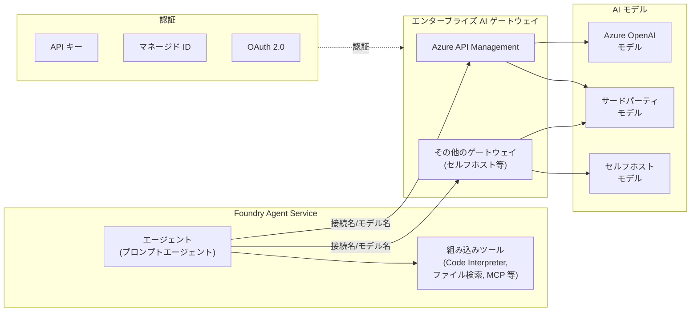

# Foundry Agent Service: Bring Your Own AI Gateway

**リリース日**: 2026-04-27

**サービス**: Microsoft Foundry Agent Service

**機能**: Bring Your Own AI Gateway (BYO AI Gateway)

**ステータス**: Launched (GA)

[このアップデートのインフォグラフィックを見る](https://takech9203.github.io/azure-news-summary/20260427-foundry-agent-service-byo-ai-gateway.html)

## 概要

Foundry Agent Service に「Bring Your Own AI Gateway」機能が一般提供 (GA) として追加された。この機能により、Foundry の外部でデプロイ・管理されている AI モデルをエージェントから利用できるようになる。Azure API Management などのエンタープライズ AI ゲートウェイの背後にホストされたモデルへの接続がサポートされ、組織が既存のモデル管理インフラストラクチャを維持したまま Foundry Agent Service のエージェント機能を活用できる。

この機能は「Bring Your Own Model (BYOM)」とも呼ばれ、Azure API Management 接続と、非 Azure の AI モデルゲートウェイ (Model Gateway) 接続の 2 種類の接続タイプをサポートする。Foundry ポータルまたは Azure CLI からゲートウェイ接続を作成し、OpenAI 互換のチャット補完 API を実装するモデルをエージェントに接続できる。

Foundry Agent Service 自体は 2026 年 3 月に GA となっていたが、利用可能なモデルは Foundry モデルカタログ内のものに限定されていた。今回の BYO AI Gateway により、サードパーティプロバイダーやセルフホストのモデル、既存のエンタープライズ AI ゲートウェイ経由のモデルなど、外部モデルの利用が正式にサポートされた。

**アップデート前の課題**

- Foundry Agent Service のエージェントは Foundry モデルカタログ内のモデル (Azure OpenAI、Llama、DeepSeek 等) のみ利用可能であり、外部でホストされたモデルを直接利用できなかった
- エンタープライズが既に Azure API Management でモデルアクセスのガバナンス (トークン制限、ロードバランシング、監査ログ等) を構築している場合、それらの既存インフラストラクチャを Foundry Agent Service と統合できなかった
- サードパーティのモデルプロバイダーやセルフホストモデルを使用したエージェント構築には、独自のオーケストレーション基盤が必要だった

**アップデート後の改善**

- Azure API Management や非 Azure の AI ゲートウェイの背後にあるモデルを Foundry Agent Service のエージェントから利用可能になった
- 既存のエンタープライズセキュリティポリシー、トークン管理、アクセス制御をそのまま活用しながらエージェントを構築できるようになった
- API キー、マネージド ID、OAuth 2.0 による柔軟な認証方式が提供された
- Code Interpreter、ファイル検索、OpenAPI、MCP 等の Foundry 組み込みツールを外部モデルと組み合わせて使用できるようになった

## アーキテクチャ図



Foundry Agent Service のエージェントがエンタープライズ AI ゲートウェイ (Azure API Management またはその他のゲートウェイ) を経由して外部モデルにリクエストをルーティングする構成を示す。認証は API キー、マネージド ID、OAuth 2.0 のいずれかで行われる。

## サービスアップデートの詳細

### 主要機能

1. **Azure API Management 接続**
   - 既存の Azure API Management リソースを選択し、OpenAI 互換のチャット補完 API を実装するモデルデプロイメントに接続
   - API キーまたはマネージド ID による認証をサポート
   - API Management の標準規約に従ったインテリジェントなデフォルト設定 (デプロイメント一覧エンドポイント `/deployments`、プロバイダー `AzureOpenAI`)

2. **Model Gateway 接続 (非 Azure ゲートウェイ)**
   - セルフホスト、非 Azure ホスト、カスタムソリューションへの接続をサポート
   - ベース URL を指定して任意のゲートウェイエンドポイントに接続可能
   - API キーまたは OAuth 2.0 (クライアント ID、クライアントシークレット、トークン URL、スコープ) による認証
   - 静的ディスカバリー (事前定義モデル) と動的ディスカバリー (ランタイム時 API 検出) をサポート

3. **モデルデプロイメント管理**
   - 接続ウィザードで追加したモデルは Foundry に自動的にデプロイメントとして登録される
   - エージェント構成時に admin-connected デプロイメントとして選択可能
   - Foundry が自動的にリクエストをゲートウェイ経由でルーティング

4. **対応ツール**
   - Code Interpreter、Functions、ファイル検索、OpenAPI、Foundry IQ、SharePoint Grounding、Fabric Data Agent、MCP、Browser Automation が BYO モデルと組み合わせて使用可能

5. **ネットワーク分離サポート**
   - パブリックネットワーキングは API Management とセルフホストゲートウェイの両方でサポート
   - 完全なネットワーク分離にも対応 (API Management の場合は専用の Bicep テンプレートを使用、セルフホストゲートウェイの場合は VNet 内からのアクセスを確保)

## 技術仕様

| 項目 | 詳細 |
|------|------|
| 対応エージェントタイプ | プロンプトエージェント (Agent SDK 経由) |
| 接続タイプ | API Management (`ApiManagement`)、Model Gateway (`ModelGateway`) |
| 認証方式 (API Management) | API キー、マネージド ID (Microsoft Entra ID) |
| 認証方式 (Model Gateway) | API キー、OAuth 2.0 (クライアント資格情報) |
| 必要な SDK バージョン | `azure-ai-projects` 2.0.0 以降 |
| Azure CLI バージョン | 2.67 以降 |
| Python バージョン | 3.10 以降 |
| モデル API 要件 | OpenAI 互換のチャット補完 API |
| URL パス形式 | OpenAI スタイル (`/deployments/{name}/chat/completions`) または Azure OpenAI スタイル (`/chat/completions`) を選択可能 |

## 設定方法

### 前提条件

1. Azure サブスクリプション
2. Microsoft Foundry プロジェクト
3. エンタープライズ AI ゲートウェイへのアクセス資格情報 (API Management サブスクリプションキー、API キー、または OAuth 2.0 資格情報)
4. Foundry プロジェクトに対する **Azure AI User** 以上のロール
5. リソースグループに対する **Contributor** ロール (接続デプロイ用)

### Foundry ポータル (Azure API Management の場合)

1. [Microsoft Foundry](https://ai.azure.com) にサインイン
2. **Operate** > **Admin console** を選択
3. **All projects** タブを開き、対象プロジェクトの **Parent resource** リンクを選択
4. **Admin-connected models** タブで **Add** を選択
5. **Connection Type** で **Azure API Management** を選択し、既存の API Management リソースとモデルデプロイメントを指定
6. **Authentication** で API キーまたはマネージド ID を選択して資格情報を入力
7. **Model configuration** でデプロイメント名、モデル名、表示名を設定
8. **Advanced** で必要に応じて API バージョンやカスタムヘッダーを構成
9. **Add** をクリックして接続を作成

### Python SDK でのエージェント作成

接続作成後、モデルデプロイメント名を `<接続名>/<モデル名>` の形式で指定してエージェントを作成する。

```python
import os
from azure.ai.projects import AIProjectClient
from azure.identity import DefaultAzureCredential

# 環境変数の設定
# FOUNDRY_PROJECT_ENDPOINT: プロジェクトエンドポイント URL
# FOUNDRY_MODEL_DEPLOYMENT_NAME: <接続名>/<モデル名> (例: my-apim-connection/gpt-4o)

client = AIProjectClient(
    endpoint=os.getenv("FOUNDRY_PROJECT_ENDPOINT"),
    credential=DefaultAzureCredential(),
)

# エージェントの作成 (BYO モデルを使用)
agent = client.agents.create_version(
    model=os.getenv("FOUNDRY_MODEL_DEPLOYMENT_NAME"),
    name="my-byom-agent",
    instructions="You are a helpful assistant.",
)
```

## メリット

### ビジネス面

- 既存のエンタープライズ AI ガバナンス基盤 (Azure API Management によるトークン管理、アクセス制御、監査ログ) を維持しながら Foundry Agent Service を活用できる
- 複数のモデルプロバイダーを統一的に管理でき、ベンダーロックインを回避できる
- コンプライアンス要件に基づくデータ境界やモデルアクセスポリシーを既存のゲートウェイレベルで適用し続けられる

### 技術面

- OpenAI 互換 API を実装するあらゆるモデルを Foundry Agent Service のエージェントに統合可能
- API Management のロードバランシング、サーキットブレーカー、セマンティックキャッシュ、トークンレート制限等の高度な機能をモデルアクセスに適用できる
- パブリックネットワーキングとプライベートネットワーキングの両方をサポートし、既存のネットワーク構成に合わせた展開が可能
- 静的・動的のモデルディスカバリーにより、柔軟なモデル管理ワークフローを実現

## デメリット・制約事項

- BYOM モデルは「非 Microsoft 製品」として扱われ、利用者がリスクを負う必要がある。Responsible AI の軽減策 (メタプロンプト、コンテンツフィルター等) は利用者の責任で実装する必要がある
- BYOM モデルの使用時、データ処理要件の遵守は利用者の責任であり、データが Azure のコンプライアンス・地理的境界を越える可能性がある
- 現時点では Agent SDK のプロンプトエージェントのみが対応しており、ホステッドエージェントやワークフローエージェントからの利用はサポートされていない
- モデルは OpenAI 互換のチャット補完 API を実装している必要がある

## ユースケース

### ユースケース 1: エンタープライズ AI ガバナンスの統合

**シナリオ**: 大規模組織が Azure API Management で複数の AI モデルデプロイメントを一元管理し、部門ごとのトークン制限、コンテンツセーフティポリシー、アクセスログの監査を行っている。この既存のガバナンス基盤を維持しつつ、Foundry Agent Service でエージェントを構築したい。

**効果**: API Management の既存ポリシー (トークンレート制限、セマンティックキャッシュ、ロードバランシング) をそのまま活用しながら、Foundry Agent Service のエージェントオーケストレーション機能 (ツール呼び出し、マルチステップ推論、公開) を組み合わせることで、ガバナンスとエージェント機能を両立できる。

### ユースケース 2: マルチプロバイダーモデルの活用

**シナリオ**: AI ゲートウェイの背後に、Azure OpenAI の GPT モデル、セルフホストのオープンソースモデル、サードパーティプロバイダーのモデルなど、複数のモデルを運用している。用途に応じて最適なモデルをエージェントに割り当てたい。

**効果**: Model Gateway 接続を使用して複数のモデルエンドポイントを Foundry に登録し、エージェント構成時にモデルを柔軟に切り替えることで、コストパフォーマンスや精度の要件に応じた最適なモデル選択が可能になる。

## 料金

BYO AI Gateway 機能自体の追加料金は明示されていない。料金は以下の要素で構成される。

- **Foundry Agent Service**: エージェントが使用するモデルデプロイメントの従量課金 (モデルごとのトークン料金)
- **Azure API Management**: AI Gateway として使用する場合、APIM インスタンスの料金が発生。AI Gateway には Azure API Management の無料枠が含まれる。v2 ティア (Basic v2、Standard v2、Premium v2) が必要
- **外部モデル**: BYOM モデルの利用料金はサードパーティプロバイダーのライセンス条項に従う

詳細は [Foundry Agent Service 料金ページ](https://aka.ms/AgentService_pricing) および [API Management 料金ページ](https://azure.microsoft.com/pricing/details/api-management/) を参照。

## 利用可能リージョン

Foundry Agent Service は Azure OpenAI Responses API をサポートするリージョンで利用可能。BYO AI Gateway 機能も同じリージョンで利用できる。ただし、API Management インスタンスは Foundry リソースと同じ Microsoft Entra テナントおよびサブスクリプション内に存在する必要がある。

## 関連サービス・機能

- **Azure API Management**: エンタープライズ AI ゲートウェイとして、モデルへのアクセス制御、トークン管理、ロードバランシング、セマンティックキャッシュ、コンテンツセーフティを提供
- **Microsoft Foundry Agent Service**: AI エージェントの構築、デプロイ、スケーリングのフルマネージドプラットフォーム。BYO AI Gateway はこのサービスの拡張機能
- **Microsoft Entra ID**: マネージド ID を使用した AI ゲートウェイへの認証を提供
- **Azure AI Content Safety**: API Management のポリシーを通じて LLM プロンプトのコンテンツ安全性チェックを適用

## 参考リンク

- [インフォグラフィック](https://takech9203.github.io/azure-news-summary/20260427-foundry-agent-service-byo-ai-gateway.html)
- [公式アップデート情報](https://azure.microsoft.com/updates?id=561002)
- [Microsoft Learn - Bring Your Own Model to Foundry Agent Service](https://learn.microsoft.com/en-us/azure/foundry/agents/how-to/ai-gateway)
- [Microsoft Learn - AI gateway in Azure API Management](https://learn.microsoft.com/en-us/azure/api-management/genai-gateway-capabilities)
- [Microsoft Learn - Configure AI Gateway in Foundry](https://learn.microsoft.com/en-us/azure/foundry/configuration/enable-ai-api-management-gateway-portal)
- [Microsoft Learn - Foundry Agent Service 概要](https://learn.microsoft.com/en-us/azure/foundry/agents/overview)
- [Azure Blog - OpenAI's GPT-5.5 in Microsoft Foundry](https://azure.microsoft.com/en-us/blog/openais-gpt-5-5-in-microsoft-foundry-frontier-intelligence-on-an-enterprise-ready-platform/)
- [料金ページ (Foundry Agent Service)](https://aka.ms/AgentService_pricing)
- [料金ページ (API Management)](https://azure.microsoft.com/pricing/details/api-management/)

## まとめ

Foundry Agent Service の BYO AI Gateway 機能の GA により、エンタープライズ AI ゲートウェイ (Azure API Management やその他のゲートウェイ) の背後にあるモデルを Foundry Agent Service のエージェントから利用できるようになった。これにより、既存のモデルガバナンス基盤を維持しつつ、Foundry のエージェントオーケストレーション機能を活用する構成が実現可能となった。

Solutions Architect としては、既に Azure API Management で AI モデルのガバナンスを構築している組織にとって特に有用なアップデートである。Foundry ポータルの Admin-connected models から接続を追加する手順は簡潔であり、まずは既存の API Management リソースとの接続を検証することを推奨する。ただし、BYOM モデルに対する Responsible AI の実装やデータ処理コンプライアンスは利用者の責任となる点に留意が必要である。

---

**タグ**: #AI #MachineLearning #MicrosoftFoundry #AgentService #AzureAPIManagement #AIGateway #BYOM #GA
