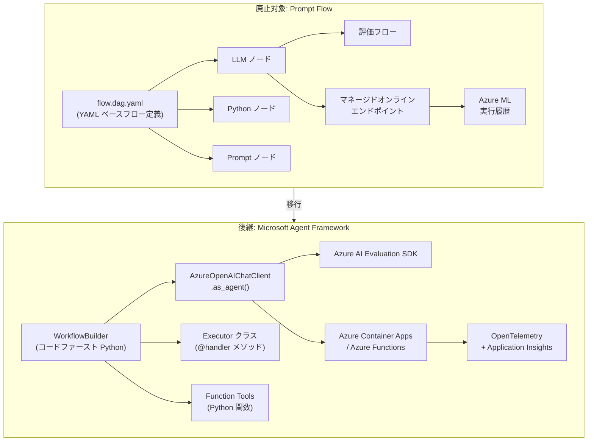
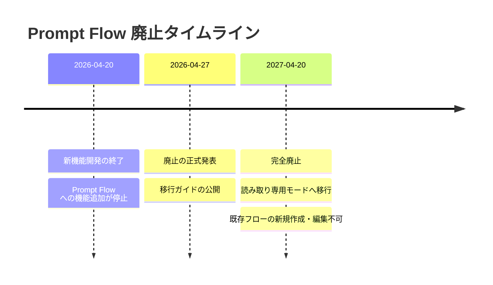

# Prompt Flow: Azure Machine Learning および Microsoft Foundry における廃止のお知らせ

**リリース日**: 2026-04-27

**サービス**: Azure Machine Learning / Microsoft Foundry

**機能**: Prompt Flow

**ステータス**: Retirement

[このアップデートのインフォグラフィックを見る](https://takech9203.github.io/azure-news-summary/20260427-prompt-flow-retirement.html)

## 概要

Microsoft は、Azure Machine Learning および Microsoft Foundry における Prompt Flow の廃止を正式に発表した。Prompt Flow の新機能開発は 2026 年 4 月 20 日に終了しており、2027 年 4 月 20 日に完全廃止（読み取り専用モードへの移行）が予定されている。既存のフローは廃止日まで引き続き動作するが、それ以降は新規作成・編集ができなくなる。

Prompt Flow は、LLM（大規模言語モデル）を活用した AI アプリケーションの開発サイクル全体を効率化するために設計された開発ツールであり、プロトタイピング、実験、イテレーション、デプロイメントを包括的に支援してきた。YAML ベースのビジュアルグラフによるフロー定義、プロンプトバリアントの作成と比較、組み込みの評価フローなどの機能を提供していた。

後継となるのは Microsoft Agent Framework であり、コードファーストの Python（および .NET）フレームワークとして、型安全なワークフロー、組み込みエージェントサポート、ネイティブ OpenTelemetry トレーシング、柔軟なデプロイメントオプション、マルチエージェントオーケストレーションなどの機能を提供する。ユーザーは 2027 年 4 月 20 日の廃止日までに、Prompt Flow のワークロードを Microsoft Agent Framework に移行する必要がある。

**アップデート前の課題**

- Prompt Flow は YAML ベースのビジュアルグラフ定義に依存しており、複雑なワークフローの管理やバージョン管理に制約があった
- 型安全性の欠如により、ランタイムエラーの検出がビルド時ではなく実行時に限られていた
- マルチエージェントオーケストレーションやエージェント間連携の仕組みがネイティブにサポートされていなかった
- トレーシングが Azure Machine Learning 固有の実行履歴に依存しており、OpenTelemetry などの標準的なオブザーバビリティスタックとの統合が限定的であった

**アップデート後の改善**

- Microsoft Agent Framework により、コードファーストの型安全なワークフロー定義（`WorkflowBuilder`）が可能になり、ビルド時に型の不一致や到達不能ノードを検出可能に
- `AzureOpenAIChatClient().as_agent()` による組み込みエージェントサポートと、Python 関数のツール登録の簡素化
- ネイティブ OpenTelemetry トレーシングにより、Application Insights への接続が `configure_azure_monitor()` 一行で完了
- Azure Container Apps、Azure Functions など標準的なコンテナホストへの柔軟なデプロイメントが可能に
- `add_edge()`、`add_fan_out_edges()`、`add_fan_in_edges()` によるマルチエージェントオーケストレーションのネイティブサポート

## アーキテクチャ図



上図は、Prompt Flow の YAML ベースアーキテクチャから Microsoft Agent Framework のコードファーストアーキテクチャへの移行の全体像を示している。各コンポーネントがどのように対応するかを視覚的に確認できる。

## 廃止タイムライン



## サービスアップデートの詳細

### 主要な変更点

1. **新機能開発の終了（2026 年 4 月 20 日）**
   - Prompt Flow への新機能追加およびアップデートが停止
   - 既存のフローは引き続き動作可能

2. **完全廃止（2027 年 4 月 20 日）**
   - Prompt Flow が読み取り専用モードに移行
   - 新規フローの作成および既存フローの編集が不可に
   - 既存のデプロイ済みエンドポイントの動作は廃止日まで保証

3. **後継: Microsoft Agent Framework**
   - コードファーストの Python / .NET フレームワーク
   - `WorkflowBuilder` によるビルド時の型安全性検証
   - `Executor` クラスと `@handler` メソッドによるステップ定義
   - ネイティブのマルチエージェントオーケストレーション機能

### コンセプトマッピング

Prompt Flow の各コンセプトは、以下のように Microsoft Agent Framework に対応する。

| Prompt Flow コンセプト | Agent Framework 対応 | 詳細 |
|---|---|---|
| Flow (YAML / ビジュアルグラフ) | `WorkflowBuilder` | `.add_edge()` でエグゼキューターを接続し `.build()` で構築 |
| Node (各ステップ) | `Executor` クラス + `@handler` メソッド | 論理ステップごとに 1 クラス |
| LLM ノード | `AzureOpenAIChatClient().as_agent()` | エージェントがシステムプロンプトテンプレートを置換 |
| Python ノード | `Executor` の `@handler` 内 Python ロジック | YAML スニペットや別ファイル登録が不要 |
| Prompt ノード | `Executor` の `@handler` 内文字列フォーマット | インラインテンプレートロジック |
| Embed Text + Vector Lookup | `AzureAISearchContextProvider` | エンベディングと検索を自動処理 |
| If / 条件ノード | `.add_edge(source, target, condition=fn)` | 条件関数が送信メッセージを受信 |
| 並列ノード | `.add_fan_out_edges()` + `.add_fan_in_edges()` | メッセージを複数エグゼキューターに同時配信 |
| Connections (資格情報) | 環境変数 | `.env` に格納し `load_dotenv()` で読み込み |
| 評価フロー | Azure AI Evaluation SDK | `SimilarityEvaluator` 等を使用 |
| マネージドオンラインエンドポイント | FastAPI + Azure Container Apps | 標準コンテナデプロイメント |

## 技術仕様

| 項目 | 詳細 |
|------|------|
| 新機能開発終了日 | 2026 年 4 月 20 日 |
| 完全廃止日 | 2027 年 4 月 20 日 |
| 廃止後の状態 | 読み取り専用モード |
| 後継サービス | Microsoft Agent Framework |
| Agent Framework SDK | `agent-framework>=1.0.0` (GA) |
| RAG 拡張パッケージ | `agent-framework-azure-ai-search` (Preview) |
| 対応言語 | Python 3.10 以降、.NET |
| 認証方式 | 環境変数ベース（本番は `DefaultAzureCredential` 推奨） |
| トレーシング | OpenTelemetry ベース（Application Insights 統合） |
| デプロイ先 | Azure Container Apps、Azure Functions、任意のコンテナホスト |

## 設定方法 / 移行手順

### 前提条件

1. Python 3.10 以降がインストールされていること
2. Azure サブスクリプションと Azure OpenAI リソース（デプロイ済みチャットモデル）が利用可能であること
3. Azure CLI がインストール済みで認証完了（`az login`）していること
4. 既存の Prompt Flow アプリケーションが Azure Machine Learning 上で稼働していること

### パッケージインストール

```bash
pip install agent-framework>=1.0.0 azure-ai-evaluation pandas python-dotenv
```

RAG ワークフローの場合は追加パッケージも必要:

```bash
pip install agent-framework-azure-ai-search
```

### 移行 5 ステップ

移行は以下の 5 つのフェーズで段階的に進める。各フェーズにはゲート（進行判定基準）があり、順番に完了させる必要がある。

#### ステップ 1: 監査とマッピング

既存の Prompt Flow を `pf flow export` コマンドでエクスポートし、`flow.dag.yaml` の全ノードを Agent Framework の対応コンポーネントにマッピングする。

```bash
pf flow export --source <your-flow-directory> --output ./flow_export
```

**ゲート**: ノードマッピングテーブルがフロー内の全ノードを網羅していることを確認。

#### ステップ 2: 再構築

`WorkflowBuilder` と `Executor` クラスを使用してワークフローを再実装する。まず単一の線形パスから始め、次に分岐、ファンアウト、条件付きエッジを追加する。

```python
from agent_framework import Executor, WorkflowBuilder, WorkflowContext, handler
from agent_framework.azure import AzureOpenAIChatClient

workflow = (
    WorkflowBuilder(name="MyWorkflow")
    .register_executor(lambda: InputExecutor(id="input"), name="Input")
    .register_executor(lambda: LLMExecutor(id="llm"), name="LLM")
    .add_edge("Input", "LLM")
    .set_start_executor("Input")
    .build()
)
```

**ゲート**: Python ファイルが Prompt Flow の動作を再現する出力を生成していることを確認。

#### ステップ 3: 検証

元の Prompt Flow と新しい Agent Framework ワークフローを同一入力で並行実行し、Azure AI Evaluation SDK の `SimilarityEvaluator` で出力の同等性をスコアリングする。平均類似度スコアが 3.5 以上（5 段階中）であることを確認してから次のステップへ進む。

| スコア範囲 | 意味 | アクション |
|---|---|---|
| 3.5 未満 | 出力が大きく乖離 | プロンプトコンテキストの不足や未移行ノードを確認 |
| 3.5 - 4.5 | 軽微な表現差異 | 一般的に許容可能 |
| 4.5 超 | 高い意味的一致 | デプロイメントに進んでよい |

#### ステップ 4: 運用移行

OpenTelemetry トレーシングを `configure_azure_monitor()` で設定し、Azure Container Apps にデプロイする。CI/CD パイプラインに同等性評価を品質ゲートとして組み込む。

```python
from azure.monitor.opentelemetry import configure_azure_monitor

configure_azure_monitor(
    connection_string=os.environ["APPLICATIONINSIGHTS_CONNECTION_STRING"],
)
```

**ゲート**: Application Insights にトレースが表示され、デプロイメントが正常であり、パイプラインがパスすることを確認。

#### ステップ 5: 切り替え

本番トラフィックを Agent Framework デプロイメントに切り替える。安定稼働を確認した後、Prompt Flow のマネージドオンラインエンドポイント、ワークスペース接続、コンピュートリソースを廃止する。

### Azure Machine Learning 固有の考慮事項

- **Azure OpenAI エンドポイント**: Prompt Flow が使用していた Azure OpenAI エンドポイント（`https://<resource>.openai.azure.com`）には、Agent Framework では `AzureOpenAIChatClient` を使用する。Microsoft Foundry プロジェクトエンドポイント（`https://<resource>.services.ai.azure.com`）に移行する場合は `FoundryChatClient` を使用する
- **接続管理**: Prompt Flow のワークスペース接続は、Agent Framework では環境変数に置き換える。本番環境では `.env` ファイルではなく Azure Key Vault にシークレットを格納する
- **マネージドオンラインエンドポイント**: Agent Framework には直接の対応物がないため、FastAPI アプリケーションとしてパッケージ化し、Azure Container Apps 等にデプロイする

## メリット

### ビジネス面

- 統一されたオーケストレーションプラットフォームへの移行により、将来のイノベーションへのアクセスが一本化される
- マルチエージェントオーケストレーション対応により、複雑なビジネスプロセスの自動化が容易になる
- Foundry Agent Service との統合により、エージェントの公開や Teams / Microsoft 365 Copilot での配布が可能に

### 技術面

- `WorkflowBuilder` による型安全なワークフロー定義で、ビルド時にエラーを検出可能
- ネイティブ OpenTelemetry トレーシングにより、標準的なオブザーバビリティスタックとの統合が容易
- コードファーストアプローチにより、バージョン管理、テスト、CI/CD パイプラインとの親和性が向上
- Azure Container Apps、Azure Functions、任意のコンテナホストなど柔軟なデプロイオプション

## デメリット・制約事項

- Agent Framework にはビジュアルグラフエディタが含まれていないため、Prompt Flow のビジュアルオーサリング体験に依存しているチームはコードベースのワークフロー定義への移行計画が必要
- 既存の Prompt Flow ワークロードはすべて手動で再実装する必要があり、移行工数が発生する
- マネージドオンラインエンドポイントの直接的な代替がなく、FastAPI ラッパー + コンテナデプロイへの変更が必要
- `agent-framework-azure-ai-search` パッケージは現時点でプレビュー段階
- Prompt Flow のワークスペース接続による資格情報管理が環境変数ベースに変更となるため、シークレット管理の見直しが必要

## ユースケース

### ユースケース 1: LLM ベースの Q&A アプリケーションの移行

**シナリオ**: Prompt Flow で構築した入力ノード + LLM ノードの線形フローを Microsoft Agent Framework に移行する。
**効果**: `WorkflowBuilder` と `AzureOpenAIChatClient().as_agent()` を使用した型安全な実装に切り替わり、OpenTelemetry トレーシングによる運用監視が可能になる。

### ユースケース 2: RAG パイプラインの統合移行

**シナリオ**: Prompt Flow の Embed Text ノード、Vector DB Lookup ノード、LLM ノードの 3 つに分かれていた RAG パイプラインを移行する。
**効果**: `AzureAISearchContextProvider` により 3 つのノードが 1 つの構成に統合され、エンベディング生成とベクトル検索が自動的に処理される。

### ユースケース 3: マルチエージェントカスタマーサポートの構築

**シナリオ**: Prompt Flow の条件分岐ノードで実現していた分類 + 専門エージェントルーティングを、Agent Framework のマルチエージェントハンドオフパターンに移行する。
**効果**: トリアージエージェント、請求担当エージェント、技術担当エージェントの連携が `add_edge()` の条件関数で明確に定義され、保守性が向上する。

## 関連サービス・機能

- **Microsoft Foundry Agent Service**: エージェントの構築、デプロイ、スケーリングを行うフルマネージドプラットフォーム。Prompt Agent、Workflow Agent、Hosted Agent の 3 種類のエージェントタイプをサポート
- **Azure OpenAI Service**: Agent Framework が LLM バックエンドとして利用する。`AzureOpenAIChatClient` で接続
- **Azure AI Search**: RAG ワークフローにおけるベクトル検索基盤。`AzureAISearchContextProvider` 経由で Agent Framework に統合
- **Azure Container Apps**: Agent Framework ワークフローのデプロイ先として推奨されるコンテナホスティングサービス
- **Azure AI Evaluation SDK**: 移行時の出力同等性検証に使用する評価ツール群（`SimilarityEvaluator`、`CoherenceEvaluator` 等）
- **Application Insights**: Agent Framework の OpenTelemetry トレーシングの送信先として使用

## 参考リンク

- [インフォグラフィック](https://takech9203.github.io/azure-news-summary/20260427-prompt-flow-retirement.html)
- [公式アップデート情報](https://azure.microsoft.com/updates?id=502936)
- [Prompt Flow 概要 (Azure Machine Learning)](https://learn.microsoft.com/en-us/azure/machine-learning/prompt-flow/overview-what-is-prompt-flow)
- [Prompt Flow から Microsoft Agent Framework への移行ガイド](https://learn.microsoft.com/en-us/azure/machine-learning/prompt-flow/migrate-prompt-flow-to-agent-framework)
- [移行手順: 監査、再構築、検証](https://learn.microsoft.com/en-us/azure/machine-learning/prompt-flow/how-to-migrate-prompt-flow-to-agent-framework)
- [Microsoft Foundry Agent Service 概要](https://learn.microsoft.com/en-us/azure/ai-services/agents/overview)

## まとめ

Prompt Flow は 2026 年 4 月 20 日に新機能開発が終了し、2027 年 4 月 20 日に完全廃止（読み取り専用モード移行）となる。後継の Microsoft Agent Framework は、YAML ベースのビジュアルグラフからコードファーストの Python / .NET フレームワークへのパラダイムシフトを伴うが、型安全性、ネイティブ OpenTelemetry トレーシング、マルチエージェントオーケストレーション、柔軟なデプロイオプションなど、多くの技術的改善を提供する。移行は監査・再構築・検証・運用移行・切り替えの 5 ステップで段階的に進め、平均類似度スコア 3.5 以上を品質ゲートとして設定することが推奨される。廃止日までの約 1 年間を活用し、計画的に移行を進めることが重要である。

---

**タグ**: #Azure #AzureMachineLearning #MicrosoftFoundry #PromptFlow #Retirement #MicrosoftAgentFramework #AIOrchestration #Migration #LLM
