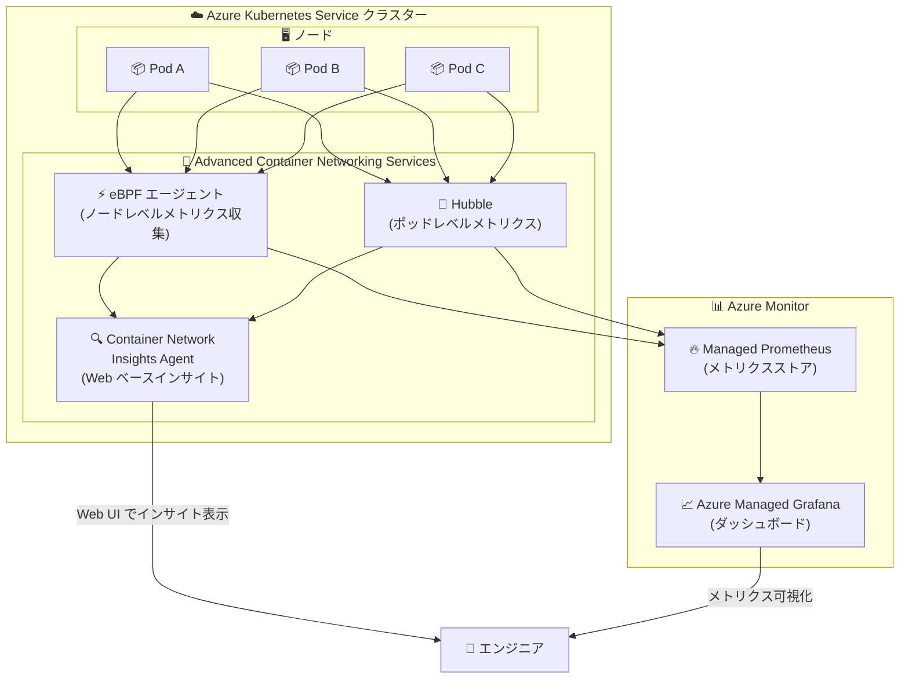

# Azure Kubernetes Service (AKS): Container Network Insights Agent のパブリックプレビュー

**リリース日**: 2026-04-28

**サービス**: Azure Kubernetes Service (AKS)

**機能**: Container Network Insights Agent

**ステータス**: In preview

[このアップデートのインフォグラフィックを見る](https://takech9203.github.io/azure-news-summary/20260428-aks-container-network-insights-agent.html)

## 概要

Azure Kubernetes Service (AKS) において、Container Network Insights Agent のパブリックプレビューが発表された。Kubernetes 環境でのネットワーク問題のトラブルシューティングは、ログやメトリクスが複数のツールに分散しているため、インシデント発生時にエンジニアが手動でシグナルを相関させる必要があり、対応が遅延するという課題があった。Container Network Insights Agent は、こうした課題を解決するための軽量な Web ベースのインサイトツールとして提供される。

本機能は Advanced Container Networking Services (ACNS) の Container Network Observability 機能群の一部として位置づけられる。ACNS は AKS クラスターのネットワーキング機能を強化するサービススイートであり、Container Network Observability、Container Network Security、Container Network Performance の 3 つの主要機能セットを提供している。Container Network Insights Agent は、これらの既存のネットワーク可観測性機能を補完し、ネットワークトラフィックの可視化とトラブルシューティングをより直感的かつ迅速に行えるようにするものである。

ACNS の Container Network Observability は Cilium および非 Cilium の両方のデータプレーンで動作し、eBPF 技術を活用してスケーラビリティとパフォーマンスを向上させている。ノードレベルおよびポッドレベルのメトリクス収集、DNS 解決時間の監視、サービス間通信の追跡など、包括的なネットワーク監視機能を提供しており、Container Network Insights Agent はこれらのデータを統合的に活用してインサイトを提供する。

**アップデート前の課題**

- Kubernetes ネットワークの問題をトラブルシューティングする際、ログやメトリクスが複数のツールに分散しており、インシデント対応時にエンジニアが手動でシグナルを相関させる必要があった
- ネットワーク関連の問題 (パケットドロップ、DNS エラー、接続の遅延など) の根本原因特定に時間がかかり、MTTR (平均復旧時間) が長くなりがちだった
- 既存の Container Network Observability はメトリクスとログの収集・可視化を提供していたが、問題の診断にはPrometheus クエリや Grafana ダッシュボードの操作スキルが必要だった

**アップデート後の改善**

- 軽量な Web ベースのインターフェースにより、ネットワークインサイトをブラウザから直接確認できるようになった
- 分散したネットワークシグナルを自動的に相関させ、問題の特定を迅速化
- ACNS の既存メトリクス (ノードレベル・ポッドレベル) と組み合わせて、より直感的なトラブルシューティング体験を提供

## アーキテクチャ図

AKS クラスター内の各ポッドからのネットワークトラフィックデータは、eBPF エージェント (ノードレベル) と Hubble (ポッドレベル) によって収集される。Container Network Insights Agent はこれらのデータを統合し、Web ベースのインターフェースを通じて直感的なネットワークインサイトを提供する。既存の Managed Prometheus / Grafana によるメトリクス可視化と併用できる。

## サービスアップデートの詳細

### 主要機能

1. **軽量な Web ベースのネットワークインサイト**
   - ブラウザから直接アクセスできる Web UI を通じて、AKS クラスターのネットワーク状態をリアルタイムに確認可能
   - 複数のツールを横断する必要なく、ネットワーク問題の概要を単一のインターフェースで把握できる

2. **ネットワークシグナルの自動相関**
   - 従来は手動で行う必要があった、分散したログ・メトリクスの相関分析を自動化
   - インシデント発生時の問題特定を迅速化し、MTTR の短縮に寄与

3. **ACNS Container Network Observability との統合**
   - 既存のノードレベルメトリクス (パケット転送数、ドロップ数、TCP 接続状態など) を活用
   - ポッドレベルの Hubble メトリクス (DNS クエリ、TCP フラグ、Layer 4/7 フロー) と連携
   - Cilium および非 Cilium データプレーンの両方をサポート

## 技術仕様

| 項目 | 詳細 |
|------|------|
| 機能名 | Container Network Insights Agent |
| ステータス | パブリックプレビュー |
| 前提サービス | Advanced Container Networking Services (ACNS) |
| データプレーン対応 | Cilium / 非 Cilium (両方サポート) |
| CNI 対応 | Azure CNI の全バリアント |
| ノード OS | Linux (ノードレベルメトリクス)、Windows (一部メトリクスをサポート) |
| ポッドレベルメトリクス | Linux のみ |
| Kubernetes バージョン | Cilium: 1.29 以降 |
| 監視統合 | Azure Monitor (Managed Prometheus)、Azure Managed Grafana |

### 収集可能な主要メトリクス

Container Network Insights Agent は、ACNS の Container Network Observability が収集する以下のメトリクスを活用してインサイトを提供する。

**ノードレベルメトリクス (非 Cilium)**:

| メトリクス | 説明 |
|-----------|------|
| `networkobservability_forward_count` | パケット転送数合計 |
| `networkobservability_forward_bytes` | バイト転送数合計 |
| `networkobservability_drop_count` | パケットドロップ数合計 |
| `networkobservability_drop_bytes` | ドロップバイト数合計 |
| `networkobservability_tcp_state` | TCP 状態別アクティブソケット数 |
| `networkobservability_tcp_connection_stats` | TCP 接続統計 |

**ポッドレベルメトリクス (Hubble)**:

| メトリクス | 説明 |
|-----------|------|
| `hubble_dns_queries_total` | DNS リクエスト総数 |
| `hubble_dns_responses_total` | DNS レスポンス総数 |
| `hubble_drop_total` | ポッドレベルのパケットドロップ数 |
| `hubble_tcp_flags_total` | TCP フラグ別パケット数 |
| `hubble_flows_processed_total` | 処理されたネットワークフロー数 |

## メリット

### ビジネス面

- インシデント対応時間の短縮により、サービスのダウンタイムを削減し SLA 維持に貢献
- ネットワーク問題のトラブルシューティングに必要な専門スキルの敷居を下げ、運用チームの生産性を向上
- 事前にネットワークのボトルネックや異常を検知することで、プロアクティブな障害予防が可能

### 技術面

- eBPF 技術を活用した軽量なデータ収集により、クラスターのパフォーマンスへの影響を最小化
- Web ベースのインターフェースにより、追加のツールインストールなしでネットワークインサイトにアクセス可能
- 既存の Managed Prometheus / Grafana エコシステムと共存し、段階的な導入が可能
- Cilium / 非 Cilium の両データプレーンに対応しており、既存のクラスター構成を変更せずに利用可能

## デメリット・制約事項

- パブリックプレビュー段階であり、SLA の対象外。本番環境での利用は慎重に検討する必要がある
- Advanced Container Networking Services (ACNS) の有効化が前提条件であり、ACNS は有料サービスである
- ポッドレベルメトリクスは Linux ノードプールでのみ利用可能であり、Windows ノードプールは非対応
- Cilium データプレーンの場合、DNS メトリクスの取得には Cilium Network Policy (CNP) の設定が必要
- 非 Cilium 環境では、TCP リセットが一時的に表示されない既知の不具合がある (`networkobservability_tcp_flag_counters` メトリクスが Linux で未公開)
- ACNS を非 Cilium データプレーンで使用する場合、Ubuntu 20.04 ノードでは FIPS がサポートされない
- Hubble Relay は Hubble ノードエージェントの一つがダウンした場合にクラッシュする可能性があり、Hubble CLI への影響が生じうる

## ユースケース

### ユースケース 1: インシデント時のネットワーク問題迅速診断

**シナリオ**: マイクロサービスアーキテクチャの AKS クラスターにおいて、特定のサービス間通信でレイテンシが急増したインシデントが発生。従来は Prometheus クエリの作成、Grafana ダッシュボードの確認、kubectl によるログ確認など、複数ツールの横断が必要だった。

**効果**: Container Network Insights Agent の Web UI から、影響を受けているポッド間の通信状態、パケットドロップの発生箇所、DNS 解決時間の異常を一元的に確認でき、根本原因の特定までの時間を大幅に短縮できる。

### ユースケース 2: ネットワークパフォーマンスの継続的モニタリング

**シナリオ**: 大規模な AKS クラスターを運用する SRE チームが、ネットワークパフォーマンスの劣化を事前に検知し、障害を未然に防ぎたい。

**効果**: Container Network Insights Agent により、トラフィックパターンの変化、接続状態の異常、パケットドロップの増加傾向をリアルタイムで把握でき、プロアクティブな対応が可能になる。

## 料金

Container Network Insights Agent は Advanced Container Networking Services (ACNS) の一部として提供される。ACNS は有料サービスであり、詳細な料金体系については公式料金ページを参照のこと。

- [Advanced Container Networking Services 料金ページ](https://azure.microsoft.com/pricing/details/azure-container-networking-services/)

## 関連サービス・機能

- **[Advanced Container Networking Services (ACNS)](https://learn.microsoft.com/azure/aks/advanced-container-networking-services-overview)**: Container Network Insights Agent が属するサービススイート。Container Network Observability、Container Network Security、Container Network Performance を提供
- **[Container Network Observability](https://learn.microsoft.com/azure/aks/container-network-observability-metrics)**: ACNS のネットワーク可観測性機能。ノードレベル・ポッドレベルのメトリクス収集と Hubble メトリクスを提供
- **[Azure Monitor (Managed Prometheus)](https://learn.microsoft.com/azure/azure-monitor/essentials/prometheus-metrics-overview)**: メトリクスの収集・保存に使用される Prometheus 互換のマネージドサービス
- **[Azure Managed Grafana](https://learn.microsoft.com/azure/managed-grafana/overview)**: ネットワークメトリクスの可視化に使用されるマネージド Grafana サービス
- **[Container Insights](https://learn.microsoft.com/azure/azure-monitor/containers/container-insights-overview)**: AKS クラスターのコンテナログ・パフォーマンスデータ収集機能。Container Network Insights Agent と補完関係

## 参考リンク

- [インフォグラフィック](https://takech9203.github.io/azure-news-summary/20260428-aks-container-network-insights-agent.html)
- [公式アップデート情報](https://azure.microsoft.com/updates?id=561020)
- [Advanced Container Networking Services 概要 - Microsoft Learn](https://learn.microsoft.com/azure/aks/advanced-container-networking-services-overview)
- [Container Network Observability メトリクス - Microsoft Learn](https://learn.microsoft.com/azure/aks/container-network-observability-metrics)
- [AKS モニタリング概要 - Microsoft Learn](https://learn.microsoft.com/azure/aks/monitor-aks)
- [Advanced Container Networking Services 料金](https://azure.microsoft.com/pricing/details/azure-container-networking-services/)

## まとめ

Container Network Insights Agent は、AKS 環境におけるネットワークトラブルシューティングの体験を大幅に改善するツールである。従来の課題であった「複数ツールに分散したネットワークシグナルの手動相関」を解消し、軽量な Web ベースインターフェースからネットワークインサイトを直感的に取得できるようにする。

ACNS の Container Network Observability が既に収集しているノードレベル・ポッドレベルのメトリクスを活用するため、既存の監視基盤との統合がスムーズである。AKS 上でマイクロサービスを運用する Solutions Architect やSRE チームにとって、インシデント対応の迅速化とプロアクティブなネットワーク監視を実現するための有力な選択肢となる。

パブリックプレビュー段階であるため、まずは検証環境で機能を評価し、ACNS の有効化を含めた導入計画を検討することが推奨される。既に ACNS を利用している環境では、追加のオーバーヘッドなく本機能を試すことができる。

---

**タグ**: #AKS #Kubernetes #Networking #ContainerNetworkInsights #ACNS #Observability #eBPF #Preview
