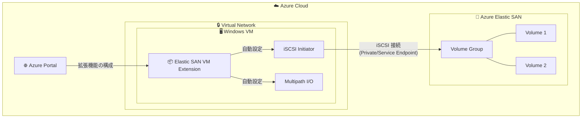

# Azure Elastic SAN: Windows VM 向け VM 拡張機能による接続が一般提供開始

**リリース日**: 2026-04-28

**サービス**: Azure Elastic SAN

**機能**: Windows VM 向け Elastic SAN VM Extension による接続

**ステータス**: Launched (GA)

[このアップデートのインフォグラフィックを見る](https://takech9203.github.io/azure-news-summary/20260428-elastic-san-windows-vm-extension.html)

## 概要

Azure Elastic SAN が Windows 仮想マシン向けの VM 拡張機能 (Elastic SAN VM Extension for Windows) による接続をサポートし、一般提供 (GA) となった。この機能により、Azure Portal から直接 Elastic SAN ボリュームへの接続を構成でき、仮想マシンのデプロイ時にストレージ接続を自動化できる。

従来、Windows VM から Elastic SAN ボリュームへ接続するには、iSCSI イニシエーターの有効化、Multipath I/O (MPIO) のインストールと構成、接続スクリプトの手動実行といった複数の手順を手動で行う必要があった。VM 拡張機能によりこれらの手順が自動化され、Azure Portal 上のワークフローに統合される。

**アップデート前の課題**

- iSCSI サービスの有効化、MPIO のインストール、接続スクリプトの実行など複数の手動手順が必要だった
- VM デプロイ後にストレージ接続を別途構成する必要があり、デプロイの自動化が困難だった
- 大規模環境で複数の VM に対して一貫した接続設定を行うのが煩雑だった

**アップデート後の改善**

- Azure Portal から VM 拡張機能を追加するだけで、iSCSI と MPIO の構成が自動化される
- VM 作成時 (デプロイ時) に Elastic SAN ボリュームへの接続を同時に構成できる
- 既存 VM への接続・切断も Azure Portal のUI から直接操作可能になった
- ARM デプロイスクリプトを使用して大規模な展開にも対応

## アーキテクチャ図



VM 拡張機能が iSCSI と MPIO を自動構成し、Private Endpoint または Service Endpoint 経由で Elastic SAN ボリュームへの接続を確立する。Azure Portal からの操作で全プロセスが完結する。

## サービスアップデートの詳細

### 主要機能

1. **VM 作成時の接続構成**
   - Azure Portal での VM 作成ワークフロー内で「Extensions + applications」ステップから Elastic SAN Extension for Windows を追加可能
   - VM デプロイと同時にストレージ接続が自動確立される

2. **既存 VM への接続・切断**
   - 既にデプロイされた VM に対して、Azure Portal の「Extensions + applications」設定から拡張機能を追加可能
   - Connect (接続) と Disconnect (切断) の操作を UI から選択して実行

3. **自動構成項目**
   - iSCSI サービスの有効化と起動
   - Multipath I/O (MPIO) のインストールと構成
   - 指定された Volume IQN、ターゲットポータルアドレス、セッション数での接続確立

4. **Virtual Machine Scale Sets 対応**
   - スケールセット内の各 VM が自動的に Elastic SAN ボリュームに接続
   - ARM デプロイスクリプトによる大規模展開にも対応

## 技術仕様

| 項目 | 詳細 |
|------|------|
| 接続プロトコル | iSCSI (internet Small Computer Systems Interface) |
| 推奨セッション数 | 32 セッション/ボリューム (最大 IOPS/スループットの達成に必要) |
| Windows iSCSI セッション上限 | 256 セッション/VM |
| 最大接続ボリューム数 (32 セッション時) | 8 ボリューム/VM |
| ボリュームあたり最大 IOPS | 80,000 IOPS |
| ネットワーク接続方式 | Private Endpoint または Service Endpoint |
| 負荷分散ポリシー | Round Robin (推奨) |

## 設定方法

### 前提条件

1. Azure Elastic SAN がデプロイ済みであること
2. ボリュームグループとボリュームが作成・構成済みであること
3. Private Endpoint または Service Endpoint が構成済みであること
4. 接続するボリュームの IQN (iSCSI Qualified Name) を取得済みであること

### Azure CLI (Volume IQN の取得)

```bash
# Volume IQN の取得
az elastic-san volume show \
  --name <volume-name> \
  --resource-group <rg-name> \
  --elastic-san-name <esan-name> \
  --query storageTarget.targetIqn -o tsv
```

### Azure Portal (VM 作成時)

1. Azure Portal にサインイン
2. VM 作成ウィザードで **Basics**、**Disks**、**Networking** を入力
3. **Extensions + applications** ステップに移動
4. **Add** を選択し、Marketplace で **Elastic SAN Extension for Windows** を検索
5. 構成パネルで接続パラメータを入力: **Volume names**、**Target IQNs**、**Target portal addresses**、**Sessions per target**
6. **Review + create** に進み、**Create** を選択

### Azure Portal (既存 VM)

1. Azure Portal で対象の Windows VM に移動
2. **Settings** > **Extensions + applications** を選択
3. **Add** を選択し、**Elastic SAN Extension for Windows** を検索
4. **Configure / Reconfigure** を選択
5. **Connect** または **Disconnect** を選択し、必要なパラメータを入力
6. 構成を適用

## メリット

### ビジネス面

- VM デプロイとストレージ接続を一体化し、運用手順の削減とデプロイ時間の短縮を実現
- 手動設定ミスの削減による運用品質の向上
- 大規模環境での一貫したストレージ接続管理が可能

### 技術面

- iSCSI および MPIO の構成が自動化され、最適なパフォーマンス設定が保証される
- Azure Portal からの宣言的な管理により、Infrastructure as Code との親和性が向上
- VM の再起動なしで接続・切断操作が可能 (再構成時)

## デメリット・制約事項

- Volume IQN は事前に取得・記録しておく必要がある (Azure Portal では直接表示されない)
- 32 セッション/ボリュームの推奨構成では、1 VM あたり最大 8 ボリュームまでの接続に制限される (Windows iSCSI の 256 セッション上限)
- 複数 VM から同一ボリュームへのアクセスにはクラスターマネージャーによる調整が必要
- 拡張機能は以前の接続履歴を保持しないため、複数ボリュームの接続パラメータはすべて明示的に指定する必要がある

## ユースケース

### ユースケース 1: 大規模データベース環境のストレージ統合

**シナリオ**: 複数の SQL Server VM が高 IOPS を必要とするデータベースワークロードを実行しており、個別の Managed Disk では コスト効率が悪い環境

**効果**: Elastic SAN で SAN 全体のパフォーマンスを共有しつつ、VM 拡張機能により各 VM へのストレージ接続を自動化。デプロイの自動化と運用コストの削減を同時に実現。

### ユースケース 2: Virtual Machine Scale Sets でのスケーラブルストレージ

**シナリオ**: スケールセットで動的にスケールアウトする Web アプリケーションバックエンドが共有ストレージを必要とする環境

**効果**: VM 拡張機能により、スケールアウト時に新規 VM が自動的に Elastic SAN ボリュームへ接続。手動介入なしでストレージ接続がプロビジョニングされる。

## 料金

Azure Elastic SAN の料金はベース容量とパフォーマンスの組み合わせで構成される。VM 拡張機能自体には追加料金は発生しない。

詳細な料金情報は公式料金ページを参照: [Azure Elastic SAN の料金](https://azure.microsoft.com/pricing/details/elastic-san/)

## 関連サービス・機能

- **Azure Elastic SAN Capacity Autoscaling**: 容量の自動スケーリング機能 (2026-04-23 に GA)
- **Azure Elastic SAN Backup**: Elastic SAN ボリュームのバックアップ機能 (2026-04-24 に GA)
- **Azure Elastic SAN CRC Protection**: データ整合性保護機能 (2026-04-24 に GA)
- **Azure Container Storage**: Kubernetes ワークロード向けの Elastic SAN 連携
- **Azure Virtual Machine Scale Sets**: スケールセットとの組み合わせで大規模展開に対応
- **Azure Private Link**: Private Endpoint 経由のセキュアなストレージ接続

## 参考リンク

- [インフォグラフィック](https://takech9203.github.io/azure-news-summary/20260428-elastic-san-windows-vm-extension.html)
- [公式アップデート情報](https://azure.microsoft.com/updates?id=560914)
- [Microsoft Learn - Connect to Elastic SAN volume (Windows)](https://learn.microsoft.com/azure/storage/elastic-san/elastic-san-connect-windows)
- [Microsoft Learn - Azure Elastic SAN の概要](https://learn.microsoft.com/azure/storage/elastic-san/elastic-san-introduction)
- [料金ページ](https://azure.microsoft.com/pricing/details/elastic-san/)

## まとめ

Azure Elastic SAN の Windows VM 向け VM 拡張機能の GA により、iSCSI ベースのストレージ接続が Azure Portal から宣言的に管理できるようになった。従来の手動スクリプト実行が不要となり、VM デプロイ時の自動接続や大規模環境での一貫した構成管理が可能になる。Elastic SAN を利用している、または検討している Solutions Architect にとっては、運用の簡素化とデプロイ自動化の観点から積極的に採用を検討すべき機能である。特に、同時期に GA となった容量オートスケーリングやバックアップ機能と組み合わせることで、エンタープライズグレードのストレージ基盤をより少ない運用負荷で構築できる。

---

**タグ**: #Azure #ElasticSAN #Storage #iSCSI #VMExtension #Windows #GA
