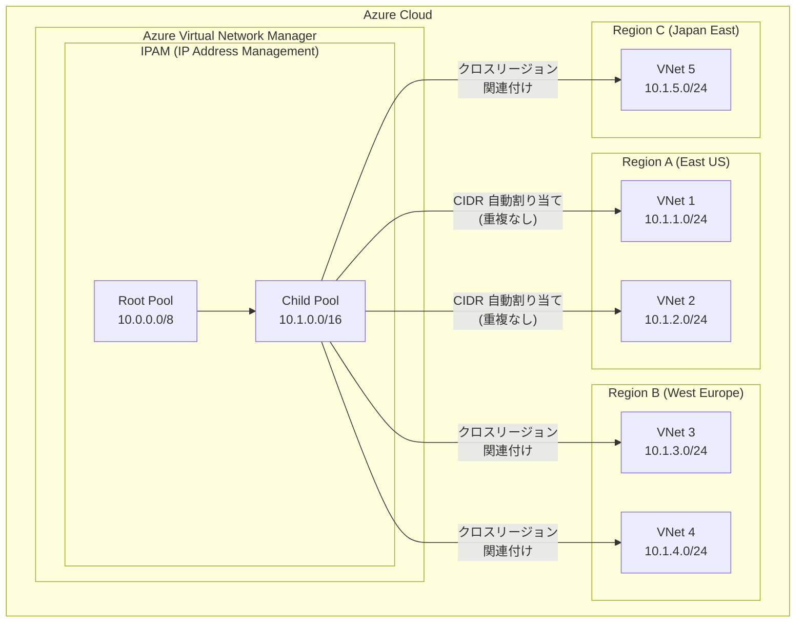

# Azure Virtual Network Manager: クロスリージョン IPAM プール関連付けの一般提供開始

**リリース日**: 2026-04-28

**サービス**: Azure Virtual Network Manager

**機能**: Cross-region IPAM pool association (クロスリージョン IPAM プール関連付け)

**ステータス**: Launched (GA)

[このアップデートのインフォグラフィックを見る](https://takech9203.github.io/azure-news-summary/20260428-vnet-manager-cross-region-ipam.html)

## 概要

Azure Virtual Network Manager の IP Address Management (IPAM) 機能において、クロスリージョン IPAM プール関連付けが一般提供 (GA) となった。本機能により、単一の IPAM プールを複数の Azure リージョンにまたがる仮想ネットワークに関連付けることが可能になり、マルチリージョン環境における IP アドレス空間の一元管理が大幅に簡素化される。

従来、複数リージョンにわたる IP アドレス空間の管理はスケーリングが困難で、設定ミスが発生しやすいという課題があった。各リージョンで個別に IPAM プールを作成・管理する必要があり、リージョン間での IP アドレスの重複を防ぐために手動での調整が求められていた。本アップデートにより、単一のプールからリージョン横断で CIDR を自動割り当てできるようになり、IP アドレスの一貫性とガバナンスが強化される。

本機能は Azure CLI および Azure PowerShell からの操作をサポートしており、異なるリージョンに存在する仮想ネットワークの新規作成時および既存の仮想ネットワークの更新時に、別リージョンの IPAM プールを関連付けることができる。

**アップデート前の課題**

- 複数リージョンにわたる IP アドレス空間の管理がスケーリング困難で、設定ミスが発生しやすかった
- リージョンごとに個別の IPAM プールを作成・管理する必要があり、運用負荷が高かった
- リージョン間での IP アドレス重複を防ぐために手動での調整作業が必要だった
- グローバル環境での IP アドレスガバナンスの一貫性を確保することが困難だった

**アップデート後の改善**

- 単一の IPAM プールを複数リージョンの仮想ネットワークに関連付けることが可能になった
- リージョン間での IP アドレスの重複が自動的に防止されるようになった
- グローバルな IP アドレスガバナンスが単一のプールから実現可能になった
- Azure CLI および Azure PowerShell による簡便な操作で、クロスリージョンの IP 割り当てが可能になった

## アーキテクチャ図



単一の IPAM プール (Child Pool) から複数リージョンの仮想ネットワークに対して、重複のない CIDR が自動的に割り当てられる。IPAM プールが存在するリージョンとは異なるリージョンの仮想ネットワークにも関連付けが可能である。

## サービスアップデートの詳細

### 主要機能

1. **クロスリージョン IPAM プール関連付け**
   - 単一の IPAM プールを、異なるリージョンに存在する複数の仮想ネットワークに関連付け可能
   - IPAM プールが配置されたリージョンに制限されず、任意のリージョンの仮想ネットワークに CIDR を割り当てできる

2. **自動 CIDR 重複防止**
   - プール内で割り当て済みの CIDR と重複しないように、システムが自動的に非重複の CIDR を割り当て
   - リージョンをまたいでもアドレス空間の整合性が維持される

3. **階層型プール構造によるスケーラブルな管理**
   - ルートプール (組織全体の IP アドレスレンジ) から子プール (用途別・部門別) への階層構造をサポート
   - 最大 7 階層までのプール階層を構成可能
   - 各階層レベルで権限委譲が可能

4. **IPv4 / IPv6 デュアルスタック対応**
   - IPv4 および IPv6 の両方のアドレスプールをサポート
   - クロスリージョンでのデュアルスタック環境にも対応

5. **予約 IP アドレスのサポート**
   - 特定の用途のために CIDR を予約 (静的割り当て) 可能
   - Azure でまだ使用されていないアドレスや、IPAM サービスが未対応のリソースのアドレスを管理可能

## 技術仕様

| 項目 | 詳細 |
|------|------|
| 機能名 | Cross-region IPAM pool association |
| ステータス | 一般提供 (GA) |
| 対象サービス | Azure Virtual Network Manager IPAM |
| 対象リソース | 仮想ネットワーク (VNet) |
| サポートするプロトコル | IPv4, IPv6 |
| プール階層の最大深度 | 7 階層 |
| プールタイプ | ルートプール、子プール |
| 操作方法 | Azure CLI, Azure PowerShell |
| 権限モデル | IPAM Pool User ロール + Network Manager Read アクセス |

## 設定方法

### 前提条件

1. Azure Virtual Network Manager インスタンスが作成済みであること
2. IPAM プールが構成済みであること
3. Azure CLI または Azure PowerShell がインストールされていること
4. IPAM Pool User ロールおよび Network Manager Read アクセスが付与されていること

### Azure CLI

```bash
# リージョン B にある IPAM プールを、リージョン A に新規作成する仮想ネットワークに関連付け
ipamAllocation='[{
  "numberOfIpAddresses": 100,
  "id": "/subscriptions/<subscription-id>/resourceGroups/<resource-group-name>/providers/Microsoft.Network/networkManagers/<network-manager-name>/ipamPools/<ipam-pool-name-region-b>"
}]'

az network vnet create \
    --name "<virtual-network-name>" \
    --resource-group "<resource-group-name>" \
    --ipam-allocations "$ipamAllocation" \
    --location "Region A"
```

```bash
# リージョン A にある既存の仮想ネットワークを、リージョン B の IPAM プールに関連付け
ipamAllocation='[{
  "numberOfIpAddresses": 100,
  "id": "/subscriptions/<subscription-id>/resourceGroups/<resource-group-name>/providers/Microsoft.Network/networkManagers/<network-manager-name>/ipamPools/<ipam-pool-name-region-b>"
}]'

az network vnet update \
    --name "<virtual-network-name>" \
    --resource-group "<resource-group-name>" \
    --ipam-allocations "$ipamAllocation" \
    --location "Region A"
```

### Azure Portal

Azure Portal での IPAM プール管理手順:

1. Azure Portal で **Azure Virtual Network Manager** インスタンスに移動
2. 左メニューから **IP address management (IPAM)** を選択
3. ルートプールまたは子プールを選択・作成
4. 仮想ネットワークの作成時または更新時に、IPAM プールからの CIDR 割り当てを指定
5. 異なるリージョンの仮想ネットワークに対しても、同一プールからの割り当てが可能

## メリット

### ビジネス面

- グローバルに分散した拠点・リージョンの IP アドレス管理を単一のプールで一元化できるため、運用コストが削減される
- IP アドレス重複による障害リスクが低減し、サービス可用性が向上する
- 権限委譲機能により、中央のネットワークチームと各部門・チーム間での責任分担が明確化される
- マルチリージョン展開時の IP 計画・割り当て作業が迅速化し、デプロイサイクルが短縮される

### 技術面

- リージョン間で一貫した CIDR 割り当てが自動的に行われ、手動での IP アドレス管理スプレッドシートが不要になる
- 階層型プール構造により、大規模な IP アドレス空間を論理的に整理・管理できる
- オンプレミスおよびマルチクラウド環境との IP アドレス重複を防止できる
- プール内の IP 使用率・割り当て状況のモニタリングにより、キャパシティプランニングが容易になる

## デメリット・制約事項

- Azure CLI および Azure PowerShell からの操作がサポートされているが、Azure Portal からのクロスリージョン関連付けの操作性については公式ドキュメントで確認が必要
- IPAM Pool User ロール単体では利用が不十分な場合があり、Network Manager Read アクセスも併せて付与する必要がある
- プール階層の最大深度は 7 階層に制限されている
- IPAM サービスが未対応のリソースタイプについては、静的 CIDR の手動割り当てで対応する必要がある

## ユースケース

### ユースケース 1: グローバル企業のマルチリージョン IP アドレス統合管理

**シナリオ**: グローバル企業が北米、ヨーロッパ、アジアの各リージョンに仮想ネットワークを展開しており、IP アドレス空間の重複防止と一元管理が求められている。

**実装例**:

```bash
# ルートプール配下にグローバル子プールを作成し、各リージョンの VNet に割り当て

# 東日本リージョンの VNet にグローバルプールから CIDR を割り当て
ipamAllocation='[{
  "numberOfIpAddresses": 256,
  "id": "/subscriptions/<sub-id>/resourceGroups/rg-network/providers/Microsoft.Network/networkManagers/nm-global/ipamPools/pool-global"
}]'

az network vnet create \
    --name "vnet-japan-east-prod" \
    --resource-group "rg-japan-east" \
    --ipam-allocations "$ipamAllocation" \
    --location "japaneast"

# 西ヨーロッパリージョンの VNet にも同じプールから CIDR を割り当て
az network vnet create \
    --name "vnet-westeurope-prod" \
    --resource-group "rg-westeurope" \
    --ipam-allocations "$ipamAllocation" \
    --location "westeurope"
```

**効果**: 単一のグローバルプールから各リージョンの仮想ネットワークに非重複の CIDR が自動割り当てされ、グローバルな IP アドレスガバナンスが実現される。IP アドレスの重複による接続障害のリスクが排除される。

### ユースケース 2: ハブ・スポーク型ネットワークのマルチリージョン展開

**シナリオ**: ハブ・スポーク型ネットワークアーキテクチャを複数リージョンに展開する際、全リージョンのスポーク VNet に対して一貫した IP アドレス計画を適用したい。

**効果**: 中央の IPAM プールから全リージョンのスポーク VNet に CIDR を割り当てることで、ハブ VNet のルーティング構成と整合性のある IP アドレス計画が自動的に維持される。

### ユースケース 3: DR (災害復旧) 環境の IP アドレス事前計画

**シナリオ**: プライマリリージョンと DR リージョンにわたる仮想ネットワーク環境で、IP アドレス空間の重複を避けつつ、DR リージョンへのフェイルオーバーに備えた IP 割り当てを事前に計画したい。

**効果**: 単一の IPAM プールからプライマリ・DR 両リージョンの VNet に CIDR を割り当てることで、フェイルオーバー時の IP 衝突を防止し、DR 環境の迅速な立ち上げを可能にする。予約 IP 機能を使用して DR 用の CIDR を事前に確保しておくこともできる。

## 料金

Azure Virtual Network Manager の料金体系は仮想ネットワーク単位の課金モデルに移行中である。IPAM 機能は Azure Virtual Network Manager の一部として提供される。

詳細な料金については、以下の公式料金ページを参照のこと。

- [Azure Virtual Network Manager 料金ページ](https://azure.microsoft.com/pricing/details/virtual-network-manager/)
- [Azure 料金計算ツール](https://azure.microsoft.com/pricing/calculator/)

**注意**: 2025 年 2 月 6 日以前に作成された Virtual Network Manager インスタンスはサブスクリプション単位の課金モデルが適用されている。仮想ネットワーク単位の課金モデルへの切り替えは Azure Feature Exposure Control (AFEC) の「Network manager billing by virtual networks」機能を登録することで可能。サブスクリプション単位の課金は 2028 年 2 月 6 日に完全廃止予定。

## 利用可能リージョン

Azure Virtual Network Manager が利用可能な全リージョンで使用可能。詳細は [Azure のリージョン別利用可能製品](https://azure.microsoft.com/explore/global-infrastructure/products-by-region/table) にて「Azure Virtual Network Manager」を検索して確認のこと。

## 関連サービス・機能

- **Azure Virtual Network Manager**: IPAM 機能を含む仮想ネットワークの一元管理サービス。接続構成、セキュリティ管理構成、ルーティング構成などの機能を提供
- **Azure Virtual Network (VNet)**: IPAM プールの割り当て対象となる Azure の仮想ネットワークリソース
- **Azure Network Manager Connectivity Configuration**: 仮想ネットワーク間のメッシュまたはハブ・スポーク型接続を構成する機能。IPAM と組み合わせることで、IP 計画と接続構成の両方を一元管理可能
- **Azure Network Manager Security Admin Rules**: IPAM で管理されるネットワークに対して、グローバルなセキュリティルールを適用する機能
- **Azure Policy**: ネットワークグループの動的メンバーシップを定義し、IPAM プールの適用範囲を自動的に管理する機能
- **Network Watcher**: ネットワークの監視・診断ツール。IPAM で管理されるネットワーク環境のトラブルシューティングに活用可能

## 参考リンク

- [インフォグラフィック](https://takech9203.github.io/azure-news-summary/20260428-vnet-manager-cross-region-ipam.html)
- [公式アップデート情報](https://azure.microsoft.com/updates?id=561067)
- [Microsoft Learn - IPAM in Azure Virtual Network Manager](https://learn.microsoft.com/azure/virtual-network-manager/concept-ip-address-management)
- [Microsoft Learn - Azure Virtual Network Manager 概要](https://learn.microsoft.com/azure/virtual-network-manager/overview)
- [料金ページ - Azure Virtual Network Manager](https://azure.microsoft.com/pricing/details/virtual-network-manager/)

## まとめ

Azure Virtual Network Manager のクロスリージョン IPAM プール関連付けが一般提供 (GA) となり、単一の IPAM プールを複数の Azure リージョンにまたがる仮想ネットワークに関連付けることが可能になった。これにより、マルチリージョン環境における IP アドレス空間の一元管理が大幅に簡素化され、IP アドレスの重複防止と一貫したガバナンスが実現される。グローバル企業のマルチリージョン展開、ハブ・スポーク型ネットワーク、DR 環境の IP 計画など、広範なユースケースに対応する。Azure CLI および Azure PowerShell を使用して、異なるリージョンの仮想ネットワークに対するプール関連付けを簡便に構成できる。マルチリージョンのネットワーク環境を運用する Solutions Architect は、本機能を活用した IP アドレス管理の一元化を検討することを推奨する。

---

**タグ**: #Azure #VirtualNetworkManager #IPAM #ネットワーク #IPアドレス管理 #クロスリージョン #GA
