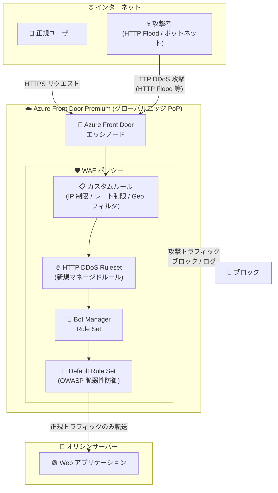

# Azure WAF on Azure Front Door Premium: Microsoft HTTP DDoS Ruleset のパブリックプレビュー

**リリース日**: 2026-04-28

**サービス**: Azure Web Application Firewall (WAF) / Azure Front Door Premium

**機能**: Microsoft HTTP DDoS Ruleset

**ステータス**: In preview

[このアップデートのインフォグラフィックを見る](https://takech9203.github.io/azure-news-summary/20260428-waf-http-ddos-ruleset-front-door.html)

## 概要

Azure Front Door Premium 上の Azure Web Application Firewall (WAF) において、新たに Microsoft HTTP DDoS Ruleset のパブリックプレビューが発表された。HTTP レイヤー (L7) の DDoS 攻撃はアプリケーションのダウンタイムを引き起こす主要な原因の一つであり、従来の静的な制御手法では進化するボットネットに十分に対応できないケースが多かった。本ルールセットは、こうした課題に対応するために設計された新しいマネージドルールセットである。

Azure WAF はこれまでも、カスタムルールによるレート制限、IP アドレスのブロック、Geo フィルタリング、Bot 保護マネージドルールセットなど、複数の防御メカニズムを提供してきた。今回の HTTP DDoS Ruleset は、これらの既存機能を補完し、HTTP フラッド攻撃やキャッシュバイパス攻撃、ボットネットによる分散型攻撃などの L7 DDoS 攻撃に対して、より効果的かつ動的な防御を提供するマネージドルールセットとして位置づけられる。

本機能は Azure Front Door Premium ティアでのみ利用可能であり、WAF ポリシーに HTTP DDoS Ruleset を追加することで有効化される。Azure Front Door のグローバルに分散された 192 以上のエッジ PoP (Point of Presence) 上で動作し、攻撃トラフィックをネットワークエッジで検出・緩和することで、オリジンサーバーへの影響を最小限に抑える。

**アップデート前の課題**

- HTTP レイヤー (L7) の DDoS 攻撃はアプリケーションダウンタイムの主要原因であるにもかかわらず、従来の静的な制御手法では進化するボットネットに対応しきれなかった
- カスタムルールによるレート制限や IP ブロックは手動での設定・調整が必要であり、新しい攻撃パターンへの迅速な対応が困難だった
- 既存のマネージドルールセット (Default Rule Set、Bot Manager Rule Set) は一般的な Web 脆弱性やボットに対する防御を提供するが、HTTP DDoS 攻撃に特化した防御ルールセットは存在しなかった
- 大規模な HTTP フラッド攻撃やキャッシュバイパス攻撃に対して、アプリケーション層での包括的な自動防御が不足していた

**アップデート後の改善**

- HTTP DDoS 攻撃に特化したマネージドルールセットにより、Azure が管理・更新するルールで自動的に攻撃を検出・緩和できるようになった
- 進化するボットネットの攻撃パターンに対して、Microsoft が継続的にルールを更新することで動的な防御を実現
- 既存の Default Rule Set や Bot Manager Rule Set と組み合わせることで、多層的な防御戦略を構築可能になった
- Azure Front Door のグローバルエッジネットワーク上で攻撃を遮断するため、オリジンサーバーへの負荷を軽減

## アーキテクチャ図

Azure Front Door Premium のエッジノードに到達したリクエストは WAF ポリシーのルールチェーンを通過する。カスタムルール、HTTP DDoS Ruleset、Bot Manager Rule Set、Default Rule Set の順に評価され、攻撃トラフィックはエッジで遮断される。正規のトラフィックのみがオリジンサーバーに転送される。

## サービスアップデートの詳細

### 主要機能

1. **HTTP DDoS 攻撃に特化したマネージドルールセット**
   - Microsoft が管理・更新する HTTP DDoS 攻撃防御用のルールセットであり、HTTP フラッド攻撃やボットネットによる分散型攻撃パターンを検出・緩和する
   - Azure が攻撃シグネチャを継続的に更新するため、新たな攻撃手法への対応が自動化される

2. **既存 WAF 防御機能との多層的な統合**
   - Default Rule Set (OWASP Top 10 等の Web 脆弱性防御)、Bot Manager Rule Set (悪意のあるボット防御)、カスタムルール (レート制限、IP 制限、Geo フィルタリング) と組み合わせた多層防御を実現
   - WAF ポリシー内で他のルールセットと並行して適用可能

3. **グローバルエッジでの攻撃緩和**
   - Azure Front Door の 192 以上のエッジ PoP 上で動作し、攻撃トラフィックを攻撃元に近いネットワークエッジで遮断
   - オリジンサーバーに到達する前に攻撃を緩和し、バックエンドの可用性とパフォーマンスを保護

4. **WAF モードによる柔軟な運用**
   - 検出モード (Detection): ルールに一致するリクエストをログに記録するのみで、トラフィックはブロックしない。本番導入前のテストに活用可能
   - 防止モード (Prevention): ルールに一致するリクエストに対して指定されたアクション (ブロック、リダイレクト等) を実行

## 技術仕様

| 項目 | 詳細 |
|------|------|
| サービスティア | Azure Front Door Premium (Premium ティアのみ) |
| ルールセット種別 | マネージドルールセット (Microsoft 管理) |
| 対象レイヤー | L7 (HTTP/HTTPS アプリケーション層) |
| ステータス | パブリックプレビュー |
| 対応プロトコル | HTTP / HTTPS |
| デプロイ範囲 | グローバル (Azure Front Door の全エッジ PoP) |
| WAF モード | 検出 (Detection) / 防止 (Prevention) |
| アクション種別 | Allow / Block / Log / Redirect |

## 設定方法

### 前提条件

1. Azure Front Door Premium プロファイルが作成されていること
2. Azure Front Door Premium に関連付けられた WAF ポリシーが存在すること
3. Azure サブスクリプションがアクティブであること

### Azure Portal

1. Azure Portal で WAF ポリシーを開く
2. **マネージドルール** セクションに移動する
3. **ルールセットの追加** から Microsoft HTTP DDoS Ruleset を選択する
4. 必要に応じて個別ルールの有効/無効やアクション (ブロック、ログ等) を設定する
5. WAF ポリシーのモードを **検出** (テスト時) または **防止** (本番時) に設定する
6. WAF ポリシーを Azure Front Door Premium のドメインに関連付ける

**注意**: パブリックプレビュー段階のため、具体的な設定手順やルールの詳細については、最新の Microsoft Learn ドキュメントを参照してください。

## メリット

### ビジネス面

- HTTP DDoS 攻撃によるアプリケーションダウンタイムのリスクを低減し、ビジネス継続性を強化
- マネージドルールセットにより、セキュリティチームの手動でのルール作成・メンテナンス負荷を軽減
- Azure Front Door のグローバルエッジで攻撃を遮断するため、オリジンインフラのスケーリングコストを抑制
- コンプライアンス要件 (可用性・セキュリティ) への対応を支援

### 技術面

- Microsoft が攻撃シグネチャを継続的に更新するため、新たな攻撃パターンへの対応が自動化される
- 既存の WAF マネージドルールセット (Default Rule Set、Bot Manager Rule Set) と組み合わせた多層防御アーキテクチャを構築可能
- Azure Front Door のグローバル分散アーキテクチャにより、大規模な DDoS 攻撃の吸収と緩和が可能
- 検出モードによるドライランで、誤検出 (False Positive) の評価を本番影響なしで実施可能

## デメリット・制約事項

- **パブリックプレビュー**: 本機能はプレビュー段階であり、SLA の対象外。本番ワークロードへの適用は慎重に検討する必要がある
- **Azure Front Door Premium のみ**: Standard ティアでは利用できない。Premium ティアへのアップグレードが必要
- **誤検出のリスク**: マネージドルールセットの特性上、正規トラフィックが誤ってブロックされる可能性がある。導入初期は検出モードで十分なテストを行うことが推奨される
- **プレビュー段階の機能制限**: ルールの詳細やカスタマイズ可能な範囲がプレビュー期間中に変更される可能性がある

## ユースケース

### ユースケース 1: EC サイトの大規模セール時の DDoS 防御

**シナリオ**: 大規模なオンラインセールイベント時に、競合他社やボットネットによる HTTP フラッド攻撃でサイトがダウンするリスクがある。既存のレート制限ルールだけでは、分散型の低頻度攻撃を検出できない。

**効果**: HTTP DDoS Ruleset を WAF ポリシーに追加することで、Microsoft が管理する攻撃シグネチャに基づいた自動防御が有効化され、既存のレート制限ルールでは検出困難な攻撃パターンにも対応可能になる。

### ユースケース 2: 金融サービスの API エンドポイント保護

**シナリオ**: 金融機関が Azure Front Door Premium 経由で公開する API エンドポイントが、HTTP レイヤーの DDoS 攻撃を受けてレスポンス遅延が発生し、取引処理に影響が出ている。

**効果**: HTTP DDoS Ruleset と Bot Manager Rule Set を組み合わせることで、悪意のあるボットによる API 乱用と HTTP DDoS 攻撃の両方を防御し、API の可用性とパフォーマンスを維持する。

### ユースケース 3: グローバル展開の SaaS アプリケーション防御

**シナリオ**: 複数リージョンに展開された SaaS アプリケーションが、地理的に分散したボットネットからの HTTP DDoS 攻撃を受けている。攻撃元 IP が頻繁に変わるため、IP ベースのブロックでは対応しきれない。

**効果**: Azure Front Door の 192 以上のグローバル PoP で HTTP DDoS Ruleset が動作するため、攻撃元に最も近いエッジで攻撃を遮断し、オリジンサーバーへの影響を最小限に抑える。IP に依存しないルールベースの検出により、IP ローテーション型攻撃にも対応可能。

## 料金

Azure Web Application Firewall on Azure Front Door Premium の料金体系に基づく。HTTP DDoS Ruleset のプレビュー期間中の追加料金については公式情報を確認してください。

Azure Front Door Premium WAF の一般的な料金構成:

| 項目 | 概要 |
|------|------|
| WAF ポリシー | Azure Front Door Premium プロファイルに含まれる |
| マネージドルールセット | WAF ポリシーの一部として提供される |
| リクエスト処理 | WAF で処理されるリクエスト数に基づく従量課金 |

詳細な料金については [Azure WAF 料金ページ](https://azure.microsoft.com/pricing/details/web-application-firewall/) を参照してください。

## 利用可能リージョン

Azure Front Door はグローバルサービスであり、192 以上のエッジ PoP で動作する。HTTP DDoS Ruleset は Azure Front Door Premium が利用可能なすべてのリージョンで使用可能。

## 関連サービス・機能

- **Azure Front Door Premium**: HTTP DDoS Ruleset の実行基盤となるグローバル CDN/リバースプロキシサービス。Premium ティアで WAF のフル機能が利用可能
- **Azure DDoS Protection**: ネットワーク層 (L3/L4) の DDoS 防御サービス。HTTP DDoS Ruleset はアプリケーション層 (L7) を保護し、Azure DDoS Protection と組み合わせることで全レイヤーの防御を実現
- **Azure WAF Default Rule Set**: OWASP Top 10 などの一般的な Web 脆弱性に対するマネージドルールセット。HTTP DDoS Ruleset と併用して多層防御を構築
- **Azure WAF Bot Manager Rule Set**: 既知の悪意あるボットに対する防御ルールセット。HTTP DDoS Ruleset と補完的に動作
- **Azure Monitor / Log Analytics**: WAF ログの収集・分析基盤。HTTP DDoS Ruleset のルール一致状況やブロックされたリクエストの監視に活用

## 参考リンク

- [インフォグラフィック](https://takech9203.github.io/azure-news-summary/20260428-waf-http-ddos-ruleset-front-door.html)
- [公式アップデート情報](https://azure.microsoft.com/updates?id=561148)
- [Microsoft Learn - Azure Web Application Firewall on Azure Front Door 概要](https://learn.microsoft.com/azure/web-application-firewall/afds/afds-overview)
- [Microsoft Learn - Application DDoS Protection](https://learn.microsoft.com/azure/web-application-firewall/shared/application-ddos-protection)
- [Microsoft Learn - DDoS protection on Azure Front Door](https://learn.microsoft.com/azure/frontdoor/front-door-ddos)
- [料金ページ - Azure Web Application Firewall](https://azure.microsoft.com/pricing/details/web-application-firewall/)

## まとめ

Azure Front Door Premium 上の Azure WAF に新たに追加された Microsoft HTTP DDoS Ruleset は、HTTP レイヤーの DDoS 攻撃に特化したマネージドルールセットであり、従来の静的な制御手法では対応困難だった進化するボットネットの攻撃パターンに対して、Microsoft が管理・更新するルールによる動的な防御を提供する。既存の Default Rule Set、Bot Manager Rule Set、カスタムルールと組み合わせることで多層的な防御戦略を構築できる。パブリックプレビュー段階であるため、本番導入前に検出モードでの十分なテストと誤検出の評価を行うことが推奨される。Azure Front Door Premium を利用している Solutions Architect は、まず検出モードで本ルールセットを有効化し、WAF ログを分析してルールの有効性と誤検出の状況を評価することから始めるとよい。

---

**タグ**: #Azure #WAF #DDoS #AzureFrontDoor #セキュリティ #ネットワーク #パブリックプレビュー #マネージドルール
