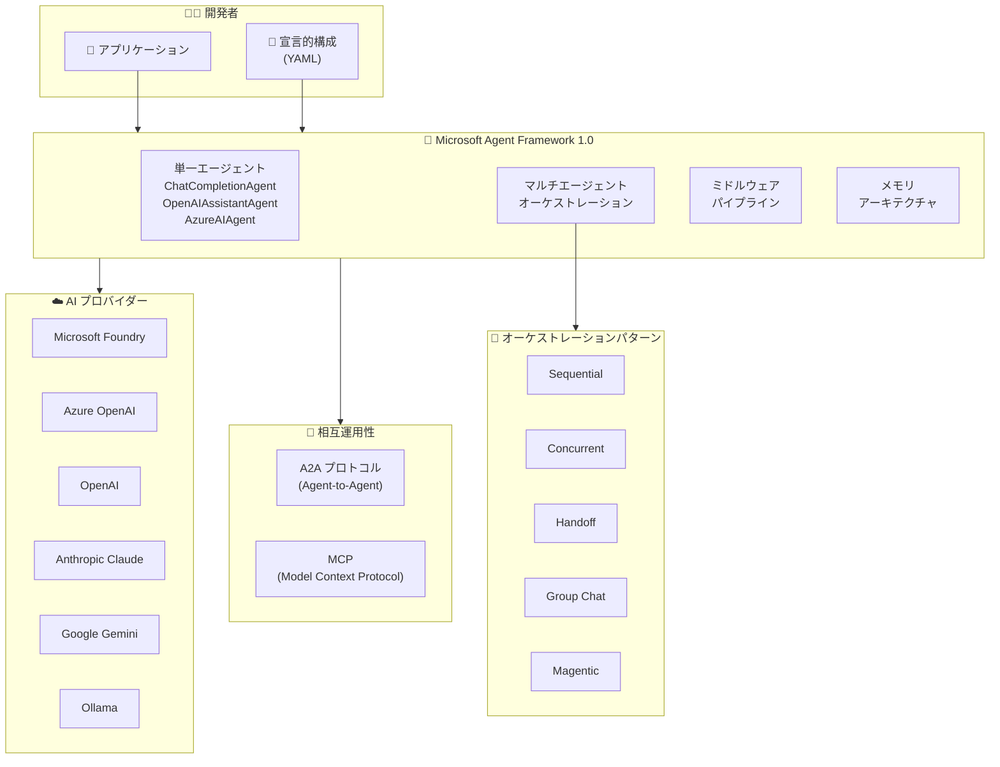

# Microsoft Agent Framework: バージョン 1.0 GA (一般提供開始)

**リリース日**: 2026-04-29

**サービス**: Microsoft Agent Framework (Semantic Kernel Agent Framework)

**機能**: Agent Framework 1.0 -- 安定 API とマルチエージェントオーケストレーション

**ステータス**: Launched (GA)

[このアップデートのインフォグラフィックを見る](https://takech9203.github.io/azure-news-summary/20260429-agent-framework-1-0-ga.html)

## 概要

Microsoft Agent Framework がバージョン 1.0 に到達し、.NET と Python の両プラットフォームで一般提供 (GA) が開始された。本リリースは「production-ready release: stable APIs, and a commitment to long-term support (本番運用に適したリリース: 安定した API と長期サポートへのコミットメント)」として位置づけられている。

Agent Framework 1.0 は、Semantic Kernel エコシステム上に構築された AI エージェント開発プラットフォームであり、単一エージェントの構築からマルチエージェントオーケストレーションまでをカバーする。Microsoft Foundry、Azure OpenAI、OpenAI、Anthropic Claude、Amazon Bedrock、Google Gemini、Ollama などの主要 AI プロバイダーへのファーストパーティコネクタを備え、A2A (Agent-to-Agent) プロトコルおよび MCP (Model Context Protocol) によるクロスランタイム相互運用性を実現する。

**アップデート前の課題**

- Agent Framework はプレビュー段階であり、API の安定性が保証されていなかったため、本番環境への導入にリスクがあった
- マルチエージェントオーケストレーション機能は実験的ステージにあり、仕様変更の可能性があった
- 異なるフレームワーク間でのエージェント連携に標準化されたプロトコルがなかった
- エージェントの動作をカスタマイズするにはプロンプトの直接変更が必要だった

**アップデート後の改善**

- 安定した API と長期サポート (LTS) のコミットメントにより、本番環境での採用が可能になった
- Sequential、Concurrent、Handoff、Group Chat、Magentic の 5 つのオーケストレーションパターンが統一インターフェースで利用可能になった
- A2A プロトコルによるクロスランタイムエージェント連携と MCP による外部ツール動的検出が実現した
- ミドルウェアパイプラインにより、プロンプトを変更せずにコンテンツ安全性、ログ記録、コンプライアンスポリシーを適用できるようになった

## アーキテクチャ図



Agent Framework 1.0 は、開発者がアプリケーションコードまたは宣言的 YAML 構成からエージェントを定義し、複数の AI プロバイダーと連携しながらマルチエージェントオーケストレーションを実行する統合プラットフォームを提供する。A2A と MCP によりフレームワーク外部との相互運用も可能になっている。

## サービスアップデートの詳細

### 主要機能

1. **マルチプロバイダーモデルサポート**
   - Microsoft Foundry、Azure OpenAI、OpenAI、Anthropic Claude、Amazon Bedrock、Google Gemini、Ollama へのファーストパーティコネクタを提供
   - プロバイダーの差異を抽象化し、統一されたコネクタアーキテクチャでシームレスな統合を実現
   - 異なるプロバイダーのモデルを組み合わせたマルチエージェントワークフローの構築が可能

2. **マルチエージェントオーケストレーション**
   - **Sequential**: エージェント間で結果を順次受け渡すパイプライン処理
   - **Concurrent**: タスクを全エージェントに同時配信し、結果を独立に収集する並列処理
   - **Handoff**: コンテキストやルールに基づいてエージェント間で動的に制御を移譲
   - **Group Chat**: グループマネージャーの調整のもと、全エージェントがグループ会話に参加
   - **Magentic**: MagenticOne に着想を得た汎用マルチエージェント協調パターン
   - 全パターンでストリーミング、チェックポイント、Human-in-the-loop 承認、一時停止/再開に対応

3. **ミドルウェアパイプライン**
   - エージェントの実行の各段階でインターセプト、変換、拡張が可能
   - コンテンツ安全性、ログ記録、コンプライアンスポリシーをプロンプト変更なしで適用
   - プラグイン・関数呼び出しによる外部サービスとの動的連携

4. **メモリアーキテクチャ**
   - 会話履歴、永続キーバリューステート、ベクトルベース検索をサポートするプラグイン可能なメモリアーキテクチャ
   - バックエンドオプション: Foundry Agent Service、Mem0、Redis、Neo4j、またはカスタムストア

5. **クロスランタイム相互運用性**
   - A2A (Agent-to-Agent) プロトコルによるフレームワーク間のエージェント連携
   - MCP (Model Context Protocol) による MCP 準拠サーバー上の外部ツールの動的検出と呼び出し

6. **宣言的構成**
   - エージェントの指示、ツール、メモリ構成、オーケストレーショントポロジーをバージョン管理された YAML ファイルで定義
   - 単一の API 呼び出しでロードおよび実行が可能

7. **グラフベースワークフローエンジン**
   - エージェントと関数を決定論的で再現可能なプロセスに合成
   - 分岐、並列実行、結果収束に対応
   - チェックポイントによる中断からの復旧が可能

## 技術仕様

| 項目 | 詳細 |
|------|------|
| バージョン | 1.0 (GA) |
| 対応プラットフォーム | .NET、Python |
| ライセンス | MIT (100% オープンソース) |
| エージェント型 | ChatCompletionAgent、OpenAIAssistantAgent、AzureAIAgent、OpenAIResponsesAgent、CopilotStudioAgent |
| オーケストレーションパターン | Sequential、Concurrent、Handoff、Group Chat、Magentic |
| AI プロバイダー | Microsoft Foundry、Azure OpenAI、OpenAI、Anthropic Claude、Amazon Bedrock、Google Gemini、Ollama |
| 相互運用プロトコル | A2A (Agent-to-Agent)、MCP (Model Context Protocol) |
| メモリバックエンド | Foundry Agent Service、Mem0、Redis、Neo4j、カスタムストア |

## 設定方法

### 前提条件

1. .NET SDK または Python 3.x 環境
2. 使用する AI プロバイダーのアカウントと API キー (Azure OpenAI、OpenAI など)

### Python

```bash
# Agent Framework のインストール
pip install semantic-kernel
```

```python
from semantic_kernel.agents import ChatCompletionAgent
from semantic_kernel.agents.orchestration import SequentialOrchestration
from semantic_kernel.agents.runtime import InProcessRuntime

# オーケストレーションの構成
orchestration = SequentialOrchestration(members=[agent_a, agent_b])

# ランタイムの起動
runtime = InProcessRuntime()
runtime.start()

# オーケストレーションの実行
result = await orchestration.invoke(task="Your task here", runtime=runtime)
final_output = await result.get()

await runtime.stop_when_idle()
```

### .NET

```bash
# NuGet パッケージの追加
dotnet add package Microsoft.SemanticKernel
dotnet add package Microsoft.SemanticKernel.Agents.Core
dotnet add package Microsoft.SemanticKernel.Agents.Orchestration
dotnet add package Microsoft.SemanticKernel.Agents.Runtime.InProcess
```

```csharp
// オーケストレーションの構成
SequentialOrchestration orchestration = new(agentA, agentB)
{
    LoggerFactory = this.LoggerFactory
};

// ランタイムの起動
InProcessRuntime runtime = new();
await runtime.StartAsync();

// オーケストレーションの実行
OrchestrationResult<string> result = await orchestration.InvokeAsync(task, runtime);
string text = await result.GetValueAsync();

await runtime.RunUntilIdleAsync();
```

## メリット

### ビジネス面

- 安定した API と長期サポートにより、エンタープライズ環境での採用リスクが大幅に低減される
- マルチプロバイダーサポートにより、特定の AI プロバイダーへのベンダーロックインを回避できる
- オープンソース (MIT ライセンス) のため、ライセンスコストが不要で、自由なカスタマイズが可能
- 宣言的構成によりエージェント定義をバージョン管理でき、チーム開発での再現性が向上する

### 技術面

- 統一インターフェースにより、オーケストレーションパターンの切り替えが API の学び直しなしで可能
- ミドルウェアパイプラインにより、横断的関心事 (セキュリティ、ログ、コンプライアンス) をエージェントロジックから分離できる
- A2A / MCP プロトコルにより、異なるフレームワーク間でのエージェント連携が標準化される
- チェックポイントと一時停止/再開により、長時間実行ワークフローの信頼性が向上する

## デメリット・制約事項

- Java SDK ではエージェントオーケストレーション機能がまだ利用できない
- 一部の機能 (DevUI、Foundry Hosted Agent Integration、Skills、GitHub Copilot SDK / Claude Code SDK 統合、Agent Harness) はプレビュー段階のまま
- Semantic Kernel や AutoGen からの移行にはマイグレーション作業が必要 (マイグレーションアシスタントが提供されている)

## ユースケース

### ユースケース 1: マルチステップ文書処理パイプライン

**シナリオ**: 契約書の分析において、文書読取エージェント、法的リスク分析エージェント、要約生成エージェントを Sequential オーケストレーションで連携させ、段階的に処理する。

**効果**: 各エージェントが専門領域に特化することで分析精度が向上し、Human-in-the-loop 承認によりリスク判断の最終確認が可能になる。

### ユースケース 2: カスタマーサポートの動的エスカレーション

**シナリオ**: 初期対応エージェント、技術サポートエージェント、上級サポートエージェントを Handoff パターンで構成し、問い合わせ内容に応じて動的にエスカレーションする。

**効果**: コンテキストを保持したままエージェント間で制御が移譲されるため、顧客体験を損なわずに適切な専門家への引き継ぎが実現する。

### ユースケース 3: 並列データ分析と統合レポート

**シナリオ**: 売上データ分析エージェント、市場トレンド分析エージェント、競合分析エージェントを Concurrent オーケストレーションで同時実行し、結果を統合する。

**効果**: 各分析を並列実行することで処理時間を短縮し、複数の観点からの分析結果を統合した総合レポートを生成できる。

## 料金

Agent Framework 自体はオープンソース (MIT ライセンス) であり、フレームワークの利用に直接的な料金は発生しない。実際のコストは、使用する AI プロバイダー (Azure OpenAI、OpenAI など) の API 利用料金、およびメモリバックエンド (Redis、Neo4j など) のインフラストラクチャコストに依存する。

詳細は各プロバイダーの料金ページを参照:
- [Azure OpenAI 料金](https://azure.microsoft.com/pricing/details/cognitive-services/openai-service/)
- [Microsoft Foundry 料金](https://azure.microsoft.com/pricing/details/azure-ai-foundry/)

## 関連サービス・機能

- **Microsoft Foundry**: Agent Framework のファーストパーティコネクタとして統合され、Foundry Agent Service をメモリバックエンドとしても利用可能
- **Azure OpenAI Service**: OpenAIAssistantAgent および ChatCompletionAgent を通じて直接統合される主要 AI プロバイダー
- **Semantic Kernel**: Agent Framework の基盤となるコアフレームワーク。プラグイン、関数呼び出し、テンプレーティング機能を共有
- **Azure AI Agent Service**: AzureAIAgent 型によるマネージドエージェントサービスとの統合
- **Copilot Studio**: CopilotStudioAgent 型による Microsoft Copilot Studio エージェントとの連携

## 参考リンク

- [インフォグラフィック](https://takech9203.github.io/azure-news-summary/20260429-agent-framework-1-0-ga.html)
- [公式アップデート情報](https://azure.microsoft.com/updates?id=560982)
- [Microsoft Agent Framework Version 1.0 (Semantic Kernel Blog)](https://devblogs.microsoft.com/semantic-kernel/microsoft-agent-framework-version-1-0/)
- [Agent Framework ドキュメント (Microsoft Learn)](https://learn.microsoft.com/semantic-kernel/frameworks/agent/agent-framework)
- [Agent Framework アーキテクチャ (Microsoft Learn)](https://learn.microsoft.com/semantic-kernel/frameworks/agent/agent-architecture)
- [Agent Orchestration ドキュメント (Microsoft Learn)](https://learn.microsoft.com/semantic-kernel/frameworks/agent/agent-orchestration)
- [GitHub リポジトリ](https://github.com/microsoft/agent-framework)

## まとめ

Microsoft Agent Framework 1.0 の GA は、エンタープライズ環境での AI エージェント開発における重要なマイルストーンである。安定した API と長期サポートのコミットメントにより、本番環境での採用障壁が取り除かれた。マルチプロバイダーモデルサポート、5 つのオーケストレーションパターン、A2A / MCP による相互運用性は、複雑なマルチエージェントシステムの構築を現実的にする。

Solutions Architect として推奨される次のアクションは以下の通り:

1. 既存の AI エージェントプロジェクトが Semantic Kernel ベースであれば、Agent Framework 1.0 への移行を検討する (マイグレーションアシスタントが利用可能)
2. マルチエージェントユースケースを評価し、適切なオーケストレーションパターン (Sequential / Concurrent / Handoff / Group Chat / Magentic) を選定する
3. A2A プロトコルを活用した異種フレームワーク間のエージェント連携の可能性を検討する
4. Java 環境のプロジェクトでは、オーケストレーション機能の Java SDK 対応状況を継続的にモニタリングする

---

**タグ**: #Microsoft #AgentFramework #SemanticKernel #AI #MachineLearning #MultiAgent #Orchestration #A2A #MCP #GA #SDK
