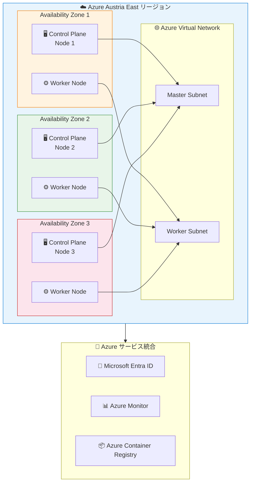

# Azure Red Hat OpenShift: Austria East リージョンで一般提供開始

**リリース日**: 2026-04-29

**サービス**: Azure Red Hat OpenShift

**機能**: Austria East リージョンでの一般提供 (GA)

**ステータス**: Launched (GA)

[このアップデートのインフォグラフィックを見る](https://takech9203.github.io/azure-news-summary/20260429-aro-austria-east.html)

## 概要

Azure Red Hat OpenShift (ARO) が、新たに Austria East リージョンで一般提供 (GA) を開始した。Austria East リージョンは 3 つの可用性ゾーン (Availability Zones) を備えており、回復力のあるスケーラブルな運用をサポートする。これにより、オーストリア国内でのデータレジデンシー要件を持つ顧客が、自国リージョンでエンタープライズグレードの OpenShift クラスターをデプロイ・運用できるようになった。

Azure Red Hat OpenShift は、Red Hat と Microsoft が共同でエンジニアリング・運用・サポートを行うフルマネージドの OpenShift サービスである。シングルテナントで高可用性の Kubernetes クラスターを Azure 上に提供し、コントロールプレーン、インフラストラクチャノード、アプリケーションノードのパッチ適用・更新・監視を Red Hat と Microsoft が代行する。今回のリージョン拡張により、EU/EEA 圏内でのデータ主権要件やオーストリア固有のコンプライアンス規制に対応した ARO クラスター運用が可能になる。

**アップデート前の課題**

- オーストリアの顧客は ARO を利用するために地理的に離れたリージョン (例: West Europe、North Europe) にクラスターをデプロイする必要があり、データが国外に保存されていた
- オーストリア国内のデータレジデンシー要件やコンプライアンス規制 (DSG 2000 / オーストリアデータ保護法) への対応において、データの国外移転が課題となっていた
- 中央ヨーロッパ地域でのディザスタリカバリ構成において、オーストリア国内のリージョン選択肢がなかった

**アップデート後の改善**

- Austria East でのローカルデプロイが可能となり、オーストリア国内でデータを処理・保存できるようになった
- 3 つの可用性ゾーンにより、単一リージョン内での高可用性構成が実現し、ゾーン障害に対する耐障害性が確保された
- オーストリアのデータレジデンシー要件および EU/EEA のコンプライアンス規制 (GDPR 含む) に準拠した ARO クラスター運用が可能になった

## アーキテクチャ図



この図は、Austria East リージョンにおける ARO クラスターの可用性ゾーン分散構成を示している。Control Plane ノードと Worker ノードが 3 つの可用性ゾーンに分散配置され、ゾーン障害時にもサービス継続性が確保される。

## サービスアップデートの詳細

### 主要機能

1. **Austria East リージョンでの一般提供 (GA)**
   - オーストリア国内で初の ARO 提供リージョン
   - ミッションクリティカルな OpenShift ワークロードのローカル実行が可能に

2. **3 つの可用性ゾーン対応**
   - Control Plane ノードおよび Worker ノードを複数の可用性ゾーンに分散配置可能
   - ゾーン障害に対する耐障害性を確保し、99.95% SLA を実現
   - 回復力のあるスケーラブルな運用をサポート

3. **国内データレジデンシー**
   - データがオーストリア国内に保存される
   - EU/EEA のデータ保護規制およびオーストリア固有の規制に準拠

4. **フルマネージドの OpenShift サービス**
   - Red Hat と Microsoft による共同エンジニアリング・運用・サポート
   - コントロールプレーン、インフラストラクチャノード、アプリケーションノードのパッチ適用・更新・監視を代行

## 技術仕様

| 項目 | 詳細 |
|------|------|
| サービス種別 | フルマネージド OpenShift (Kubernetes) |
| リージョン | Austria East |
| 可用性ゾーン数 | 3 |
| 最小コア数 | 44 コア (ブートストラップ 8 + Control Plane 24 + Worker 12) |
| 運用時コア数 | 36 コア (ブートストラップ削除後) |
| 最大 Worker ノード数 | 250 ノード |
| デフォルト Master VM サイズ | Standard D8s_v5 |
| デフォルト Worker VM サイズ | Standard D4s_v5 |
| SLA | 99.95% |
| クラスター作成時間 | 約 45 分 |
| 認証統合 | Microsoft Entra ID |
| ネットワーク要件 | 仮想ネットワークに 2 つの空サブネット (Master 用、Worker 用) |

## 設定方法

### 前提条件

1. Azure サブスクリプション
2. Austria East リージョンで最低 44 コアの vCPU クォータ
3. Microsoft Entra ID テナント
4. Azure CLI (az コマンド) バージョン 2.6.0 以上
5. `az aro` 拡張機能のインストール

### Azure CLI

```bash
# ARO 拡張機能の登録
az provider register -n Microsoft.RedHatOpenShift --wait

# リソースグループの作成
az group create --name myResourceGroup --location austriaeast

# 仮想ネットワークとサブネットの作成
az network vnet create \
  --resource-group myResourceGroup \
  --name myVNet \
  --address-prefixes 10.0.0.0/22

az network vnet subnet create \
  --resource-group myResourceGroup \
  --vnet-name myVNet \
  --name master-subnet \
  --address-prefixes 10.0.0.0/23

az network vnet subnet create \
  --resource-group myResourceGroup \
  --vnet-name myVNet \
  --name worker-subnet \
  --address-prefixes 10.0.2.0/23

# ARO クラスターの作成 (Austria East)
az aro create \
  --resource-group myResourceGroup \
  --name myAROCluster \
  --vnet myVNet \
  --master-subnet master-subnet \
  --worker-subnet worker-subnet \
  --location austriaeast
```

### Azure Portal

Azure Portal から ARO クラスターを作成する場合、リージョン選択で「Austria East」を選択し、ウィザードに従ってクラスターを構成する。

## メリット

### ビジネス面

- **データレジデンシー要件への対応**: オーストリア国内でデータを処理・保存できるため、オーストリアのデータ保護法 (DSG 2000) および EU GDPR への準拠が容易になる
- **規制産業への対応**: 金融、医療、公共セクターなど厳格なデータローカライゼーション要件を持つ業界の顧客がオーストリア国内で ARO を利用可能になる
- **レイテンシの低減による UX 向上**: オーストリアおよび中央ヨーロッパのエンドユーザーに対して低レイテンシのサービス提供が可能になる

### 技術面

- **可用性ゾーンによる高可用性**: 3 つの可用性ゾーンにまたがるクラスター構成により、単一ゾーン障害時もサービスを継続できる
- **マルチリージョン DR 構成の拡充**: West Europe、North Europe、Germany West Central などの既存リージョンとの組み合わせにより、ヨーロッパ地域でのディザスタリカバリ戦略の選択肢が増加する
- **フルマネージドのインフラ運用**: コントロールプレーンの運用・保守を Red Hat と Microsoft に委任でき、アプリケーション開発に集中できる
- **Azure サービスとの統合**: Austria East でも Microsoft Entra ID、Azure Monitor、Azure Container Registry など Azure エコシステムと統合された OpenShift 環境を利用可能

## デメリット・制約事項

- 新リージョンでは ARO で利用可能な VM サイズが既存リージョンと比較して制限される場合がある。デプロイ前に利用可能なバージョンと VM サイズを確認すること
- 最小 44 コアの vCPU クォータが必要であり、新規サブスクリプションではクォータ増加申請が必要になる場合がある
- クラスター作成に約 45 分を要する
- 新リージョンの料金は既存リージョンと異なる場合がある

## ユースケース

### ユースケース 1: オーストリアの金融機関におけるコンテナプラットフォーム

**シナリオ**: オーストリアの金融機関が、規制要件によりデータを国内に保持しつつ、マイクロサービスアーキテクチャへの移行を進める

**実装例**:

```bash
# Austria East にプライベート ARO クラスターを作成
az aro create \
  --resource-group fintech-rg \
  --name fintech-aro-cluster \
  --vnet fintech-vnet \
  --master-subnet master-subnet \
  --worker-subnet worker-subnet \
  --location austriaeast \
  --apiserver-visibility Private \
  --ingress-visibility Private
```

**効果**: オーストリア国内のデータレジデンシー要件を満たしながら、フルマネージドの Kubernetes 環境でマイクロサービスを運用できる。プライベートクラスター構成により、インターネットからの直接アクセスを排除しセキュリティを強化。

### ユースケース 2: 中央ヨーロッパにおけるマルチリージョン DR 構成

**シナリオ**: ヨーロッパ全域にサービスを提供する企業が、Austria East をセカンダリサイトとしたディザスタリカバリ構成を構築する

**効果**: West Europe (オランダ) や Germany West Central (フランクフルト) をプライマリとし、Austria East をセカンダリリージョンとして利用することで、ヨーロッパ内でのデータ主権を維持しながら高い可用性を確保できる。

## 料金

Azure Red Hat OpenShift はコンポーネントベースの課金モデルを採用しており、クラスターリソース (コンピューティング、ネットワーク、ストレージ) は実際の使用量に基づいて課金される。

| 項目 | 説明 |
|------|------|
| Control Plane ノード | Azure Virtual Machines の標準 Linux VM 料金 (OpenShift ライセンス込み) |
| Worker ノード | Linux VM 料金 + OpenShift ライセンス料 |
| 購入オプション | 従量課金制、またはリザーブドインスタンス |

※ 料金はリージョンにより異なる場合がある。Austria East の正確な料金は [Azure Red Hat OpenShift 料金ページ](https://azure.microsoft.com/pricing/details/openshift/) を参照。別途 Red Hat との契約は不要で、Azure の課金に含まれる。

## 利用可能リージョン

今回のアップデートにより、以下のリージョンが新たに追加された。

| リージョン | 地域 | 可用性ゾーン | ステータス |
|----------|------|------------|----------|
| Austria East | 中央ヨーロッパ | 3 | **新規追加** |

ARO が利用可能な全リージョンの一覧は [Azure リージョン別利用可能サービス](https://azure.microsoft.com/global-infrastructure/services/?products=openshift) を参照。

## 関連サービス・機能

- **Azure Kubernetes Service (AKS)**: Azure のマネージド Kubernetes サービス。ARO は OpenShift ベースの Kubernetes サービスであり、Red Hat エコシステムとの統合が必要な場合に適している
- **Azure Container Registry (ACR)**: ARO クラスターと統合可能なコンテナイメージレジストリ
- **Microsoft Entra ID**: ARO クラスターの認証基盤として統合。RBAC と組み合わせたアクセス制御を提供
- **Azure Monitor**: ARO クラスターの監視とログ収集。Container Insights によるコンテナワークロードの可視化が可能
- **Azure Virtual Network**: ARO クラスターのネットワーク基盤。Master サブネットと Worker サブネットの 2 つの空サブネットが必要
- **Azure Availability Zones**: Austria East の 3 つの可用性ゾーンを活用した高可用性構成を実現

## 参考リンク

- [インフォグラフィック](https://takech9203.github.io/azure-news-summary/20260429-aro-austria-east.html)
- [公式アップデート情報](https://azure.microsoft.com/updates?id=561135)
- [Microsoft Learn - Azure Red Hat OpenShift ドキュメント](https://learn.microsoft.com/en-us/azure/openshift/)
- [Microsoft Learn - Azure Red Hat OpenShift の概要](https://learn.microsoft.com/en-us/azure/openshift/intro-openshift)
- [Microsoft Learn - ARO クラスターの作成](https://learn.microsoft.com/en-us/azure/openshift/create-cluster)
- [料金ページ](https://azure.microsoft.com/pricing/details/openshift/)
- [Azure Red Hat OpenShift SLA](https://azure.microsoft.com/support/legal/sla/openshift/v1_0/)
- [リージョン別利用可能サービス](https://azure.microsoft.com/global-infrastructure/services/?products=openshift)

## まとめ

Azure Red Hat OpenShift の Austria East リージョンへの拡張は、オーストリアおよび中央ヨーロッパ地域におけるエンタープライズ Kubernetes ワークロードのデプロイ選択肢を広げる重要なアップデートである。特に、3 つの可用性ゾーンを備えたリージョンでの提供により、データレジデンシー要件への対応と高可用性の両方を実現できる点が大きな意義を持つ。

Solutions Architect への推奨アクション:

1. **リージョン選定の見直し**: オーストリアおよび中央ヨーロッパ地域のワークロードについて、Austria East リージョンの利用を検討する。特にデータレジデンシー要件やオーストリア国内規制への準拠が必要な場合は優先的に評価すること
2. **可用性ゾーン構成の検討**: 3 つの可用性ゾーンを活用し、Control Plane ノードおよび Worker ノードをゾーン間で分散配置する高可用性設計を検討する
3. **クォータの事前確認**: Austria East での ARO デプロイに必要な vCPU クォータ (最小 44 コア) を事前に確認し、必要に応じて増加申請を行う
4. **DR 構成の再評価**: 既存の ARO クラスターに対するディザスタリカバリ戦略を見直し、Austria East をヨーロッパ圏内のセカンダリサイトとして活用できるか検討する
5. **コンプライアンス要件の確認**: オーストリアのデータ保護法 (DSG 2000) や EU GDPR の要件と照らし合わせ、Austria East リージョンの利用が要件を満たすか確認する

---

**タグ**: #AzureRedHatOpenShift #Containers #Kubernetes #OpenShift #RegionalExpansion #AustriaEast #Europe #GA #DataResidency #AvailabilityZones #Compliance #OpenSource
