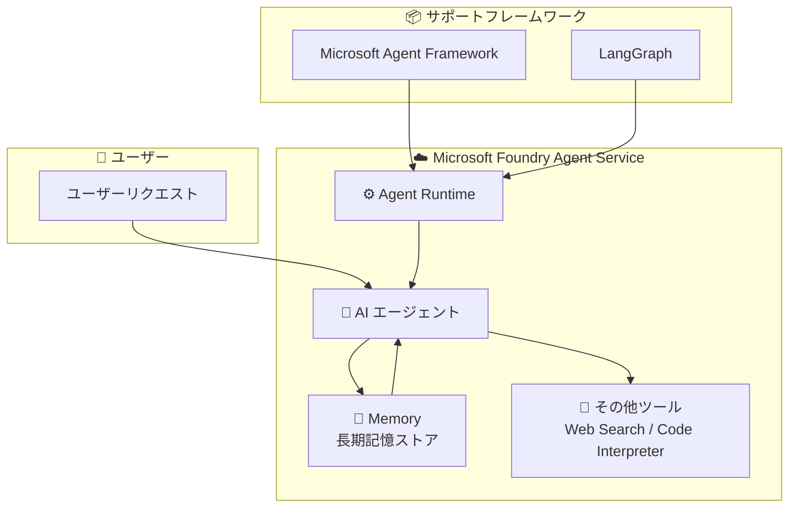

# Foundry Agent Service: Memory (Preview)

**リリース日**: 2026-04-29

**サービス**: Microsoft Foundry Agent Service

**機能**: Memory (長期記憶)

**ステータス**: In preview

[このアップデートのインフォグラフィックを見る](https://takech9203.github.io/azure-news-summary/20260429-foundry-agent-service-memory.html)

## 概要

Microsoft Foundry Agent Service に、マネージドの長期記憶 (Memory) 機能がパブリックプレビューとして追加された。Memory は Foundry Agent Service に直接組み込まれたビルトインツールであり、エージェントが会話を超えてユーザーの情報や好みを記憶し、パーソナライズされた応答を提供できるようにする。

この機能は Microsoft Agent Framework および LangGraph とネイティブに統合されており、外部データベースのプロビジョニング、スケーリング、セキュリティ管理が不要である。開発者はエージェントロジックに集中でき、インフラストラクチャの管理負担なく長期記憶を実現できる。

**アップデート前の課題**

- エージェントに長期記憶を持たせるには、外部データベース (Redis、Cosmos DB など) を別途プロビジョニング・管理する必要があった
- 記憶の保存・検索・スケーリング・セキュリティ管理を開発者が自前で実装する必要があった
- フレームワーク間で記憶の管理方法が統一されておらず、実装の複雑さが増していた

**アップデート後の改善**

- Foundry Agent Service のビルトインツールとして Memory が利用可能になり、外部データベースが不要
- Microsoft Agent Framework と LangGraph にネイティブ統合されており、最小限のコード変更で利用可能
- スケーリングとセキュリティは Foundry プラットフォームが自動管理

## アーキテクチャ図

Memory はエージェントのビルトインツールとして Agent Runtime に統合されており、会話コンテキストを超えた長期的な情報の保存・取得をマネージドサービスとして提供する。

## サービスアップデートの詳細

### 主要機能

1. **マネージド長期記憶**
   - エージェントが会話セッションを超えてユーザーの好み、過去のやり取り、重要な情報を記憶
   - 外部データベースのプロビジョニングが不要なフルマネージド実装

2. **ネイティブフレームワーク統合**
   - Microsoft Agent Framework とのネイティブ統合
   - LangGraph とのネイティブ統合
   - 既存のエージェントコードへの最小限の変更で Memory を追加可能

3. **プラットフォームマネージド運用**
   - スケーリングは Foundry プラットフォームが自動管理
   - セキュリティは Microsoft Entra ID、RBAC、コンテンツフィルターと統合
   - エンタープライズグレードのデータ保護

### Foundry Agent Service の既存ツールとの関係

Memory は Foundry Agent Service の以下のビルトインツールと並列で利用可能:

| ツール | 用途 |
|--------|------|
| Web Search | リアルタイムの Web 情報検索 |
| Code Interpreter | Python コードの実行・データ分析 |
| File Search | アップロードドキュメントからのベクトル検索 |
| **Memory (今回追加)** | セッションを超えた長期記憶 |

## メリット

### ビジネス面

- インフラ管理コストの削減 (外部データベースの運用が不要)
- エージェントのパーソナライゼーション向上によるユーザー体験の改善
- エンタープライズセキュリティ要件への準拠が容易

### 技術面

- 外部データベースのプロビジョニング・スケーリング・セキュリティ管理が不要
- Microsoft Agent Framework / LangGraph とのネイティブ統合により実装工数を削減
- Foundry の既存セキュリティ基盤 (Microsoft Entra ID、RBAC、VNet) を自動活用

## デメリット・制約事項

- プレビュー段階のため、本番環境での利用には注意が必要 (プレビュー補足利用規約が適用)
- Memory ツールの詳細な技術仕様 (保存容量上限、レイテンシなど) は公式ドキュメントの更新を待つ必要あり

## ユースケース

### ユースケース 1: カスタマーサポートエージェント

**シナリオ**: 顧客がサポートチャットを利用する際、過去の問い合わせ内容や購入履歴をエージェントが記憶し、コンテキストに基づいたサポートを提供する。

**効果**: 顧客が毎回同じ情報を説明する必要がなくなり、対応時間の短縮と顧客満足度の向上が期待できる。

### ユースケース 2: パーソナルアシスタント

**シナリオ**: ユーザーの好み (レポート形式、使用言語、通知設定など) を記憶し、繰り返し指示することなく一貫したエクスペリエンスを提供する。

**効果**: ユーザーの生産性向上と、より自然な対話体験の実現。

## 関連サービス・機能

- **Microsoft Agent Framework**: Memory とネイティブ統合されたエージェント構築フレームワーク
- **LangGraph**: Memory とネイティブ統合されたオープンソースエージェントフレームワーク
- **Foundry Agent Service - Hosted Agents**: カスタムコードベースのエージェントを Foundry 上にデプロイ
- **Foundry Agent Service - Toolbox**: 複数ツールを 1 つの MCP エンドポイントとしてバンドル

## 参考リンク

- [インフォグラフィック](https://takech9203.github.io/azure-news-summary/20260429-foundry-agent-service-memory.html)
- [公式アップデート情報](https://azure.microsoft.com/updates?id=560992)
- [Microsoft Foundry Agent Service 概要 - Microsoft Learn](https://learn.microsoft.com/en-us/azure/foundry/agents/overview)
- [Foundry Agent Service ツールカタログ - Microsoft Learn](https://learn.microsoft.com/en-us/azure/foundry/agents/concepts/tool-catalog)

## まとめ

Foundry Agent Service の Memory (プレビュー) は、AI エージェントに長期記憶を持たせるための障壁を大幅に下げるアップデートである。従来は外部データベースの構築・運用が必要だった長期記憶を、ビルトインのマネージドツールとして提供することで、開発者はエージェントロジックに集中できるようになる。Microsoft Agent Framework および LangGraph とのネイティブ統合により、既存のエージェントプロジェクトへの導入も容易である。Solutions Architect としては、パーソナライズされたエージェント体験を必要とするプロジェクトにおいて、プレビューの制約を理解した上で早期検証を推奨する。

---

**タグ**: #Azure #FoundryAgentService #Memory #AI #MachineLearning #Preview #MicrosoftAgentFramework #LangGraph
