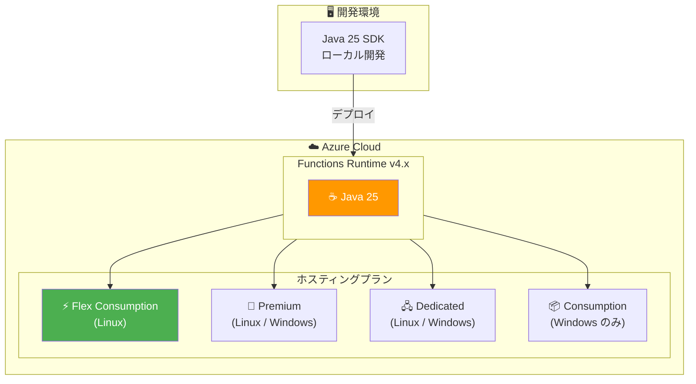

# Azure Functions: Java 25 サポート

**リリース日**: 2026-04-30

**サービス**: Azure Functions

**機能**: Java 25 ランタイムサポート

**ステータス**: GA (一般提供)

[このアップデートのインフォグラフィックを見る](https://takech9203.github.io/azure-news-summary/20260430-azure-functions-java-25.html)

## 概要

Azure Functions で Java 25 のサポートが一般提供 (GA) として利用可能になった。Java 25 を使用してローカルで関数アプリを開発し、Linux および Windows 上でサポートされている Azure Functions プランにデプロイできるようになった。Flex Consumption プランも含まれる。

Java 25 は Azure Functions でサポートされる最新の Java バージョンであり、2029 年 5 月までサポートが継続される。ただし、Java 21 が Linux Consumption プランでサポートされる最後の Java バージョンとなるため、Java 25 を使用する場合は Flex Consumption プラン、Premium プラン、または Dedicated プランの利用が必要である。

**アップデート前の課題**

- Azure Functions で利用可能な最新の Java バージョンは Java 21 であり、Java 25 の新機能を活用できなかった
- Linux Consumption プランを使用している Java アプリは、新しい Java バージョンへのアップグレードパスが不明確だった

**アップデート後の改善**

- Java 25 をローカル開発環境および Azure 上の対応プランで利用可能になった
- Linux、Windows の両方のプラットフォームで Java 25 がサポートされた
- Flex Consumption プランを含むすべての対応プランで Java 25 を実行できるようになった

## アーキテクチャ図



Java 25 の関数アプリは、ローカルで開発した後、対応する各ホスティングプランにデプロイできる。Flex Consumption プランは Linux のみ対応だが、Premium および Dedicated プランでは Linux と Windows の両方で利用可能。

## サービスアップデートの詳細

### 主要機能

1. **Java 25 ランタイムサポート (GA)**
   - Azure Functions Runtime v4.x 上で Java 25 が完全サポートされた
   - ローカル開発からクラウドデプロイまでの完全なワークフローが利用可能

2. **マルチプラットフォーム対応**
   - Linux および Windows の両方のオペレーティングシステムで動作
   - Flex Consumption、Premium、Dedicated プランで利用可能

3. **Flex Consumption プラン対応**
   - サーバーレスモデルでの Java 25 実行が可能
   - 仮想ネットワーク統合、per-function スケーリング、always ready インスタンスなどの機能を Java 25 と組み合わせて利用可能

## 技術仕様

| 項目 | 詳細 |
|------|------|
| Java バージョン | Java 25 |
| サポートレベル | GA (一般提供) |
| サポート期限 | 2029 年 5 月 |
| Functions ランタイム | v4.x |
| 対応 OS | Linux, Windows |
| 対応プラン | Flex Consumption, Premium, Dedicated, Consumption (Windows) |
| Linux Consumption | 非対応 (Java 21 が最終サポートバージョン) |

## 設定方法

### 前提条件

1. Azure Functions Runtime v4.x を使用していること
2. Java 25 JDK がローカル開発環境にインストールされていること
3. JAVA_HOME 環境変数が Java 25 JDK ディレクトリに設定されていること

### pom.xml の設定

```xml
<properties>
    <java.version>25</java.version>
</properties>

<runtime>
    <!-- Linux または Windows を選択 -->
    <os>linux</os>
    <javaVersion>25</javaVersion>
</runtime>
```

### Azure CLI

```bash
# 関数アプリの Java バージョンを Java 25 に設定
az functionapp config set \
    --name <APP_NAME> \
    --resource-group <RESOURCE_GROUP> \
    --java-version 25
```

### Maven アーキタイプによる新規プロジェクト作成

```bash
mvn archetype:generate \
    -DarchetypeGroupId=com.microsoft.azure \
    -DarchetypeArtifactId=azure-functions-archetype \
    -DjavaVersion=25
```

## メリット

### 技術面

- Java 25 の最新言語機能を Azure Functions で活用可能
- Flex Consumption プランとの組み合わせにより、サーバーレスでの高性能 Java 実行が実現
- Linux と Windows の両方で利用でき、既存のデプロイメント戦略を維持可能
- 2029 年 5 月までの長期サポートにより、安定したプロダクション運用が可能

### ビジネス面

- 最新の Java エコシステムとライブラリを活用した開発が可能
- Flex Consumption プランの従量課金モデルにより、コスト効率の高い運用が実現
- 長期サポート期間により、アプリケーションのライフサイクル計画が立てやすい

## デメリット・制約事項

- Linux Consumption プランでは Java 25 を利用できない (Java 21 が最終サポートバージョン)
- Linux Consumption プランから Java 25 を使用するには Flex Consumption プランへの移行が必要
- Flex Consumption プランは Linux のみ対応であり、Windows では利用できない
- Flex Consumption プランはすべてのリージョンで利用可能ではない

## ユースケース

### ユースケース 1: Flex Consumption プランでの Java 25 サーバーレスアプリケーション

**シナリオ**: Java 25 の最新機能を活用しながら、サーバーレスモデルで関数アプリを運用したい場合。

**実装例**:

```bash
# Flex Consumption プランの関数アプリを作成
az functionapp create \
    --name myJava25FuncApp \
    --resource-group myResourceGroup \
    --storage-account mystorageaccount \
    --runtime java \
    --runtime-version 25 \
    --flexconsumption-location "East US" \
    --os-type Linux
```

**効果**: 仮想ネットワーク統合や per-function スケーリングの恩恵を受けながら、Java 25 の最新機能をサーバーレス環境で利用可能。

### ユースケース 2: 既存 Java 21 アプリの Java 25 へのアップグレード

**シナリオ**: 既に Azure Functions で Java 21 を使用しているアプリケーションを Java 25 にアップグレードしたい場合。

**実装例**:

```xml
<!-- pom.xml の更新 -->
<properties>
    <java.version>25</java.version>
</properties>
<runtime>
    <os>linux</os>
    <javaVersion>25</javaVersion>
</runtime>
```

```bash
# Azure 上のランタイムバージョンを更新
az functionapp config set \
    --name myFuncApp \
    --resource-group myResourceGroup \
    --java-version 25
```

**効果**: 最新の Java 25 機能を活用しつつ、既存のトリガーやバインディング設定をそのまま維持可能。

## 料金

Azure Functions の料金は選択するホスティングプランによって異なる。Java 25 の利用自体に追加料金は発生しない。

| プラン | 料金モデル | 特徴 |
|--------|-----------|------|
| Flex Consumption | 実行時間 + always ready インスタンス | サーバーレス、VNet 統合対応 |
| Premium | 常時稼働インスタンス数ベース | VNet 統合、無制限実行時間 |
| Dedicated (App Service) | App Service プラン料金 | 専用コンピュート |
| Consumption (Windows) | 実行時間ベース | シンプルなサーバーレス |

詳細: [Azure Functions 料金ページ](https://azure.microsoft.com/pricing/details/functions/)

## 関連サービス・機能

- **Azure Functions Flex Consumption プラン**: Java 25 をサーバーレスモデルで実行するための推奨プラン。VNet 統合、per-function スケーリング対応
- **Microsoft Build of OpenJDK**: Azure で使用される Java ランタイム。Java 25 のバイナリが提供される
- **Azure Functions Core Tools**: ローカル開発・テストのためのツール。Java 25 対応
- **Maven Plugin (azure-functions-maven-plugin)**: Java 関数のビルドとデプロイのための Maven プラグイン

## 参考リンク

- [インフォグラフィック](https://takech9203.github.io/azure-news-summary/20260430-azure-functions-java-25.html)
- [公式アップデート情報](https://azure.microsoft.com/updates?id=560879)
- [Azure Functions Java 開発者ガイド](https://learn.microsoft.com/azure/azure-functions/functions-reference-java)
- [Azure Functions ランタイムバージョン](https://learn.microsoft.com/azure/azure-functions/functions-versions)
- [Azure Functions サポート言語](https://learn.microsoft.com/azure/azure-functions/supported-languages)
- [Flex Consumption プラン](https://learn.microsoft.com/azure/azure-functions/flex-consumption-plan)
- [料金ページ](https://azure.microsoft.com/pricing/details/functions/)

## まとめ

Azure Functions で Java 25 が GA としてサポートされ、Linux および Windows の主要なホスティングプランで利用可能になった。特に Flex Consumption プランとの組み合わせにより、サーバーレスモデルで Java 25 の最新機能を活用できる。ただし、Linux Consumption プランでは Java 21 が最終サポートバージョンとなるため、Java 25 を利用する場合は Flex Consumption プランへの移行を検討する必要がある。2029 年 5 月までの長期サポートが保証されており、プロダクション利用に適している。

---

**タグ**: #AzureFunctions #Java25 #Serverless #FlexConsumption #GA
