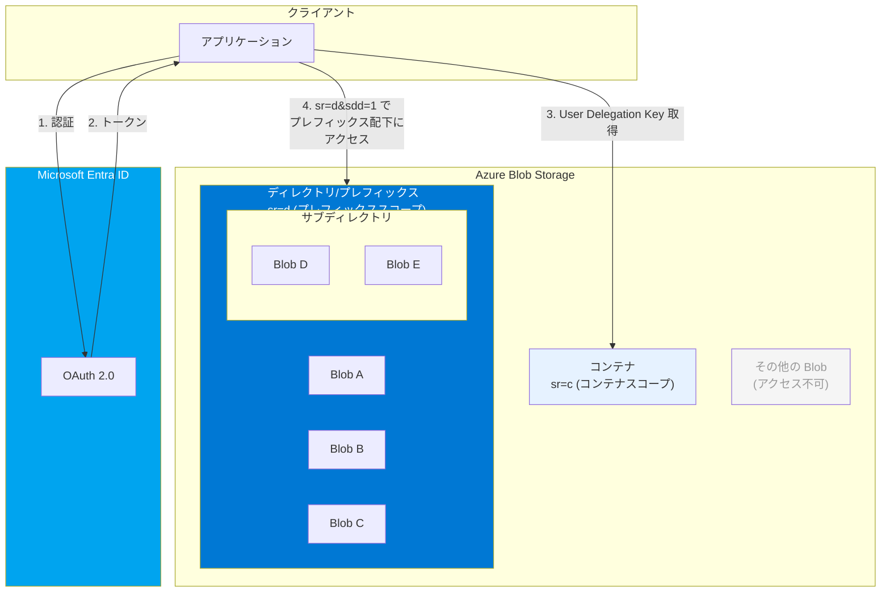

# Azure Blob Storage: ユーザー委任 SAS のプレフィックススコープアクセス

**リリース日**: 2026-04-30

**サービス**: Azure Blob Storage

**機能**: Prefix-scoped access for User Delegation SAS

**ステータス**: Launched (GA)

[このアップデートのインフォグラフィックを見る](https://takech9203.github.io/azure-news-summary/20260430-blob-storage-prefix-scoped-delegation-sas.html)

## 概要

Azure Blob Storage のユーザー委任 SAS (User Delegation SAS) におけるプレフィックススコープアクセスが、すべての Azure リージョンで一般提供 (GA) となった。従来、Blob Storage の SAS トークンはコンテナレベル (`sr=c`) と個別 Blob レベル (`sr=b`) の 2 つのスコープのみをサポートしていたが、本リリースにより新たにディレクトリ/プレフィックススコープ (`sr=d`) が利用可能となった。

プレフィックススコープを使用すると、コンテナ内の特定のディレクトリ (パスプレフィックス) 配下のすべての Blob に対してアクセスを制限できる。これにより、コンテナ全体へのアクセスを許可する必要なく、特定のパスプレフィックスに合致するリソースのみにきめ細かいアクセス権を委任できるようになる。

**アップデート前の課題**

- SAS トークンのスコープがコンテナ全体か個別 Blob のいずれかに限定されており、中間的なアクセス粒度を実現できなかった
- テナントごと・ユーザーごとにパスプレフィックスで分離されたデータに対して、必要最小限のアクセス権を付与することが困難だった
- コンテナスコープ SAS を使用する場合、コンテナ内の全 Blob にアクセスできてしまうため、最小権限の原則に反する可能性があった
- 個別 Blob スコープ SAS を使用する場合、多数の Blob に対して個別にトークンを発行する必要があり運用負荷が高かった

**アップデート後の改善**

- ディレクトリ/プレフィックススコープ (`sr=d`) により、特定のパスプレフィックス配下の Blob のみにアクセスを制限できるようになった
- ユーザー委任 SAS と組み合わせることで、アカウントキーに依存せず、Microsoft Entra ID ベースの安全なプレフィックス単位のアクセス委任が可能となった
- `signedDirectoryDepth` (`sdd`) パラメータにより、アクセス可能なディレクトリ階層の深さを明示的に指定できる
- コンテナ全体と個別 Blob の間の適切な粒度でアクセス制御を実現できるようになった

## アーキテクチャ図



この図は、プレフィックススコープ SAS によるアクセス制御の階層構造を示している。コンテナ全体 (`sr=c`) よりも狭く、個別 Blob (`sr=b`) よりも広い範囲として、ディレクトリ/プレフィックス (`sr=d`) を指定することで、特定のパスプレフィックス配下の Blob とサブディレクトリにのみアクセスを許可できる。

## サービスアップデートの詳細

### 主要機能

1. **ディレクトリスコープ (`sr=d`) のサポート**
   - `signedResource` パラメータに `d` (ディレクトリ) を指定することで、特定のディレクトリ (パスプレフィックス) 配下のリソースにアクセスを制限できる
   - コンテナスコープ (`sr=c`) と同様のセマンティクスだが、アクセスは指定されたディレクトリとその配下のファイル・サブディレクトリに限定される

2. **ディレクトリ深度の指定 (`sdd` パラメータ)**
   - `signedDirectoryDepth` (`sdd`) パラメータにより、ルートディレクトリからの深さを指定する
   - 例: `https://{account}.blob.core.windows.net/{container}/d1/d2` の場合、深さは 2 となる
   - このパラメータは `sr=d` を指定した場合に必須

3. **ユーザー委任 SAS との組み合わせ**
   - プレフィックススコープはユーザー委任 SAS でサポートされており、アカウントキーに依存しないセキュアなアクセス委任が可能
   - Microsoft Entra ID の資格情報で署名されるため、トークンの発行者を追跡可能

4. **全 Azure リージョンでの一般提供**
   - 本機能はすべての Azure リージョンで一般提供 (GA) となった

## 技術仕様

| 項目 | 詳細 |
|------|------|
| 必要な API バージョン | `sv=2020-02-10` 以降 |
| signedResource 値 | `d` (ディレクトリ/プレフィックス) |
| 必須パラメータ | `sdd` (signedDirectoryDepth) - ディレクトリの深さを非負整数で指定 |
| 対象サービス | Azure Blob Storage (Data Lake Storage 含む) |
| SAS 種別 | ユーザー委任 SAS (User Delegation SAS) |
| 認証方式 | Microsoft Entra ID (OAuth 2.0) |
| ユーザー委任キーの最大有効期間 | 7 日間 |

### スコープの比較

| スコープ | `sr` 値 | アクセス範囲 | ユースケース |
|---------|---------|------------|-------------|
| コンテナ | `c` | コンテナ内の全 Blob | コンテナ全体への一括アクセス |
| ディレクトリ/プレフィックス | `d` | 指定ディレクトリ配下の Blob とサブディレクトリ | テナント別・ユーザー別のパス分離 |
| Blob | `b` | 単一の Blob | 個別ファイルへのアクセス |
| Blob バージョン | `bv` | 単一の Blob バージョン | 特定バージョンへのアクセス |
| Blob スナップショット | `bs` | 単一の Blob スナップショット | 特定スナップショットへのアクセス |

### ディレクトリ深度 (sdd) の計算例

| パス | ディレクトリ深度 (`sdd`) |
|------|------------------------|
| `https://{account}.blob.core.windows.net/{container}/` | 0 |
| `https://{account}.blob.core.windows.net/{container}/dir1/` | 1 |
| `https://{account}.blob.core.windows.net/{container}/dir1/dir2/` | 2 |
| `https://{account}.blob.core.windows.net/{container}/tenant-a/data/` | 2 |

## 設定方法

### 前提条件

1. Azure ストレージアカウント (Blob Storage または Data Lake Storage)
2. Microsoft Entra ID による認証が可能なセキュリティプリンシパル
3. `Storage Blob Delegator` ロール (またはユーザー委任キー生成権限を含むロール) の割り当て
4. API バージョン `2020-02-10` 以降をサポートする SDK またはツール

### Azure CLI

```bash
# 1. Storage Blob Delegator ロールの割り当て
az role assignment create \
  --assignee {principal-id} \
  --role "Storage Blob Delegator" \
  --scope /subscriptions/{sub-id}/resourceGroups/{rg}/providers/Microsoft.Storage/storageAccounts/{account}

# 2. プレフィックススコープのユーザー委任 SAS を生成
# (コンテナ "mycontainer" 内の "tenant-a/" プレフィックス配下にアクセスを制限)
az storage blob generate-sas \
  --account-name {account} \
  --container-name mycontainer \
  --name "tenant-a/" \
  --as-user \
  --auth-mode login \
  --permissions rl \
  --expiry 2026-05-01T00:00:00Z \
  --resource-types d
```

### REST API でのプレフィックススコープ SAS URI の例

```
https://{account}.blob.core.windows.net/{container}?restype=directory&sr=d&sdd=1&sp=rl&st=2026-04-30T00:00:00Z&se=2026-05-01T00:00:00Z&sv=2020-02-10&skoid={object-id}&sktid={tenant-id}&skt=2026-04-30T00:00:00Z&ske=2026-05-01T00:00:00Z&sks=b&skv=2020-02-10&sig={signature}
```

## メリット

### ビジネス面

- **最小権限の原則の実現**: コンテナ全体ではなく、必要なパスプレフィックス配下のみにアクセスを制限でき、セキュリティポリシーへの準拠が容易になる
- **マルチテナント環境での安全なデータ分離**: テナントごとにパスプレフィックスを分離し、各テナントに対して自テナントのプレフィックスのみへのアクセスを委任できる
- **運用負荷の軽減**: 個別 Blob ごとに SAS を発行する必要がなく、ディレクトリ単位で一括してアクセスを付与できる

### 技術面

- **アカウントキー不要のセキュアなアクセス**: ユーザー委任 SAS と組み合わせることで、アカウントキーに依存しないプレフィックス単位のアクセス制御を実現
- **階層型ストレージとの親和性**: Data Lake Storage (階層型名前空間) を使用するワークロードにおいて、ディレクトリベースのアクセス制御と自然に統合可能
- **柔軟なパーミッション設定**: 読み取り (`r`)、追加 (`a`)、作成 (`c`)、書き込み (`w`)、削除 (`d`)、一覧表示 (`l`) などの操作をプレフィックス単位で制御可能
- **監査追跡性の向上**: Microsoft Entra ID ベースの認証により、誰がどのプレフィックスへのアクセスを委任したかの追跡が容易

## デメリット・制約事項

- **API バージョン要件**: `sv=2020-02-10` 以降が必要であり、古い SDK やツールでは利用できない場合がある
- **ストアドアクセスポリシー非対応**: ユーザー委任 SAS はアドホック SAS のみであり、ストアドアクセスポリシーに関連付けることができない
- **ユーザー委任キーの有効期間制限**: 最大 7 日間であり、長期間のアクセス委任には定期的なキー更新が必要
- **コンテナの管理操作は不可**: コンテナの作成・削除・一覧表示はユーザー委任 SAS ではサポートされない
- **Blob Storage 専用**: プレフィックススコープ (`sr=d`) は Blob Storage (Data Lake Storage 含む) でのみ利用可能であり、Azure Files や Queue Storage では使用できない

## ユースケース

### ユースケース 1: マルチテナント SaaS アプリケーション

**シナリオ**: SaaS プラットフォームで各テナントのデータを同一コンテナ内のパスプレフィックスで分離し、テナントごとに自分のデータのみにアクセスできる SAS を発行する。

**実装例**:

```
コンテナ構造:
  mycontainer/
    tenant-a/
      documents/file1.pdf
      documents/file2.pdf
      images/logo.png
    tenant-b/
      documents/report.pdf
      images/banner.jpg

SAS 発行:
  sr=d, sdd=1, canonicalizedResource=/blob/{account}/mycontainer/tenant-a
  → tenant-a/ 配下の全リソースにアクセス可能
  → tenant-b/ 配下にはアクセス不可
```

**効果**: テナントごとにコンテナを分ける必要がなく、単一コンテナでの効率的なマルチテナントデータ管理と、きめ細かいアクセス制御を両立できる。

### ユースケース 2: CI/CD パイプラインでのアーティファクト管理

**シナリオ**: ビルドパイプラインでプロジェクトごと・ビルドごとのパスプレフィックスにアーティファクトを保存し、各パイプラインに自身のプレフィックスのみへの書き込み権限を委任する。

**実装例**:

```
コンテナ構造:
  artifacts/
    project-alpha/build-123/
    project-alpha/build-124/
    project-beta/build-001/

SAS 発行:
  sr=d, sdd=2, canonicalizedResource=/blob/{account}/artifacts/project-alpha/build-124
  → project-alpha/build-124/ 配下のみに書き込み可能
```

**効果**: 各ビルドジョブが他のプロジェクトやビルドのアーティファクトに影響を与えることなく、安全にアーティファクトをアップロードできる。

### ユースケース 3: データレイクの部門別アクセス制御

**シナリオ**: Data Lake Storage で部門別にディレクトリ構造を持つデータレイクにおいて、各部門のアナリストに自部門のデータへのみ読み取りアクセスを委任する。

**実装例**:

```
コンテナ構造:
  datalake/
    sales/2026/04/
    marketing/2026/04/
    engineering/2026/04/

SAS 発行:
  sr=d, sdd=1, sp=rl
  canonicalizedResource=/blob/{account}/datalake/sales
  → sales/ 配下の全データに読み取り・一覧表示が可能
```

**効果**: 部門間のデータ分離を維持しながら、アカウントキーを共有することなく安全にデータアクセスを委任できる。

## 料金

プレフィックススコープアクセス自体に追加料金は発生しない。通常の Azure Blob Storage の料金体系が適用される:

- **Get User Delegation Key 操作**: ストレージアカウントの種類に応じた操作料金として課金
- **SAS を使用したデータアクセス**: 通常のトランザクション料金が適用
- **データ転送**: 通常のデータ転送料金が適用

## 利用可能リージョン

すべての Azure リージョンで利用可能。公式アナウンスにおいて「generally available in all Azure regions」と明記されている。

## 関連サービス・機能

- **[ユーザー委任 SAS の Azure Tables, Files, Queues への拡張](2026-03-31-storage-user-delegation-sas.md)**: ユーザー委任 SAS が全ストレージサービスで GA となった関連アップデート (2026-03-31)
- **Azure Data Lake Storage**: 階層型名前空間を有効にした場合、ディレクトリスコープ SAS とネイティブに統合可能
- **Microsoft Entra ID**: ユーザー委任 SAS の署名に使用される OAuth 2.0 トークンの発行元
- **Azure RBAC**: Storage Blob Delegator ロールによるユーザー委任キー生成権限の管理
- **SAS 有効期限ポリシー**: ストレージアカウントレベルで SAS の推奨最大有効期間を設定する機能

## 参考リンク

- [インフォグラフィック](https://takech9203.github.io/azure-news-summary/20260430-blob-storage-prefix-scoped-delegation-sas.html)
- [公式アップデート情報](https://azure.microsoft.com/updates?id=561257)
- [ユーザー委任 SAS の作成 (REST API)](https://learn.microsoft.com/en-us/rest/api/storageservices/create-user-delegation-sas)
- [共有アクセス署名 (SAS) の概要](https://learn.microsoft.com/en-us/azure/storage/common/storage-sas-overview)

## まとめ

ユーザー委任 SAS のプレフィックススコープアクセスの一般提供は、Azure Blob Storage におけるアクセス制御の柔軟性を大幅に向上させるアップデートである。従来のコンテナスコープと個別 Blob スコープの間に位置する新たなスコープレベルにより、最小権限の原則に従ったきめ細かいアクセス委任が可能となった。

Solutions Architect にとって特に重要なのは、マルチテナント環境やデータレイクアーキテクチャにおいて、パスプレフィックスによるデータ分離とユーザー委任 SAS のセキュリティ上の利点を組み合わせることができる点である。コンテナ全体へのアクセスを付与することなく、特定のディレクトリ配下のリソースのみにアクセスを制限できるため、セキュリティリスクの軽減と運用効率の向上を同時に実現できる。API バージョン `2020-02-10` 以降であれば利用可能であり、既存の環境でもすぐに活用を開始できる。

---

**タグ**: `Azure Blob Storage` `Storage` `SAS` `User Delegation SAS` `Prefix Scope` `Directory Scope` `Security` `Microsoft Entra ID` `GA`
