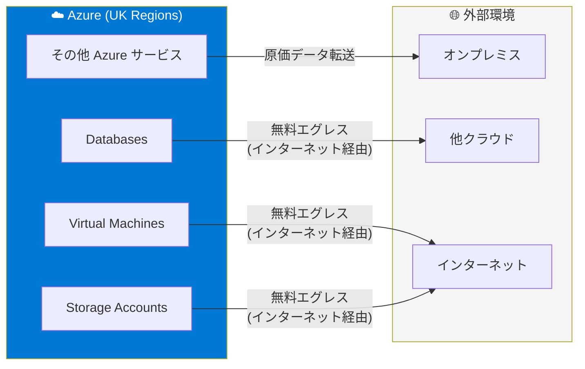

# Azure Networking: 英国におけるエグレスおよびデータ転送の無料化

**リリース日**: 2026-05-01

**サービス**: Azure Networking / Pricing & Offerings

**機能**: 英国における無料エグレスおよび原価データ転送

**ステータス**: GA (一般提供)

[このアップデートのインフォグラフィックを見る](https://takech9203.github.io/azure-news-summary/20260501-azure-uk-egress-data-transfer.html)

## 概要

Microsoft Azure は、英国 (United Kingdom) のお客様および CSP パートナーに対して、Azure からインターネット経由でデータを転送する際のエグレス料金を無料化し、データ転送を原価で提供するアップデートを発表した。これは、既にヨーロッパで提供されている同様のポリシーを英国にも拡大するものである。

Azure はお客様の選択を尊重しており、Azure と Azure 外の環境間でデータを転送する自由を支持している。ヨーロッパでは既に、インターネット経由でデータを転送するお客様および CSP パートナー向けに無料エグレスおよび原価データ転送が提供されていたが、このポリシーが英国にも適用されることとなった。

**アップデート前の課題**

- 英国のお客様は Azure からのデータエグレスに対して標準的な帯域幅料金を支払う必要があった
- Azure からデータを移行する際のコストが、マルチクラウド戦略やクラウド間のデータポータビリティの障壁となっていた
- ヨーロッパの顧客には既に無料エグレスが提供されていたが、英国の顧客には同等のポリシーが適用されていなかった

**アップデート後の改善**

- 英国のお客様および CSP パートナーがインターネット経由でのデータエグレスを無料で利用可能になった
- Azure と Azure 外の環境間のデータ転送が原価で提供されるようになった
- データポータビリティが向上し、マルチクラウドやハイブリッド環境の構築がコスト面で容易になった

## アーキテクチャ図

英国リージョンの Azure サービスから外部環境へのインターネット経由のデータ転送が無料となり、その他のデータ転送方法についても原価で提供される。

## サービスアップデートの詳細

### 主要機能

1. **インターネット経由の無料エグレス**
   - 英国リージョンから外部へのインターネット経由のデータ転送が無料化
   - お客様および CSP パートナーが対象

2. **原価でのデータ転送**
   - Azure と Azure 外の環境間のデータ転送が原価で提供
   - データポータビリティの促進が目的

3. **ヨーロッパのポリシーとの整合性**
   - 既にヨーロッパで提供されていたポリシーと同等の条件が英国にも適用
   - EU Data Act への対応と同様の顧客選択の尊重が英国でも実現

## 技術仕様

| 項目 | 詳細 |
|------|------|
| 対象リージョン | 英国 (UK South, UK West) |
| 対象顧客 | 英国のお客様および CSP パートナー |
| エグレス方法 | インターネット経由 |
| エグレス料金 | 無料 |
| データ転送料金 | 原価 |
| ステータス | GA (一般提供) |
| 適用開始日 | 2026-05-01 |

## メリット

### ビジネス面

- データエグレスコストの削減により、Azure から他環境へのデータ移行やマルチクラウド運用のコスト障壁が低減
- クラウドベンダーロックインへの懸念が軽減され、Azure 採用の意思決定が容易になる
- CSP パートナーのビジネスモデルにおける柔軟性が向上
- 英国のデータポータビリティ規制への対応が強化される

### 技術面

- マルチクラウドアーキテクチャにおけるデータ同期のコスト最適化が可能
- バックアップデータの外部保存やディザスタリカバリ構成のコスト削減
- データレイクからのデータエクスポートや分析基盤間のデータ移動が経済的に実行可能

## デメリット・制約事項

- インターネット経由の転送のみが無料エグレスの対象である (ExpressRoute などの専用接続については詳細が確認できていない)
- Azure リージョン間の転送 (リージョン間データ転送) は本ポリシーの対象外の可能性がある
- 具体的なデータ転送量の上限や条件の詳細は公式ドキュメントを確認する必要がある

## ユースケース

### ユースケース 1: マルチクラウド環境でのデータ連携

**シナリオ**: 英国に拠点を持つ企業が Azure と他のクラウドプロバイダーの両方を使用し、定期的にデータを同期する必要がある場合。

**効果**: Azure からのエグレス料金が無料になるため、マルチクラウドデータ連携のランニングコストが大幅に削減される。

### ユースケース 2: クラウド移行の柔軟性確保

**シナリオ**: Azure から他のクラウドやオンプレミスへのワークロード移行を検討している英国の企業。

**効果**: データ転送コストを気にせずに移行計画を策定でき、ベンダーロックインのリスクなくクラウド戦略を見直すことが可能。

### ユースケース 3: ハイブリッドクラウドでのバックアップ

**シナリオ**: Azure 上のデータをオンプレミスやサードパーティのバックアップサービスに定期バックアップしている場合。

**効果**: バックアップデータのエグレスコストがゼロになり、ディザスタリカバリ体制をコスト効率よく維持できる。

## 料金

| 項目 | 料金 |
|------|------|
| インターネット経由のエグレス (英国) | 無料 |
| データ転送 (Azure 外への転送) | 原価 |

本アップデートにより、英国のお客様および CSP パートナーは、Azure からインターネット経由でデータを転送する際にエグレス料金が発生しなくなる。原価でのデータ転送の具体的な料金については、Azure Bandwidth 料金ページで最新情報を確認することを推奨する。

## 利用可能リージョン

- **UK South** (ロンドン)
- **UK West** (カーディフ)

## 関連サービス・機能

- **Azure Bandwidth**: Azure のデータ転送料金体系の基盤サービス。本アップデートにより英国リージョンの料金体系が変更される
- **Azure ExpressRoute**: Azure とオンプレミス間の専用接続サービス。本アップデートとの関係については公式情報を確認する必要がある
- **Azure Data Box**: 大量データの物理的な転送サービス。ネットワーク経由のエグレスと組み合わせて利用可能
- **ヨーロッパ向けエグレス無料化**: 先行して実施されたヨーロッパ向けの同等ポリシー。英国版はこの延長

## 参考リンク

- [インフォグラフィック](https://takech9203.github.io/azure-news-summary/20260501-azure-uk-egress-data-transfer.html)
- [公式アップデート情報](https://azure.microsoft.com/updates?id=561392)
- [Azure Bandwidth 料金ページ](https://azure.microsoft.com/pricing/details/bandwidth/)
- [Azure データ転送の概要](https://learn.microsoft.com/azure/networking/fundamentals/azure-network-transfer-overview)

## まとめ

Microsoft は英国のお客様および CSP パートナーに対して、Azure からのインターネット経由のデータエグレスを無料化し、データ転送を原価で提供するポリシーを開始した。これは既にヨーロッパで実施されているポリシーの英国への拡大であり、データポータビリティの促進とお客様の選択の自由を支持する取り組みの一環である。マルチクラウドやハイブリッド環境を運用する英国の組織にとって、データ転送コストの削減による大きなメリットが期待される。

---

**タグ**: #Azure #Networking #Egress #DataTransfer #UK #Pricing #GA
