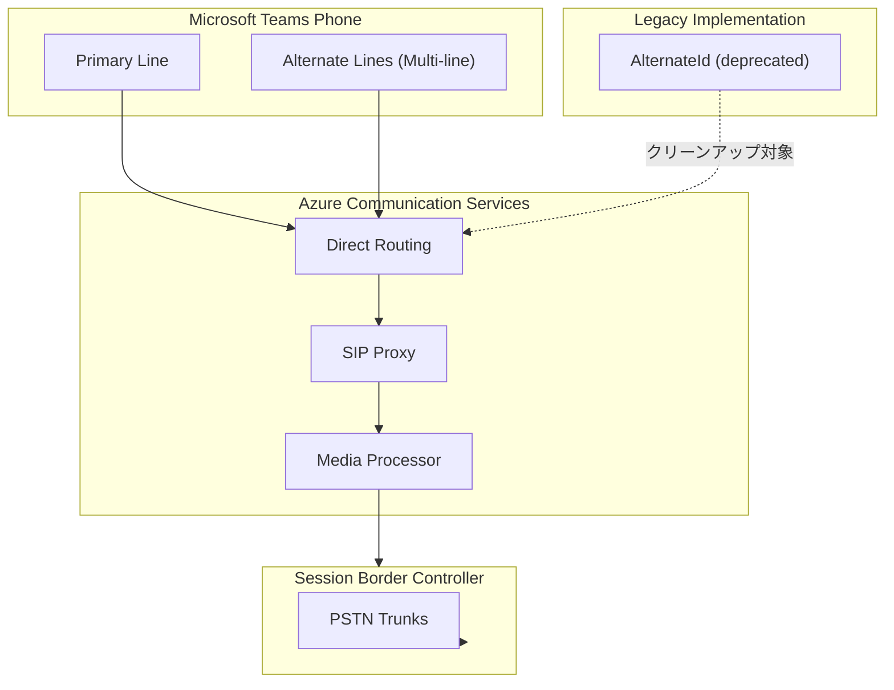

# Azure Communication Services: レガシー AlternateId 使用のクリーンアップ

**リリース日**: 2026-05-04

**サービス**: Azure Communication Services

**機能**: レガシー AlternateId 使用のクリーンアップ (Cleanup legacy AlternateId usage to ensure continued service)

**ステータス**: Launched (GA)

[このアップデートのインフォグラフィックを見る](https://takech9203.github.io/azure-news-summary/20260504-acs-alternateid-cleanup.html)

## 概要

Microsoft は、Azure Communication Services (ACS) における Teams Phone の Multi-line (Multiple Number Assignment) 機能の有効化に影響する問題を特定した。この問題は、顧客の内部実装で AlternateId が使用されていることに起因している。

Teams Phone の Multi-line 機能は、管理者が単一ユーザーに複数の電話番号を割り当てることを可能にする機能であり、ACS のダイレクトルーティングと連携して動作する。今回のアップデートでは、レガシーな AlternateId の使用をクリーンアップし、サービスの継続的な動作を確保するための対応が GA として提供された。

**アップデート前の課題**

- 顧客の内部実装でレガシーな AlternateId が使用されており、Teams Phone の Multi-line 機能の有効化に影響が発生していた
- AlternateId のレガシー使用が残存することで、サービスの継続性にリスクが生じていた

**アップデート後の改善**

- レガシーな AlternateId 使用のクリーンアップにより、Teams Phone の Multi-line 機能が正常に動作するようになった
- サービスの継続的な動作が確保された

## アーキテクチャ図

Teams Phone の Multi-line 機能が ACS のダイレクトルーティングを経由して PSTN と接続する構成を示す。レガシーな AlternateId はクリーンアップの対象となり、新しい Alternate Line の仕組みに統合される。

## サービスアップデートの詳細

### 主要機能

1. **レガシー AlternateId のクリーンアップ**
   - 顧客の内部実装で使用されていたレガシーな AlternateId 参照を削除・移行
   - Teams Phone の Multi-line 機能との互換性を確保

2. **サービス継続性の確保**
   - クリーンアップ後もサービスが中断なく継続動作することを保証
   - Multi-line (Multiple Number Assignment) 機能の正常な有効化を実現

## 技術仕様

| 項目 | 詳細 |
|------|------|
| 対象サービス | Azure Communication Services |
| 関連機能 | Teams Phone Multi-line (Multiple Number Assignment) |
| ステータス | Generally Available (GA) |
| 影響範囲 | ACS で AlternateId をレガシー実装として使用している顧客 |
| Multi-line 最大回線数 | 1 プライマリ + 1 プライベート + 最大 9 代替回線 (合計 11) |
| 対応接続タイプ | Direct Routing, Operator Connect, Calling Plan, Teams Phone Mobile |

## メリット

### ビジネス面

- Teams Phone の Multi-line 機能が正常に利用可能になり、1 ユーザーで複数の電話番号を運用できる
- サービス中断のリスクが軽減され、ビジネスの継続性が向上

### 技術面

- レガシーな実装が整理され、将来的なメンテナンス性が向上
- Multi-line 機能と ACS のダイレクトルーティングの連携が安定化

## デメリット・制約事項

- レガシー AlternateId を使用した既存の内部実装は、新しい仕組みへの移行が必要になる可能性がある
- 具体的な移行手順については公式ドキュメントの確認が推奨される

## 関連サービス・機能

- **Microsoft Teams Phone**: Multi-line 機能を提供する通話サービス。ACS と連携して PSTN 接続を実現する
- **Azure Communication Services Direct Routing**: SBC を介して PSTN に接続するためのルーティング機能
- **Session Border Controller (SBC)**: ACS と PSTN ネットワーク間のシグナリングとメディア処理を行う

## 参考リンク

- [インフォグラフィック](https://takech9203.github.io/azure-news-summary/20260504-acs-alternateid-cleanup.html)
- [公式アップデート情報](https://azure.microsoft.com/updates?id=561432)
- [Microsoft Learn - Teams Phone Multi-line 構成](https://learn.microsoft.com/en-us/microsoftteams/multi-line)
- [Microsoft Learn - ACS Direct Routing インフラ要件](https://learn.microsoft.com/en-us/azure/communication-services/concepts/telephony/direct-routing-infrastructure)
- [Microsoft Learn - ACS Teams 連携](https://learn.microsoft.com/en-us/azure/communication-services/concepts/teams-endpoint)

## まとめ

本アップデートは、Azure Communication Services におけるレガシーな AlternateId の使用をクリーンアップし、Teams Phone の Multi-line (Multiple Number Assignment) 機能の正常な動作を確保するものである。ACS を利用して Teams Phone と連携している組織は、レガシー AlternateId の使用状況を確認し、必要に応じて推奨される構成への移行を検討することが推奨される。特に、内部実装で AlternateId を直接使用している場合は、公式ドキュメントに従った対応が必要となる可能性がある。

---

**タグ**: #AzureCommunicationServices #TeamsPhone #MultiLine #AlternateId #DirectRouting #PSTN #GA
