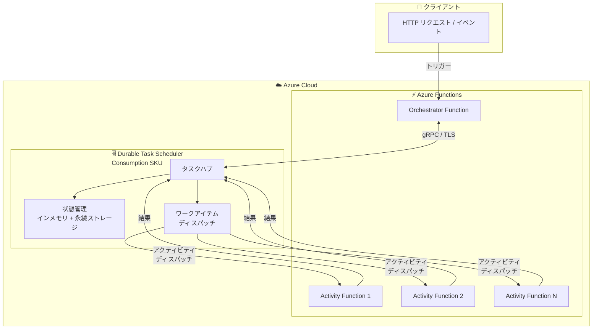

# Azure Functions: Durable Task Scheduler Consumption SKU の一般提供開始

**リリース日**: 2026-05-04

**サービス**: Azure Functions

**機能**: Durable Task Scheduler Consumption SKU

**ステータス**: Launched (GA)

[このアップデートのインフォグラフィックを見る](https://takech9203.github.io/azure-news-summary/20260504-functions-durable-task-scheduler-consumption.html)

## 概要

Azure Functions の Durable Task Scheduler に Consumption SKU が一般提供 (GA) として追加された。Durable Task Scheduler は、Durable Functions および Durable Task SDK のオーケストレーション状態を永続化するためのマネージドバックエンドサービスであり、従来の BYO (Bring Your Own) ストレージプロバイダー (Azure Storage、MSSQL など) に代わる目的で構築された専用バックエンドである。

Consumption SKU は従量課金 (Pay-per-use) モデルを採用しており、アクション単位での課金となる。初期費用、最低利用コミットメント、基本料金が不要で、アイドル時のコストも発生しない。ストレージの管理やキャパシティプランニングも不要となり、開発チームはワークフローのロジックに集中できる。

このリリースにより、耐久性のあるワークフローや AI エージェントオーケストレーションを Azure 上で従量課金で実行することが可能となった。変動的なワークロードや開発・テストシナリオに最適なオプションである。

**アップデート前の課題**

- Durable Functions で BYO ストレージプロバイダーを使用する場合、Azure Storage アカウントや SQL データベースなどのストレージインフラを自分で管理する必要があった
- ストレージのキャパシティプランニングや、パーティション管理によるリソース消費が CPU・メモリのオーバーヘッドとなっていた
- Dedicated SKU のみの提供であったため、ワークロードが小規模・変動的な場合でも固定費用が発生していた

**アップデート後の改善**

- ストレージ管理が完全に不要となり、マネージドサービスとしてオーケストレーション状態が自動的に永続化される
- 従量課金により、実行したアクション分のみの課金で、アイドルコストゼロを実現
- キャパシティプランニングが不要で、最大 500 アクション/秒まで自動的にスケール

## アーキテクチャ図



Durable Task Scheduler は Azure Functions とは独立したリソースとして動作し、gRPC 接続を通じてオーケストレーション状態の管理とワークアイテムのディスパッチを行う。Consumption SKU ではストレージインフラの管理が完全に抽象化されている。

## サービスアップデートの詳細

### 主要機能

1. **従量課金 (Pay-per-use)**
   - アクション単位での課金。初期費用、最低コミットメント、基本料金なし
   - アイドル時のコストゼロ

2. **フルマネージドストレージ**
   - ストレージアカウントの管理不要
   - オーケストレーション状態はサービス内部で自動的に永続化
   - インメモリストアと永続ストアの組み合わせによる最適化

3. **プッシュベースのワークアイテム配信**
   - gRPC 接続によるプッシュモデルでワークアイテムをストリーミング
   - ポーリング不要でエンドツーエンドのレイテンシを削減

4. **Durable Task Scheduler ダッシュボード**
   - オーケストレーションとエンティティインスタンスの監視・管理
   - フィルタリング、詳細確認、サブオーケストレーションの追跡
   - 一時停止・終了・再起動などの管理操作

5. **マネージド ID 認証**
   - 接続文字列ではなくマネージド ID による認証のみサポート
   - RBAC によるきめ細かいアクセス制御

## 技術仕様

| 項目 | 詳細 |
|------|------|
| 最大アクション/秒 | 500 |
| データ保持期間 | 最大 30 日 |
| スケジューラー数上限 | 10 (リージョンあたり、サブスクリプションあたり) |
| タスクハブ数上限 | 5 (リージョンあたり、サブスクリプションあたり) |
| 最大ペイロードサイズ | 1 MB (入出力、外部イベント、カスタムステータス、エンティティ状態) |
| インスタンス ID 最大長 | 100 文字 (印字可能 ASCII のみ) |
| 接続方式 | gRPC (TLS 暗号化) |
| 認証方式 | マネージド ID のみ (接続文字列非対応) |
| エンドポイント形式 | `{scheduler-name}.{region}.durabletask.io` |

## 設定方法

### 前提条件

1. Azure CLI がインストールされていること
2. Durable Task Scheduler CLI 拡張機能
3. ユーザー割り当てマネージド ID (推奨)

### Azure CLI

```bash
# Durable Task Scheduler CLI 拡張機能のインストール
az extension add --name durabletask
az extension update --name durabletask

# リソースグループの作成 (必要に応じて)
az group create --name YOUR_RESOURCE_GROUP --location LOCATION

# Consumption SKU でスケジューラーを作成
az durabletask scheduler create \
  --name "YOUR_SCHEDULER" \
  --resource-group "YOUR_RESOURCE_GROUP" \
  --location "LOCATION" \
  --ip-allowlist "[0.0.0.0/0]" \
  --sku-name "consumption"

# タスクハブの作成
az durabletask taskhub create \
  --resource-group YOUR_RESOURCE_GROUP \
  --scheduler-name YOUR_SCHEDULER \
  --name YOUR_TASKHUB
```

```bash
# マネージド ID の作成
az identity create -g YOUR_RESOURCE_GROUP -n YOUR_IDENTITY_NAME

# Durable Task Data Contributor ロールの割り当て
assignee=$(az identity show --name YOUR_IDENTITY_NAME --resource-group YOUR_RESOURCE_GROUP --query 'clientId' --output tsv)

scope="/subscriptions/YOUR_SUBSCRIPTION_ID/resourceGroups/YOUR_RESOURCE_GROUP/providers/Microsoft.DurableTask/schedulers/YOUR_SCHEDULER"

az role assignment create \
  --assignee "$assignee" \
  --role "Durable Task Data Contributor" \
  --scope "$scope"

# Function App にマネージド ID を割り当て
resource_id=$(az resource show --resource-group YOUR_RESOURCE_GROUP --name YOUR_IDENTITY_NAME --resource-type Microsoft.ManagedIdentity/userAssignedIdentities --query id --output tsv)

az functionapp identity assign \
  --resource-group YOUR_RESOURCE_GROUP \
  --name YOUR_FUNCTION_APP \
  --identities "$resource_id"
```

### Azure Portal

1. Azure Portal で「Durable Task Scheduler」を検索して選択
2. 「作成」を選択してスケジューラー作成ペインを表示
3. 基本タブでリソースグループ、スケジューラー名、リージョン、SKU (Consumption) を入力
4. 「確認と作成」を選択し、検証後に「作成」を選択 (デプロイに最大 15 分)
5. スケジューラーリソースの「概要」ページでタスクハブを作成
6. アクセス制御 (IAM) でマネージド ID に「Durable Task Data Contributor」ロールを割り当て

### アプリケーション設定

Function App に以下の環境変数を設定:

| 変数 | 値 |
|------|------|
| `TASKHUB_NAME` | タスクハブ名 |
| `DURABLE_TASK_SCHEDULER_CONNECTION_STRING` | `Endpoint={scheduler endpoint};Authentication=ManagedIdentity;ClientID={client id}` |

## メリット

### ビジネス面

- アイドルコストゼロにより、変動的なワークロードのコスト効率が大幅に向上
- 初期費用不要で参入障壁が低く、PoC やプロトタイピングに最適
- ストレージインフラの管理工数削減による運用コスト低下

### 技術面

- ストレージ管理の抽象化により、開発者がビジネスロジックに集中可能
- gRPC プッシュモデルによるレイテンシ削減とポーリングオーバーヘッドの排除
- マネージド ID のみの認証によりセキュリティベストプラクティスが強制される
- AI エージェントオーケストレーションなど新しいワークロードパターンへの対応

## デメリット・制約事項

- 最大スループットが 500 アクション/秒 (Dedicated SKU は 2,000 アクション/秒/CU)
- データ保持期間が最大 30 日 (Dedicated SKU は 90 日)
- スケジューラー数がリージョンあたり 10 個まで (Dedicated SKU は 25 個)
- タスクハブ数がリージョンあたり 5 個まで (Dedicated SKU は 25 個)
- Extended Sessions 機能は Durable Task Scheduler バックエンドで未対応
- マネージド ID 認証のみサポートで、接続文字列 (ストレージキー) は使用不可
- 最大ペイロードサイズが 1 MB に制限

## ユースケース

### ユースケース 1: AI エージェントオーケストレーション

**シナリオ**: マルチステップの AI エージェントワークフローを実行する。各ステップで外部 API 呼び出しやモデル推論を行い、結果に基づいて次のアクションを決定する。ワークロードは不定期に発生する。

**効果**: アイドル時のコストゼロにより、不定期に実行される AI エージェントワークフローのコストを最小化。状態の自動永続化により、長時間実行のオーケストレーションも安全に再開可能。

### ユースケース 2: 開発・テスト環境

**シナリオ**: Durable Functions アプリケーションの開発・テストで、ストレージインフラの管理を避けたい。開発者ごとに独立した環境が必要。

**効果**: ストレージアカウントの管理不要で、すぐに開発開始可能。使用した分のみ課金されるため、テスト環境のコストを最小限に抑制。

### ユースケース 3: イベント駆動型ワークフロー

**シナリオ**: EC サイトのプロモーションイベント時にオーダー処理のオーケストレーションが急増し、通常時はほぼゼロになる変動的なワークロード。

**効果**: 従量課金によりピーク時のみコスト発生。キャパシティプランニング不要で、最大 500 アクション/秒まで自動対応。

## 料金

Durable Task Scheduler の料金はスケジューラー SKU の費用とコンピュートプラットフォームの費用の 2 つの要素で構成される。

### Durable Task Scheduler (Consumption SKU)

| 項目 | 詳細 |
|------|------|
| 課金モデル | アクション単位の従量課金 |
| 初期費用 | なし |
| 基本料金 | なし |
| 最低コミットメント | なし |

**アクションの定義**: Durable Task Scheduler からアプリケーションにディスパッチされるメッセージ。オーケストレーターの開始、アクティビティの開始、タイマーの完了、外部イベントのトリガー、アクティビティ結果の処理などが含まれる。

**アクション数の計算例**: 3 つのアクティビティを呼び出すオーケストレーションの場合、オーケストレーター開始 (1) + 各アクティビティのスケジューリングと結果処理 (2 x 3) = 7 アクション。

### コンピュート費用 (別途)

Azure Functions のホスティングプランに応じた費用が別途発生する (Consumption Plan、Flex Consumption Plan、Premium Plan、Dedicated Plan)。

具体的なアクション単価については [Azure 料金ページ](https://azure.microsoft.com/pricing/details/durable-task-scheduler/) を参照。

### Dedicated SKU との比較

| 項目 | Consumption SKU | Dedicated SKU |
|------|----------------|---------------|
| 課金モデル | アクション単位 | CU (Capacity Unit) 単位の固定費 |
| 最大スループット | 500 アクション/秒 | 2,000 アクション/秒/CU |
| データ保持 | 30 日 | 90 日 |
| 高可用性 | - | 3 CU 以上で対応 |
| 推奨ワークロード | 変動的・小規模 | 大規模・安定的 |

## 利用可能リージョン

利用可能リージョンは以下のコマンドで確認可能:

```bash
az provider show --namespace Microsoft.DurableTask --query "resourceTypes[?resourceType=='schedulers'].locations | [0]" --out table
```

パフォーマンス最適化のため、Durable Functions アプリと同一リージョンでの Durable Task Scheduler リソースの配置が推奨される。

## 関連サービス・機能

- **Azure Functions Durable Functions**: Durable Task Scheduler のプライマリオーケストレーションフレームワーク。ステートフルなワークフローを Functions 上で実装
- **Durable Task SDK**: プラットフォーム非依存のオーケストレーション SDK。Azure Container Apps、AKS、App Service 上で実行可能
- **Durable Task Scheduler Dedicated SKU**: 大規模ワークロード向けの固定課金 SKU。CU 単位でのパフォーマンス保証
- **Durable Task Scheduler ダッシュボード**: オーケストレーションインスタンスの監視・管理用 UI
- **Azure Managed Identity**: Durable Task Scheduler への認証に必須。RBAC によるアクセス制御を提供

## 参考リンク

- [インフォグラフィック](https://takech9203.github.io/azure-news-summary/20260504-functions-durable-task-scheduler-consumption.html)
- [公式アップデート情報](https://azure.microsoft.com/updates?id=560957)
- [Microsoft Learn - Durable Task Scheduler](https://learn.microsoft.com/azure/durable-task/scheduler/durable-task-scheduler)
- [Microsoft Learn - Durable Task Scheduler 課金](https://learn.microsoft.com/azure/durable-task/scheduler/durable-task-scheduler-billing)
- [Microsoft Learn - タスクハブ](https://learn.microsoft.com/azure/durable-task/common/durable-task-hubs)
- [料金ページ](https://azure.microsoft.com/pricing/details/durable-task-scheduler/)

## まとめ

Durable Task Scheduler Consumption SKU の一般提供開始は、Azure Functions でのサーバーレスオーケストレーションのコスト構造を大きく改善するアップデートである。従来の BYO ストレージプロバイダーや Dedicated SKU と異なり、ストレージ管理不要・キャパシティプランニング不要・アイドルコストゼロを実現し、特に変動的なワークロードや開発/テスト環境、AI エージェントオーケストレーションなどの新しいユースケースに適している。

推奨される次のアクション:
- 既存の BYO ストレージプロバイダーを使用している Durable Functions アプリケーションについて、Consumption SKU への移行を検討
- 新規プロジェクトでは、ワークロードの特性 (スループット要件、データ保持期間) に応じて Consumption SKU と Dedicated SKU を選択
- 500 アクション/秒を超えるスループットが必要な場合は Dedicated SKU を選択

---

**タグ**: #AzureFunctions #DurableTask #DurableTaskScheduler #Serverless #ConsumptionSKU #GA #PayPerUse #Orchestration #AIAgent
