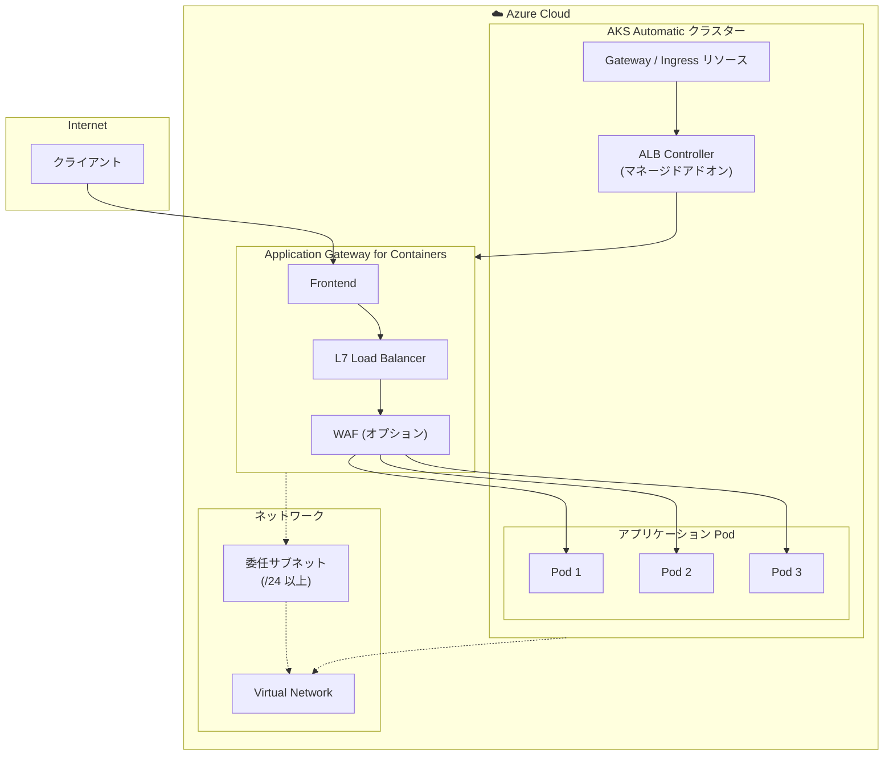

# Application Gateway for Containers: AKS Automatic マネージドアドオン対応

**リリース日**: 2026-05-05

**サービス**: Application Gateway for Containers / Azure Kubernetes Service (AKS)

**機能**: Application Gateway for Containers managed add-on + AKS Automatic

**ステータス**: In preview

[このアップデートのインフォグラフィックを見る](https://takech9203.github.io/azure-news-summary/20260505-appgw-containers-aks-automatic.html)

## 概要

Microsoft は、Application Gateway for Containers のマネージドアドオンが AKS Automatic クラスターで利用可能になったことを発表した。これまで Application Gateway for Containers と AKS Automatic の組み合わせには制限があり、AKS Automatic クラスターでは Application Gateway for Containers を使用できなかったが、今回のパブリックプレビューによりこの制限が解消された。

Application Gateway for Containers は、Kubernetes クラスターで実行されるワークロード向けのレイヤー 7 ロードバランシングおよび動的トラフィック管理プロダクトである。AKS Automatic は、ノード管理、スケーリング、セキュリティなどの一般的なタスクを自動化する AKS のマネージド体験を提供する。この 2 つのサービスの統合により、AKS Automatic の運用簡素化の利点を享受しつつ、Application Gateway for Containers の高度なトラフィック管理機能を活用できるようになった。

**アップデート前の課題**

- AKS Automatic クラスターでは Application Gateway for Containers マネージドアドオンを有効化できなかった
- AKS Automatic ユーザーは高度なレイヤー 7 ロードバランシング機能を利用するために AKS Standard に切り替える必要があった
- AKS Automatic のデフォルトの Ingress (マネージド NGINX) では対応できない高度なトラフィック管理要件に対応が困難であった

**アップデート後の改善**

- AKS Automatic クラスターで Application Gateway for Containers マネージドアドオンを直接有効化可能に
- AKS Automatic のフルマネージドなノード管理・スケーリングと、Application Gateway for Containers の高度なトラフィック管理を組み合わせた構成が実現可能に
- Gateway API や Ingress API を通じた柔軟なトラフィックルーティングが AKS Automatic でも利用可能に

## アーキテクチャ図



ALB Controller がマネージドアドオンとして AKS Automatic クラスター内で動作し、Gateway API / Ingress リソースの変更を検知して Application Gateway for Containers のリソースを自動的にプロビジョニング・管理する構成を示す。

## サービスアップデートの詳細

### 主要機能

1. **AKS Automatic でのマネージドアドオン対応**
   - AKS Automatic クラスター作成時または作成後に Application Gateway for Containers マネージドアドオンを有効化可能
   - ALB Controller が AKS Automatic の自動管理機能と統合され、運用負荷を最小限に抑えた構成が可能

2. **Gateway API および Ingress API サポート**
   - Kubernetes Gateway API v1 に準拠し、GatewayClass、Gateway、HTTPRoute リソースを利用可能
   - 従来の Ingress API もサポートし、既存のアプリケーション定義との互換性を確保

3. **ALB Controller によるライフサイクル管理**
   - ApplicationLoadBalancer カスタムリソースにより Application Gateway for Containers リソースのライフサイクルを Kubernetes 上から管理
   - リソースの作成・更新・削除が Kubernetes のリソース定義と連動

4. **高度なトラフィック管理機能**
   - トラフィックスプリッティング (Weighted Round Robin)
   - ヘッダーリライト、URL リダイレクト、URL リライト
   - mTLS (フロントエンド、バックエンド、エンドツーエンド)
   - gRPC、WebSocket、Server-sent Events サポート

## 技術仕様

| 項目 | 詳細 |
|------|------|
| ステータス | パブリックプレビュー |
| デプロイ戦略 | ALB Controller によるマネージド管理 / BYO (Bring Your Own) |
| サポートする API | Gateway API v1、Ingress API |
| 対応プロトコル | HTTP/1.1、HTTP/2、gRPC、WebSocket、SSE |
| TLS | SSL 終端、エンドツーエンド SSL、mTLS |
| 証明書 | ECDSA および RSA 証明書 |
| サブネット要件 | 最低 250 の利用可能な IP アドレス (/24 以上) |
| サブネット委任 | Microsoft.ServiceNetworking/trafficControllers |
| ヘルスプローブ | カスタムおよびデフォルトヘルスプローブ |
| 可用性ゾーン | ゾーン冗長対応 |

## 設定方法

### 前提条件

1. AKS Automatic クラスターが作成済みであること
2. Application Gateway for Containers 用の委任サブネット (/24 以上) が利用可能であること
3. ALB Controller マネージドアドオンに必要な権限が付与されていること

### Azure CLI

```bash
# AKS Automatic クラスターの情報を取得
AKS_NAME='<cluster name>'
RESOURCE_GROUP='<resource group name>'

# ノードリソースグループの取得
MC_RESOURCE_GROUP=$(az aks show --name $AKS_NAME --resource-group $RESOURCE_GROUP --query "nodeResourceGroup" -o tsv)

# VNet 情報の取得
CLUSTER_SUBNET_ID=$(az vmss list --resource-group $MC_RESOURCE_GROUP --query '[0].virtualMachineProfile.networkProfile.networkInterfaceConfigurations[0].ipConfigurations[0].subnet.id' -o tsv)
read -d '' VNET_NAME VNET_RESOURCE_GROUP VNET_ID <<< $(az network vnet show --ids $CLUSTER_SUBNET_ID --query '[name, resourceGroup, id]' -o tsv)

# Application Gateway for Containers 用サブネットの作成
SUBNET_ADDRESS_PREFIX='<subnet prefix /24 or larger>'
ALB_SUBNET_NAME='subnet-alb'
az network vnet subnet create \
  --resource-group $VNET_RESOURCE_GROUP \
  --vnet-name $VNET_NAME \
  --name $ALB_SUBNET_NAME \
  --address-prefixes $SUBNET_ADDRESS_PREFIX \
  --delegations 'Microsoft.ServiceNetworking/trafficControllers'

ALB_SUBNET_ID=$(az network vnet subnet show --name $ALB_SUBNET_NAME --resource-group $VNET_RESOURCE_GROUP --vnet-name $VNET_NAME --query '[id]' --output tsv)
```

```bash
# マネージド ID への権限委任
IDENTITY_RESOURCE_NAME='azure-alb-identity'
mcResourceGroupId=$(az group show --name $MC_RESOURCE_GROUP --query id -otsv)
principalId=$(az identity show -g $RESOURCE_GROUP -n $IDENTITY_RESOURCE_NAME --query principalId -otsv)

# AppGw for Containers Configuration Manager ロールを付与
az role assignment create --assignee-object-id $principalId --assignee-principal-type ServicePrincipal --scope $mcResourceGroupId --role "fbc52c3f-28ad-4303-a892-8a056630b8f1"

# Network Contributor ロールを ALB サブネットに付与
az role assignment create --assignee-object-id $principalId --assignee-principal-type ServicePrincipal --scope $ALB_SUBNET_ID --role "4d97b98b-1d4f-4787-a291-c67834d212e7"
```

```bash
# ApplicationLoadBalancer カスタムリソースの作成
kubectl apply -f - <<EOF
apiVersion: alb.networking.azure.io/v1
kind: ApplicationLoadBalancer
metadata:
  name: alb-test
  namespace: alb-test-infra
spec:
  associations:
  - $ALB_SUBNET_ID
EOF
```

### Azure Portal

Azure Portal から AKS Automatic クラスターのネットワーク設定にアクセスし、Application Gateway for Containers マネージドアドオンを有効化する。具体的な Portal 手順についてはプレビュー期間中に公式ドキュメントが更新される見込み。

## メリット

### ビジネス面

- AKS Automatic の運用簡素化と Application Gateway for Containers の高度なトラフィック管理を両立でき、運用コストを削減
- プロダクション環境への迅速なデプロイが可能になり、Time to Market を短縮
- AKS Automatic の Pod Readiness SLA (99.9%) と組み合わせることで、高い可用性を実現

### 技術面

- Gateway API 準拠により、ベンダーニュートラルな Kubernetes ネイティブの設定が可能
- トラフィックスプリッティングによるカナリアデプロイ・Blue/Green デプロイの実現
- ニアリアルタイムの構成更新により、Pod の追加・削除・ルート変更が即座に反映
- mTLS によるエンドツーエンドのゼロトラスト通信の実現
- 自動スケーリングにより突発的なトラフィック増加にも対応

## デメリット・制約事項

- パブリックプレビュー段階であるため、本番環境での使用には注意が必要
- 委任サブネットに最低 250 の利用可能な IP アドレスが必要 (既存の VNet に空きが必要)
- リスナーポートは 80 と 443 のみに制限
- プレビュー中は SLA が適用されない可能性がある
- AKS Automatic のデフォルト Ingress (マネージド NGINX) との共存時の設定に注意が必要

## ユースケース

### ユースケース 1: マイクロサービスのカナリアデプロイ

**シナリオ**: AKS Automatic 上で複数のマイクロサービスを運用し、新バージョンのリリース時にトラフィックを段階的に切り替えたい

**実装例**:

```yaml
apiVersion: gateway.networking.k8s.io/v1
kind: HTTPRoute
metadata:
  name: canary-route
spec:
  parentRefs:
  - name: my-gateway
  rules:
  - backendRefs:
    - name: app-v1
      port: 80
      weight: 90
    - name: app-v2
      port: 80
      weight: 10
```

**効果**: 新バージョンへのトラフィックを 10% から段階的に増加させることで、リスクを最小限に抑えたリリースが可能

### ユースケース 2: マルチテナント SaaS アプリケーション

**シナリオ**: 複数のテナントにサービスを提供する SaaS アプリケーションで、ホスト名ベースのルーティングと mTLS を実現したい

**実装例**:

```yaml
apiVersion: gateway.networking.k8s.io/v1
kind: HTTPRoute
metadata:
  name: tenant-routing
spec:
  parentRefs:
  - name: my-gateway
  hostnames:
  - "tenant-a.example.com"
  rules:
  - backendRefs:
    - name: tenant-a-service
      port: 443
```

**効果**: テナントごとに独立したルーティングと TLS 設定を適用し、セキュアなマルチテナント環境を実現

## 利用可能リージョン

Application Gateway for Containers は以下のリージョンで利用可能:

- Australia East
- Brazil South
- Canada Central
- Central India
- Central US
- East Asia
- East US
- East US 2
- France Central
- Germany West Central
- Korea Central
- North Central US
- North Europe
- Norway East
- South Central US
- Southeast Asia
- Switzerland North
- UAE North
- UK South
- West US
- West US 2
- West US 3
- West Europe

## 関連サービス・機能

- **Azure Kubernetes Service (AKS) Automatic**: ノード管理、スケーリング、セキュリティを自動化するフルマネージドな Kubernetes 体験を提供
- **Application Gateway for Containers**: Kubernetes ワークロード向けのレイヤー 7 ロードバランシングおよび動的トラフィック管理サービス
- **ALB Controller**: AKS クラスター内で動作し、Application Gateway for Containers リソースのライフサイクルを管理するコントローラー
- **Gateway API**: Kubernetes のネットワーキング標準仕様。ベンダーニュートラルなルーティング設定を実現
- **Application Routing Add-on (マネージド NGINX)**: AKS Automatic のデフォルトの Ingress コントローラー

## 参考リンク

- [インフォグラフィック](https://takech9203.github.io/azure-news-summary/20260505-appgw-containers-aks-automatic.html)
- [公式アップデート情報](https://azure.microsoft.com/updates?id=558403)
- [Microsoft Learn - Application Gateway for Containers 概要](https://learn.microsoft.com/en-us/azure/application-gateway/for-containers/overview)
- [Microsoft Learn - AKS Automatic 概要](https://learn.microsoft.com/en-us/azure/aks/intro-aks-automatic)
- [Microsoft Learn - ALB Controller によるデプロイ](https://learn.microsoft.com/en-us/azure/application-gateway/for-containers/quickstart-create-application-gateway-for-containers-managed-by-alb-controller)
- [料金ページ](https://azure.microsoft.com/pricing/details/application-gateway/)

## まとめ

本アップデートにより、AKS Automatic クラスターで Application Gateway for Containers マネージドアドオンが利用可能になった (パブリックプレビュー)。これまで AKS Automatic では Application Gateway for Containers を使用できないという制限があったが、今回のリリースでその制限が解消された。AKS Automatic のフルマネージドな運用体験と、Application Gateway for Containers の高度なレイヤー 7 トラフィック管理 (Gateway API、mTLS、トラフィックスプリッティング、WAF など) を組み合わせることで、運用負荷を最小限に抑えながらエンタープライズグレードのトラフィック管理が実現可能になる。AKS Automatic を利用中、または導入を検討している組織で、高度な Ingress 制御が必要な場合は、本プレビューの評価を推奨する。

---

**タグ**: #ApplicationGatewayForContainers #AKS #AKSAutomatic #GatewayAPI #Kubernetes #Networking #LoadBalancing #Preview
