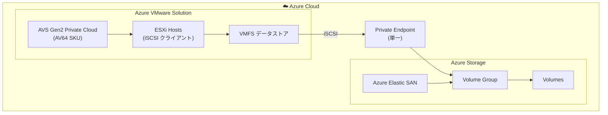

# Azure Elastic SAN: Azure VMware Solution (AVS) Gen2 および AV64 SKU サポート

**リリース日**: 2026-05-05

**サービス**: Azure Elastic SAN

**機能**: AVS Gen2 Private Cloud サポートおよび AV64 SKU サポート

**ステータス**: Launched (GA)

[このアップデートのインフォグラフィックを見る](https://takech9203.github.io/azure-news-summary/20260505-elastic-san-avs-gen2-av64.html)

## 概要

Azure Elastic SAN が Azure VMware Solution (AVS) Gen2 Private Cloud および AV64 SKU に対応し、一般提供 (GA) となった。これにより、AVS Gen2 環境での Elastic SAN データストアの接続がよりシンプルになり、パフォーマンスも向上する。

Gen2 Private Cloud では ExpressRoute ゲートウェイが不要となり、単一の Private Endpoint で構成が可能になった。従来の Gen1 では複数の Private Endpoint を使用して iSCSI セッションをスケールする必要があったが、Gen2 では iSCSI セッションのクローンが自動的に行われるため、接続構成が大幅に簡素化される。

また、AV64 SKU での Elastic SAN データストアのサポートにより、AVS デプロイメントにおいてより高いスケールとパフォーマンスのストレージオプションが利用可能になった。AV64 は Dual Intel Xeon Platinum 8370C (Ice Lake) を搭載し、64 物理コア、1,024 GB RAM を持つハイパフォーマンスな SKU である。

**アップデート前の課題**

- Gen1 環境では ExpressRoute ゲートウェイ経由の接続が必要で、ゲートウェイメンテナンス時に一時的な接続問題が発生する可能性があった
- 複数の Private Endpoint を作成・管理して iSCSI セッションをスケールする必要があった
- AV64 SKU で Elastic SAN データストアが利用できず、高スケール環境でのストレージ拡張オプションが制限されていた

**アップデート後の改善**

- Gen2 では ExpressRoute ゲートウェイが不要となり、ゲートウェイメンテナンスの影響を受けなくなった
- 単一の Private Endpoint で接続構成が完了し、iSCSI セッションは自動的にクローンされる
- AV64 SKU で Elastic SAN データストアが利用可能になり、高パフォーマンス環境でのストレージ拡張が実現

## アーキテクチャ図

AVS Gen2 の ESXi ホストから Private Endpoint を介して Elastic SAN ボリュームに iSCSI 接続する構成を示す。Gen2 では単一の Private Endpoint で複数の iSCSI セッションが自動的にクローンされる。

## サービスアップデートの詳細

### 主要機能

1. **AVS Gen2 Private Cloud での Elastic SAN サポート**
   - ExpressRoute ゲートウェイ不要のシンプルな接続構成
   - 単一の Private Endpoint による iSCSI セッションの自動クローン
   - ゲートウェイメンテナンスの影響を排除した高可用性接続

2. **AV64 SKU での Elastic SAN データストアサポート**
   - AV64 SKU (64コア、1,024 GB RAM) でのストレージ拡張が可能に
   - 高スケール・高パフォーマンスなストレージオプションの提供
   - クラスタースケーリングなしでストレージ容量の拡張が可能

3. **iSCSI マルチセッションの簡素化 (Gen2)**
   - Gen1 では複数の Private Endpoint が必要だったマルチセッション構成が不要に
   - Gen2 では単一の Private Endpoint から iSCSI セッションが自動クローン

## 技術仕様

| 項目 | 詳細 |
|------|------|
| プロトコル | iSCSI |
| データストア形式 | VMFS (Virtual Machine File System) |
| 対応 SKU (Gen1) | AV36, AV36P, AV48, AV52, AV64 |
| 対応 SKU (Gen2) | AV64 |
| AV64 CPU | Dual Intel Xeon Platinum 8370C (Ice Lake), 64 物理コア |
| AV64 メモリ | 1,024 GB |
| AV64 ネットワーク | 100 Gbps |
| Elastic SAN 最大 IOPS | 数百万 IOPS (SAN 全体) |
| 単一ボリューム最大 IOPS | 80,000 IOPS |
| 最大接続数 (データストアあたり) | 128 |
| Elastic SAN 最小ベースサイズ | 16 TiB |
| 冗長性 | LRS または ZRS |
| Gen2 接続方式 | Private Endpoint (単一、ExpressRoute 不要) |

## 設定方法

### 前提条件

1. Azure VMware Solution Gen2 Private Cloud (AV64 SKU) がデプロイ済みであること
2. Elastic SAN が同一リージョン・同一アベイラビリティゾーンに作成済みであること (最小 16 TiB ベースサイズ)
3. CRC (巡回冗長検査) 保護が Volume Group で無効化されていること
4. 適切な RBAC 権限 (`Microsoft.AVS/privateClouds/clusters/datastores/write`、`Microsoft.ElasticSan/elasticSans/volumeGroups/volumes/write`、`Microsoft.ElasticSan/elasticSans/volumeGroups/volumes/read`)

### Azure Portal

**Gen2 での Elastic SAN データストア接続手順:**

1. Volume Group の **Networking** で Private Endpoint を作成する (Gen2 では 1 つで十分)
2. AVS Private Cloud の左ナビゲーションから **Storage** を選択
3. **+ Connect Elastic SAN** を選択
4. サブスクリプション、リソース、Volume Group、Volumes、Client cluster を選択
5. VMware 要件に合わせてデータストア名を設定
6. 仮想ディスク作成時は eager zeroed thick プロビジョニングを使用

## メリット

### ビジネス面

- クラスターノードを追加せずにストレージを拡張でき、コスト最適化が可能
- ExpressRoute ゲートウェイが不要になることで、インフラコストを削減
- 運用管理の簡素化により、管理工数を削減

### 技術面

- 単一 Private Endpoint による簡素な構成で、構築・運用が容易
- ExpressRoute ゲートウェイメンテナンスの影響を受けない高可用性
- AV64 の 100 Gbps ネットワークスループットを活かした高パフォーマンスストレージ接続
- iSCSI セッション自動クローンにより、マルチパスの信頼性向上

## デメリット・制約事項

- Gen2 は AV64 SKU のみ対応 (AV36、AV36P、AV48、AV52 は Gen1 のみ)
- Elastic SAN は同一リージョン・同一アベイラビリティゾーンに配置する必要がある
- データストアあたりの最大接続数は 128 に制限
- CRC 保護は AVS では現在サポートされていないため無効化が必要
- 転送中の暗号化 (Encryption in transit) は Elastic SAN で非対応
- Elastic SAN データストア上に仮想マシンまたは仮想ディスクが存在する場合、データストアの削除不可

## ユースケース

### ユースケース 1: 大規模 VMware ワークロードのストレージ拡張

**シナリオ**: AV64 SKU で構成された AVS Gen2 Private Cloud で、vSAN 容量を超えるストレージが必要な場合に、クラスターノードを追加せずに Elastic SAN でデータストアを拡張する。

**効果**: ホスト追加なしでストレージ容量を拡張できるため、コンピュートリソースを無駄にせずストレージのみをスケールアウト可能。コスト効率の高いストレージ拡張を実現。

### ユースケース 2: パフォーマンス集約型データベースワークロード

**シナリオ**: SQL Server や Oracle などのパフォーマンス集約型データベースを AVS 上で実行する際に、Elastic SAN の高 IOPS (最大 80,000 IOPS/ボリューム) を活用してデータベースストレージのパフォーマンスを確保する。

**効果**: vSAN とは独立したパフォーマンス特性を持つストレージを利用でき、データベースワークロードに必要な IOPS とスループットを確保。

## 料金

Azure Elastic SAN の料金は、プロビジョニングされたベース容量と追加容量に基づく従量課金制。詳細な料金は利用リージョンによって異なる。

| 項目 | 説明 |
|------|------|
| ベースユニット | 容量 + パフォーマンス (IOPS/スループット) を含む |
| 追加容量ユニット | パフォーマンスを増やさずストレージ容量のみ追加 |
| 冗長性 | LRS と ZRS で料金が異なる |

最新の料金は [Azure Elastic SAN 料金ページ](https://azure.microsoft.com/pricing/details/elastic-san/) を参照。

## 利用可能リージョン

Elastic SAN が利用可能で、かつ AVS Gen2 (AV64) がデプロイ可能なリージョンで利用可能。具体的なリージョン一覧は [Azure リージョン別製品提供状況](https://azure.microsoft.com/explore/global-infrastructure/products-by-region/?products=azure-vmware) を参照。

## 関連サービス・機能

- **Azure VMware Solution (AVS)**: Elastic SAN をバッキングストレージとして使用する VMware 環境
- **Azure Private Endpoint**: Elastic SAN への安全なプライベート接続を提供
- **Azure Kubernetes Service (AKS)**: Elastic SAN をバッキングストレージとして利用可能な別のコンピュートサービス
- **VMware vSAN**: AVS 内蔵のストレージ。Elastic SAN は vSAN を補完・拡張する外部ストレージオプション

## 参考リンク

- [インフォグラフィック](https://takech9203.github.io/azure-news-summary/20260505-elastic-san-avs-gen2-av64.html)
- [公式アップデート情報 - Gen2 サポート](https://azure.microsoft.com/updates?id=560909)
- [公式アップデート情報 - AV64 サポート](https://azure.microsoft.com/updates?id=560894)
- [Microsoft Learn - Azure Elastic SAN の概要](https://learn.microsoft.com/azure/storage/elastic-san/elastic-san-introduction)
- [Microsoft Learn - AVS での Elastic SAN 構成](https://learn.microsoft.com/azure/azure-vmware/configure-azure-elastic-san)
- [料金ページ](https://azure.microsoft.com/pricing/details/elastic-san/)

## まとめ

今回のアップデートにより、Azure Elastic SAN と Azure VMware Solution の統合が大幅に強化された。特に Gen2 Private Cloud での ExpressRoute 不要のシンプルな接続構成と、AV64 SKU での高パフォーマンスストレージサポートは、大規模な VMware ワークロードを Azure 上で運用するユーザーにとって重要な改善である。

AVS 環境でストレージ容量の拡張を検討している場合は、クラスターノード追加よりもコスト効率の良い Elastic SAN データストアの活用を推奨する。Gen2 環境では接続構成も大幅に簡素化されているため、移行のハードルも低い。

---

**タグ**: #Azure #ElasticSAN #AzureVMwareSolution #AVS #Gen2 #AV64 #Storage #iSCSI #GA
