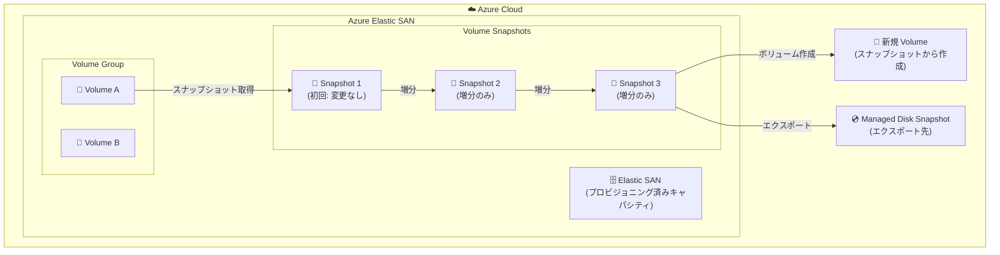

# Azure Elastic SAN: 単一ボリュームスナップショット (GA)

**リリース日**: 2026-05-05

**サービス**: Azure Elastic SAN

**機能**: Single Volume Snapshots

**ステータス**: Launched (GA)

[このアップデートのインフォグラフィックを見る](https://takech9203.github.io/azure-news-summary/20260505-elastic-san-single-volume-snapshots.html)

## 概要

Azure Elastic SAN において、単一ボリュームスナップショット機能が一般提供 (GA) となった。この機能により、SAN 内の個別ボリュームに対してインクリメンタル (増分) なポイントインタイムバックアップを取得できるようになる。

スナップショットは最初の取得時にはスペースを消費せず、2 回目以降は前回のスナップショットからの変更分のみを保存する増分方式を採用している。これは Managed Disk のスナップショットとは異なるアプローチであり、Managed Disk では最初のスナップショットがディスク全体のフルコピーとなる。Elastic SAN のスナップショットは SAN 内に保存され、SAN のキャパシティを消費するが、スナップショット自体に追加の課金は発生しない。

取得したスナップショットからは、新しいボリュームの作成や Managed Disk スナップショットへのエクスポートが可能である。ただし、既存ボリュームの状態を直接変更 (ロールバック) することはできない点に注意が必要である。

**アップデート前の課題**

- Elastic SAN ボリュームの個別バックアップには Managed Disk スナップショットへのエクスポートが必要で、時間がかかっていた
- ボリュームの迅速なリストアが困難で、開発/テスト環境での頻繁なスナップショット運用が難しかった
- フルコピー方式のバックアップによるストレージ消費の増大

**アップデート後の改善**

- SAN 内で直接スナップショットを取得でき、増分方式のためストレージ効率が高い
- スナップショットからのボリューム作成が即座に利用可能 (バックグラウンドでリハイドレーション)
- 追加課金なしでスナップショットを取得可能 (SAN のキャパシティのみ消費)

## アーキテクチャ図



Elastic SAN 内でボリュームのインクリメンタルスナップショットが連鎖的に保存され、スナップショットから新規ボリュームを作成したり、Managed Disk スナップショットにエクスポートしたりできる構成を示している。

## サービスアップデートの詳細

### 主要機能

1. **インクリメンタルスナップショット**
   - 最初のスナップショットはスペースを消費しない
   - 2 回目以降は前回からの変更分のみを保存
   - SAN のキャパシティ内に保存され、追加課金なし

2. **スナップショットからのボリューム作成**
   - スナップショットから新規ボリュームを即座にデプロイ可能
   - リハイドレーションはバックグラウンドで実行
   - 同一 SAN 内だけでなく、同一リージョン内の異なる SAN からも作成可能

3. **Managed Disk スナップショットへのエクスポート**
   - 長期保存のためにスナップショットを Managed Disk スナップショットにエクスポート
   - ボリューム削除後もデータを永続化
   - エクスポート先は同一リージョンに限定

4. **安定したスナップショットの取得ガイダンス**
   - 実行中の VM に対するスナップショットは部分的な操作を含む可能性がある
   - ストライプボリュームの場合、fsfreeze (Linux) や VSS (Windows) による調整が推奨

## 技術仕様

| 項目 | 詳細 |
|------|------|
| スナップショット上限 | 1 ボリュームあたり最大 200 スナップショット |
| 取得レート制限 | 5 分間に最大 7 スナップショット |
| スナップショット方式 | インクリメンタル (増分) |
| 保存場所 | Elastic SAN 内 (SAN キャパシティを消費) |
| 冗長性タイプ | SAN の冗長性タイプに依存 (LRS または ZRS) |
| スナップショットの永続性 | ボリューム削除時にスナップショットも削除される |
| 既存ボリュームのロールバック | 不可 (新規ボリューム作成のみ) |
| リージョン間コピー | 不可 (同一リージョンのみ) |

## 設定方法

### 前提条件

1. Azure Elastic SAN がデプロイ済みであること
2. ボリュームグループ内にスナップショット対象のボリュームが存在すること
3. Azure CLI または Azure PowerShell がインストールされていること

### Azure CLI

```bash
# ボリュームスナップショットの作成
az elastic-san volume snapshot create \
  -g "resourceGroupName" \
  -e "san_name" \
  -v "vg_name" \
  -n "snapshot_name" \
  --creation-data '{source-id:"volume_id"}'

# スナップショットからボリュームを作成
az elastic-san volume create \
  -g "resourceGroupName" \
  -e "san_name" \
  -v "vg_name" \
  -n "new_volume_name" \
  --size-gib 2 \
  --creation-data '{source-id:"snapshot_id",create-source:VolumeSnapshot}'

# スナップショットの削除
az elastic-san volume snapshot delete \
  -g "resourceGroupName" \
  -e "san_name" \
  -v "vg_name" \
  -n "snapshot_name"

# Managed Disk スナップショットへのエクスポート
snapID=$(az elastic-san volume snapshot show -g $rgName -e $sanName -v $vgName -n $sanSnapName --query 'id' | tr -d \"~)
az snapshot create -g $rgName --name $diskSnapName --elastic-san-id $snapID --location $region
```

### Azure Portal

1. Azure Portal にサインインし、対象の Elastic SAN に移動する
2. **Volume snapshots** を選択する
3. **Create a snapshot** を選択し、対象のボリュームグループとボリュームを指定する
4. スナップショット名を入力して作成する

**スナップショットからのボリューム作成:**
1. Elastic SAN の **Volumes** を選択する
2. **+ Create volume** を選択する
3. **Source type** で **Volume snapshot** を選択し、対象のスナップショットを指定する
4. **Create** を選択する

## メリット

### ビジネス面

- スナップショットに追加課金が発生しないため、バックアップコストを削減できる
- 迅速なリストアにより、障害時のダウンタイムを最小化できる
- ストレージの統合管理により運用コストを最適化できる

### 技術面

- インクリメンタル方式によりストレージ効率が高い (変更分のみ保存)
- スナップショットからのボリューム作成が即座に利用可能
- 同一リージョン内の異なる SAN・ボリュームグループからもボリューム作成が可能
- iSCSI プロトコル経由で多様なコンピュートリソース (VM、AKS、AVS) から利用可能

## デメリット・制約事項

- 既存ボリュームの状態を直接ロールバックすることはできない (新規ボリュームの作成のみ)
- ボリュームを削除するとスナップショットも削除される (永続化にはエクスポートが必要)
- スナップショットのエクスポート先は同一リージョンに限定される
- ボリュームのリサイズ後に取得したスナップショットは増分ではなくなり、エクスポートが失敗する可能性がある
- 1 ボリュームあたり最大 200 スナップショットまで
- 5 分間に最大 7 スナップショットのレート制限がある
- 個別のスナップショットを 1 つずつしか削除できない (一括削除不可)
- アプリケーション整合性のスナップショットには追加の調整 (fsfreeze/VSS) が必要

## ユースケース

### ユースケース 1: 開発/テスト環境の迅速なリストア

**シナリオ**: 開発/テスト環境でデータベースボリュームのスナップショットを取得し、テスト実行後に元の状態のボリュームを素早く再作成する。

**実装例**:

```bash
# テスト前にスナップショットを取得
az elastic-san volume snapshot create \
  -g "dev-rg" -e "dev-san" -v "db-vg" \
  -n "pre-test-snapshot" \
  --creation-data '{source-id:"/subscriptions/.../volumes/db-volume"}'

# テスト後にスナップショットから新しいボリュームを作成
az elastic-san volume create \
  -g "dev-rg" -e "dev-san" -v "db-vg" \
  -n "db-volume-restored" --size-gib 100 \
  --creation-data '{source-id:"/subscriptions/.../snapshots/pre-test-snapshot",create-source:VolumeSnapshot}'
```

**効果**: テスト環境のリセットが即座に行え、開発サイクルの効率が向上する。

### ユースケース 2: 長期バックアップのための Managed Disk エクスポート

**シナリオ**: 本番環境のボリュームスナップショットを定期的に Managed Disk スナップショットにエクスポートし、ボリューム削除後もデータを永続化する。

**実装例**:

```bash
# Elastic SAN スナップショットの ID を取得
snapID=$(az elastic-san volume snapshot show \
  -g "prod-rg" -e "prod-san" -v "prod-vg" -n "weekly-snapshot" \
  --query 'id' | tr -d \"~)

# Managed Disk スナップショットにエクスポート
az snapshot create \
  -g "prod-rg" --name "prod-disk-snapshot-weekly" \
  --elastic-san-id $snapID --location "japaneast"
```

**効果**: SAN のライフサイクルに依存しない長期バックアップを実現し、ディザスタリカバリ要件を満たす。

## 料金

Elastic SAN ボリュームスナップショット自体には追加の課金は発生しない。スナップショットは SAN のプロビジョニング済みキャパシティを消費する。

| 項目 | 料金 |
|------|------|
| ボリュームスナップショット | 追加課金なし (SAN キャパシティを消費) |
| Managed Disk スナップショットへのエクスポート | エクスポート先の Managed Disk スナップショット料金が発生 |

詳細な Elastic SAN の料金体系については [Azure Elastic SAN 料金ページ](https://azure.microsoft.com/pricing/details/elastic-san/) を参照。

## 関連サービス・機能

- **Azure Managed Disks**: スナップショットのエクスポート先として連携。長期保存やリージョン間コピーが必要な場合に使用
- **Azure Virtual Machines**: iSCSI 経由で Elastic SAN ボリュームに接続するプライマリコンピュートリソース
- **Azure Kubernetes Service (AKS)**: Elastic SAN ボリュームをバックエンドストレージとして使用可能
- **Azure VMware Solution**: Elastic SAN をストレージバックエンドとして統合可能

## 参考リンク

- [インフォグラフィック](https://takech9203.github.io/azure-news-summary/20260505-elastic-san-single-volume-snapshots.html)
- [公式アップデート情報](https://azure.microsoft.com/updates?id=560899)
- [Microsoft Learn ドキュメント - Elastic SAN スナップショット](https://learn.microsoft.com/azure/storage/elastic-san/elastic-san-snapshots)
- [Microsoft Learn ドキュメント - Elastic SAN 概要](https://learn.microsoft.com/azure/storage/elastic-san/elastic-san-introduction)
- [料金ページ](https://azure.microsoft.com/pricing/details/elastic-san/)

## まとめ

Azure Elastic SAN の単一ボリュームスナップショット機能が GA となり、SAN 内の個別ボリュームに対して効率的なインクリメンタルバックアップが可能になった。追加課金なしで最大 200 スナップショットを保持でき、スナップショットからのボリューム作成は即座に利用可能である。開発/テスト環境での迅速なリストアや、Managed Disk スナップショットへのエクスポートによる長期保存に適している。Elastic SAN を利用している組織は、バックアップ戦略にこの機能を組み込むことで、コスト効率とリストア速度の両面でメリットを得られる。

---

**タグ**: #Azure #ElasticSAN #Storage #Snapshots #Backup #GA
