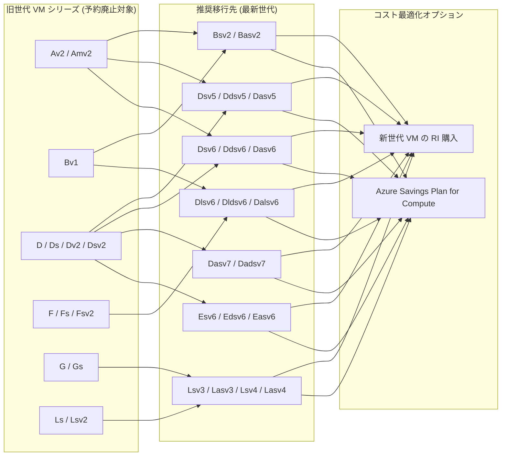

# Azure Reserved Virtual Machine Instances: 旧世代 VM シリーズの予約廃止

**リリース日**: 2026-05-05

**サービス**: Azure Virtual Machines / Azure Reserved VM Instances

**機能**: 旧世代 VM シリーズの予約購入・更新の廃止

**ステータス**: Retirement

[このアップデートのインフォグラフィックを見る](https://takech9203.github.io/azure-news-summary/20260505-reserved-vm-instances-retirement.html)

## 概要

2026 年 7 月 1 日以降、以下の旧世代 VM シリーズの 1 年間 Azure Reserved VM Instances (RI) の新規購入および更新が不可となる。対象シリーズは Av2、Amv2、Bv1、D、Ds、Dv2、Dsv2、F、Fs、Fsv2、G、Gs、Ls、Lsv2 である。

また、Dv3、Dsv3、Ev3、Esv3 シリーズについても 1 年および 3 年の予約インスタンスの新規購入・更新が 2026 年 7 月 1 日以降停止される(ただしこれらのシリーズ自体は現時点で廃止予定ではない)。

既存の予約は元の契約期間が終了するまで有効であるが、期限切れ後は従量課金制に移行する。

**アップデート前の課題**
- 旧世代 VM シリーズの予約インスタンスを購入・更新できたため、古いハードウェア上のワークロードに長期コミットメントを行うリスクがあった
- 旧世代 VM はパフォーマンスやコスト効率の面で最新世代に劣る

**アップデート後の改善**
- 新規予約が停止されることで、ユーザーは最新世代 VM への移行を促される
- Azure Savings Plan for Compute への移行により、VM ファミリーやリージョンを跨いだ柔軟なコスト最適化が可能になる
- 最新世代 VM (v5/v6/v7) への移行で、より高いパフォーマンス、NVMe 対応、広いリージョン可用性を享受できる

## アーキテクチャ図

以下の図は、旧世代 VM シリーズから推奨される最新世代 VM シリーズへの移行パスを示す。

## サービスアップデートの詳細

### 主要な変更点

| 項目 | 内容 |
|------|------|
| 予約購入停止日 | 2026 年 7 月 1 日 |
| 対象 (1 年 RI 停止) | Av2, Amv2, Bv1, D, Ds, Dv2, Dsv2, F, Fs, Fsv2, G, Gs, Ls, Lsv2 |
| 対象 (1 年 + 3 年 RI 停止) | Dv3, Dsv3, Ev3, Esv3 |
| 既存 RI の扱い | 契約期間満了まで有効 |
| VM シリーズ自体の廃止日 | シリーズにより異なる (2028 年 5 月〜11 月) |

### VM シリーズ別の廃止タイムライン

| VM シリーズ | 3 年 RI 期限切れ | 1 年 RI 期限切れ | VM 廃止日 |
|------------|----------------|----------------|-----------|
| Av2 | 2025/11/15 | 2026/07/01 | 2028/11/15 |
| Amv2 | 2025/11/15 | 2026/07/01 | 2028/11/15 |
| Bv1 | 2025/11/15 | 2026/07/01 | 2028/11/15 |
| D | 2025/05/01 | 2026/07/01 | 2028/05/01 |
| Ds | 2025/05/01 | 2026/07/01 | 2028/05/01 |
| Dv2 | 2025/05/01 | 2026/07/01 | 2028/05/01 |
| Dsv2 | 2025/05/01 | 2026/07/01 | 2028/05/01 |
| F | 2025/11/15 | 2026/07/01 | 2028/11/15 |
| Fs | 2025/11/15 | 2026/07/01 | 2028/11/15 |
| Fsv2 | 2025/11/15 | 2026/07/01 | 2028/11/15 |
| G | 2025/11/15 | 2026/07/01 | 2028/11/15 |
| Gs | 2025/11/15 | 2026/07/01 | 2028/11/15 |
| Ls | 2025/05/01 | 2026/07/01 | 2028/05/01 |
| Lsv2 | 2025/11/15 | 2026/07/01 | 2028/11/15 |

### 推奨移行先 VM シリーズ

| 旧世代 VM シリーズ | 推奨移行先 | 備考 |
|-------------------|-----------|------|
| D / Ds / Dv2 / Dsv2 | Dsv5/Ddsv5/Dasv5/Dadsv5、Dasv6/Dadsv6/Dsv6/Ddsv6、Dasv7/Dadsv7 | v5: SCSI、v6/v7: NVMe ディスクコントローラー |
| Av2 / Amv2 | Bsv2/Basv2、Dsv5/Ddv5/Dasv5、Dsv6/Ddsv6/Dasv6 | エントリーレベルは Bsv2 へ |
| Bv1 | Bsv2/Basv2、Dlsv5/Dldsv5/Dalsv5、Dlsv6/Dldsv6/Dalsv6 | バースト型ワークロード向け |
| F / Fs / Fsv2 | Dlsv6/Dldsv6/Dalsv6/Daldsv6、Falsv6、Dldsv5/Dlsv5/Dsv5/Ddsv5 | コンピュート最適化 |
| G / Gs | Lsv3/Lasv3、Lsv4/Lasv4 | メモリ/ストレージ集約型 |
| Ls / Lsv2 | Lsv3/Lasv3、Lsv4/Lasv4 | NVMe ローカルストレージ対応 |

## 技術仕様

### 移行時の考慮事項

- **ディスクコントローラー**: v6 シリーズは NVMe ディスクコントローラーを使用。対応 OS が必要
- **VM 世代**: v6 シリーズは Generation 2 VM のみサポート
- **ネットワーク**: v6 シリーズは MANA (Microsoft Azure Network Adapter) が必須。対応 OS が必要
- **リージョン可用性**: v6 シリーズは一部リージョンで利用不可の場合あり。その場合は v5 シリーズを検討

### v5 vs v6 シリーズの選択基準

| 条件 | 推奨 |
|------|------|
| NVMe 対応 OS を使用している | v6 シリーズ |
| Generation 1 VM を使用している | v5 シリーズ |
| MANA 対応 OS がない | v5 シリーズ |
| 特定リージョンで v6 が未対応 | v5 シリーズ |

## 移行手順

### 1. 予約インスタンスの確認

Azure Portal の [予約管理ページ](https://portal.azure.com/#blade/Microsoft_Azure_Reservations/ReservationsBrowseBlade) で現在の RI を確認する。

### 2. コスト最適化オプションの選択

以下の 3 つのオプションから選択:

1. **既存 RI の交換**: 新世代 VM シリーズの RI にペナルティなしで交換可能
2. **Azure Savings Plan for Compute への移行**: VM ファミリー・リージョンを跨いだ柔軟性を提供
3. **新世代 VM の新規 RI 購入**: 移行先の VM シリーズで新たに予約を購入

### 3. VM のリサイズ

1. VM を停止 (割り当て解除)
2. ターゲットの v5/v6 シリーズにリサイズ
3. VM を再起動

### 4. クォータの確認

リサイズ前に、サブスクリプションのクォータが移行先 VM シリーズに対して十分であることを確認する。不足の場合は Azure Portal からクォータ増加をリクエストする。

## メリット

### ビジネス面
- 最新世代への移行により、コストパフォーマンスが向上する
- Azure Savings Plan for Compute は RI より柔軟な割引を提供し、VM ファミリーやリージョンの変更に対応可能
- 廃止前に計画的に移行することで、予期しないコスト増加を回避できる

### 技術面
- 最新世代 VM は NVMe 対応により高い I/O パフォーマンスを提供
- Premium Storage、Accelerated Networking、Nested Virtualization など最新機能を利用可能
- より広いリージョン可用性

## デメリット・制約事項

- 2026 年 7 月 1 日以降、対象シリーズの 1 年 RI の購入・更新が不可
- 既存 RI の期限切れ後は従量課金制に自動移行 (コスト増加の可能性)
- v6 シリーズへの移行には NVMe 対応 OS、Generation 2 VM、MANA 対応が必要
- 一部のソブリンクラウドでは Bsv2、Bpsv2、Basv2 が利用不可
- VM のリサイズには一時的なダウンタイム (停止・再起動) が発生する

## ユースケース

### 早急に対応が必要なケース
- 対象 VM シリーズで 1 年 RI を利用しており、2026 年 7 月以降に更新予定だったお客様
- 3 年 RI が既に期限切れとなっている D/Ds/Dv2/Dsv2/Ls シリーズのお客様

### 計画的に対応すべきケース
- 対象 VM シリーズで大規模なワークロードを実行しているお客様
- 複数リージョンで旧世代 VM を使用しているお客様
- VM 廃止日 (2028 年) までに段階的な移行計画が必要なお客様

## 料金

予約廃止に関する直接的な料金変更はないが、以下の影響がある:

- **RI 期限切れ後**: 従量課金 (Pay-as-you-go) に移行。コストが最大 72% 増加する可能性
- **Azure Savings Plan for Compute**: 1 年または 3 年のコミットメントで最大 65% の割引
- **新世代 VM の RI**: 最大 72% の割引 (従量課金比)

詳細な料金は [Azure 料金計算ツール](https://azure.microsoft.com/pricing/calculator/) を参照。

## 利用可能リージョン

移行先 VM シリーズのリージョン可用性は、シリーズおよびサイズにより異なる。最新の対応状況は以下を参照:

- [Azure VM サイズ別リージョン可用性](https://azure.microsoft.com/explore/global-infrastructure/products-by-region/?products=virtual-machines)

## 関連サービス・機能

- **Azure Savings Plan for Compute**: RI の代替として推奨されるコスト最適化オプション
- **Azure Advisor**: 予約購入の推奨事項と移行ガイダンスを提供
- **Azure Cost Management**: 予約の使用状況と最適化の監視
- **Azure Reservations**: 予約の管理・交換・払い戻し

## 参考リンク

- [Azure Updates - 本アナウンスメント](https://azure.microsoft.com/updates?id=560948)
- [VM サイズ移行ガイド](https://learn.microsoft.com/azure/virtual-machines/migration/sizes/d-ds-dv2-dsv2-ls-series-migration-guide)
- [旧世代 VM サイズ一覧](https://learn.microsoft.com/azure/virtual-machines/sizes/previous-gen-sizes-list)
- [Azure VM サイズ概要](https://learn.microsoft.com/azure/virtual-machines/sizes/overview)
- [Azure VM リサイズガイド](https://learn.microsoft.com/azure/virtual-machines/sizes/resize-vm)
- [Azure Reservations 管理](https://learn.microsoft.com/azure/cost-management-billing/reservations/manage-reserved-vm-instance)
- [RI 交換ガイド](https://learn.microsoft.com/azure/cost-management-billing/reservations/exchange-and-refund-azure-reservations)
- [Azure Savings Plan へのトレードイン](https://learn.microsoft.com/azure/cost-management-billing/savings-plan/reservation-trade-in)
- [NVMe 対応ガイド](https://learn.microsoft.com/azure/virtual-machines/nvme-overview)

## まとめ

2026 年 7 月 1 日以降、旧世代 VM シリーズ (Av2、Amv2、Bv1、D、Ds、Dv2、Dsv2、F、Fs、Fsv2、G、Gs、Ls、Lsv2) の 1 年間 Azure Reserved VM Instances の新規購入・更新が停止される。既存の予約は契約期間終了まで有効だが、期限切れ後は従量課金に移行するため、コスト増加のリスクがある。

Solutions Architect として推奨されるアクションは以下の通り:

1. **現行 RI の棚卸し**: 対象シリーズの RI の残存期間を確認
2. **移行先の選定**: ワークロード要件に基づき v5/v6/v7 シリーズから適切な移行先を選択
3. **コスト最適化戦略の決定**: 新世代 VM の RI 購入、または Azure Savings Plan for Compute への移行を検討
4. **段階的な移行計画の策定**: VM 廃止日 (2028 年) までに全ワークロードの移行を完了する計画を立案

特に v6 シリーズへの移行は NVMe 対応 OS や Generation 2 VM が必要となるため、技術的な前提条件の確認を早期に行うことが重要である。

---

**タグ**: #Azure #VirtualMachines #ReservedInstances #Retirement #CostOptimization #Migration #Compute
