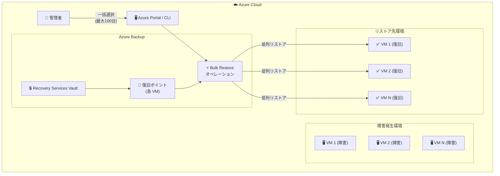

# Azure Backup: Azure VM の一括リストア (Bulk Restore)

**リリース日**: 2026-05-06

**サービス**: Azure Backup

**機能**: Azure Virtual Machines の一括リストア (Bulk Restore)

**ステータス**: In preview

[このアップデートのインフォグラフィックを見る](https://takech9203.github.io/azure-news-summary/20260506-azure-backup-bulk-restore.html)

## 概要

Azure Backup に「Bulk Restore」機能がパブリックプレビューとして追加された。この機能により、最大 100 台の Azure 仮想マシン (VM) を単一のオペレーションで一括リストアできるようになる。大規模な災害復旧 (DR) シナリオにおいて、複数 VM の復旧を効率的に実行しつつ、個々の VM レベルでの制御と粒度を維持することが可能となる。

従来の Azure Backup によるリストアでは、各 VM を個別に選択し、それぞれリストアポイントの選択、リストア先の指定、リストアタイプの選択といった手順を繰り返す必要があった。大規模環境で数十台以上の VM を復旧する場合、この反復作業が復旧時間の延長と運用負荷の増大を招いていた。Bulk Restore はこの課題を解決し、DR シナリオにおける RTO (Recovery Time Objective) の短縮に貢献する。

**アップデート前の課題**

- 大規模障害時に多数の VM を 1 台ずつ手動でリストアする必要があり、復旧に時間がかかった
- VM ごとにリストアポイントの選択、リストア先の指定、リストアタイプの選択を繰り返す運用負荷が大きかった
- 1 日あたりのリストア回数制限 (1 データソースあたり 24 時間で 20 回) の中で効率的に復旧を実行する必要があった
- 大規模環境での DR テストやフェイルオーバー演習に多大な工数がかかっていた

**アップデート後の改善**

- 最大 100 台の VM を単一オペレーションで一括リストアが可能
- 一括操作でありながら、個々の VM レベルでの制御と粒度は維持
- 大規模災害復旧シナリオでの復旧時間 (RTO) の短縮
- DR テストやフェイルオーバー演習の効率化

## アーキテクチャ図

管理者が最大 100 台の VM を一括選択し、Bulk Restore オペレーションが Recovery Services Vault の復旧ポイントから並列にリストアを実行する。個々の VM ごとにリストア設定を制御可能。

## サービスアップデートの詳細

### 主要機能

1. **一括リストア (最大 100 VM)**
   - 単一のオペレーションで最大 100 台の Azure VM を同時にリストア
   - 大規模な災害復旧シナリオに対応

2. **個別 VM レベルの制御**
   - 一括操作でありながら、各 VM のリストア設定を個別に制御可能
   - VM ごとにリストアポイント、リストア先、リストアタイプを指定可能

3. **既存リストアオプションとの互換性**
   - 新規 VM 作成、ディスクリストア、既存ディスク置換などの既存リストアタイプを利用可能
   - Cross Region Restore、Cross Subscription Restore、Cross Zonal Restore との組み合わせが期待される

## 技術仕様

| 項目 | 詳細 |
|------|------|
| 一括リストア最大 VM 数 | 100 台 |
| ステータス | パブリックプレビュー |
| リストアタイプ | 新規 VM 作成、ディスクリストア、既存ディスク置換 |
| スナップショット一貫性 | アプリケーション整合性、ファイルシステム整合性、クラッシュ整合性 |
| 暗号化対応 | SSE (プラットフォーム管理キー / カスタマー管理キー)、Azure Disk Encryption |

## メリット

### ビジネス面

- 大規模障害時の復旧時間 (RTO) を大幅に短縮
- DR テストの実施コストと工数を削減し、定期的な DR 演習が容易に
- ビジネス継続性計画 (BCP) の実効性向上
- 大規模環境における運用コストの削減

### 技術面

- 反復的な手動操作の排除による人的ミスの低減
- 並列リストアによる復旧スループットの向上
- 個別 VM レベルの制御を維持しつつ一括操作が可能
- 大規模環境での復旧オーケストレーションの簡素化

## デメリット・制約事項

- パブリックプレビュー段階であり、GA 時に仕様が変更される可能性がある
- 一括リストアの上限は 100 台 (それ以上の場合は複数回の操作が必要)
- Azure Resource Manager のリクエスト制限によるスロットリングが発生する可能性がある
- 大量の VM を同時にリストアする場合、ターゲットストレージアカウントの IOPS とスループットがボトルネックとなる可能性がある
- リストア先のストレージアカウントは VM ごとに異なるものを使用することが推奨される (スロットリング回避のため)

## ユースケース

### ユースケース 1: 大規模災害からの復旧

**シナリオ**: データセンター障害やリージョン障害により、数十台以上の VM が停止。ビジネスクリティカルなサービスを迅速に復旧する必要がある。

**効果**: 最大 100 台の VM を単一オペレーションで一括リストアすることで、1 台ずつ復旧する場合と比較して復旧時間を大幅に短縮。RTO の達成が容易になる。

### ユースケース 2: DR テスト・フェイルオーバー演習

**シナリオ**: BCP の一環として定期的に DR テストを実施する必要があるが、多数の VM を手動で復旧する工数が大きく、テスト頻度が低下している。

**効果**: 一括リストアにより DR テストの工数が削減され、より頻繁な演習の実施が可能に。DR 計画の実効性検証が容易になる。

### ユースケース 3: ランサムウェア攻撃からの復旧

**シナリオ**: ランサムウェア攻撃により複数の VM が暗号化され、クリーンな状態への復旧が必要。

**効果**: 攻撃前のリストアポイントを使用して、影響を受けた全 VM を一括で復旧。個別の VM ごとにリストアポイントを選択できるため、最適な復旧ポイントを VM ごとに指定可能。

## 料金

Azure Backup の既存料金体系に基づく。Bulk Restore 機能自体の追加料金については公式アナウンスで言及されていない。

Azure VM バックアップの料金は以下の要素で構成される:

| 項目 | 詳細 |
|------|------|
| 保護インスタンス料金 | VM の実データサイズに基づく月額料金 |
| バックアップストレージ | 各復旧ポイントの実データ合計に基づく |
| リストア操作 | データ転送量に基づく |

詳細は [Azure Backup 料金ページ](https://azure.microsoft.com/pricing/details/backup/) を参照。

## 関連サービス・機能

- **Azure Site Recovery**: VM の継続的レプリケーションによる DR ソリューション。Bulk Restore は定期バックアップからの復旧に特化
- **Recovery Services Vault**: バックアップデータの保管先。Bulk Restore はこの Vault に保存された復旧ポイントから実行
- **Cross Region Restore**: セカンダリリージョンからの復旧機能。大規模リージョン障害時の DR シナリオで Bulk Restore と組み合わせて利用
- **Azure Resource Manager**: VM のデプロイ管理。大量の同時リストアでは ARM のリクエスト制限を考慮する必要がある
- **Azure Monitor**: リストアジョブの監視とアラート。失敗時の通知設定が推奨される

## 参考リンク

- [インフォグラフィック](https://takech9203.github.io/azure-news-summary/20260506-azure-backup-bulk-restore.html)
- [公式アップデート情報](https://azure.microsoft.com/updates?id=561373)
- [Azure VM の復元 - Microsoft Learn](https://learn.microsoft.com/azure/backup/backup-azure-arm-restore-vms)
- [Azure VM バックアップの概要 - Microsoft Learn](https://learn.microsoft.com/azure/backup/backup-azure-vms-introduction)
- [料金ページ](https://azure.microsoft.com/pricing/details/backup/)

## まとめ

Azure Backup の Bulk Restore は、大規模環境における災害復旧の実効性を大幅に向上させるアップデートである。最大 100 台の VM を単一オペレーションでリストアできることにより、大規模障害時の復旧時間短縮、DR テストの効率化、ランサムウェア攻撃からの迅速な復旧が可能になる。

Solutions Architect としては、以下のアクションを推奨する:
- 既存の DR 計画における復旧手順の見直しと Bulk Restore の適用可能性評価
- プレビュー段階での DR テスト環境を用いた動作検証
- 大量 VM リストア時のストレージアカウント分散設計の確認
- GA 後の本番環境への導入計画の策定

---

**タグ**: #AzureBackup #DisasterRecovery #BulkRestore #VirtualMachines #Preview #BCP
