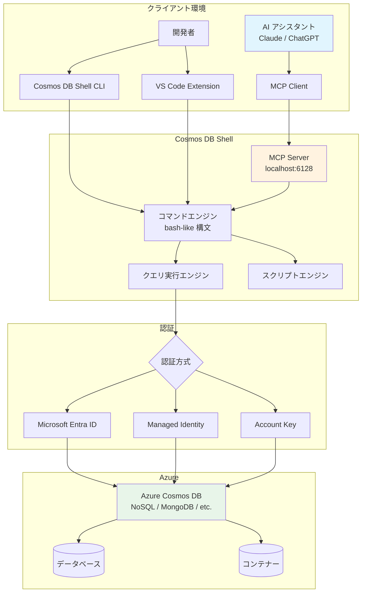

# Azure Cosmos DB: Shell - データワークフロー向け新コマンドラインツール (MCP 対応)

**リリース日**: 2026-05-06

**サービス**: Azure Cosmos DB

**機能**: Azure Cosmos DB Shell

**ステータス**: In preview

[このアップデートのインフォグラフィックを見る](https://takech9203.github.io/azure-news-summary/20260506-cosmosdb-shell-mcp-cli.html)

## 概要

Azure Cosmos DB Shell がパブリックプレビューとして公開された。これはオープンソースのコマンドラインインターフェース (CLI) であり、bash ライクなコマンド構文を使用して Azure Cosmos DB データベースと直感的に対話できるツールである。最大の特徴は、Model Context Protocol (MCP) サーバーサポートによる AI エージェント連携機能を備えている点にある。

本ツールは、開発者やデータベース管理者がコマンドラインから直接 Cosmos DB のデータを探索・クエリ・管理できるようにするものであり、`cd`、`ls`、`pwd`、`rm`、`mkdir` などの馴染みのあるコマンドを使用できる。さらに、パイプによるコマンドチェーンやスクリプティング機能もサポートしており、複雑なデータ操作の自動化が可能である。

MCP サーバー統合により、AI アシスタント (Claude、ChatGPT など) から直接 Cosmos DB リソースをプログラム的に操作できる。これにより、自然言語によるデータクエリや分析のワークフローが実現し、開発生産性の大幅な向上が期待される。

**アップデート前の課題**

- Cosmos DB のデータ操作には Azure Portal、SDK、または Data Explorer を使用する必要があり、コマンドラインからの迅速な対話的操作が困難であった
- AI アシスタントが Cosmos DB のデータに直接アクセスする標準的な手段がなく、AI 駆動のデータワークフロー構築が難しかった
- データベース管理のスクリプト化には SDK を使用したカスタムコードの記述が必要であった

**アップデート後の改善**

- bash ライクなコマンドで直感的にデータベースを操作でき、対話的なデータ探索が容易になった
- MCP サーバーを通じて AI アシスタントが Cosmos DB と直接連携でき、自然言語によるデータ操作が可能になった
- パイプやスクリプティングにより、複雑なデータワークフローの自動化が実現した
- VS Code 拡張機能によりエディタからシームレスに利用可能になった

## アーキテクチャ図



## サービスアップデートの詳細

### 主要機能

| 機能 | 説明 |
|------|------|
| Bash ライクコマンド | `cd`、`ls`、`pwd`、`rm`、`mkdir` などの馴染みのある構文 |
| データベース操作 | データベースとコンテナーの作成・管理 |
| データ操作 | ドキュメントのクエリ、挿入、更新、削除 |
| パイプサポート | コマンドのチェーンによるデータ変換 |
| JSON クエリ | SQL クエリの実行と JSON 出力 |
| スクリプティング | シェルスクリプトによる自動化操作 |
| MCP サーバー統合 | AI アシスタントとの連携 |
| VS Code 拡張機能 | Visual Studio Code とのシームレスな統合 |
| オープンソース | コミュニティ駆動の開発 |

## 技術仕様

| 項目 | 仕様 |
|------|------|
| パッケージ名 | CosmosDBShell |
| バージョン | 1.0.213-preview |
| ライセンス | MIT |
| .NET 要件 (NuGet) | .NET SDK 10.0 以降 |
| VS Code 要件 | VS Code 1.85 以降 |
| MCP デフォルトポート | 6128 |
| MCP 最大接続数 | 10 (デフォルト) |
| MCP タイムアウト | 30,000 ms (デフォルト) |
| 対応 OS | Windows (x64/ARM), macOS (Intel/Apple Silicon), Linux (x64/ARM64) |
| 自己完結型バイナリサイズ | 約 200 MB |

## 設定方法

### インストール方法 1: NuGet パッケージ (.NET グローバルツール)

```bash
# インストール
dotnet tool install --global CosmosDBShell --prerelease

# バージョン確認
cosmosdbshell --version

# アップデート
dotnet tool update --global CosmosDBShell --prerelease
```

### インストール方法 2: VS Code 拡張機能 (推奨)

1. VS Code を起動
2. 拡張機能マーケットプレイス (Ctrl+Shift+X) を開く
3. "Cosmos DB" を検索
4. "Azure Cosmos DB Shell" をインストール

### インストール方法 3: 自己完結型バイナリ

```bash
# macOS/Linux の場合
mkdir -p ~/cosmosdbshell
tar -xzf cosmosdbshell-linux-x64.tar.gz -C ~/cosmosdbshell
export PATH="$HOME/cosmosdbshell:$PATH"
```

### MCP サーバーの有効化 (VS Code)

VS Code の `settings.json` に以下を追加:

```json
{
  "cosmosDB.shell.MCP.enabled": true,
  "cosmosDB.shell.MCP.port": 6128,
  "cosmosDB.shell.MCP.startOnLaunch": true,
  "cosmosDB.shell.MCP.bindToLocalhost": true
}
```

### MCP サーバーの有効化 (コマンドライン)

```bash
cosmosdbshell --mcp --mcp-port 6128
```

### AI アシスタントとの連携設定

AI クライアントの MCP 設定に以下を追加:

```json
{
  "mcpServers": {
    "cosmosdb": {
      "command": "cosmosdbshell",
      "args": ["--mcp"],
      "env": {
        "MCP_PORT": "6128"
      }
    }
  }
}
```

## メリット

### ビジネス面

- **開発生産性の向上**: コマンドラインからの迅速なデータ操作により、開発・テストサイクルが短縮される
- **AI 活用の推進**: MCP 統合により、AI アシスタントを活用したデータ分析・管理ワークフローが構築でき、データインサイトの獲得が加速する
- **オンボーディングの簡素化**: bash ライクな構文により、新しいチームメンバーの学習コストが低い
- **運用自動化**: スクリプティング機能により、定型的なデータベース運用作業の自動化が可能

### 技術面

- **マルチプラットフォーム対応**: Windows、macOS、Linux の全主要プラットフォームで動作
- **柔軟なインストール**: NuGet、VS Code 拡張機能、自己完結型バイナリの 3 つの方式から選択可能
- **セキュアな認証**: Microsoft Entra ID、Managed Identity、Account Key に対応
- **MCP 標準準拠**: オープンスタンダードの MCP に準拠しており、様々な AI アシスタントとの相互運用が可能
- **パイプ処理**: Unix 的なコマンドチェーンにより、複雑なデータ変換を簡潔に記述可能

## デメリット・制約事項

- **プレビュー段階**: 現在パブリックプレビューであり、本番環境での使用は推奨されない。今後の仕様変更の可能性がある
- **.NET 依存 (NuGet)**: NuGet インストールには .NET SDK 10.0 以降が必要
- **MCP のローカル実行制限**: MCP サーバーはローカルホストにバインドされるため、リモートからの AI アシスタント接続には追加の構成が必要
- **NoSQL API 中心**: ドキュメントからは主に NoSQL API 向けの機能として説明されており、他の API (MongoDB、Cassandra など) での対応範囲は要確認
- **自己完結型バイナリのサイズ**: 約 200 MB と比較的大きい

## ユースケース

| ユースケース | 説明 |
|------|------|
| 開発・テスト | 開発中の迅速なコマンドラインアクセスによるデータ確認・操作 |
| データベース管理 | データベース、コンテナー、データの管理作業 |
| データ探索 | 対話的なクエリによるデータの探索・分析 |
| 自動化 | シェルスクリプトを使用した定型作業の自動化 |
| AI 連携 | MCP を通じた AI アシスタントによるデータ操作・分析 |
| 学習 | Cosmos DB の概念を学ぶための教育ツール |

## 料金

Cosmos DB Shell 自体は無料のオープンソースツール (MIT ライセンス) である。ただし、ツールを通じて実行されるクエリやデータ操作に対する Azure Cosmos DB の利用料金 (RU/s、ストレージなど) は通常通り課金される。

## 利用可能リージョン

Cosmos DB Shell はクライアントサイドのツールであるため、リージョンの制限はない。接続先の Azure Cosmos DB アカウントが利用可能な全てのリージョンで使用できる。

## 関連サービス・機能

| サービス/機能 | 関連性 |
|------|------|
| Azure Cosmos DB Data Explorer | ブラウザベースのデータ操作ツール。Shell はそのコマンドライン版 |
| Azure Cosmos DB SDK | プログラム的なアクセス。Shell はより対話的な操作向け |
| Model Context Protocol (MCP) | AI アシスタント連携のオープンスタンダード |
| VS Code Azure Cosmos DB 拡張機能 | Shell の VS Code 統合版 |
| Azure Data Studio | SQL Server 向けの類似ツール。Cosmos DB Shell は NoSQL 版 |

## 参考リンク

- [Azure Cosmos DB Shell 概要 - Microsoft Learn](https://learn.microsoft.com/en-us/azure/cosmos-db/shell/overview)
- [インストールガイド - Microsoft Learn](https://learn.microsoft.com/en-us/azure/cosmos-db/shell/install)
- [MCP セットアップガイド - Microsoft Learn](https://learn.microsoft.com/en-us/azure/cosmos-db/shell/model-context-protocol-setup)
- [Azure Updates 発表ページ](https://azure.microsoft.com/updates?id=561162)
- [NuGet パッケージ](https://www.nuget.org/packages/CosmosDBShell/1.0.213-preview)

## まとめ

Azure Cosmos DB Shell は、Cosmos DB を対象とした初のネイティブコマンドラインツールであり、bash ライクな構文による直感的なデータ操作と MCP サーバー統合による AI エージェント連携を実現する。開発者はコマンドラインから迅速にデータの探索・クエリ・管理が行えるようになり、AI アシスタントを活用した高度なデータワークフローの構築も可能となる。現在パブリックプレビューであるため本番利用は推奨されないが、開発・テスト環境での活用や、AI 駆動のデータ操作パイプラインの構築検証において大きな価値を発揮するツールである。

---

**タグ**: #Azure #CosmosDB #CLI #MCP #ModelContextProtocol #AI #Preview #OpenSource #データベース
