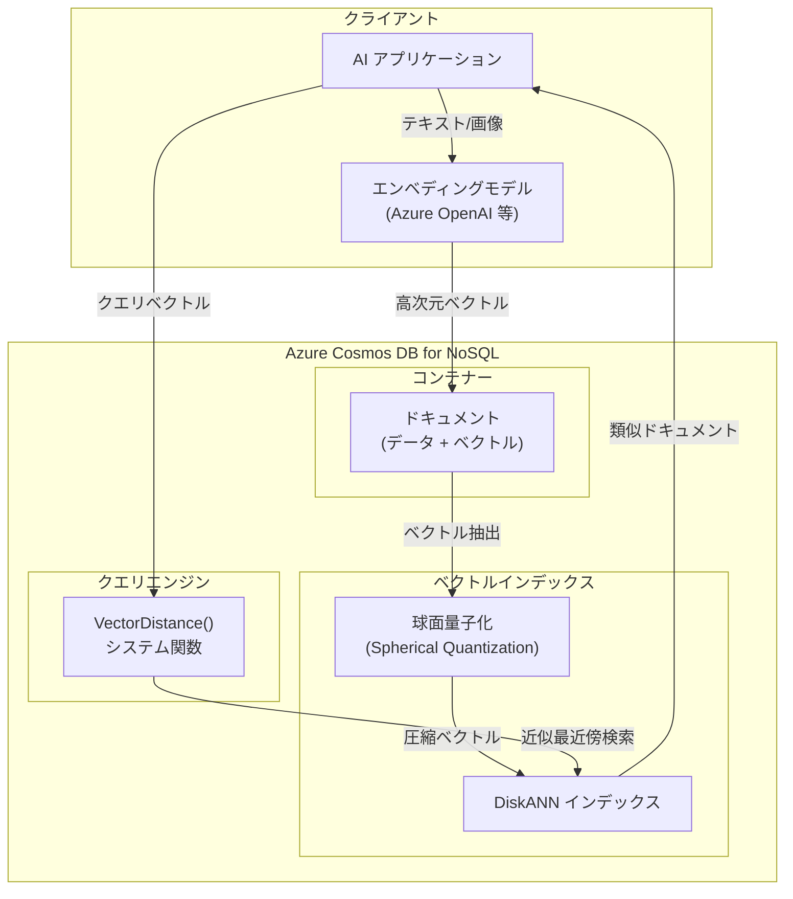

# Azure Cosmos DB: ベクトル検索のための球面量子化 (Spherical Quantization)

**リリース日**: 2026-05-06

**サービス**: Azure Cosmos DB

**機能**: ベクトル検索のための球面量子化 (Spherical Quantization for improved vector search)

**ステータス**: In preview

[このアップデートのインフォグラフィックを見る](https://takech9203.github.io/azure-news-summary/20260506-cosmosdb-spherical-quantization.html)

## 概要

Azure Cosmos DB for NoSQL において、ベクトルインデックスの量子化方式として新たに「球面量子化 (Spherical Quantization)」がパブリックプレビューとして利用可能になった。球面量子化は、ベクトルの圧縮品質を向上させる高度な技術であり、従来の積量子化 (Product Quantization) と比較して、高次元ベクトルにおいてより高い検索精度 (Recall) とインデックス作成速度の向上を実現する。

Azure Cosmos DB のベクトル検索機能は、DiskANN および quantizedFlat インデックスタイプにおいて量子化を使用しており、今回のアップデートではこの量子化プロセスに球面量子化を選択できるようになった。特に高次元のエンベディング (例: 3072 次元以上) を使用する RAG アプリケーションや AI アプリケーションにおいて、検索品質の安定性向上が期待される。

**アップデート前の課題**

- 積量子化 (Product Quantization) のみが利用可能で、非常に高次元のベクトルでは Recall が時間の経過とともに安定しない場合があった
- 大規模ベクトルデータセットのインデックス作成時間が長くなる傾向があった
- 高次元エンベディングモデル (例: OpenAI text-embedding-3-large の 3072 次元) を使用する際、量子化による精度低下が課題であった

**アップデート後の改善**

- 球面量子化により、高次元ベクトルでもより高い Recall を安定的に維持
- インデックス作成 (量子化処理) の速度向上
- DiskANN および quantizedFlat の両インデックスタイプで利用可能
- インデックスポリシーの `quantizerType` プロパティで簡単に設定可能

## アーキテクチャ図



球面量子化は、ベクトルがインデックスに格納される前の圧縮ステップとして機能する。高次元ベクトルを球面上に射影し、量子化することで、ベクトル間の角度関係を保持しつつデータを圧縮する。DiskANN インデックスと組み合わせることで、高速かつ高精度な近似最近傍検索を実現する。

## サービスアップデートの詳細

### 主要機能

1. **球面量子化 (Spherical Quantization)**
   - ベクトルを球面上に正規化した後に量子化を行う手法
   - 高次元ベクトルにおいてコサイン類似度の精度を維持しやすい
   - `quantizerType: "spherical"` として設定可能

2. **対応インデックスタイプ**
   - `diskANN`: 大規模ベクトルデータセット向けの高性能近似検索
   - `quantizedFlat`: 小規模データセット向けのブルートフォース検索 (量子化圧縮付き)

3. **既存のインデックスとの共存**
   - 同一コンテナー内で異なるベクトルパスに対して異なる量子化タイプを指定可能
   - 積量子化 (product) と球面量子化 (spherical) を混在して利用可能

## 技術仕様

| 項目 | 詳細 |
|------|------|
| 量子化タイプ | `spherical` (新規) / `product` (既定、従来) |
| 対応インデックスタイプ | `diskANN`, `quantizedFlat` |
| 最大ベクトル次元数 | 4,096 次元 |
| 最小ベクトル数 | 1,000 (量子化の精度確保のため) |
| 対応データタイプ | `float32`, `float16`, `int8`, `uint8` |
| 対応距離関数 | cosine, dot product, euclidean |
| ステータス | パブリックプレビュー |

## 設定方法

### 前提条件

1. Azure Cosmos DB for NoSQL アカウントが作成済みであること
2. ベクトル検索機能 (`EnableNoSQLVectorSearch`) が有効であること
3. 最低 1,000 件のベクトルデータが挿入されること (量子化精度の確保のため)

### ベクトル検索機能の有効化

```bash
az cosmosdb update \
  --resource-group <resource-group-name> \
  --name <account-name> \
  --capabilities EnableNoSQLVectorSearch
```

### コンテナーベクトルポリシーの設定

```json
{
    "vectorEmbeddings": [
        {
            "path": "/contentVector",
            "dataType": "float32",
            "distanceFunction": "cosine",
            "dimensions": 3072
        }
    ]
}
```

### 球面量子化を使用するインデックスポリシーの設定

```json
{
    "indexingMode": "consistent",
    "automatic": true,
    "includedPaths": [
        {
            "path": "/*"
        }
    ],
    "excludedPaths": [
        {
            "path": "/_etag/?"
        },
        {
            "path": "/contentVector/*"
        }
    ],
    "vectorIndexes": [
        {
            "path": "/contentVector",
            "type": "diskANN",
            "quantizerType": "spherical"
        }
    ]
}
```

### ベクトル検索クエリの実行

```sql
SELECT TOP 10 c.title, VectorDistance(c.contentVector, @queryVector) AS SimilarityScore
FROM c
ORDER BY VectorDistance(c.contentVector, @queryVector)
```

## メリット

### ビジネス面

- AI アプリケーションの検索精度向上により、エンドユーザー体験が改善
- 高精度なベクトル検索によりRAGアプリケーションの回答品質が向上
- インデックス作成速度の改善により、データ投入のスループットが向上

### 技術面

- 高次元ベクトル (3072 次元等) において Recall の安定性が向上
- 量子化処理の高速化によりインデックス構築時間を短縮
- 既存の DiskANN インデックスの設定に `quantizerType` を追加するだけで利用可能
- コサイン類似度を使用するワークロードで特に効果的

## デメリット・制約事項

- パブリックプレビュー段階のため、GA 時に仕様が変更される可能性がある
- `quantizedFlat` および `diskANN` インデックスは最低 1,000 件のベクトルが必要 (それ未満はフルスキャンにフォールバック)
- 最大 4,096 次元までの制約あり
- ワイルドカード文字 (`*`, `[]`) や配列内にネストされたベクトルパスは未対応
- 共有スループット (Shared Throughput) アカウントでは利用不可
- コンテナーでベクトルインデックスを有効にすると無効化できない
- ベクトルポリシーやインデックスポリシーの設定変更は、既存の設定を削除してから再作成する必要がある
- 短期間に大量のベクトル挿入 (500 万件超) を行う場合、インデックス構築に追加時間が必要

## ユースケース

### ユースケース 1: 大規模 RAG アプリケーション

**シナリオ**: 企業内ドキュメント検索システムで、OpenAI text-embedding-3-large (3072 次元) を使用して数百万件のドキュメントをベクトル化し、高精度な類似検索を行いたい。

**効果**: 球面量子化により、高次元ベクトルの圧縮時にコサイン類似度の関係が保持され、Recall が安定的に高水準を維持。DiskANN インデックスとの組み合わせにより、大規模データセットでも低レイテンシの検索が可能。

### ユースケース 2: マルチモーダル AI 検索

**シナリオ**: IoT センサーデータと画像データの両方をベクトル化し、異常検知や類似パターン検索を行うアプリケーション。Cosmos DB に運用データとベクトルを同一ドキュメントに格納し、フィルター付きベクトル検索を実行する。

**効果**: 球面量子化による高精度な近似検索と、Cosmos DB の WHERE 句によるフィルター機能を組み合わせることで、特定条件に合致するデータの中から効率的に類似パターンを発見できる。

### ユースケース 3: リアルタイムレコメンデーション

**シナリオ**: EC サイトにおける商品レコメンデーションで、ユーザーの行動履歴と商品特徴をベクトル化し、リアルタイムにパーソナライズされた推薦を行いたい。

**効果**: 球面量子化によるインデックス作成速度の向上により、新商品の追加時もインデックスの更新が高速化。DiskANN の低レイテンシ検索と組み合わせることで、リアルタイムレコメンデーションの品質と応答速度の両立が可能。

## 料金

球面量子化自体に追加料金は発生しない。料金は Azure Cosmos DB for NoSQL の通常の課金モデル (RU/s + ストレージ) に基づく。

ベクトル検索関連の主なコスト要素:
- **プロビジョンドスループット (RU/s)**: ベクトル検索クエリの実行に RU を消費
- **ストレージ**: ベクトルデータおよびインデックスのストレージ使用量に基づく課金
- **DiskANN インデックス**: インデックス構築と維持に RU を消費

量子化 (球面量子化を含む) はベクトルを圧縮するため、非圧縮のフラットインデックスと比較してストレージコストと検索時の RU 消費が削減される。

詳細は [Azure Cosmos DB 料金ページ](https://azure.microsoft.com/pricing/details/cosmos-db/) を参照。

## 利用可能リージョン

Azure Cosmos DB for NoSQL のベクトル検索機能が利用可能なすべてのリージョンで球面量子化が利用可能。具体的なリージョン一覧は公式ドキュメントを参照。

## 関連サービス・機能

- **Azure Cosmos DB DiskANN インデックス**: Microsoft Research が開発した高性能ベクトルインデックスアルゴリズム。球面量子化と組み合わせて使用
- **Azure Cosmos DB quantizedFlat インデックス**: 量子化付きブルートフォース検索。小規模データセット (50,000 件以下) に適する
- **Azure OpenAI Service**: エンベディングモデル (text-embedding-3-large 等) を提供。生成したベクトルを Cosmos DB に格納
- **Azure AI Search**: フルテキスト検索とベクトル検索を組み合わせたハイブリッド検索を提供する別のサービス
- **Azure Cosmos DB 変更フィード**: 新規ドキュメントのベクトル化パイプラインのトリガーとして利用可能

## 参考リンク

- [インフォグラフィック](https://takech9203.github.io/azure-news-summary/20260506-cosmosdb-spherical-quantization.html)
- [公式アップデート情報](https://azure.microsoft.com/updates?id=561167)
- [Azure Cosmos DB ベクトル検索の概要 - Microsoft Learn](https://learn.microsoft.com/azure/cosmos-db/nosql/vector-search)
- [ベクトルインデックスポリシー - Microsoft Learn](https://learn.microsoft.com/azure/cosmos-db/nosql/index-policy#vector-indexes)
- [VectorDistance システム関数 - Microsoft Learn](https://learn.microsoft.com/azure/cosmos-db/query/vectordistance)
- [DiskANN 論文 - Microsoft Research](https://www.microsoft.com/research/publication/diskann-fast-accurate-billion-point-nearest-neighbor-search-on-a-single-node/)
- [Azure Cosmos DB 料金ページ](https://azure.microsoft.com/pricing/details/cosmos-db/)

## まとめ

Azure Cosmos DB の球面量子化 (Spherical Quantization) は、ベクトル検索の精度と速度を向上させる新たな量子化オプションである。従来の積量子化 (Product Quantization) と比較して、特に高次元ベクトルにおいて Recall の安定性とインデックス作成速度の改善が期待される。

設定は既存のインデックスポリシーに `quantizerType: "spherical"` を追加するだけで完了するため、既に DiskANN または quantizedFlat インデックスを使用しているワークロードでは容易に評価可能である。

Solutions Architect としては、プレビュー段階であることを考慮しつつ、高次元エンベディング (3072 次元等) を使用する RAG アプリケーションや、Recall の安定性が重要なユースケースにおいて評価を検討することを推奨する。本番環境への適用はGA後の仕様確定を待つことが望ましい。

---

**タグ**: #AzureCosmosDB #VectorSearch #SphericalQuantization #DiskANN #AI #MachineLearning #Preview
