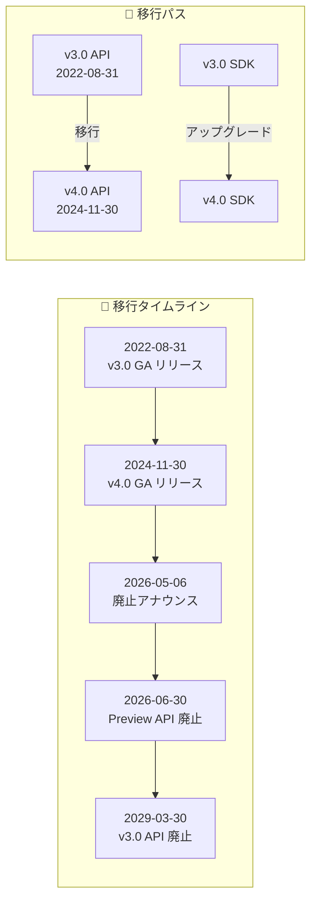

# Azure AI Document Intelligence: v3.0 API 廃止アナウンス (2029年3月30日)

**リリース日**: 2026-05-06

**サービス**: Azure AI Document Intelligence

**機能**: v3.0 API 廃止 (Retirement)

**ステータス**: Retirement announcement

[このアップデートのインフォグラフィックを見る](https://takech9203.github.io/azure-news-summary/20260506-document-intelligence-v3-retirement.html)

## 概要

Microsoft は、Azure Document Intelligence v3.0 API (REST API バージョン `2022-08-31`) を 2029年3月30日に廃止することを発表した。現在 v3.0 API を使用しているユーザーは、その日までに最新の GA バージョンである v4.0 API (REST API バージョン `2024-11-30`) へ移行する必要がある。

2029年3月30日以降、v3.0 API はサポートされなくなる。約3年間の移行猶予期間が設けられているが、v4.0 では Batch API、Searchable PDF、新しいプリビルトモデル、カスタム分類モデルの強化など多数の機能改善が含まれているため、早期の移行が推奨される。

なお、Preview API バージョン (2021-09-30-preview、2022-01-30-preview、2022-06-30-preview) については、2026年6月30日に先行して廃止される予定であり、より早急な対応が必要である。

**v3.0 API の現状**

- REST API バージョン `2022-08-31` として 2022年にリリースされ、現在も稼働中
- Read、Layout、General Document、Invoice、Receipt、ID Document、カスタムモデルなどの基本的なドキュメント処理機能を提供
- 関連する SDK (Python、.NET、Java、JavaScript) の旧バージョンも v3.0 API を使用

**v4.0 API への移行で得られる改善**

- Batch API による大量ドキュメントの一括処理サポート (全モデル対応)
- Searchable PDF 出力機能 (中国語・日本語・韓国語対応)
- 新しいプリビルトモデル追加 (銀行小切手、銀行明細書、給与明細、住宅ローン書類、クレジットカードなど)
- カスタム分類モデルのインクリメンタルトレーニングサポート
- カスタムニューラルモデルの署名検出機能
- Query Fields による AI ベースのフィールド抽出
- 分析結果の削除 API (GDPR/プライバシー対応)

## アーキテクチャ図

v3.0 から v4.0 への移行タイムラインと移行パスを示す。Preview API は 2026年6月30日に先行廃止され、v3.0 GA API は 2029年3月30日に廃止される。

## サービスアップデートの詳細

### 主要機能 (v4.0 で追加・強化された機能)

1. **Batch API**
   - 全モデル (Read、Layout、プリビルト、カスタム) で大量ドキュメントの一括分析をサポート
   - LIST 機能で過去7日間のバッチジョブ一覧表示が可能
   - DELETE 機能で GDPR/プライバシー準拠のためのジョブ明示的削除が可能

2. **Searchable PDF**
   - Read モデルで画像形式 (JPEG、PNG、BMP、TIFF、HEIF) からテキスト埋め込み PDF を生成
   - 中国語、日本語、韓国語に対応拡大

3. **カスタム分類モデルの強化**
   - インクリメンタルトレーニング: 既存クラスへの新サンプル追加や新クラスの追加が可能
   - トレーニングページ上限が 25,000 ページに拡大
   - モデルコピー操作によるバックアップ・災害復旧対応

4. **カスタムニューラルモデルの強化**
   - 署名検出機能の追加
   - 有料トレーニングによる長時間トレーニング対応 (月20回まで無料)

5. **新プリビルトモデル**
   - 銀行小切手 (Bank Check)
   - 銀行明細書 (Bank Statement)
   - 給与明細 (Pay Stub)
   - 住宅ローン書類 (1003、1004、1005、1008、Closing Disclosure)
   - クレジットカード
   - 結婚証明書
   - 米国税務書類の大幅拡充 (1095A、1095C、1099SSA、W4 など)

## 技術仕様

| 項目 | v3.0 (廃止予定) | v4.0 (移行先) |
|------|----------------|---------------|
| REST API バージョン | 2022-08-31 | 2024-11-30 |
| Batch API | 未サポート | 全モデル対応 |
| Searchable PDF | 未サポート | Read モデルで対応 |
| General Document モデル | 独立モデル | Layout モデルに統合 (keyValuePairs オプション) |
| カスタム分類モデル | 未サポート | サポート (インクリメンタルトレーニング対応) |
| カスタムニューラルモデル署名検出 | 未サポート | サポート |
| Query Fields | 未サポート | アドオン機能として対応 |
| 分析結果削除 API | 未サポート | サポート |
| トレーニングページ上限 (分類モデル) | - | 25,000 ページ |

## メリット

### ビジネス面

- 約3年間の長い移行猶予期間があるため、計画的な移行が可能
- v4.0 への移行により、住宅ローン、銀行、税務など業界特化の新プリビルトモデルを活用可能
- Batch API による大量ドキュメント処理の効率化

### 技術面

- Searchable PDF 出力により、OCR 結果を再利用可能な形式で保存可能
- カスタムモデルのインクリメンタルトレーニングにより、再トレーニングの負荷を軽減
- General Document モデルが Layout に統合されたことで API 呼び出しがシンプルに
- 分析結果削除 API により GDPR 対応が容易に

## デメリット・制約事項

- v3.0 で使用していた General Document モデル (`prebuilt-document`) は v4.0 で廃止されており、Layout モデルの `keyValuePairs` オプションに移行が必要
- カスタム分類モデルのデフォルト動作が変更: v4.0 ではドキュメント分割がデフォルトで無効化され、`splitMode` プロパティを明示的に `auto` に設定する必要がある
- SDK のメジャーバージョンアップが伴うため、コード修正が必要
- Business Card モデルは v4.0 で deprecated となっている

## ユースケース

### ユースケース 1: 大量請求書処理の移行

**シナリオ**: v3.0 の Invoice モデルで個別に請求書を処理していたシステムを、v4.0 の Batch API を活用した一括処理に移行する。

**効果**: 大量の請求書を一度のAPI呼び出しで処理可能になり、スループットが向上。バッチジョブの管理機能により運用の可視性も向上する。

### ユースケース 2: 日本語ドキュメントの Searchable PDF 化

**シナリオ**: スキャンした日本語ドキュメントを v4.0 の Read モデルで処理し、テキスト検索可能な PDF として出力する。

**効果**: v3.0 では対応していなかった日本語 Searchable PDF が利用可能になり、ドキュメントアーカイブの検索性が大幅に向上する。

## 料金

Document Intelligence の料金は処理するドキュメントのページ数とモデルの種類に基づく。v3.0 から v4.0 への移行に伴う追加料金は発生しないが、新しいアドオン機能 (Query Fields、High Resolution など) は追加コストが発生する。

- カスタムニューラルモデルのトレーニング: 月20回まで無料、それ以降は有料
- 詳細な料金情報: [Azure AI Document Intelligence 料金ページ](https://azure.microsoft.com/pricing/details/ai-document-intelligence/)

## 利用可能リージョン

Azure Document Intelligence v4.0 は Azure のグローバルインフラストラクチャの多くのリージョンで利用可能。詳細は [Azure リージョン別サービス提供状況](https://azure.microsoft.com/global-infrastructure/services/?products=metrics-advisor&regions=all) を参照。

## 関連サービス・機能

- **Azure AI Foundry**: Document Intelligence は Azure AI Foundry ポータルから利用可能
- **Azure AI Services**: Document Intelligence は Azure AI Services の一部として提供
- **Azure Blob Storage**: Batch API でのドキュメント入出力先として使用
- **Azure Monitor**: API 使用量の監視とアラート設定

## 参考リンク

- [インフォグラフィック](https://takech9203.github.io/azure-news-summary/20260506-document-intelligence-v3-retirement.html)
- [公式アップデート情報](https://azure.microsoft.com/updates?id=561176)
- [Microsoft Learn - What's new in Document Intelligence](https://learn.microsoft.com/en-us/azure/ai-services/document-intelligence/whats-new)
- [Microsoft Learn - Document Intelligence モデル概要](https://learn.microsoft.com/en-us/azure/ai-services/document-intelligence/model-overview)
- [Document Intelligence v3.1 移行ガイド](https://learn.microsoft.com/en-us/azure/ai-services/document-intelligence/v3-1-migration-guide)
- [REST API v4.0 リファレンス](https://learn.microsoft.com/en-us/rest/api/aiservices/operation-groups?view=rest-aiservices-v4.0%20(2024-11-30))
- [料金ページ](https://azure.microsoft.com/pricing/details/ai-document-intelligence/)

## まとめ

Azure Document Intelligence v3.0 API は 2029年3月30日に廃止される。約3年間の移行猶予期間が設けられているが、v4.0 では Batch API、Searchable PDF、多数の新プリビルトモデル、カスタムモデルの強化など大幅な機能追加が行われているため、早期の移行計画策定を推奨する。特に Preview API を使用している場合は 2026年6月30日に廃止されるため、至急の対応が必要である。移行にあたっては、General Document モデルの Layout モデルへの統合やカスタム分類モデルのデフォルト動作変更など、破壊的変更に注意が必要。

---

**タグ**: AI + Machine Learning, Azure AI Document Intelligence, Retirements, Migration, API Version
