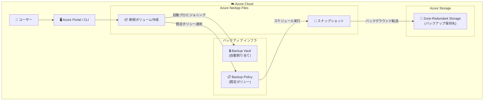

# Azure NetApp Files: ボリューム作成時のバックアップ既定有効化

**リリース日**: 2026-05-06

**サービス**: Azure NetApp Files

**機能**: ボリューム作成時のバックアップ既定有効化 (Enable backup by default)

**ステータス**: In preview

[このアップデートのインフォグラフィックを見る](https://takech9203.github.io/azure-news-summary/20260506-netapp-files-backup-by-default.html)

## 概要

Azure NetApp Files において、新規ボリューム作成時にバックアップが既定で有効化されるようになった。これにより、ボリューム作成と同時にバックアップが自動的にプロビジョニングされ、よりシームレスで安全なデータ保護体験が提供される。

従来、Azure NetApp Files のバックアップ機能を利用するには、ボリューム作成後に手動でバックアップ Vault の割り当てやバックアップポリシーの設定を行う必要があった。このアップデートにより、新規ボリューム作成のワークフローにバックアップ構成が統合され、セットアップの手間が削減される。カスタマイズも引き続き可能であり、必要に応じて設定を変更できる。

**アップデート前の課題**

- ボリューム作成後に手動でバックアップ Vault を作成・割り当てる必要があった
- バックアップポリシーの設定を忘れると、データ保護が欠落するリスクがあった
- バックアップ構成のセットアップに複数のステップが必要で、運用負荷が高かった

**アップデート後の改善**

- 新規ボリューム作成時にバックアップが自動的にプロビジョニングされる
- セットアップの手間が削減され、データ保護の確実性が向上
- バックアップ未設定のボリュームが生まれるリスクが低減
- カスタマイズは引き続き可能で、ユーザーの柔軟性は維持

## アーキテクチャ図



新規ボリューム作成時にバックアップ Vault とポリシーが自動的にプロビジョニングされ、スケジュールに基づいてスナップショットが Azure Storage (ZRS) に転送される。

## サービスアップデートの詳細

### 主要機能

1. **バックアップの既定有効化**
   - 新規ボリューム作成時にバックアップが自動的に有効化される
   - セットアップ工数の削減とデータ保護の確実性向上

2. **自動プロビジョニング**
   - バックアップ Vault の割り当てとポリシー設定がボリューム作成フローに統合
   - 追加の手動操作なしでバックアップが開始される

3. **カスタマイズの維持**
   - 自動設定後もバックアップポリシーの変更が可能
   - 必要に応じてバックアップの無効化も可能

## 技術仕様

| 項目 | 詳細 |
|------|------|
| バックアップストレージ | Zone-Redundant Storage (ZRS)。West US リージョンのみ LRS |
| バックアップ種別 | ポリシーベース (スケジュール) および手動 (オンデマンド) |
| バックアップ頻度 | 日次、週次、月次 (時間単位は未対応) |
| バックアップポリシーテンプレート | Default (各7コピー)、Extended (各14コピー)、Custom |
| 日次バックアップ最小保持数 | 2 |
| 週次スケジュール | 毎週月曜日 |
| 月次スケジュール | 毎月1日 |
| リストア | 同一リージョン内の新規ボリュームへリストア |
| 大容量ボリューム対応 | 10 TiB 超のボリュームは転送に数時間かかる場合あり |

## 設定方法

### 前提条件

1. Azure NetApp Files アカウントが作成済みであること
2. バックアップ Vault が利用可能であること (自動作成される場合を含む)
3. 大容量ボリュームを使用する場合は、大容量ボリューム機能への登録が必要

### Azure Portal

本プレビュー機能により、Azure Portal での新規ボリューム作成時にバックアップ構成が統合される。

1. Azure Portal にサインインし、**Azure NetApp Files** に移動
2. アカウントを選択し、新規ボリュームを作成
3. ボリューム作成ウィザードにてバックアップが既定で有効化されていることを確認
4. 必要に応じてバックアップポリシーをカスタマイズ
5. ボリューム作成を完了

### バックアップポリシーの変更 (既存の手順)

```bash
# バックアップポリシーの確認
az netappfiles backup policy show \
  --account-name <account-name> \
  --resource-group <resource-group> \
  --backup-policy-name <policy-name>
```

## メリット

### ビジネス面

- データ保護のコンプライアンス要件への準拠が容易になる
- バックアップ未設定による障害時のデータ損失リスクを低減
- 運用チームのセットアップ工数と管理負荷を削減

### 技術面

- ボリューム作成ワークフローの簡素化 (複数ステップの統合)
- 「設定忘れ」によるデータ保護のギャップを解消
- Zone-Redundant Storage による高可用性バックアップが自動適用
- 既定ポリシーによる一貫したバックアップ戦略の確保

## デメリット・制約事項

- バックアップは同一リージョン内にのみ保存される (クロスリージョンバックアップ非対応)
- 時間単位のバックアップは未対応 (日次、週次、月次のみ)
- 10 TiB 超のボリュームではバックアップ転送に数時間かかる場合がある
- Elastic zone-redundant storage を使用する場合は waitlist リクエストの提出が必要
- 手動バックアップ実行中はポリシーベースのバックアップを適用できない
- ボリュームが最大クォータに達した場合、大量のデータ変更があるとバックアップ作成が失敗する可能性がある
- West US リージョンのみ LRS (Zone-Redundant Storage ではない) で保護される
- 本機能はプレビュー段階であり、GA 時に変更される可能性がある

## ユースケース

### ユースケース 1: エンタープライズファイル共有のデータ保護

**シナリオ**: 企業の共有ファイルストレージとして Azure NetApp Files を新規導入する際、IT 管理者がバックアップの設定漏れなく確実にデータ保護を確立したい。

**効果**: ボリューム作成と同時にバックアップが自動的に有効化されるため、設定漏れのリスクがなくなり、コンプライアンス要件を即座に満たすことができる。

### ユースケース 2: 開発環境の迅速なプロビジョニング

**シナリオ**: 複数のプロジェクトチームが頻繁に新規ボリュームを作成する環境で、各ボリュームに一貫したバックアップポリシーを適用したい。

**効果**: 既定でバックアップが有効化されるため、個別のチームがバックアップ設定を意識する必要がなくなり、組織全体で一貫したデータ保護レベルが維持される。

## 料金

Azure NetApp Files のバックアップ料金は、バックアップによって消費されたストレージ総量に基づく従量課金制。

| 項目 | 料金 |
|------|------|
| バックアップストレージ | $0.05/GiB/月 |
| バックアップリストア | $0.02/GiB |
| セットアップ料金 | なし |
| 最小使用料金 | なし |

**料金例**: 500 GiB のベースラインバックアップ + 日次 5 GiB の増分バックアップ (30日間) の場合、月間バックアップストレージは約 650 GiB で月額約 $32.5。

詳細は [Azure NetApp Files 料金ページ](https://azure.microsoft.com/pricing/details/netapp/) を参照。

## 利用可能リージョン

Azure NetApp Files バックアップは、Azure NetApp Files が利用可能なすべてのリージョンで提供される。Elastic zone-redundant storage を使用する場合は、対応リージョンに限定される。

## 関連サービス・機能

- **Azure NetApp Files スナップショット**: 短期的なリカバリやクローン作成に使用。バックアップはスナップショットベースで Azure Storage に長期保存
- **Azure NetApp Files クロスリージョンレプリケーション**: ソースボリュームではバックアップ構成が可能。DR シナリオと組み合わせて利用
- **Azure NetApp Files Backup Vault**: バックアップの管理単位。バックアップの作成前に必要
- **Azure Storage (ZRS)**: バックアップの保存先。3 つの可用性ゾーンにデータを同期的にレプリケート

## 参考リンク

- [インフォグラフィック](https://takech9203.github.io/azure-news-summary/20260506-netapp-files-backup-by-default.html)
- [公式アップデート情報](https://azure.microsoft.com/updates?id=560668)
- [Azure NetApp Files バックアップの概要 - Microsoft Learn](https://learn.microsoft.com/azure/azure-netapp-files/backup-introduction)
- [ポリシーベースバックアップの構成 - Microsoft Learn](https://learn.microsoft.com/azure/azure-netapp-files/backup-configure-policy-based)
- [バックアップの要件と考慮事項 - Microsoft Learn](https://learn.microsoft.com/azure/azure-netapp-files/backup-requirements-considerations)
- [料金ページ](https://azure.microsoft.com/pricing/details/netapp/)

## まとめ

Azure NetApp Files の「バックアップ既定有効化」は、新規ボリューム作成時のデータ保護設定を大幅に簡素化するアップデートである。従来は手動で複数ステップの設定が必要だったバックアップ構成が、ボリューム作成フローに統合されることで、設定漏れによるデータ保護のギャップを解消する。

Solutions Architect としては、既存のバックアップ運用プロセスへの影響を確認し、プレビュー段階での動作を検証することを推奨する。特に、既定ポリシーが組織のバックアップ要件に合致するかの確認と、必要に応じたカスタマイズの計画が重要である。

---

**タグ**: #AzureNetAppFiles #Backup #DataProtection #Storage #Preview
