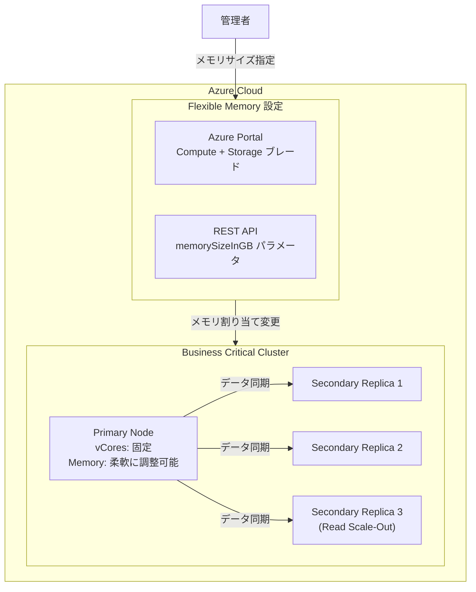

# Azure SQL Managed Instance: Business Critical メモリの適正化 (Flexible Memory)

**リリース日**: 2026-05-06

**サービス**: Azure SQL Managed Instance

**機能**: Business Critical サービスティアにおけるメモリの適正化 (Right-size Memory)

**ステータス**: In preview

[このアップデートのインフォグラフィックを見る](https://takech9203.github.io/azure-news-summary/20260506-sql-managed-instance-rightsize-memory.html)

## 概要

2026 年 5 月初旬のアップデートにより、Azure SQL Managed Instance の Business Critical サービスティアにおいて、メモリの適正化 (Right-size Memory) 機能がパブリックプレビューとして提供開始された。この機能は「Flexible Memory」と呼ばれ、vCore 数を変更せずにインスタンスに割り当てるメモリ量を柔軟に調整できる。

従来、Business Critical ティアではメモリ量は選択した vCore 数に応じた固定値で決定されていた。例えば Premium-series ハードウェアでは vCore あたり 7 GB が固定で割り当てられていた。この新機能により、ワークロードに最適なメモリ量を選択でき、過剰プロビジョニングを回避しながらパフォーマンスを維持できる。

この機能は Premium-series ハードウェア上の Business Critical ティアで利用可能であり、ローカル冗長構成およびゾーン冗長構成の両方のインスタンスに対応している。

**アップデート前の課題**

- メモリ量が vCore 数に固定されており、メモリだけを増減することができなかった
- メモリ要件が高いワークロードでは、不要な vCore を追加購入する必要があった (過剰プロビジョニング)
- メモリをあまり必要としないワークロードでも、vCore に付随する全メモリ分のコストが発生していた

**アップデート後の改善**

- vCore 数を変更せずにメモリ量を最小値から最大値の範囲で調整可能になった
- ワークロードに応じた適正なメモリ配分により、コスト最適化が実現できる
- Azure Portal または REST API から既存・新規インスタンスのメモリ割り当てを変更可能

## アーキテクチャ図



Business Critical ティアの 4 ノードクラスター構成において、各ノードのメモリ割り当てを vCore 数とは独立して調整できる。変更はインスタンス全体のすべてのデータベースに適用され、最終操作としてフェイルオーバーが実行される。

## サービスアップデートの詳細

### 主要機能

1. **メモリの独立スケーリング**
   - vCore 数を変更せずに、メモリ量を最小値から最大値の範囲で調整可能
   - vCore あたりのメモリ比率を 7 GB/vCore から最大 12 GB/vCore まで選択可能 (vCore 数による)

2. **既存インスタンスへの適用**
   - 新規インスタンスだけでなく、既存の Business Critical インスタンスにも適用可能
   - Azure Portal の「Compute + Storage」ブレードまたは REST API で変更

3. **ゾーン冗長構成のサポート**
   - ローカル冗長構成に加え、ゾーン冗長構成のインスタンスでも利用可能

## 技術仕様

| 項目 | 詳細 |
|------|------|
| 対象ハードウェア | Premium-series |
| 対象サービスティア | Business Critical |
| 対応構成 | ローカル冗長、ゾーン冗長 |
| メモリ最小比率 | 7 GB/vCore |
| メモリ最大比率 | 12 GB/vCore (48 vCores 以下) |
| 設定単位 | GB 単位で指定 |
| API バージョン | 2024-08-01-preview 以降 |
| 変更時の動作 | フェイルオーバーが発生 |

### メモリ割り当て範囲の例

| vCores | 最小 RAM (GB) | 最大 RAM (GB) | 対応メモリ値 | メモリ比率 |
|--------|--------------|--------------|-------------|-----------|
| 4 | 28 | 48 | 28, 32, 40, 48 | 7, 8, 10, 12 |
| 8 | 56 | 96 | 56, 64, 80, 96 | 7, 8, 10, 12 |
| 16 | 112 | 192 | 112, 128, 160, 192 | 7, 8, 10, 12 |
| 32 | 224 | 384 | 224, 256, 320, 384 | 7, 8, 10, 12 |
| 64 | 448 | 448 | 448 | 7 |
| 80 | 560 | 560 | 560 | 7 |

## 設定方法

### 前提条件

1. Premium-series ハードウェアで稼働する Business Critical ティアのインスタンス
2. Azure サブスクリプションへのアクセス権限 (共同作成者以上)

### REST API

```bash
# Managed Instance のメモリサイズを変更
# API バージョン 2024-08-01-preview 以降を使用
# memorySizeInGB プロパティでメモリ量を指定

curl -X PATCH \
  "https://management.azure.com/subscriptions/{subscription-id}/resourceGroups/{resource-group}/providers/Microsoft.Sql/managedInstances/{instance-name}?api-version=2024-08-01-preview" \
  -H "Authorization: Bearer {token}" \
  -H "Content-Type: application/json" \
  -d '{
    "properties": {
      "memorySizeInGB": 96
    }
  }'
```

### Azure Portal

1. Azure Portal で対象の SQL Managed Instance に移動
2. 「設定」セクションから「Compute + Storage」を選択
3. メモリ割り当てのスライダーを使用して目的のメモリ量を設定
4. 「適用」をクリックして変更を確定
5. フェイルオーバーが完了するまで待機

## メリット

### ビジネス面

- メモリの過剰プロビジョニングを削減し、コストを最適化できる
- ワークロードの実際の要件に基づいた適切なリソース配分が可能
- 不要な vCore の追加購入を回避し、ライセンスコストを削減

### 技術面

- ワークロード特性に応じた最適なメモリ/vCore 比率を選択可能
- vCore 変更なしでメモリを増加できるため、CPU リソースに影響を与えずにバッファプールを拡大可能
- In-Memory OLTP ワークロードに対して、必要なメモリだけを追加割り当て可能

## デメリット・制約事項

- メモリ変更時にフェイルオーバーが発生するため、短時間の接続断が生じる
- 現時点ではプレビュー段階であり、本番環境での使用には注意が必要
- Premium-series ハードウェアのみが対象 (Standard-series / Gen5 は非対応)
- 48 vCores を超える構成ではメモリの柔軟性が制限される (64 vCores 以上では固定)
- デフォルトメモリを超える追加メモリ分は別途 GB/時間で課金される

## ユースケース

### ユースケース 1: In-Memory OLTP ワークロードのメモリ増強

**シナリオ**: 8 vCores の Business Critical インスタンスで In-Memory OLTP を利用しているが、デフォルトの 56 GB では In-Memory OLTP オブジェクトの格納に不足する場合

**効果**: vCore を増やさずにメモリを 96 GB まで拡張でき、CPU コストを抑えながらインメモリ処理の容量を確保できる

### ユースケース 2: コスト最適化のためのメモリ削減

**シナリオ**: 高い CPU 性能は必要だがメモリ使用量が少ないワークロード (多数の同時接続による軽量クエリ処理など) で、割り当てメモリがほとんど使われていない場合

**効果**: 現在のアーキテクチャでは vCore に付随するメモリ分の課金が発生するが、将来的にメモリを適正化することでコスト効率を改善できる可能性がある

## 料金

| 項目 | 料金 |
|------|------|
| 基本メモリ (デフォルト) | vCore 料金に含まれる |
| 追加メモリ | GB/時間で別途課金 |

課金計算式: `課金対象メモリ = 合計メモリ - デフォルトメモリ (vCore数 x 7 GB)`

例: 4 vCore インスタンスで 40 GB のメモリを設定した場合、課金対象メモリは 40 - (4 x 7) = 12 GB となる。

## 利用可能リージョン

Premium-series ハードウェアが利用可能なすべてのリージョンで利用可能。Premium-series の提供状況はリージョンにより異なるため、詳細は Azure の公式ドキュメントを参照のこと。

## 関連サービス・機能

- **Next-gen General Purpose ティアの Flexible Memory**: 同様の柔軟なメモリ割り当て機能が Next-gen General Purpose ティアでは GA として提供済み
- **Azure SQL Managed Instance Premium-series**: Flexible Memory の前提となるハードウェア世代
- **Memory Optimized Premium-series**: より高いメモリ/vCore 比率 (13.6 GB/vCore) を標準で提供するハードウェアオプション

## 参考リンク

- [インフォグラフィック](https://takech9203.github.io/azure-news-summary/20260506-sql-managed-instance-rightsize-memory.html)
- [公式アップデート情報](https://azure.microsoft.com/updates?id=560283)
- [Microsoft Learn - Resource Limits](https://learn.microsoft.com/en-us/azure/azure-sql/managed-instance/resource-limits?view=azuresql#flexible-memory)
- [Microsoft Learn - vCore 購入モデル](https://learn.microsoft.com/en-us/azure/azure-sql/managed-instance/service-tiers-managed-instance-vcore?view=azuresql)
- [料金ページ](https://azure.microsoft.com/pricing/details/sql-database/managed/)

## まとめ

Azure SQL Managed Instance の Business Critical ティアにおける Flexible Memory 機能のパブリックプレビューにより、vCore 数とメモリ量を独立して調整できるようになった。これにより、過剰プロビジョニングを回避しながらワークロードに最適なリソース配分を実現できる。Premium-series ハードウェア上で動作し、Azure Portal または REST API から設定可能である。コスト最適化を重視する Solutions Architect にとって、既存の Business Critical インスタンスのメモリ利用状況を確認し、適正化の余地がないか検討することが推奨される。

---

**タグ**: #Azure #AzureSQL #SQLManagedInstance #BusinessCritical #FlexibleMemory #メモリ最適化 #コスト最適化 #パブリックプレビュー #データベース
