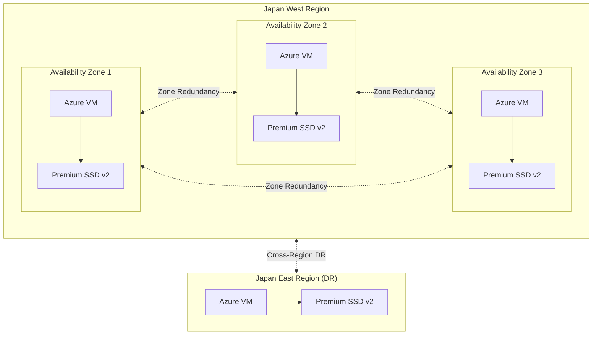

# Azure Disk Storage: Premium SSD v2 が Japan West リージョンの全 3 Availability Zone で利用可能に

**リリース日**: 2026-05-07

**サービス**: Azure Disk Storage

**機能**: Premium SSD v2 が Japan West リージョンの全 3 Availability Zone で GA

**ステータス**: Launched (GA)

[このアップデートのインフォグラフィックを見る](https://takech9203.github.io/azure-news-summary/20260507-premium-ssd-v2-japan-west.html)

## 概要

Azure Premium SSD v2 Disk Storage が Japan West (西日本) リージョンの全 3 Availability Zone で利用可能になった。これにより、Japan West は Premium SSD v2 を 3 つの Availability Zone すべてで利用できるリージョンとなり、西日本におけるミッションクリティカルなワークロードの耐障害性と柔軟性が大幅に向上する。

Premium SSD v2 は Azure 仮想マシン向けの次世代汎用ブロックストレージであり、サブミリ秒のレイテンシと優れたコストパフォーマンスを提供する。容量・IOPS・スループットをそれぞれ独立して調整できるため、ワークロードの要件に合わせた柔軟なパフォーマンスチューニングが可能である。

今回のアップデートにより、Japan East (東日本) に加えて Japan West でも全 AZ で Premium SSD v2 が利用可能となった。日本国内で 2 つのリージョンにまたがる DR (災害復旧) 構成において、両リージョンで同等のストレージパフォーマンスを確保できるようになり、日本の顧客にとって非常に重要なマイルストーンとなる。

**アップデート前の課題**

- Japan West で Premium SSD v2 を全 AZ で利用できなかったため、ゾーン冗長構成の選択肢が制限されていた
- Japan East のみが全 AZ で Premium SSD v2 をサポートしており、国内 DR 構成でストレージ性能に非対称性が生じていた
- 西日本リージョンのユーザーは、一部の AZ でのみ Premium SSD v2 を利用可能であり、ワークロード配置の柔軟性が制約されていた

**アップデート後の改善**

- Japan West の 3 つの AZ すべてで Premium SSD v2 が利用可能となり、完全なゾーン冗長構成が実現
- Japan East と Japan West の両方で全 AZ 対応となり、国内リージョン間 DR 構成の設計自由度が向上
- 西日本リージョンで AZ 間のワークロード分散が柔軟になり、より堅牢な HA 構成を設計可能に

## アーキテクチャ図



Japan West の 3 つの Availability Zone に Premium SSD v2 ディスクを分散配置し、Japan East との間でリージョン間 DR 構成を実現する構成例。国内 2 リージョンの両方で全 AZ 対応となったことで、対称的な HA/DR アーキテクチャが構築可能になった。

## サービスアップデートの詳細

### 主要機能

1. **全 3 AZ での Premium SSD v2 サポート**
   - Japan West リージョンの 3 つすべての Availability Zone で Premium SSD v2 が利用可能に
   - これにより Japan West は「Three Availability Zones」完全対応リージョンに昇格

2. **独立したパフォーマンスチューニング**
   - 容量 (1 GiB ~ 64 TiB)、IOPS (最大 80,000)、スループット (最大 2,000 MB/s) をそれぞれ独立して設定可能
   - 24 時間以内に最大 4 回のパフォーマンス変更が可能 (ディスク作成を含む)
   - ダウンタイムなしでパフォーマンスを調整可能

3. **サブミリ秒レイテンシ**
   - Premium SSD v2 は 99.9% の時間でサブミリ秒のレイテンシを提供
   - ホストキャッシュは非対応だが、低レイテンシにより同等の効果を実現

4. **コスト効率の高い料金モデル**
   - ベースライン IOPS (3,000) とスループット (125 MB/s) が無料で提供
   - 必要なパフォーマンスのみに課金される従量制モデル
   - Premium SSD v1 のような固定サイズモデルと異なり、無駄な課金を回避

## 技術仕様

| 項目 | 詳細 |
|------|------|
| 最大ディスクサイズ | 65,536 GiB (64 TiB) |
| 最大 IOPS | 80,000 |
| 最大スループット | 2,000 MB/s |
| ベースライン IOPS (無料) | 3,000 |
| ベースラインスループット (無料) | 125 MB/s |
| IOPS スケーリング | 6 GiB 以上で 500 IOPS/GiB |
| スループットスケーリング | 0.25 MB/s per provisioned IOPS |
| レイテンシ | サブミリ秒 (99.9% SLA) |
| セクターサイズ | 4k (デフォルト) / 512E |
| ホストキャッシュ | 非対応 |
| OS ディスクとしての使用 | 非対応 |
| SKU | PremiumV2_LRS |
| パフォーマンス変更回数 | 24 時間以内に最大 4 回 |

## 設定方法

### 前提条件

1. Azure サブスクリプションが有効であること
2. 最新の Azure CLI または Azure PowerShell モジュールがインストールされていること
3. VM を Availability Zone を指定して作成すること (Premium SSD v2 はゾーナル VM にのみアタッチ可能)

### Azure CLI

```bash
# Premium SSD v2 ディスクを Japan West の AZ 1 に作成
az disk create -n myPremiumSSDv2Disk -g myResourceGroup \
  --size-gb 100 \
  --disk-iops-read-write 5000 \
  --disk-mbps-read-write 150 \
  --location japanwest \
  --zone 1 \
  --sku PremiumV2_LRS \
  --logical-sector-size 4096

# VM を同じリージョン・AZ に作成してディスクをアタッチ
az vm create -n myVM -g myResourceGroup \
  --image Ubuntu2204 \
  --zone 1 \
  --size Standard_D4s_v3 \
  --location japanwest \
  --attach-data-disks myPremiumSSDv2Disk
```

```bash
# 対応リージョン・AZ をプログラムで確認
az vm list-skus --resource-type disks \
  --query "[?name=='PremiumV2_LRS'].{Region:locationInfo[0].location, Zones:locationInfo[0].zones}"
```

```bash
# パフォーマンスの動的調整 (ダウンタイム不要)
az disk update --resource-group myResourceGroup \
  --name myPremiumSSDv2Disk \
  --disk-iops-read-write 10000 \
  --disk-mbps-read-write 300
```

### Azure Portal

1. Azure Portal にサインインし、**Virtual machines** に移動
2. VM 作成時に **Availability options** で **Availability zone** を選択
3. リージョンで **Japan West** を選択し、任意の AZ (1, 2, 3) を選択
4. **Disks** ページで **Create and attach a new disk** を選択
5. **Disk SKU** で **Premium SSD v2** を選択
6. 容量・IOPS・スループットを必要に応じて設定
7. セクターサイズ (4k または 512E) を選択してデプロイ

## メリット

### ビジネス面

- **国内 DR 構成の完全対称化**: Japan East と Japan West の両方で全 AZ 対応となり、国内リージョン間 DR の設計が容易に
- **データ主権の確保**: 日本国内でデータを保持しつつ、最高レベルの可用性を実現
- **コスト最適化**: 容量・IOPS・スループットを個別に設定できるため、必要なパフォーマンスのみに課金される
- **SLA の向上**: 3 AZ 構成により、単一 AZ 障害時のサービス継続性が向上
- **ディスクストライピング不要**: パフォーマンスを柔軟に調整できるため、複数ディスクのストライピングによるパフォーマンス確保が不要

### 技術面

- **完全なゾーン冗長**: 3 つの AZ すべてで利用可能となり、真のゾーン冗長アーキテクチャを構築可能
- **サブミリ秒レイテンシ**: トランザクション集約型ワークロード (SQL Server, Oracle, SAP HANA 等) に最適
- **動的パフォーマンス調整**: ダウンタイムなしで IOPS / スループットを変更可能
- **幅広い VM シリーズ対応**: DSv3, Ddsv4, Esv5, M-series など多数の VM シリーズでサポート

## デメリット・制約事項

- OS ディスクとしては使用不可 (データディスクのみ)
- Azure Compute Gallery との併用不可
- ホストキャッシュ非対応
- ゾーナル VM にのみアタッチ可能 (Availability Zone を指定して VM を作成する必要がある)
- 現時点では LRS (ローカル冗長ストレージ) 構成のみサポート
- 24 時間以内のパフォーマンス変更は最大 4 回まで (ディスク作成を含む)
- リージョンあたりサブスクリプションあたりのデフォルト容量上限は 100 TiB (クォータ増加リクエストにより拡張可能)

## ユースケース

### ユースケース 1: 西日本拠点の金融機関向けデータベース基盤

**シナリオ**: 大阪に本拠を置く金融機関が、Japan West リージョンで SQL Server Always On 可用性グループを 3 つの AZ に分散配置し、ミッションクリティカルなデータベース基盤を構築する。

**実装例**:

```bash
# AZ 1 にプライマリノード用ディスクを作成
az disk create -n sqlPrimaryDisk -g sqlRG \
  --size-gb 512 --disk-iops-read-write 20000 --disk-mbps-read-write 500 \
  --location japanwest --zone 1 --sku PremiumV2_LRS

# AZ 2 にセカンダリノード用ディスクを作成
az disk create -n sqlSecondary1Disk -g sqlRG \
  --size-gb 512 --disk-iops-read-write 10000 --disk-mbps-read-write 250 \
  --location japanwest --zone 2 --sku PremiumV2_LRS

# AZ 3 にセカンダリノード用ディスクを作成
az disk create -n sqlSecondary2Disk -g sqlRG \
  --size-gb 512 --disk-iops-read-write 10000 --disk-mbps-read-write 250 \
  --location japanwest --zone 3 --sku PremiumV2_LRS
```

**効果**: 3 AZ にまたがる SQL Server Always On 構成により、単一データセンター障害時も自動フェイルオーバーでサービス継続が可能。セカンダリノードの IOPS を抑えることでコストを最適化しつつ、必要時にはパフォーマンスを動的に引き上げ可能。

### ユースケース 2: Japan East / Japan West 間の国内 DR 構成

**シナリオ**: 日本国内でデータ主権要件を満たしつつ、リージョン障害に備えた DR 構成を構築する。プライマリを Japan East、DR サイトを Japan West に配置する。

**実装例**:

```bash
# Japan East (プライマリ) にディスクを作成
az disk create -n primaryDisk -g drRG \
  --size-gb 1024 --disk-iops-read-write 30000 --disk-mbps-read-write 750 \
  --location japaneast --zone 1 --sku PremiumV2_LRS

# Japan West (DR サイト) にディスクを作成
az disk create -n drDisk -g drRG \
  --size-gb 1024 --disk-iops-read-write 15000 --disk-mbps-read-write 375 \
  --location japanwest --zone 1 --sku PremiumV2_LRS
```

**効果**: 両リージョンで Premium SSD v2 の全 AZ サポートが利用可能になったことで、DR サイトでもプライマリと同等のストレージ性能を確保可能。DR サイトの IOPS を通常時は低く設定し、フェイルオーバー時に動的に引き上げることでコストを最適化。

## 料金

Premium SSD v2 の料金は容量・IOPS・スループットの 3 つの要素で構成される。

| 項目 | 詳細 |
|------|------|
| ディスク容量 | GiB 単位で課金 (時間課金) |
| プロビジョニング IOPS | 3,000 IOPS まで無料、超過分は IOPS 単位で課金 |
| プロビジョニングスループット | 125 MB/s まで無料、超過分は MB/s 単位で課金 |

具体的な料金はリージョンにより異なるため、[Azure Managed Disks 料金ページ](https://azure.microsoft.com/pricing/details/managed-disks/) で Japan West リージョンの料金を確認することを推奨する。

Premium SSD v1 と比較して、Premium SSD v2 は必要なパフォーマンスのみに課金される従量制モデルであるため、ワークロードによっては大幅なコスト削減が期待できる。

## 利用可能リージョン

Premium SSD v2 の 3 Availability Zone サポートリージョン (Japan West を含む):

Austria East, Australia East, Brazil South, Canada Central, Central India, Central US, China North 3, East Asia, East US, East US 2, France Central, Germany West Central, Indonesia Central, Israel Central, Italy North, Japan East, **Japan West**, Korea Central, Malaysia West, Mexico Central, New Zealand North, North Europe, Norway East, Poland Central, Spain Central, South African North, South Central US, Southeast Asia, Sweden Central, Switzerland North, UAE North, UK South, US Gov Virginia, West Europe, West US 2, West US 3

## 関連サービス・機能

- **Azure Ultra Disks**: Premium SSD v2 よりもさらに高い IOPS (最大 400,000) とスループット (最大 10,000 MB/s) を必要とするワークロード向け
- **Premium SSD (v1)**: OS ディスクとして使用可能な従来型のプレミアム SSD。固定サイズ・固定パフォーマンスモデル
- **Azure Virtual Machines**: Premium SSD v2 をデータディスクとしてアタッチ。DSv3, Ddsv4, Esv5, M-series など幅広い VM シリーズに対応
- **Azure Compute Fleet**: 複数の VM タイプを組み合わせたフリート構成で Premium SSD v2 を活用可能
- **Azure Migrate**: オンプレミスから Azure への移行時に Premium SSD v2 をターゲットストレージとして選択可能

## 参考リンク

- [インフォグラフィック](https://takech9203.github.io/azure-news-summary/20260507-premium-ssd-v2-japan-west.html)
- [公式アップデート情報](https://azure.microsoft.com/updates?id=561814)
- [Microsoft Learn - Azure ディスクの種類](https://learn.microsoft.com/en-us/azure/virtual-machines/disks-types)
- [Microsoft Learn - Premium SSD v2 のデプロイ](https://learn.microsoft.com/en-us/azure/virtual-machines/disks-deploy-premium-v2)
- [料金ページ](https://azure.microsoft.com/pricing/details/managed-disks/)

## まとめ

Azure Premium SSD v2 が Japan West リージョンの全 3 Availability Zone で GA となったことで、日本国内の両リージョン (Japan East / Japan West) で Premium SSD v2 の全 AZ サポートが実現した。これにより、西日本拠点の顧客はゾーン冗長構成を最大限に活用でき、また国内 2 リージョン間の対称的な DR アーキテクチャの構築が可能になる。

Solutions Architect への推奨アクション:
- Japan West で既に Premium SSD v2 を利用している場合、全 AZ にワークロードを分散し耐障害性を向上させる
- 新規のミッションクリティカルなワークロード (SQL Server, SAP HANA, Oracle 等) を Japan West にデプロイする際は、3 AZ 構成を標準アーキテクチャとして採用する
- Japan East / Japan West 間の国内 DR 構成において、両リージョンで Premium SSD v2 を活用し、DR サイトの IOPS を動的に制御することでコストを最適化する
- Premium SSD v2 の動的パフォーマンス調整機能を活用し、ピーク時と通常時でコストを最適化する

---

**タグ**: #Azure #DiskStorage #PremiumSSDv2 #JapanWest #AvailabilityZone #GA #Storage #HighAvailability #DR
