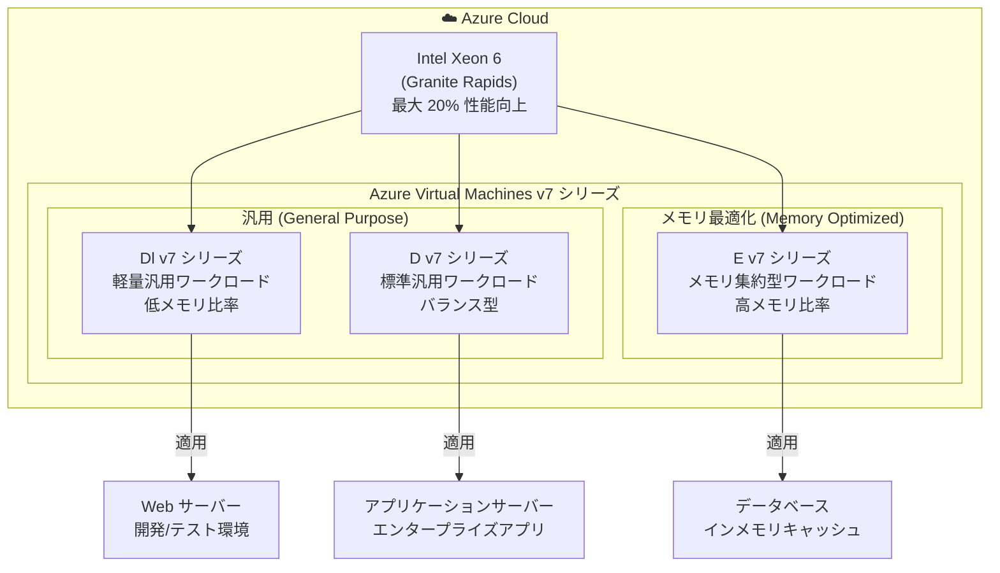

# Azure Virtual Machines: Dl/D/E v7 シリーズ一般提供開始

**リリース日**: 2026-05-07

**サービス**: Azure Virtual Machines

**機能**: Dl/D/E v7 シリーズ仮想マシン (Intel Xeon 6 Granite Rapids 搭載)

**ステータス**: Launched (GA)

[このアップデートのインフォグラフィックを見る](https://takech9203.github.io/azure-news-summary/20260507-vm-dl-d-e-v7-series.html)

## 概要

Azure は新しい Dl/D/E v7 シリーズ仮想マシンの一般提供 (GA) を発表した。これらの VM は最新の Intel Xeon 6 (Granite Rapids) プロセッサを搭載しており、汎用 (General Purpose) およびメモリ最適化 (Memory Optimized) のワークロードに対応する。

前世代と比較して、汎用コンピュートパフォーマンスが最大 20% 向上しており、幅広いワークロードに対してより高いコストパフォーマンスを提供する。Dl v7 は軽量汎用ワークロード向け、D v7 は標準的な汎用ワークロード向け、E v7 はメモリ最適化ワークロード向けとして位置づけられる。

**アップデート前の課題**

- 前世代 (v6) の VM では、最新のプロセッサ性能を活用できず、同一コスト内での処理能力に上限があった
- 汎用コンピュートワークロードにおいて、より高いパフォーマンスを得るにはスケールアップまたはスケールアウトが必要だった
- メモリ集約型ワークロードでの性能向上余地が限られていた

**アップデート後の改善**

- Intel Xeon 6 (Granite Rapids) プロセッサにより、前世代比で最大 20% の汎用コンピュートパフォーマンス向上
- 同じ VM サイズでより多くの処理を実行できるため、コスト効率が改善
- 3 つのシリーズ (Dl/D/E) により、ワークロード特性に応じた最適な VM サイズ選択が可能

## アーキテクチャ図



v7 シリーズは Intel Xeon 6 (Granite Rapids) プロセッサを共通基盤とし、ワークロード特性に応じて Dl (軽量汎用)、D (標準汎用)、E (メモリ最適化) の 3 つのシリーズから選択可能な構成となっている。

## サービスアップデートの詳細

### 主要機能

1. **Dl v7 シリーズ (軽量汎用)**
   - vCPU あたりのメモリ比率が低い汎用 VM
   - メモリ使用量が比較的少ないワークロードに最適化
   - コスト効率を重視する軽量ワークロード向け

2. **D v7 シリーズ (標準汎用)**
   - バランスの取れた vCPU とメモリの比率
   - 幅広いエンタープライズワークロードに対応
   - 前世代 D v6 からの直接的なアップグレードパス

3. **E v7 シリーズ (メモリ最適化)**
   - vCPU あたりのメモリ比率が高い VM
   - メモリ集約型ワークロード (データベース、キャッシュなど) に最適化
   - 大規模メモリを必要とするエンタープライズアプリケーション向け

## 技術仕様

| 項目 | 詳細 |
|------|------|
| プロセッサ | Intel Xeon 6 (Granite Rapids) |
| パフォーマンス向上 | 前世代比で最大 20% の汎用コンピュート性能向上 |
| カテゴリ (Dl v7) | 汎用 - 軽量 (低メモリ比率) |
| カテゴリ (D v7) | 汎用 - 標準 (バランス型) |
| カテゴリ (E v7) | メモリ最適化 (高メモリ比率) |

## 設定方法

### Azure CLI

```bash
# D v7 シリーズ VM の作成例
az vm create \
  --resource-group myResourceGroup \
  --name myVM \
  --image Ubuntu2204 \
  --size Standard_D4_v7 \
  --admin-username azureuser \
  --generate-ssh-keys
```

```bash
# 利用可能な v7 VM サイズの確認
az vm list-sizes --location eastus --query "[?contains(name, '_v7')]" --output table
```

### Azure Portal

1. Azure Portal で「仮想マシン」を選択し、「+ 作成」をクリック
2. 基本設定でリソースグループ、VM 名、リージョンを入力
3. 「サイズ」セクションで「すべてのサイズを表示」を選択
4. フィルターで「v7」を検索し、Dl v7 / D v7 / E v7 から適切なサイズを選択
5. 残りの設定を構成してデプロイ

## メリット

### ビジネス面

- 同一 VM サイズで最大 20% の性能向上により、スケールアップせずにパフォーマンス改善が可能
- より少ない VM インスタンスで同等の処理能力を実現でき、コスト最適化に寄与
- 最新世代プロセッサによるエネルギー効率向上

### 技術面

- Intel Xeon 6 (Granite Rapids) の最新アーキテクチャによる IPC (Instructions Per Clock) の向上
- 3 つのシリーズ (Dl/D/E) によりワークロード特性に合わせた粒度の細かいサイジングが可能
- 前世代からのマイグレーションが容易 (同じ Azure VM インフラストラクチャ上で動作)

## デメリット・制約事項

- 新シリーズのため、初期段階では利用可能リージョンが限定される可能性がある
- 前世代 (v6) からの移行時に VM サイズ名が変更されるため、IaC テンプレートの更新が必要
- Reserved Instances を購入済みの場合、v7 シリーズへの変更には予約の交換または新規購入が必要になる場合がある

## ユースケース

### ユースケース 1: Web アプリケーションサーバー (D v7)

**シナリオ**: エンタープライズ Web アプリケーションを D v6 から D v7 にアップグレードし、同じコストでリクエスト処理能力を向上させる。

**効果**: 最大 20% のパフォーマンス向上により、ピーク時のレスポンスタイムが改善し、ユーザー体験が向上。VM 台数を削減してコスト削減も可能。

### ユースケース 2: インメモリデータベース (E v7)

**シナリオ**: SQL Server や SAP HANA などのメモリ集約型データベースワークロードを E v7 シリーズで実行し、プロセッサ性能向上の恩恵を受ける。

**効果**: データベースクエリの処理速度が向上し、トランザクション処理能力が改善。メモリ帯域幅の向上により大規模データセットの処理が高速化。

### ユースケース 3: 開発/テスト環境 (Dl v7)

**シナリオ**: 開発・テスト環境に Dl v7 シリーズを使用し、メモリ使用量が少ないビルド・CI/CD パイプラインのコスト効率を最適化する。

**効果**: 低メモリ比率の VM を選択することで、不要なメモリコストを削減しつつ、ビルド・テスト処理は 20% 高速化。

## 料金

v7 シリーズの具体的な料金は公式の料金ページを参照。一般的に、新世代 VM は前世代と同等またはわずかに異なる料金設定となり、性能向上分を考慮すると実質的なコストパフォーマンスが向上する。

最新の料金は [Azure Virtual Machines 料金ページ](https://azure.microsoft.com/pricing/details/virtual-machines/) を参照。

## 利用可能リージョン

一般提供開始に伴い展開が進行中。利用可能なリージョンの最新情報は [Azure リージョン別製品提供状況](https://azure.microsoft.com/explore/global-infrastructure/products-by-region/?products=virtual-machines) を参照。

## 関連サービス・機能

- **Azure Virtual Machine Scale Sets**: v7 シリーズ VM を使用した自動スケーリング構成
- **Azure Reserved Virtual Machine Instances**: v7 シリーズの予約インスタンスによるコスト削減
- **Azure Spot Virtual Machines**: v7 シリーズをスポットインスタンスとして利用し、さらなるコスト最適化
- **Azure Compute Gallery**: v7 シリーズ対応のカスタムイメージ管理

## 参考リンク

- [インフォグラフィック](https://takech9203.github.io/azure-news-summary/20260507-vm-dl-d-e-v7-series.html)
- [公式アップデート情報](https://azure.microsoft.com/updates?id=560734)
- [Azure Virtual Machines 料金ページ](https://azure.microsoft.com/pricing/details/virtual-machines/)
- [Azure VM サイズ一覧](https://learn.microsoft.com/azure/virtual-machines/sizes)

## まとめ

Azure Dl/D/E v7 シリーズは、Intel Xeon 6 (Granite Rapids) プロセッサを搭載した最新世代の仮想マシンであり、前世代と比較して最大 20% の汎用コンピュートパフォーマンス向上を実現する。軽量汎用 (Dl)、標準汎用 (D)、メモリ最適化 (E) の 3 シリーズにより、ワークロード特性に応じた最適な VM 選択が可能である。

既存の v5/v6 世代 VM を利用しているユーザーは、パフォーマンス向上とコスト効率改善のために v7 シリーズへのアップグレードを検討することを推奨する。特にコンピュート集約型のワークロードでは、同一コストでの処理能力向上が見込める。

---

**タグ**: #Azure #VirtualMachines #Compute #IntelXeon6 #GraniteRapids #Dv7 #Dlv7 #Ev7 #GA #パフォーマンス向上
