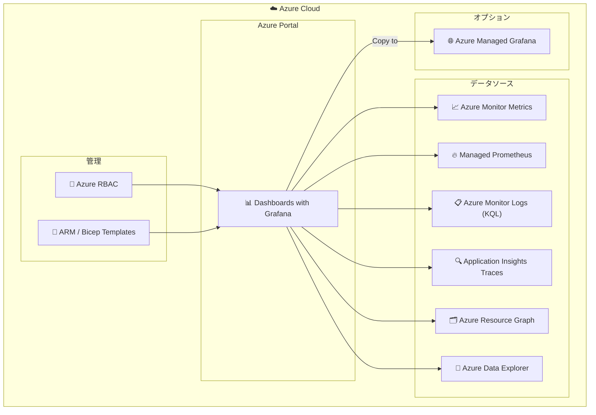

# Azure Monitor: Dashboards with Grafana が Public、Government (Fairfax)、China で一般提供開始

**リリース日**: 2026-05-12

**サービス**: Azure Monitor

**機能**: Dashboards with Grafana (GA)

**ステータス**: Launched (GA)

[このアップデートのインフォグラフィックを見る](https://takech9203.github.io/azure-news-summary/20260512-azure-monitor-grafana-dashboards.html)

## 概要

Azure Monitor dashboards with Grafana が一般提供 (GA) となり、Public クラウド、Government (Fairfax)、China リージョンで利用可能になった。これにより、Grafana のオープンかつコンポーザブルな可視化プラットフォームが Azure Portal 内に直接統合され、開発者やオペレーターが Grafana ダッシュボードを作成、編集、共有できるようになった。

この機能は追加コストなし、設定不要で利用でき、Azure Monitor が収集するメトリクス、ログ、トレースのデータを Grafana の豊富なビジュアライゼーション機能で可視化できる。既存の Azure Managed Grafana とは異なり、Azure Portal 内で完結するライトウェイトなソリューションとして位置づけられている。

Government (Fairfax) および China リージョンへの対応により、規制要件のある組織でも同じ監視ダッシュボード体験を利用できるようになった。

**アップデート前の課題**

- Azure Portal 内でのモニタリングデータの可視化は Azure Monitor のネイティブダッシュボードやワークブックに限定されていた
- Grafana を使用するには Azure Managed Grafana の別途プロビジョニングと追加コストが必要だった
- Government や China リージョンでは Grafana ベースの可視化オプションが限られていた
- Grafana コミュニティダッシュボードを活用するには外部の Grafana インスタンスが必要だった

**アップデート後の改善**

- Azure Portal 内で直接 Grafana ダッシュボードを作成・編集・共有できるようになった
- 追加コストなし、設定不要で即座に利用開始できる
- 数千の Grafana コミュニティダッシュボードをインポート可能
- Azure RBAC によるアクセス制御、ARM/Bicep テンプレートによる自動化に対応
- Public、Government (Fairfax)、China の全クラウド環境で利用可能

## アーキテクチャ図

Azure Monitor dashboards with Grafana は Azure Portal 内で動作し、複数の Azure データソースに接続してデータを可視化する。必要に応じて Azure Managed Grafana へダッシュボードをコピーして、より高度な機能を利用することも可能。

## サービスアップデートの詳細

### 主要機能

1. **プリビルトダッシュボード**
   - Azure リソースのモニタリングデータを可視化するための事前構築済みダッシュボードが提供される
   - Kubernetes クラスターからスクレイプされた Prometheus メトリクスの可視化に対応

2. **Grafana コミュニティダッシュボードのインポート**
   - 数千の公開 Grafana コミュニティダッシュボードをインポートして利用可能
   - Prometheus データソースに対応したダッシュボードをそのまま活用できる

3. **カスタムダッシュボードの作成**
   - Azure Portal 内で独自のダッシュボードを作成可能
   - Grafana の豊富なビジュアライゼーションとクライアントサイドのデータ変換機能を利用可能

4. **Azure ネイティブリソース管理**
   - Grafana ダッシュボードを Azure ネイティブリソースとして管理
   - Azure RBAC によるアクセス制御
   - ARM テンプレートおよび Bicep テンプレートによる自動化

5. **Azure Managed Grafana へのコピー**
   - 作成したダッシュボードを Azure Managed Grafana インスタンスにコピー可能
   - パネル、クエリ、レイアウトが保持される

## 技術仕様

| 項目 | 詳細 |
|------|------|
| 対応データソース | Azure Monitor Metrics、Azure Managed Prometheus、Azure Monitor Logs (KQL)、Application Insights Traces、Azure Resource Graph、Azure Data Explorer |
| 認証方式 | 現在のユーザー ID (Current User) のみ |
| アクセス方法 | Azure Portal 内 (Azure Monitor > Dashboards with Grafana) |
| ゾーン冗長 | デフォルトで有効 |
| プライベートネットワーク | 非対応 |
| 確定的アウトバウンド IP | 非対応 |
| コンピュートリソース | SaaS (専用リソース不要) |

## 設定方法

### 前提条件

1. Azure サブスクリプション
2. Azure Monitor で監視対象リソースのデータ収集が構成済みであること
3. 適切な Azure RBAC ロール (データソースへの読み取りアクセス権)

### Azure Portal

1. Azure Portal にサインイン
2. **Azure Monitor** に移動
3. 左側メニューから **Dashboards with Grafana** を選択
4. プリビルトダッシュボードから選択するか、新しいダッシュボードを作成
5. コミュニティダッシュボードをインポートする場合は、Grafana コミュニティダッシュボードの ID を使用してインポート

### Azure Managed Grafana へのコピー手順

1. ユーザー保存済みダッシュボードを開く
2. ツールバーの **Copy to Managed Grafana** を選択
3. サイドペインで既存の Azure Managed Grafana ワークスペースを選択、または新規作成
4. **Copy** を選択してデプロイを開始

## メリット

### ビジネス面

- 追加コストなしで Grafana ダッシュボード機能を利用可能 (Azure Managed Grafana はユーザー単位の課金が発生)
- Government (Fairfax) および China リージョンでの利用により、規制対応が必要な組織でも統一されたモニタリング体験を提供
- 既存の Grafana ナレッジを持つチームが追加投資なしで Azure 上で活用可能

### 技術面

- 設定不要で即座に利用開始 (プロビジョニング不要の SaaS モデル)
- Azure RBAC との統合により既存のアクセス制御ポリシーをそのまま適用可能
- ARM/Bicep テンプレートによる Infrastructure as Code 対応
- ゾーン冗長がデフォルトで有効 (高可用性)
- 必要に応じて Azure Managed Grafana へシームレスに移行可能

## デメリット・制約事項

- Grafana アラート機能は非対応 (アラートが必要な場合は Azure Managed Grafana を使用)
- レポートのスケジュール機能は非対応
- ライブラリパネル、スナップショット、プレイリスト、App プラグインは非対応
- プライベートネットワーク (Private Link) は非対応
- 外部データソース (OSS データソース、エンタープライズデータソース) は非対応
- データソースの認証は現在のユーザー ID のみ (マネージド ID やアプリ登録は不可)
- Grafana Enterprise 機能は非対応
- Azure 管理テンプレートダッシュボードは直接コピーできない (一度保存してからコピーが必要)

## ユースケース

### ユースケース 1: Kubernetes クラスターのモニタリング

**シナリオ**: AKS クラスターの Prometheus メトリクスを Grafana ダッシュボードで可視化し、チーム全体で共有する

**実装例**:

1. Azure Monitor で AKS クラスターの Prometheus メトリクス スクレイピングを有効化
2. Azure Portal で Azure Monitor > Dashboards with Grafana に移動
3. プリビルトの Kubernetes ダッシュボードを選択、またはコミュニティダッシュボードをインポート
4. Azure RBAC でチームメンバーにアクセス権を付与

**効果**: 追加コストなしで Kubernetes クラスターの包括的なモニタリングダッシュボードを構築し、運用チーム全体で共有できる

### ユースケース 2: マルチリソースの統合監視ダッシュボード

**シナリオ**: 複数の Azure リソース (VM、ストレージ、データベース) のメトリクスとログを単一のダッシュボードで統合監視する

**実装例**:

1. Azure Monitor > Dashboards with Grafana でカスタムダッシュボードを新規作成
2. Azure Monitor Metrics データソースから各リソースのメトリクスパネルを追加
3. Azure Monitor Logs (KQL) データソースからログクエリパネルを追加
4. Grafana のビジュアライゼーション機能でデータ変換とレイアウトを調整

**効果**: 単一のビューでインフラストラクチャ全体の健全性を把握でき、問題の早期検知とトラブルシューティングの迅速化を実現

## 料金

Azure Monitor dashboards with Grafana は追加コストなしで利用可能。

| 項目 | 料金 |
|------|------|
| Azure Monitor dashboards with Grafana | 無料 |
| Azure Managed Grafana (比較参考) | ユーザー単位の課金 + Standard SKU のコンピュートコスト |

無料枠: Azure Monitor dashboards with Grafana 自体が無料で提供される。ただし、データソースとなる Azure Monitor のデータ収集・保持には別途料金が発生する (Azure Monitor Metrics、Log Analytics ワークスペースなど)。

## 利用可能リージョン

- **Public クラウド**: 全リージョンで利用可能
- **Government (Fairfax)**: 利用可能 (今回の GA で追加)
- **China**: 利用可能 (今回の GA で追加)

## 関連サービス・機能

- **Azure Managed Grafana**: フルマネージドの Grafana サービス。アラート、レポート、外部データソース、プライベートネットワークなど高度な機能が必要な場合に使用
- **Azure Monitor Metrics**: Azure リソースからの数値時系列データ。dashboards with Grafana の主要データソース
- **Azure Monitor managed service for Prometheus**: Kubernetes クラスターからスクレイプした Prometheus メトリクスを管理するサービス
- **Azure Monitor Logs (Log Analytics)**: KQL によるログ・パフォーマンスデータのクエリ
- **Application Insights**: 分散トレーシングデータの可視化に使用
- **Azure Resource Graph**: サブスクリプション全体の Azure リソースをクエリ

## 参考リンク

- [インフォグラフィック](https://takech9203.github.io/azure-news-summary/20260512-azure-monitor-grafana-dashboards.html)
- [公式アップデート情報](https://azure.microsoft.com/updates?id=561564)
- [Microsoft Learn ドキュメント - Visualize Azure Monitor data with Grafana](https://learn.microsoft.com/en-us/azure/azure-monitor/visualize/grafana-plugin)
- [Microsoft Learn ドキュメント - Copy dashboard to Managed Grafana](https://learn.microsoft.com/en-us/azure/azure-monitor/visualize/visualize-copy-to-managed-grafana)
- [料金ページ - Azure Managed Grafana](https://azure.microsoft.com/pricing/details/managed-grafana/)

## まとめ

Azure Monitor dashboards with Grafana の GA は、Azure Portal 内で無料かつ設定不要で Grafana ダッシュボードを利用できる重要なアップデートである。特に Government (Fairfax) および China リージョンへの対応は、規制要件のある組織にとって大きな意味を持つ。

推奨される次のアクション:
1. Azure Portal で Azure Monitor > Dashboards with Grafana を確認し、プリビルトダッシュボードを試用する
2. 既存の Grafana コミュニティダッシュボードのインポートを検討する
3. アラートやプライベートネットワークが必要な場合は Azure Managed Grafana への移行パスを計画する
4. ARM/Bicep テンプレートを使用したダッシュボードの IaC 管理を検討する

---

**タグ**: Azure Monitor, Grafana, Dashboards, DevOps, Management and governance, Open Source, GA, Government, China
