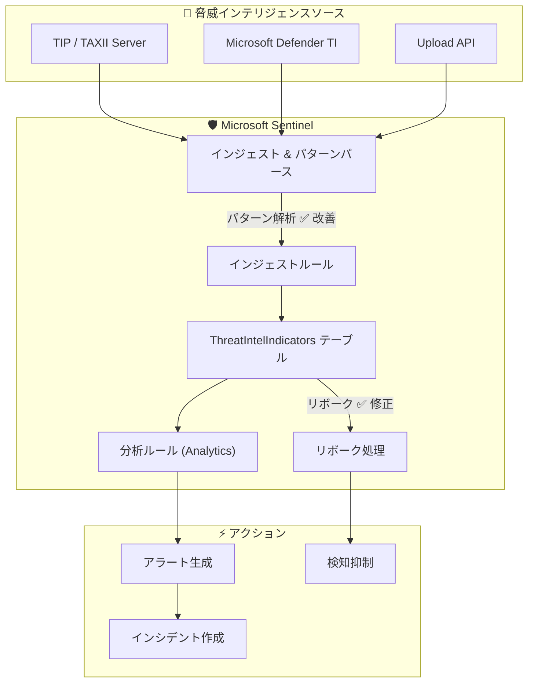

# Microsoft Sentinel: 脅威インテリジェンス (TI) のパターンパース精度向上とリボーク信頼性の改善

**リリース日**: 2026-05-12

**サービス**: Microsoft Sentinel

**機能**: Threat Intelligence - パターンパースの改善とリボーク信頼性の修正

**ステータス**: Launched (GA)

[このアップデートのインフォグラフィックを見る](https://takech9203.github.io/azure-news-summary/20260512-sentinel-ti-pattern-parsing-revoke.html)

## 概要

Microsoft Sentinel の脅威インテリジェンス (Threat Intelligence) 機能において、パターンベースのワークフローの精度と制御性を向上させる 2 つの重要な改善がリリースされた。

1 つ目は、リボーク (revoke) アクションが一貫して適用されない問題の修正である。これにより、脅威インジケーターの無効化操作が確実に反映されるようになった。2 つ目は、パターンパース (pattern parsing) のサポート改善であり、STIX パターンの解析精度が向上した。

これらの改善は、セキュリティオペレーションチームが脅威インジケーターのライフサイクルを管理する際の信頼性を高め、誤検知の削減やインシデント対応の正確性向上に寄与する。

**アップデート前の課題**

- リボークアクションが一貫して適用されず、無効化したはずのインジケーターが依然としてアラートを生成する可能性があった
- パターンベースのワークフローにおいて、特定のパターン形式が正しくパースされないケースがあった

**アップデート後の改善**

- リボークアクションが確実に適用され、意図した通りに変更が反映されるようになった
- パターンパースのサポートが改善され、より多様なパターン形式に対応可能になった

## アーキテクチャ図

この図は、脅威インテリジェンスが外部ソースからインジェストされ、パターンパースを経てテーブルに格納された後、分析ルールで検知に活用される流れを示している。今回の改善箇所であるパターンパースとリボーク処理を強調表示している。

## サービスアップデートの詳細

### 主要機能

1. **リボーク (Revoke) の信頼性修正**
   - リボークアクションが一貫して適用されない問題を解決
   - インジケーターを無効化した際に、変更が確実かつ意図した通りに反映されるようになった
   - これにより、期限切れや誤ったインジケーターによる誤検知を確実に防止できる

2. **パターンパースのサポート改善**
   - STIX パターンの解析精度が向上
   - パターンベースのワークフローにおいて、より多様な形式のパターンが正確に処理されるようになった
   - 脅威インジケーターのマッチング精度が向上し、検知の正確性が改善

## 技術仕様

| 項目 | 詳細 |
|------|------|
| 対象サービス | Microsoft Sentinel - Threat Intelligence |
| STIX バージョン | STIX 2.0 / 2.1 |
| 影響範囲 | パターンベースのインジケーター、リボーク操作 |
| データ格納先 | ThreatIntelIndicators テーブル (新)、ThreatIntelligenceIndicator テーブル (レガシー) |
| 対応インジケーター種別 | ドメイン名、URL、IPv4/IPv6 アドレス、ファイルハッシュ、X509 証明書、JA3/JA3S フィンガープリント、ユーザーエージェント |

## メリット

### ビジネス面

- 脅威インジケーターのリボーク操作が確実に機能することで、セキュリティ運用の信頼性が向上
- 誤検知の削減により、SOC チームのアラート疲れを軽減
- インシデント対応の精度が向上し、対応時間の短縮に貢献

### 技術面

- パターンパースの精度向上により、STIX パターンベースの検知ルールがより正確に動作
- リボーク操作の一貫性が確保され、脅威インテリジェンスのライフサイクル管理が改善
- TAXII サーバーや TIP 製品からインジェストされるインジケーターの処理信頼性が向上

## ユースケース

### ユースケース 1: 誤検知インジケーターの即時無効化

**シナリオ**: SOC チームが特定のドメインインジケーターが誤検知を発生させていることを発見し、即座にリボークする必要がある場合。

**効果**: リボーク操作が確実に反映されるようになったため、リボーク後に当該インジケーターによる新規アラートが確実に停止する。以前は操作後もアラートが継続するケースがあったが、今回の修正により信頼性が確保された。

### ユースケース 2: 複雑な STIX パターンによる高度な脅威検知

**シナリオ**: TAXII サーバーから複雑な複合条件パターン (複数のインジケータータイプを組み合わせた STIX パターン) を含む脅威インテリジェンスをインジェストする場合。

**効果**: パターンパースの改善により、以前は正しく解析されなかった複雑なパターンが正確に処理され、脅威検知の網羅性が向上する。

## 関連サービス・機能

- **Microsoft Defender Threat Intelligence (MDTI)**: 脅威インテリジェンスの主要な情報ソースの 1 つ。MDTI から取得したインジケーターも今回の改善の恩恵を受ける
- **Microsoft Sentinel Analytics**: パターンベースのインジケーターを使用した分析ルールの検知精度が向上
- **TAXII データコネクタ**: STIX/TAXII フィードからインジェストされるインジケーターのパターンパースが改善
- **インジェストルール**: パターンパース改善と連携し、脅威インテリジェンスフィードの最適化に活用可能
- **ThreatIntelIndicators / ThreatIntelObjects テーブル**: 改善されたパターン情報が格納される新しいテーブル (2025 年 4 月プレビュー開始)

## 参考リンク

- [このアップデートのインフォグラフィック](https://takech9203.github.io/azure-news-summary/20260512-sentinel-ti-pattern-parsing-revoke.html)
- [公式アップデート情報](https://azure.microsoft.com/updates?id=561510)
- [Microsoft Learn - Threat intelligence integration in Microsoft Sentinel](https://learn.microsoft.com/azure/sentinel/threat-intelligence-integration)
- [Microsoft Learn - Work with threat indicators](https://learn.microsoft.com/azure/sentinel/work-with-threat-indicators)
- [Microsoft Learn - Understand threat intelligence](https://learn.microsoft.com/azure/sentinel/understand-threat-intelligence)

## まとめ

今回の Microsoft Sentinel Threat Intelligence の改善は、パターンベースの脅威検知ワークフローにおける 2 つの重要な課題を解決するものである。リボーク操作の信頼性修正により、脅威インジケーターのライフサイクル管理が確実になり、パターンパースの改善により検知精度が向上した。

Solutions Architect として推奨されるアクションは以下の通り:

1. 既存のリボーク済みインジケーターが正しく無効化されているか確認する
2. パターンベースの分析ルールが正常に動作しているか検証する
3. STIX パターンを活用した高度な脅威検知ルールの導入を検討する

---

**タグ**: #Microsoft-Sentinel #Threat-Intelligence #Security #STIX #GA
