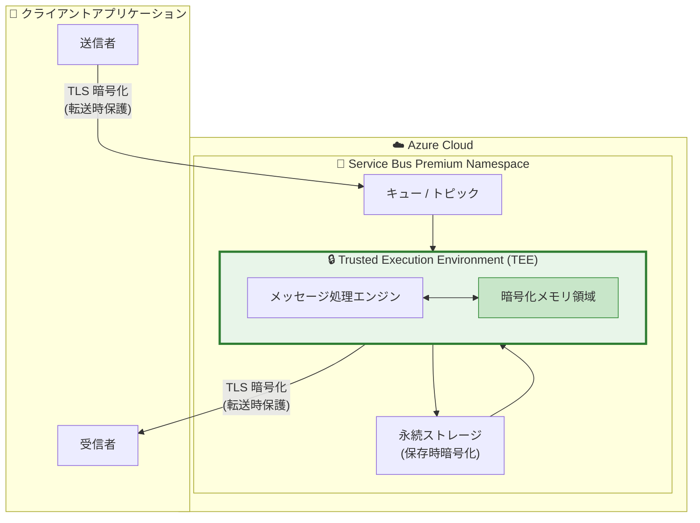

# Azure Service Bus Premium: Confidential Computing (機密コンピューティング)

**リリース日**: 2026-05-12

**サービス**: Azure Service Bus

**機能**: Confidential Computing for Azure Service Bus Premium

**ステータス**: Launched (GA)

[このアップデートのインフォグラフィックを見る](https://takech9203.github.io/azure-news-summary/20260512-service-bus-confidential-computing.html)

## 概要

Azure Service Bus Premium における Confidential Computing (機密コンピューティング) が一般提供 (GA) となった。本機能は、Service Bus がハードウェアベースの Trusted Execution Environment (TEE: 信頼された実行環境) 内でメッセージを処理することを可能にし、使用中のデータ (data in use) に対する保護を追加する。

従来、Azure Service Bus は保存時 (at rest) および転送時 (in transit) のデータ暗号化を提供していたが、本機能により処理中のデータも保護対象となり、クラウドオペレーターを含む不正アクセスからメッセージデータを守ることができる。これは Confidential Computing Consortium (CCC) が定義する機密コンピューティングの概念に準拠しており、規制の厳しい業界やセンシティブなデータを扱うワークロードにとって重要なセキュリティ強化となる。

現時点では Korea Central および UAE North リージョンで利用可能である。

**アップデート前の課題**

- Service Bus のメッセージは保存時・転送時には暗号化されていたが、処理中 (in use) のデータは保護されていなかった
- クラウドインフラストラクチャレベルでのメッセージ内容へのアクセスリスクが理論上存在した
- 規制要件の厳しい業界 (金融、医療、政府機関等) では、処理中データの保護が求められるケースがあった

**アップデート後の改善**

- ハードウェアベースの TEE 内でメッセージ処理が行われ、使用中のデータが保護される
- クラウドオペレーターを含む第三者がメッセージ処理中のデータにアクセスできない
- 保存時・転送時・使用時の 3 段階すべてでデータが保護される完全な暗号化チェーンが実現

## アーキテクチャ図

TEE (信頼された実行環境) がメッセージ処理のコアコンポーネントとして機能し、ハードウェアレベルの分離により、処理中のデータがクラウドインフラストラクチャの他のコンポーネントやオペレーターからアクセスされることを防止する。

## サービスアップデートの詳細

### 主要機能

1. **ハードウェアベース TEE でのメッセージ処理**
   - Service Bus のメッセージ処理がハードウェアレベルで隔離された TEE 内で実行される
   - CPU やメモリ内のデータが暗号化され、外部からのアクセスが防止される

2. **3 段階のデータ保護**
   - 保存時 (at rest): Microsoft マネージドキーまたはカスタマーマネージドキー (CMK) による暗号化
   - 転送時 (in transit): TLS による暗号化
   - 使用時 (in use): TEE によるハードウェアベースの保護 (本機能)

3. **透過的な動作**
   - 既存の Service Bus Premium ワークロードに対して、アプリケーションコードの変更なしで適用可能
   - 既存の AMQP プロトコルおよびクライアント SDK との互換性を維持

## 技術仕様

| 項目 | 詳細 |
|------|------|
| 対象ティア | Service Bus Premium のみ |
| 保護メカニズム | ハードウェアベース Trusted Execution Environment (TEE) |
| 保護対象 | 処理中のメッセージデータ (data in use) |
| 利用可能リージョン | Korea Central, UAE North |
| 前提条件 | Service Bus Premium 名前空間 |
| プロトコル互換性 | AMQP (既存プロトコルと互換) |

## メリット

### ビジネス面

- 金融、医療、政府機関など規制の厳しい業界のコンプライアンス要件への対応が容易になる
- ゼロトラストアーキテクチャの実現に貢献し、クラウドオペレーターを含むすべての第三者からデータを保護
- データ主権要件を満たすための追加的なセキュリティレイヤーとして活用可能

### 技術面

- ハードウェアルートオブトラストにより、ソフトウェアレベルの脆弱性からデータを保護
- アプリケーションコードの変更不要で、既存ワークロードに透過的に適用可能
- 保存時・転送時・使用時の完全な暗号化チェーンにより、エンドツーエンドのデータ保護を実現

## デメリット・制約事項

- 現時点では Korea Central および UAE North の 2 リージョンのみで利用可能
- Service Bus Premium ティアのみが対象 (Standard / Basic ティアでは利用不可)
- TEE によるオーバーヘッドがパフォーマンスに影響する可能性がある (具体的な影響度は公式ドキュメントで要確認)

## ユースケース

### ユースケース 1: 金融取引メッセージの保護

**シナリオ**: 銀行間の決済指示やトランザクションデータを Service Bus 経由でやり取りする場合、規制要件 (PCI DSS、金融庁ガイドライン等) により処理中のデータも保護する必要がある。

**効果**: TEE 内でメッセージが処理されるため、インフラストラクチャ管理者を含む第三者がトランザクションデータにアクセスできず、規制要件を満たしつつクラウドでのメッセージング基盤を運用できる。

### ユースケース 2: 医療データのイベント駆動処理

**シナリオ**: 電子カルテシステムや医療 IoT デバイスからのデータを Service Bus で集約・処理する場合、HIPAA 等の規制により患者データの保護が求められる。

**効果**: 機密性の高い医療データが処理中も TEE によって保護され、マルチテナントクラウド環境でも患者プライバシーを確保できる。

### ユースケース 3: 政府機関のセキュアメッセージング

**シナリオ**: 政府機関間のセキュアな通信基盤として Service Bus を利用する場合、機密情報の処理中の保護が必要。

**効果**: ハードウェアベースの保護により、クラウドプロバイダーのオペレーターを含む不正アクセスリスクを排除し、政府のセキュリティ基準に準拠できる。

## 料金

Service Bus Premium ティアの料金が適用される。Confidential Computing 機能による追加料金については、公式料金ページを参照すること。

Service Bus Premium の基本料金体系:
- メッセージングユニット単位での固定価格モデル
- 1, 2, 4, 8, 16 メッセージングユニットから選択可能

詳細は [Azure Service Bus 料金ページ](https://azure.microsoft.com/pricing/details/service-bus/) を参照。

## 利用可能リージョン

現時点で以下のリージョンで一般提供 (GA):

- Korea Central (韓国中部)
- UAE North (UAE 北部)

今後のリージョン展開については公式アナウンスを確認すること。

## 関連サービス・機能

- **Azure Confidential Computing**: TEE を活用した機密コンピューティングの基盤技術。VM、コンテナ、その他 PaaS サービスにも展開されている
- **Azure Service Bus Premium**: 本機能の前提となるティア。リソース分離、大容量メッセージ、ネットワークセキュリティ機能を提供
- **カスタマーマネージドキー (CMK)**: Service Bus Premium で利用可能な保存時暗号化の追加オプション。本機能と組み合わせることで多層防御を実現
- **Azure Private Link / Private Endpoints**: Service Bus へのネットワークアクセスを VNet 内に限定し、ネットワークレベルのセキュリティを強化
- **Microsoft Entra ID**: Service Bus へのアクセス認証・認可。RBAC によるきめ細かなアクセス制御を提供

## 参考リンク

- [インフォグラフィック](https://takech9203.github.io/azure-news-summary/20260512-service-bus-confidential-computing.html)
- [公式アップデート情報](https://azure.microsoft.com/updates?id=561942)
- [Microsoft Learn - Service Bus Premium](https://learn.microsoft.com/azure/service-bus-messaging/service-bus-premium-messaging)
- [Microsoft Learn - Azure Confidential Computing 概要](https://learn.microsoft.com/azure/confidential-computing/overview)
- [料金ページ](https://azure.microsoft.com/pricing/details/service-bus/)

## まとめ

Azure Service Bus Premium での Confidential Computing の GA は、メッセージングワークロードにおけるデータ保護を「保存時・転送時」から「使用時」にまで拡張する重要なアップデートである。特に規制の厳しい業界 (金融、医療、政府機関) において、クラウド上でのメッセージング基盤のセキュリティ要件を満たすための重要な機能となる。

**推奨されるアクション:**

1. Korea Central または UAE North リージョンで該当ワークロードがある場合、本機能の有効化を検討する
2. コンプライアンス要件で「使用中のデータ保護」が求められる場合、本機能を含めたセキュリティアーキテクチャの見直しを行う
3. 今後のリージョン展開を注視し、利用リージョンが追加された際に既存ワークロードへの適用を計画する

---

**タグ**: #Azure #ServiceBus #ConfidentialComputing #Security #TEE #GA #Premium #Integration
