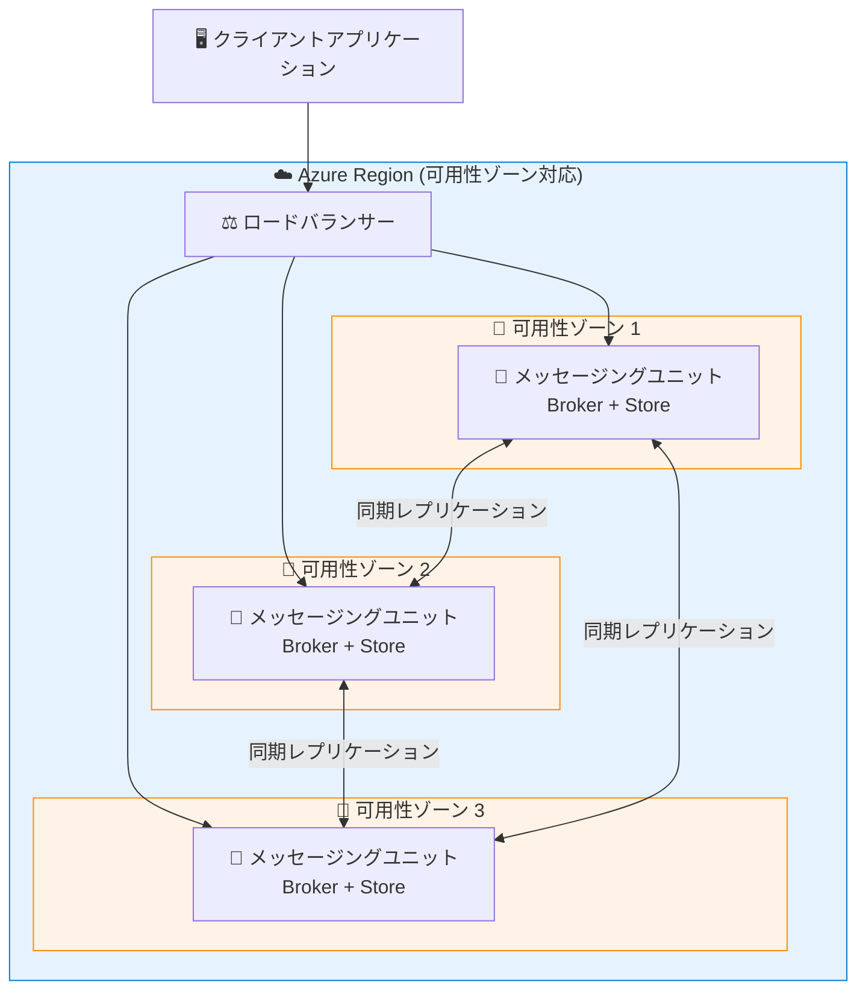

# Azure Service Bus: Premium 名前空間の 99.99% 稼働率 SLA (可用性ゾーン対応リージョン)

**リリース日**: 2026-05-12

**サービス**: Azure Service Bus

**機能**: Premium 名前空間における 99.99% アップタイム SLA

**ステータス**: Launched (GA)

[このアップデートのインフォグラフィックを見る](https://takech9203.github.io/azure-news-summary/20260512-service-bus-premium-9999-sla.html)

## 概要

2026 年 5 月 1 日より、可用性ゾーン (Availability Zone) をサポートするリージョンにデプロイされたすべての Azure Service Bus Premium 名前空間が 99.99% のアップタイム SLA の対象となった。これは従来の SLA からの引き上げであり、ミッションクリティカルなワークロードに対するプラットフォームの信頼性コミットメントが強化されたことを意味する。

Premium ティアは、最も重要なワークロードを実行する顧客向けに設計されたティアであり、専用リソース (CPU およびメモリ) による分離環境を提供する。今回の SLA 引き上げにより、可用性ゾーンを活用した冗長構成が標準的に適用されることで、単一ゾーン障害に対する耐性が正式に保証される。

**アップデート前の課題**

- Service Bus Premium 名前空間の SLA は 99.99% 未満であり、ミッションクリティカルなメッセージング基盤としての可用性保証に改善の余地があった
- 可用性ゾーン対応リージョンであっても、SLA として明示的に 99.99% が保証されていなかった

**アップデート後の改善**

- 可用性ゾーン対応リージョンの Premium 名前空間すべてに 99.99% アップタイム SLA が適用
- 追加構成不要で自動的に SLA の対象となる (可用性ゾーン対応は自動で有効化される)
- ミッションクリティカルなワークロードに対するプラットフォームレベルの可用性コミットメントが強化

## アーキテクチャ図

Service Bus Premium 名前空間は 3 つの可用性ゾーンにまたがってデプロイされ、各ゾーンにメッセージングストアのレプリカが配置される。ゾーン間は同期レプリケーションにより整合性が維持され、1 つのゾーンが完全に失われても自動的にフェイルオーバーが行われる。

## サービスアップデートの詳細

### 主要機能

1. **99.99% アップタイム SLA**
   - 可用性ゾーン対応リージョンの Premium 名前空間すべてが対象
   - 2026 年 5 月 1 日から有効
   - 年間ダウンタイム許容量: 約 52.6 分 (99.99%) に相当

2. **自動ゾーン冗長**
   - 可用性ゾーン対応リージョンに名前空間を作成すると自動的にゾーン冗長が有効化
   - 追加の構成や設定は不要
   - `zoneRedundant` プロパティは非推奨 (すべての対応リージョンの名前空間が自動的にゾーン冗長)

3. **同期レプリケーション**
   - メタデータおよびメッセージデータが複数の可用性ゾーンに同期レプリケーション
   - 書き込み操作は複数のメッセージングストアのコピーが確認応答してから完了
   - ゾーン障害時のデータ損失なし

## 技術仕様

| 項目 | 詳細 |
|------|------|
| 対象ティア | Premium のみ |
| SLA | 99.99% アップタイム |
| 有効日 | 2026 年 5 月 1 日 |
| 対象リージョン | 可用性ゾーンをサポートするすべてのリージョン |
| ゾーン冗長設定 | 自動 (追加構成不要) |
| レプリケーション方式 | 同期 (ゾーン間) |
| メッセージングユニット | 1, 2, 4, 8, 16 MU 選択可能 |
| 最大メッセージサイズ | 100 MB (AMQP プロトコル使用時) |
| データ損失 (ゾーン障害時) | なし |
| フェイルオーバー | 自動・透過的 |

## メリット

### ビジネス面

- **可用性保証の強化**: 99.99% SLA により、ミッションクリティカルなシステムの可用性要件をプラットフォームレベルで充足可能
- **コンプライアンス対応**: 金融機関や医療機関など、高い可用性が規制要件として求められる業界での採用が容易に
- **SLA 違反時のサービスクレジット**: 明確な SLA によりクレジット請求の根拠が明確化

### 技術面

- **追加設定不要**: 可用性ゾーン対応リージョンでの Premium 名前空間作成だけで自動適用
- **透過的フェイルオーバー**: ゾーン障害時もアプリケーション側の変更不要
- **データ整合性保証**: 同期レプリケーションによりゾーン障害時もデータ損失なし
- **オンプレミスを超える耐障害性**: すべてのアクティブクラスターモデルと可用性ゾーンの組み合わせにより、オンプレミスのメッセージブローカー製品を凌駕する回復力

## デメリット・制約事項

- Premium ティアのみが対象 (Standard / Basic ティアは対象外)
- 可用性ゾーンをサポートしないリージョンでは 99.99% SLA は適用されない
- Premium ティアは Standard ティアと比較してコストが高い (専用リソース課金)
- Express エンティティは Premium 名前空間ではサポートされない
- 同期レプリケーションにより、書き込みレイテンシが若干増加する可能性がある

## ユースケース

### ユースケース 1: 金融取引メッセージング基盤

**シナリオ**: 証券取引所や銀行間決済システムにおける注文・決済メッセージの中継基盤として Service Bus Premium を利用。ゾーン障害が発生しても取引処理を継続する必要がある。

**効果**: 99.99% SLA により、年間ダウンタイムが最大約 53 分に制限され、金融規制の可用性要件を満たすことが可能。

### ユースケース 2: IoT イベント駆動アーキテクチャ

**シナリオ**: 製造業のスマートファクトリーにおいて、センサーデバイスからのイベントを Service Bus Topics で集約・分散し、リアルタイム品質管理を実現。

**効果**: メッセージ損失なしの保証により、品質異常の検知漏れを防止。高可用性により生産ラインの継続稼働を支援。

### ユースケース 3: マイクロサービス間非同期通信

**シナリオ**: EC サイトの注文処理パイプラインにおいて、注文受付・在庫確認・決済・配送指示をキューベースで疎結合化。

**効果**: ゾーン障害時もメッセージが保持され、注文の欠損やデータ不整合を防止。

## 料金

Service Bus Premium の料金は、メッセージングユニット (MU) 数に基づく時間課金となる。99.99% SLA 適用のための追加費用は発生しない。

| 項目 | 備考 |
|------|------|
| 課金単位 | メッセージングユニット (MU) x 時間 |
| 選択可能 MU 数 | 1, 2, 4, 8, 16 |
| 可用性ゾーン冗長 | 追加費用なし |
| SLA 適用条件 | Premium ティア + AZ 対応リージョン |

詳細な料金については [Azure Service Bus 料金ページ](https://azure.microsoft.com/pricing/details/service-bus/) を参照。

## 利用可能リージョン

可用性ゾーンをサポートするすべての Azure リージョンで利用可能。代表的なリージョンは以下の通り:

- East US / East US 2 / West US 2 / West US 3
- Japan East (東日本)
- West Europe / North Europe
- Southeast Asia
- Australia East
- UK South

最新の対応リージョン一覧は [Azure の可用性ゾーンサポートリージョン](https://learn.microsoft.com/azure/reliability/availability-zones-service-support) を参照。

## 関連サービス・機能

- **Azure Service Bus Geo-Replication**: リージョン間でのメタデータ+データレプリケーション。ゾーン冗長と併用することでリージョン障害にも対応可能
- **Azure Service Bus Geo-Disaster Recovery**: メタデータのみのリージョン間レプリケーション。軽量なDR構成
- **Azure Monitor**: Service Bus のメトリクス監視 (CPU 使用率、メッセージスループット、レプリケーションラグ)
- **Azure Event Hubs**: 大量イベントストリーミング向け。Service Bus と補完的に利用される
- **Azure Event Grid**: イベント駆動アーキテクチャのルーティング層として併用

## 参考リンク

- [インフォグラフィック](https://takech9203.github.io/azure-news-summary/20260512-service-bus-premium-9999-sla.html)
- [公式アップデート情報](https://azure.microsoft.com/updates?id=561947)
- [Microsoft Learn - Service Bus Premium メッセージング](https://learn.microsoft.com/azure/service-bus-messaging/service-bus-premium-messaging)
- [Microsoft Learn - Service Bus の信頼性](https://learn.microsoft.com/azure/reliability/reliability-service-bus)
- [料金ページ](https://azure.microsoft.com/pricing/details/service-bus/)

## まとめ

今回のアップデートにより、可用性ゾーン対応リージョンにデプロイされた Azure Service Bus Premium 名前空間の SLA が 99.99% に引き上げられた。これは追加の構成や費用なしで自動的に適用される。

**Solutions Architect への推奨アクション:**

1. **既存環境の確認**: 現在の Service Bus Premium 名前空間が可用性ゾーン対応リージョンにデプロイされているか確認する
2. **SLA 要件の見直し**: アプリケーションの可用性要件と照合し、99.99% SLA が要件を満たすか評価する
3. **Standard ティアからの移行検討**: ミッションクリティカルなワークロードで Standard ティアを使用している場合、Premium ティアへの移行を検討する
4. **Geo-Replication の併用検討**: リージョン障害への耐性も必要な場合、ゾーン冗長に加えて Geo-Replication の構成を検討する

---

**タグ**: #AzureServiceBus #Premium #SLA #AvailabilityZones #HighAvailability #Messaging #Integration #GA
