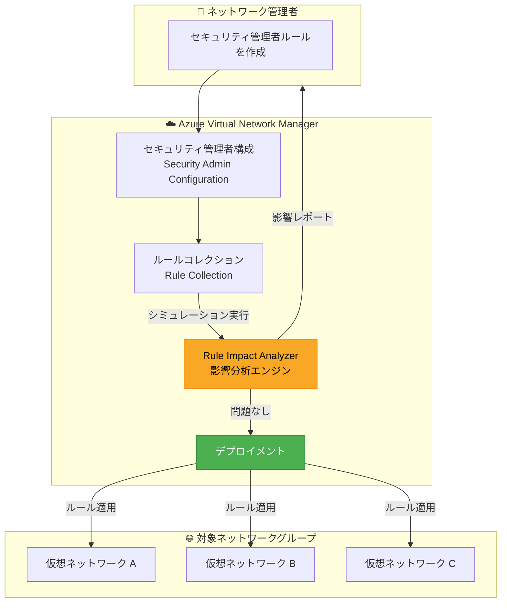

# Azure Virtual Network Manager: ルール影響分析 (Rule Impact Analyzer) が一般提供開始

**リリース日**: 2026-05-12

**サービス**: Azure Virtual Network Manager

**機能**: Rule Impact Analyzer (ルール影響分析)

**ステータス**: Launched (GA)

[このアップデートのインフォグラフィックを見る](https://takech9203.github.io/azure-news-summary/20260512-virtual-network-manager-rule-impact-analyzer.html)

## 概要

Azure Virtual Network Manager の **Rule Impact Analyzer (ルール影響分析)** が一般提供 (GA) となった。この機能は、セキュリティ管理者ルール (Security Admin Rules) を仮想ネットワークにデプロイする前に、そのルールが与える影響をシミュレーションできる機能である。

Azure Virtual Network Manager のセキュリティ管理者ルールは、NSG (Network Security Group) よりも高い優先度で評価され、仮想ネットワーク全体にグローバルなセキュリティポリシーを強制する強力な機能である。Rule Impact Analyzer を使用することで、ルールのデプロイ前にその影響を確認し、意図しない接続障害やサービス中断を防止できる。

本機能は Azure Virtual Network Manager のネイティブ機能として提供される点が特徴である。2026 年 4 月にパブリックプレビューとして発表された Azure Network Watcher の Rule Impact Analysis とは別のサービスであり、Virtual Network Manager のワークフロー内で直接利用できる。

**アップデート前の課題**

- セキュリティ管理者ルールの適用前に、対象仮想ネットワーク群への影響を正確に把握する手段が限られていた
- 誤ったルール適用により、広範囲にわたる接続障害が発生するリスクがあった
- 大規模環境 (複数サブスクリプション・リージョンにまたがるネットワークグループ) でのルール変更の影響評価が困難だった
- NSG ルールとの相互作用 (優先順位、Allow/Deny/Always Allow の評価順) を事前に検証する標準的な方法がなかった

**アップデート後の改善**

- ルールのデプロイ前にシミュレーションを実行し、影響範囲を事前に可視化できる
- 仮想ネットワーク上のトラフィックフローに対するルールの効果を事前検証できる
- 既存のセキュリティ管理者ルールや NSG ルールとの競合を検出できる
- GA となったことで、本番環境のワークフローに安心して組み込める (SLA 対象)

## アーキテクチャ図



この図は、Rule Impact Analyzer を使用したセキュリティ管理者ルールのデプロイワークフローを示している。管理者がルールを作成した後、デプロイ前に影響分析を実行し、問題がないことを確認してからネットワークグループへルールを適用する。

## サービスアップデートの詳細

### 主要機能

1. **ルール影響のシミュレーション**
   - セキュリティ管理者ルールを実際にデプロイする前に、仮想ネットワーク上のトラフィックに対する影響をシミュレーションできる
   - 対象ネットワークグループ内の全仮想ネットワークに対する影響を一括で評価する

2. **トラフィックフロー検証**
   - 特定のソース/宛先 IP、ポート、プロトコルの組み合わせに対して、ルール適用後のトラフィック許可/拒否状態を確認できる
   - Allow、Deny、Always Allow の各アクションによるトラフィックへの影響を可視化する

3. **ルール競合検出**
   - 新規ルールと既存のセキュリティ管理者ルールとの優先順位競合を検出する
   - NSG ルールとの相互作用を考慮した包括的な分析を提供する

4. **デプロイ前検証ワークフロー**
   - Virtual Network Manager のデプロイワークフローに統合されており、構成のデプロイ前に分析を実行できる
   - 問題が検出された場合はルールを修正してから再シミュレーションが可能

## 技術仕様

| 項目 | 詳細 |
|------|------|
| 機能名 | Rule Impact Analyzer |
| 所属サービス | Azure Virtual Network Manager |
| ステータス | 一般提供 (GA) |
| 分析対象 | セキュリティ管理者ルール (Security Admin Rules) |
| ルールのアクション種別 | Allow / Deny / Always Allow |
| ルール優先度範囲 | 1 - 4,096 |
| 対応プロトコル | TCP / UDP / ICMP / ESP / AH / Any |
| 対応方向 | Inbound / Outbound |

## セキュリティ管理者ルールの評価順序

Rule Impact Analyzer は以下の評価順序を考慮して影響をシミュレーションする。

| ルール種別 | 対象者 | 適用レベル | 評価順序 | アクション |
|-----------|--------|-----------|---------|----------|
| セキュリティ管理者ルール | ネットワーク管理者 (中央ガバナンスチーム) | 仮想ネットワーク | 高優先度 (先に評価) | Allow / Deny / Always Allow |
| NSG ルール | 個別チーム | サブネット / NIC | 低優先度 (後に評価) | Allow / Deny |

**アクションの動作:**
- **Allow**: セキュリティ管理者ルールで許可後、NSG ルールでさらに評価される
- **Deny**: トラフィックを即座にブロックし、NSG ルールは評価されない
- **Always Allow**: トラフィックを即座に許可し、NSG ルールの評価を完全にバイパスする

## 前提条件

1. Azure サブスクリプション
2. Azure Virtual Network Manager インスタンスが作成済みであること
3. ネットワークグループが構成されていること
4. セキュリティ管理者構成 (Security Admin Configuration) が作成済みであること

## メリット

### ビジネス面

- セキュリティポリシー変更に伴う計画外ダウンタイムのリスクを大幅に低減
- 変更管理プロセスの品質向上 (事前検証のエビデンスとして活用可能)
- GA となったことで、本番ワークロードの変更管理に安心して採用できる
- コンプライアンス監査時に、ルール変更前の影響評価を記録として残せる

### 技術面

- ルール適用前のシミュレーションにより、安全なデプロイメントを実現
- 大規模環境 (複数サブスクリプション・リージョン) でのルール検証を効率化
- 既存 NSG ルールとセキュリティ管理者ルールの相互作用を事前に把握できる
- デプロイ後のロールバック頻度の削減

## デメリット・制約事項

- セキュリティ管理者ルール自体がプライベートエンドポイントには適用されないため、その部分の影響分析も対象外となる
- Azure SQL Managed Instances や Azure Databricks を含む仮想ネットワークにはデフォルトでセキュリティ管理者ルールが適用されないため、影響分析の対象外
- 一部サービスのサブネット (Azure Application Gateway、Azure Bastion、Azure Firewall、Azure VPN Gateway、Azure Virtual WAN、Azure ExpressRoute Gateway) にはセキュリティ管理者ルールが適用されない
- セキュリティ管理者ルールは最終的な整合性モデル (Eventual Consistency) を使用しており、実際のルール適用にはわずかな遅延がある

## ユースケース

### ユースケース 1: 高リスクポートのブロック前検証

**シナリオ**: 組織全体で RDP (ポート 3389)、SSH (ポート 22)、SMB (ポート 445) へのインターネットからのアクセスをブロックするセキュリティ管理者ルールを適用する前に、業務システムへの影響を検証したい。

**実装例**:

```bash
# セキュリティ管理者構成の作成
az network manager security-admin-config create \
  --resource-group myResourceGroup \
  --network-manager-name myNetworkManager \
  --configuration-name blockHighRiskPorts \
  --description "Block high-risk ports from internet"

# ルールコレクションの作成とルール追加後、
# Rule Impact Analyzer でデプロイ前に影響をシミュレーション
```

**効果**: VPN 経由でのみ管理アクセスを行っている環境では問題なし、直接 RDP を使用しているレガシーシステムを特定し、例外ルールまたはアクセス方法の移行を事前に計画できる。

### ユースケース 2: マルチテナント環境でのコンプライアンス適用

**シナリオ**: 複数の事業部門がそれぞれのサブスクリプションで運用する仮想ネットワーク間の通信を制限するセキュリティポリシーを導入する際、各事業部門のワークロードへの影響を事前に把握したい。

**効果**: Rule Impact Analyzer でシミュレーションを実行し、部門間で共有されるサービス (Azure AD、DNS、モニタリング) の通信が遮断されないことを確認してから、安全にポリシーを適用できる。

## 関連サービス・機能

- **Azure Virtual Network Manager**: セキュリティ管理者ルールの作成・管理・デプロイを行う中央管理サービス。Rule Impact Analyzer はこのサービスのネイティブ機能として提供される
- **Azure Network Watcher - Rule Impact Analysis (プレビュー)**: 2026 年 4 月にパブリックプレビューとして発表された類似機能。Network Watcher の診断機能として提供される点が異なる
- **Network Security Group (NSG)**: サブネット・NIC レベルのセキュリティルール。セキュリティ管理者ルールとの評価順序を理解した上で影響分析が行われる
- **Azure Policy**: ネットワークグループの動的メンバーシップを定義するために使用。影響分析は動的に決定されたネットワークグループメンバーに対しても実行される

## 参考リンク

- [インフォグラフィック](https://takech9203.github.io/azure-news-summary/20260512-virtual-network-manager-rule-impact-analyzer.html)
- [公式アップデート情報](https://azure.microsoft.com/updates?id=562010)
- [Azure Virtual Network Manager 概要](https://learn.microsoft.com/azure/virtual-network-manager/overview)
- [セキュリティ管理者ルールの概念](https://learn.microsoft.com/azure/virtual-network-manager/concept-security-admins)
- [セキュリティ管理者ルールでトラフィックをブロックする方法](https://learn.microsoft.com/azure/virtual-network-manager/how-to-block-network-traffic-portal)
- [Azure Virtual Network Manager 料金](https://azure.microsoft.com/pricing/details/virtual-network-manager/)

## まとめ

Azure Virtual Network Manager の Rule Impact Analyzer が GA となり、セキュリティ管理者ルールのデプロイ前シミュレーションが本番環境で正式にサポートされた。セキュリティ管理者ルールは NSG よりも高い優先度で評価されるため、誤った適用は広範囲の接続障害を引き起こす可能性がある。本機能を活用することで、ルールの影響を事前に可視化し、安全なセキュリティポリシーの展開が実現できる。

Solutions Architect としての推奨アクション:
- 既存のセキュリティ管理者ルールの変更プロセスに Rule Impact Analyzer を組み込む
- CI/CD パイプラインでのインフラ変更時に、セキュリティルール変更の事前検証ステップとして活用する
- 2026 年 4 月発表の Network Watcher Rule Impact Analysis (プレビュー) との違いを理解し、用途に応じて使い分ける (Virtual Network Manager のワークフロー内での利用 vs Network Watcher の診断機能としての利用)

---

**タグ**: #Azure #VirtualNetworkManager #SecurityAdminRules #RuleImpactAnalyzer #GA #NetworkSecurity #Governance #Networking
