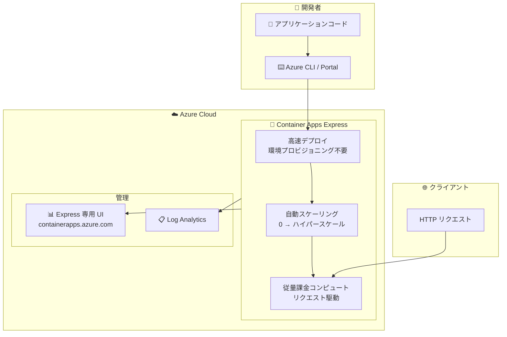

# Azure Container Apps: Container Apps Express (Public Preview)

**リリース日**: 2026-05-13

**サービス**: Azure Container Apps

**機能**: Container Apps Express

**ステータス**: In preview

[このアップデートのインフォグラフィックを見る](https://takech9203.github.io/azure-news-summary/20260513-container-apps-express.html)

## 概要

Azure Container Apps Express がパブリックプレビューとして提供開始された。これは Azure 上でコンテナ化された Web アプリケーションをデプロイするための最もシンプルかつ高速な方法であり、インフラストラクチャに関する意思決定を不要にしながら、ゼロからハイパースケールまで自動的にスケーリングする新しいコンピュートプラットフォームである。

Container Apps Express は「開発者ファースト」かつ「エージェントファースト」のプラットフォームとして設計されており、オピニオネーテッドなデフォルト設定と最小限の構成サーフェスにより、アプリケーションを可能な限り迅速にクラウド上で稼働させることができる。従来の Container Apps とは異なり、環境のプロビジョニングを待つことなく直接コンテナアプリを作成できる。

AI パワードアプリケーションやエージェントバックエンドのホスティングに最適化されており、高速プロビジョニングとスケールフロムゼロの特徴を活かして、予測不可能なトラフィックパターンに対応する。専用の管理 UI (https://containerapps.azure.com/) を通じてアプリを管理できる。

**アップデート前の課題**

- 従来の Azure Container Apps では、アプリをデプロイする前に Container Apps 環境のプロビジョニングが必要で、デプロイまでに時間がかかっていた
- スケーリングルール、ネットワーキング、リソース割り当てなど多数のインフラストラクチャ設定を理解・構成する必要があった
- スタートアップや新規プロジェクトにおいて、アイデアからプロダクションまでの時間が長かった

**アップデート後の改善**

- 環境のプロビジョニングなしに直接コンテナアプリを作成可能になり、数分でデプロイが完了する
- オピニオネーテッドなデフォルト設定により、インフラストラクチャの意思決定が不要になった
- ゼロからハイパースケールまで自動的にスケーリングし、リクエスト駆動でコンピュートが動作する

## アーキテクチャ図



Container Apps Express は従来の Container Apps 環境を簡素化し、開発者がコードからプロダクションまでを最短経路で実現できるアーキテクチャを提供する。リクエストがない場合はゼロにスケールダウンし、トラフィック増加時に自動スケールアウトする。

## サービスアップデートの詳細

### 主要機能

1. **高速起動 (High-speed launch)**
   - インフラストラクチャチューニング不要で数分でデプロイが完了する
   - スケーリング動作は最初から組み込まれている

2. **スケールフロムゼロ (Scale from zero)**
   - アイドル時にはゼロまでスケールダウンし、オンデマンドでスケールアップする
   - 使用した分のみ課金される

3. **自動弾性スケーリング (Automatic elasticity)**
   - ゼロからハイパースケールまで自動的にスケーリングする
   - 予測不可能なトラフィックパターンに対応するよう設計されている

4. **高速コールドスタート (High-speed startup)**
   - 最適化されたコールドスタートにより、ゼロからのスケールアップ後も迅速にトラフィックを処理する

5. **オピニオネーテッドデフォルト (Opinionated defaults)**
   - 本番環境向けの適切なデフォルト設定が自動的に適用される
   - スケーリングルール、ネットワーキング、リソース割り当ての構成が不要

6. **最小構成サーフェス (Minimal configuration surface)**
   - 意思決定を最小限に抑え、プロダクションまでの時間を短縮する

7. **専用管理 UI**
   - Azure Portal とは別の専用インターフェース (containerapps.azure.com) で管理する

## 技術仕様

| 項目 | 詳細 |
|------|------|
| コンピュートタイプ | 従量課金 CPU (Consumption-based CPU) |
| プロトコル | HTTP のみ (TCP 非対応) |
| スケーリング | ゼロ → ハイパースケール (自動) |
| マルチレプリカ | 対応 |
| イメージデプロイ | 匿名およびトークンベースの認証に対応 |
| 環境変数 | 対応 |
| Ingress | 対応 |
| ログストリーミング | 対応 |
| ログ (Log Analytics) | 対応 |
| ローリングアップデート | 部分対応 |
| リージョン制限 | 対応 |

### 現時点で非対応の主要機能

| 項目 | ステータス |
|------|------|
| シークレット / Key Vault 連携 | 非対応 |
| KEDA ベースのオートスケール | 非対応 |
| マネージド ID (アプリ実行時 / イメージプル) | 非対応 |
| VNet 統合 | 非対応 |
| ヘルスプローブ | 非対応 |
| Easy Auth | 非対応 |
| カスタムドメイン (マネージド証明書) | 非対応 |
| GPU | 非対応 |
| Dapr 統合 | 非対応 |
| サービスディスカバリ | 非対応 |
| サイドカーコンテナ | 非対応 |
| ボリュームマウント | 非対応 |
| トラフィック分割 (マルチリビジョン) | 非対応 |
| OpenTelemetry | 非対応 |
| プライベートエンドポイント | 非対応 |
| ゾーン冗長 | 非対応 |

## 設定方法

### 前提条件

1. Azure サブスクリプション
2. コンテナイメージ (Docker Hub、Azure Container Registry など)

### Azure Portal (Express 専用 UI)

1. [containerapps.azure.com](https://containerapps.azure.com/) にアクセスする
2. Express 専用のウェルカム画面が表示される
3. コンテナイメージを指定してアプリを作成する
4. Express ではポータルから軽量環境が自動的に作成される

### Azure CLI

CLI を使用する場合は、環境を自身で作成する必要がある (ポータル経由の場合はプラットフォームが自動作成)。

```bash
# リソースグループの作成
az group create --name myResourceGroup --location westcentralus

# Container Apps 環境の作成 (CLI 経由の場合は必要)
az containerapp env create --name myExpressEnv --resource-group myResourceGroup --location westcentralus

# Express アプリのデプロイ
az containerapp create --name my-express-app --resource-group myResourceGroup --environment myExpressEnv --image mcr.microsoft.com/azuredocs/containerapps-helloworld:latest --target-port 80 --ingress external
```

## メリット

### ビジネス面

- **市場投入時間の短縮**: アイデアからプロダクションまで数分で完了し、スタートアップや新規プロジェクトに最適
- **コスト最適化**: スケールフロムゼロにより、アイドル時のコストが発生しない (使用した分のみ課金)
- **リプラットフォーミング不要**: プロトタイプからそのままプロダクション運用に移行可能

### 技術面

- **インフラストラクチャ管理の排除**: スケーリング、ネットワーキング、リソース割り当ての構成が不要
- **高速コールドスタート**: 最適化されたコールドスタートにより、ユーザー体験を損なわない
- **AI/エージェントワークロードに最適化**: AI パワードアプリケーションやエージェントバックエンドのホスティングに設計されている
- **開発者生産性の向上**: インフラストラクチャよりもコードの開発に集中できる

## デメリット・制約事項

- **HTTP ワークロードのみ対応**: TCP ベースのワークロードは非対応
- **GPU 非対応**: GPU ワークロードには標準の Container Apps 環境 (ワークロードプロファイル) が必要
- **機能の制限**: VNet 統合、Dapr、サービスディスカバリ、マネージド ID、カスタムドメイン、ヘルスプローブなど多数の機能が現時点で非対応
- **シークレット管理非対応**: Key Vault 連携を含むシークレット管理が使用できない
- **きめ細かい制御が不可能**: オピニオネーテッドな構成モデルのため、コンピュート、ネットワーキング、コールドスタート動作の詳細な制御が必要な場合は標準 Container Apps を使用する必要がある
- **課金機能が未実装**: プレビュー段階では課金機能が「No」となっており、GA 時の料金体系は未定

## ユースケース

### ユースケース 1: AI アプリケーションフロントエンド

**シナリオ**: LLM を活用した AI チャットアプリケーションのフロントエンドをデプロイする。トラフィックは予測不可能で、夜間はほぼゼロ、日中にスパイクが発生する。

**実装例**:

```bash
# AI チャットフロントエンドのデプロイ
az containerapp create --name ai-chat-frontend --resource-group myResourceGroup --environment myExpressEnv --image myregistry.azurecr.io/ai-chat:latest --target-port 3000 --ingress external --env-vars "API_ENDPOINT=https://my-ai-backend.openai.azure.com"
```

**効果**: アイドル時はゼロにスケールダウンしてコストを削減し、トラフィック増加時に自動スケールアウトで応答性を維持する。

### ユースケース 2: SaaS プロダクトの高速ローンチ

**シナリオ**: スタートアップが MVP (Minimum Viable Product) を可能な限り迅速にローンチしたい。インフラストラクチャの構成に時間を費やすことなく、プロダクト開発に集中したい。

**効果**: 数分でプロダクション環境にデプロイ可能。ユーザー数の増加に応じて自動スケーリングされ、リプラットフォーミングなしにそのまま成長に対応できる。

### ユースケース 3: 社内 Web ダッシュボード

**シナリオ**: 社内の分析・モニタリングダッシュボードをデプロイする。業務時間中のみ使用され、夜間や週末はアクセスがない。

**効果**: スケールフロムゼロにより、使用されていない時間帯のコストがゼロになる。業務開始時に高速コールドスタートで迅速に利用可能になる。

## 料金

プレビュー段階での料金体系は以下の通り:

- **従量課金 (Consumption-based)**: リクエスト駆動でコンピュートが動作し、アイドル時はゼロにスケールダウン
- **使用した分のみ課金**: アプリがリクエストを受信して処理している間のみコンピュート料金が発生

現時点ではプレビューのため詳細な料金表は未公開 (ドキュメント上で Billing は「No」と記載)。GA 時に正式な料金体系が発表される見込み。

## 利用可能リージョン

パブリックプレビュー段階では以下の 2 リージョンで利用可能:

- **West Central US** (米国中西部)
- **East Asia** (東アジア)

今後、追加リージョンのサポートが予定されている。

## 関連サービス・機能

- **Azure Container Apps (標準)**: Express は標準 Container Apps の簡易版。VNet、Dapr、GPU などの高度な機能が必要な場合は標準版を使用する
- **Azure App Service**: Web アプリのホスティングサービス。Express はコンテナベースでスケールフロムゼロに対応する点が異なる
- **Azure Container Instances (ACI)**: 単一ポッドの Hyper-V 分離コンテナ。Express はよりアプリケーションレベルの抽象化を提供する
- **Azure Functions**: イベント駆動の FaaS。Express は HTTP ファーストのコンテナワークロードに特化している
- **Azure Kubernetes Service (AKS)**: フルマネージド Kubernetes。Express は Kubernetes API アクセスは不要だがコンテナ実行したい場合に適している

## 参考リンク

- [インフォグラフィック](https://takech9203.github.io/azure-news-summary/20260513-container-apps-express.html)
- [公式アップデート情報](https://azure.microsoft.com/updates?id=559242)
- [Microsoft Learn ドキュメント](https://learn.microsoft.com/en-us/azure/container-apps/express-overview)
- [Container Apps Express 管理ポータル](https://containerapps.azure.com/)
- [Azure Container Apps 料金ページ](https://azure.microsoft.com/pricing/details/container-apps/)

## まとめ

Azure Container Apps Express は、Azure のコンテナコンピュートプラットフォームにおける「最速・最シンプル」なデプロイ体験を提供する新しいオプションである。特に AI アプリケーション、SaaS プロダクト、スタートアップの MVP など、迅速なデプロイとスケーラビリティが重要なシナリオに適している。

ただし、プレビュー段階では VNet、マネージド ID、シークレット管理、カスタムドメインなど多くのエンタープライズ機能が非対応であるため、本番ワークロードへの採用は慎重に検討する必要がある。現時点では、非機密の HTTP ワークロードやプロトタイプ開発での評価から開始し、GA に向けた機能追加を注視することを推奨する。

---

**タグ**: #Azure #ContainerApps #ContainerAppsExpress #Preview #Containers #Serverless #ScaleToZero #AI
