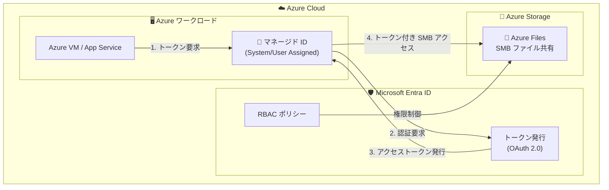

# Azure Files: Managed Identity Support for SMB Access (GA)

**リリース日**: 2026-05-14

**サービス**: Azure Files

**機能**: Managed Identity Support for SMB Access

**ステータス**: Launched (GA)

[このアップデートのインフォグラフィックを見る](https://takech9203.github.io/azure-news-summary/20260514-azure-files-managed-identity-smb.html)

## 概要

Azure Files が SMB アクセスにおけるマネージド ID (Managed Identity) 認証の一般提供 (GA) を開始した。これにより、アプリケーションやサービスが静的な資格情報やストレージアカウントキーを保存することなく、Azure Files SMB ファイル共有に対して認証を行うことが可能になる。

この機能は Zero Trust 原則に沿った設計であり、ワークロードが Microsoft Entra が発行するトークンを使用して Azure Files にアクセスできるようにする。従来の Azure Files SMB 認証では、オンプレミス Active Directory Domain Services (AD DS)、Microsoft Entra Domain Services、または Microsoft Entra Kerberos のいずれかを ID ソースとして構成する必要があったが、マネージド ID のサポートにより、Azure VM やその他の Azure サービス上で動作するワークロードがより簡潔かつセキュアにファイル共有へアクセスできるようになる。

Microsoft Build 2026 のタイミングで発表されたこのアップデートは、Azure のセキュリティとコンプライアンスの強化に寄与し、特に資格情報管理の負担を軽減したい組織にとって重要な機能改善である。

**アップデート前の課題**

- SMB ファイル共有へのアクセスにストレージアカウントキーや静的な資格情報の管理が必要で、セキュリティリスクが存在していた
- AD DS や Microsoft Entra Domain Services の構成が必要で、ドメインコントローラーへのネットワーク接続が前提条件となっていた
- アプリケーションコード内やシークレットストアに資格情報を保持する必要があり、ローテーション管理の運用負担が発生していた
- Azure サービス上のワークロードからのアクセスでも、Kerberos チケット取得のための複雑なインフラストラクチャ設定が必要だった

**アップデート後の改善**

- マネージド ID を使用した資格情報不要の認証が可能になり、静的なキーやパスワードの管理が不要になった
- Zero Trust 原則に準拠した認証フローにより、セキュリティ態勢が向上した
- Microsoft Entra が発行するトークンベースの認証により、資格情報のローテーション管理が自動化された
- Azure VM やサービス上のワークロードから、追加のインフラストラクチャ構成なしに SMB ファイル共有へアクセスできるようになった

## アーキテクチャ図

この図は、マネージド ID を使用した Azure Files SMB 認証フローを示している。ワークロードがマネージド ID を通じて Microsoft Entra ID からトークンを取得し、そのトークンを使用して SMB ファイル共有にアクセスする。資格情報はプラットフォームが管理するため、アプリケーション側でのシークレット管理が不要になる。

## サービスアップデートの詳細

### 主要機能

1. **マネージド ID による SMB 認証**
   - Azure リソースに割り当てられたマネージド ID (システム割り当ておよびユーザー割り当て) を使用して、SMB プロトコル経由で Azure Files にアクセスできる
   - ストレージアカウントキーや静的な資格情報の保存が不要

2. **Zero Trust 原則への準拠**
   - 「信頼しない、常に検証する」の原則に基づき、すべてのアクセスでトークンベースの認証を実施
   - 最小権限の原則に沿ったアクセス制御が可能

3. **Microsoft Entra トークンベース認証**
   - Microsoft Entra ID が発行する OAuth 2.0 トークンを使用した認証フロー
   - トークンの有効期限とリフレッシュがプラットフォームにより自動管理される

## 技術仕様

| 項目 | 詳細 |
|------|------|
| プロトコル | SMB (Server Message Block) |
| 認証方式 | Microsoft Entra トークンベース (マネージド ID) |
| マネージド ID タイプ | システム割り当て / ユーザー割り当て |
| ステータス | 一般提供 (GA) |
| セキュリティモデル | Zero Trust |
| 既存認証方式との関係 | AD DS、Microsoft Entra Domain Services、Microsoft Entra Kerberos に加えた追加オプション |

## メリット

### ビジネス面

- **セキュリティリスクの低減**: 静的な資格情報の漏洩リスクを排除し、セキュリティインシデントの可能性を大幅に低減
- **コンプライアンス強化**: Zero Trust 原則への準拠により、セキュリティ監査やコンプライアンス要件への対応が容易になる
- **運用コストの削減**: 資格情報のローテーション管理やシークレット管理の運用負担が軽減される

### 技術面

- **資格情報管理の自動化**: マネージド ID のライフサイクルは Azure プラットフォームが管理するため、手動での資格情報管理が不要
- **シンプルな構成**: ドメインコントローラーやドメイン参加の構成が不要で、マネージド ID の割り当てと RBAC 設定のみで利用可能
- **アプリケーションコードの簡素化**: シークレット取得や資格情報管理のコードが不要になり、アプリケーションのセキュリティ表面積が縮小

## デメリット・制約事項

- Azure リソース上で動作するワークロードのみが対象 (オンプレミスのクライアントからはマネージド ID を直接使用できない)
- マネージド ID はストレージアカウント単位ではなく Azure リソース単位で割り当てられるため、アクセス制御の粒度に注意が必要
- 既存のファイル共有で AD DS ベースの認証を使用している場合、マネージド ID 認証への移行計画が必要

## ユースケース

### ユースケース 1: Azure VM 上のアプリケーションからのファイルアクセス

**シナリオ**: Azure VM 上で動作するアプリケーションが、設定ファイルやデータファイルを Azure Files SMB 共有から読み書きする必要がある。従来はストレージアカウントキーをアプリケーション設定に保存していた。

**効果**: マネージド ID により、VM にシステム割り当て ID を有効化するだけで、キーレスでファイル共有にアクセスできる。資格情報の漏洩リスクがゼロになる。

### ユースケース 2: コンテナワークロードからの共有ストレージアクセス

**シナリオ**: Azure Kubernetes Service (AKS) や Azure Container Apps で動作するコンテナが、複数のインスタンス間で共有するファイルストレージとして Azure Files を使用する。

**効果**: ポッドに割り当てられたマネージド ID を使用して、シークレットやキーなしに SMB マウントが可能。Kubernetes Secret にストレージキーを保存する必要がなくなる。

### ユースケース 3: Zero Trust アーキテクチャの実現

**シナリオ**: 組織全体で Zero Trust セキュリティモデルを導入しており、すべてのサービス間通信から静的な資格情報を排除する方針を策定している。

**効果**: Azure Files へのアクセスにおいても資格情報レスの認証が実現し、組織の Zero Trust 戦略を完全に適用できる。

## 料金

マネージド ID 認証機能自体に追加料金は発生しない (Azure Files のストレージおよびトランザクション料金は通常通り適用)。

詳細な Azure Files の料金体系については公式料金ページを参照。

## 関連サービス・機能

- **Microsoft Entra ID**: マネージド ID の発行とトークン管理を行う ID プラットフォーム
- **Azure RBAC**: ファイル共有に対するアクセス権限の制御を行うロールベースアクセス制御
- **Azure Key Vault**: 従来の資格情報管理で使用されていたサービス。マネージド ID により Key Vault からのキー取得自体が不要になるケースがある
- **Azure Files (既存の ID 認証)**: AD DS、Microsoft Entra Domain Services、Microsoft Entra Kerberos による既存の認証方式と併用可能
- **Azure Virtual Machines**: システム割り当てマネージド ID の主要な利用元
- **Azure Kubernetes Service (AKS)**: ポッド ID やワークロード ID と連携したファイル共有アクセスに活用可能

## 参考リンク

- [インフォグラフィック](https://takech9203.github.io/azure-news-summary/20260514-azure-files-managed-identity-smb.html)
- [公式アップデート情報](https://azure.microsoft.com/updates?id=562350)
- [Azure Files ID ベース認証の概要](https://learn.microsoft.com/azure/storage/files/storage-files-active-directory-overview)
- [Azure Files の概要](https://learn.microsoft.com/azure/storage/files/storage-files-introduction)
- [料金ページ](https://azure.microsoft.com/pricing/details/storage/files/)

## まとめ

Azure Files の SMB アクセスにおけるマネージド ID サポートの GA は、Azure のストレージセキュリティにおける重要なマイルストーンである。この機能により、Azure 上のワークロードはストレージアカウントキーや静的な資格情報を一切保持することなく、SMB ファイル共有にアクセスできるようになった。

Solutions Architect への推奨アクションとして、以下を提案する:

1. 現在ストレージアカウントキーを使用して Azure Files にアクセスしているワークロードの棚卸しを実施する
2. マネージド ID への移行計画を策定し、Zero Trust 原則に沿ったアーキテクチャへの更新を検討する
3. 新規プロジェクトでは、マネージド ID を第一選択肢として Azure Files SMB 認証を設計する

---

**タグ**: #Azure #AzureFiles #Storage #ManagedIdentity #SMB #Security #ZeroTrust #GA #MicrosoftBuild
