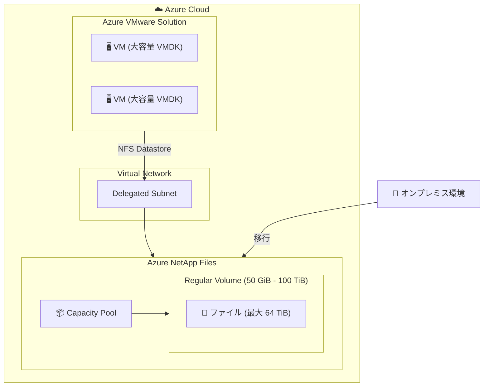

# Azure NetApp Files: 通常ボリュームでの大容量ファイル (64 TiB) サポート

**リリース日**: 2026-05-14

**サービス**: Azure NetApp Files

**機能**: 通常ボリュームにおける最大 64 TiB ファイルサイズのサポート

**ステータス**: Launched (GA)

[このアップデートのインフォグラフィックを見る](https://takech9203.github.io/azure-news-summary/20260514-netapp-files-large-files.html)

## 概要

Azure NetApp Files の通常ボリューム (Regular Volumes) において、単一ファイルの最大サイズが 64 TiB にまで拡張された。これにより、大容量ファイルを使用するワークロードのシームレスな移行と運用が可能になった。

特に Azure VMware Solution (AVS) の仮想マシンで使用される大容量 VMDK ディスクなど、大きなファイルサイズを必要とするワークロードのサポートが強化された。この機能強化により、オンプレミスや他のクラウド環境から Azure NetApp Files への移行時に、ファイルサイズ制限による障壁が解消される。

なお、Large Volumes (50 TiB〜1 PiB のボリューム) における単一ファイルの最大サイズは従来通り 16 TiB であり、今回のアップデートは通常ボリューム (50 GiB〜100 TiB) に対する改善である点に注意が必要である。

**アップデート前の課題**

- 通常ボリュームにおける単一ファイルの最大サイズに制限があり、大容量 VMDK ディスクなどの大きなファイルを扱うワークロードの移行が困難だった
- Azure VMware Solution (AVS) で大容量 VMDK を使用する仮想マシンのデータストアとして Azure NetApp Files を利用する際にファイルサイズの制約が存在した

**アップデート後の改善**

- 通常ボリュームで最大 64 TiB のファイルサイズをサポート
- AVS の大容量 VMDK ディスクを含むワークロードのシームレスな移行・運用が可能に
- 大容量ファイルを使用するワークロードにおいて、Large Volumes を使わずに通常ボリュームで対応可能

## アーキテクチャ図

Azure VMware Solution の仮想マシンが Azure NetApp Files の通常ボリュームを NFS データストアとして利用し、最大 64 TiB の大容量ファイル (VMDK) を格納できる構成を示している。

## サービスアップデートの詳細

### 主要機能

1. **通常ボリュームの最大ファイルサイズ拡張**
   - 通常ボリューム (Regular Volumes) で単一ファイルの最大サイズが 64 TiB に拡張
   - ボリュームサイズ: 50 GiB〜100 TiB の範囲で利用可能

2. **大容量 VMDK ディスクのサポート**
   - Azure VMware Solution (AVS) の仮想マシンで使用される大容量 VMDK ディスクを直接格納可能
   - オンプレミスからの移行時にファイルサイズによる制約が解消

3. **シームレスなワークロード移行**
   - 大容量ファイルを使用するワークロードの Azure への移行が容易に
   - 既存のプロトコル (NFS/SMB) をそのまま使用して移行可能

## 技術仕様

| 項目 | 詳細 |
|------|------|
| 対象ボリュームタイプ | Regular Volumes (通常ボリューム) |
| 最大ファイルサイズ (通常ボリューム) | 64 TiB |
| 最大ファイルサイズ (Large Volumes) | 16 TiB |
| 通常ボリュームの最小サイズ | 50 GiB |
| 通常ボリュームの最大サイズ | 100 TiB |
| サポートプロトコル | NFSv3, NFSv4.1, SMB 3.0, SMB 3.1.1, デュアルプロトコル |
| 対応サービスレベル | Flexible, Standard, Premium, Ultra |

## 設定方法

### 前提条件

1. Azure NetApp Files アカウントが作成済みであること
2. Capacity Pool が設定済みであること
3. Azure NetApp Files に委任されたサブネットが存在すること

### Azure Portal

1. Azure Portal で Azure NetApp Files アカウントに移動
2. Capacity Pool を選択し、「+ Add volume」をクリック
3. ボリュームの基本情報を入力:
   - Volume name: ボリューム名を指定
   - Capacity pool: 使用するキャパシティプールを選択
   - Quota: ボリュームのサイズを指定 (50 GiB〜100 TiB)
   - Large Volume: 「No」(通常ボリュームの場合)
4. プロトコルタブで NFS または SMB を選択
5. 「Review + Create」で確認し、ボリュームを作成

通常ボリュームとして作成すれば、自動的に最大 64 TiB のファイルサイズがサポートされる。特別な設定やフィーチャーフラグの登録は不要である。

## メリット

### ビジネス面

- Azure VMware Solution への移行がファイルサイズ制限なく実行可能に
- オンプレミスからクラウドへの移行コストとリスクの低減
- エンタープライズワークロードの Azure 展開加速

### 技術面

- 64 TiB までの大容量ファイルを通常ボリュームで直接格納可能
- Large Volumes の登録・設定なしで大容量ファイルに対応
- AVS データストアとしての利用時にファイルサイズ制約が解消

## デメリット・制約事項

- Large Volumes の単一ファイル最大サイズは 16 TiB のまま (通常ボリュームの方が大きなファイルを格納可能)
- 通常ボリュームの最大サイズは 100 TiB (ボリューム全体のサイズ制限は変更なし)
- 通常ボリュームを Large Volumes に変換することは不可

## ユースケース

### ユースケース 1: Azure VMware Solution データストア

**シナリオ**: オンプレミスの VMware 環境から Azure VMware Solution (AVS) へ移行する際、大容量 VMDK ディスクを持つ仮想マシンのデータストアとして Azure NetApp Files を使用する。

**効果**: 最大 64 TiB の VMDK ファイルを通常ボリュームに格納可能。コンピュートノードの追加なしにストレージを拡張でき、コスト最適化を実現。

### ユースケース 2: 大容量データファイルの管理

**シナリオ**: メディア処理、科学計算、EDA (Electronic Design Automation) など、大容量ファイルを扱うワークロードを Azure に移行する。

**効果**: 単一ファイルで最大 64 TiB をサポートするため、ファイル分割やワークアラウンドなしに既存のワークフローをそのまま移行可能。

## 料金

Azure NetApp Files の料金はサービスレベルとプロビジョニングされた容量に基づく。大容量ファイルサポートによる追加料金は発生しない。

| サービスレベル | スループット (TiB あたり) |
|------|------|
| Standard | 16 MiB/s |
| Premium | 64 MiB/s |
| Ultra | 128 MiB/s |

詳細な料金については [Azure NetApp Files の料金ページ](https://azure.microsoft.com/pricing/details/netapp/) を参照。

## 利用可能リージョン

Azure NetApp Files が利用可能なすべてのリージョンで、通常ボリュームの 64 TiB ファイルサイズサポートが利用可能。具体的なリージョン一覧については [Azure NetApp Files のリソース制限ドキュメント](https://learn.microsoft.com/azure/azure-netapp-files/azure-netapp-files-resource-limits) を参照。

## 関連サービス・機能

- **Azure VMware Solution (AVS)**: Azure NetApp Files を NFS データストアとして使用し、コンピュートノードの追加なしにストレージを拡張可能
- **Azure NetApp Files Large Volumes**: 50 TiB〜1 PiB のボリュームサイズをサポート (単一ファイルサイズは 16 TiB まで)
- **Azure NetApp Files Cool Access**: アクセス頻度の低いデータを自動的にクールティアに移動しコスト最適化
- **Cross-region Replication**: リージョン間でのデータレプリケーションによる災害復旧

## 参考リンク

- [インフォグラフィック](https://takech9203.github.io/azure-news-summary/20260514-netapp-files-large-files.html)
- [公式アップデート情報](https://azure.microsoft.com/updates?id=561722)
- [Microsoft Learn - Azure NetApp Files リソース制限](https://learn.microsoft.com/azure/azure-netapp-files/azure-netapp-files-resource-limits)
- [Microsoft Learn - Azure NetApp Files 概要](https://learn.microsoft.com/azure/azure-netapp-files/azure-netapp-files-introduction)
- [Microsoft Learn - Large Volumes の要件と考慮事項](https://learn.microsoft.com/azure/azure-netapp-files/large-volumes-requirements-considerations)
- [料金ページ](https://azure.microsoft.com/pricing/details/netapp/)

## まとめ

Azure NetApp Files の通常ボリュームにおける単一ファイルの最大サイズが 64 TiB に拡張されたことにより、Azure VMware Solution の大容量 VMDK ディスクをはじめとする大容量ファイルを使用するワークロードの移行と運用が大幅に容易になった。特に AVS 環境でのデータストア利用において、ファイルサイズ制限が実質的に解消されたことの影響は大きい。

Solutions Architect として、AVS への移行プロジェクトや大容量ファイルを扱うワークロードのクラウド移行を検討する際には、Large Volumes ではなく通常ボリュームの方が大きなファイル (最大 64 TiB) を格納できる点を把握しておくことが重要である。

---

**タグ**: #Azure #AzureNetAppFiles #Storage #LargeFiles #AVS #AzureVMwareSolution #GA
